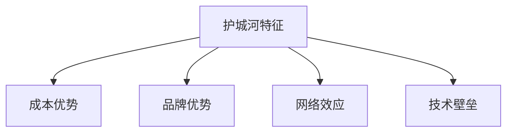
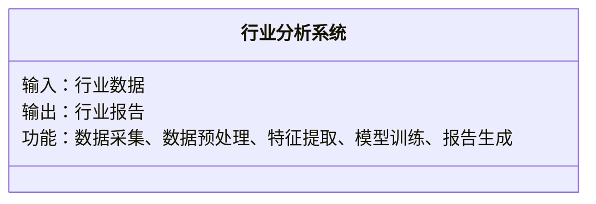
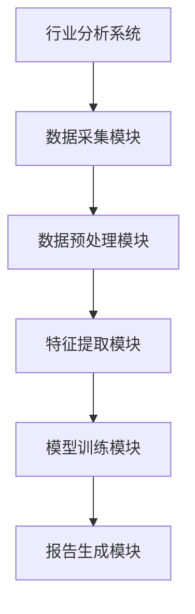
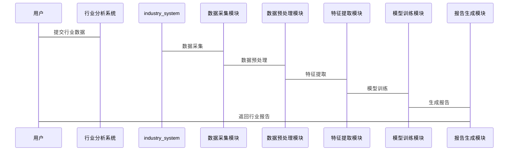
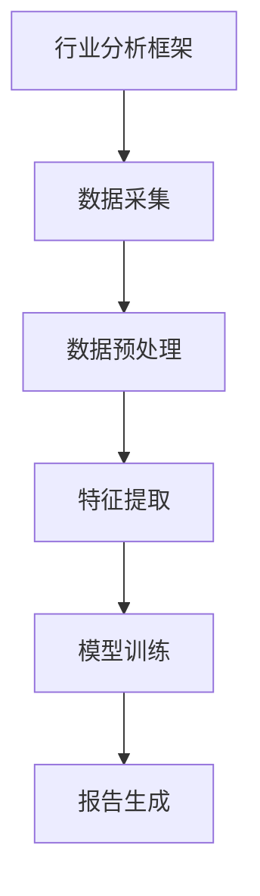

                 


# 巴菲特的行业分析方法：如何识别具有持久竞争优势的行业

## 关键词：巴菲特，行业分析，竞争优势，护城河，价值投资

## 摘要： 
本文详细探讨了巴菲特的行业分析方法，重点介绍如何识别具有持久竞争优势的行业。通过护城河理论、行业分析框架、数学模型和实际案例分析，本文为读者提供了系统化的行业分析方法。

---

## 第一部分：巴菲特的行业分析方法概述

### 第1章：巴菲特投资理念的背景与核心思想

#### 1.1 巴菲特投资理念的形成

##### 1.1.1 价值投资的起源
- **价值投资**：由本杰明·格雷厄姆提出，强调以低于内在价值的价格购买股票。
- **巴菲特的传承**：巴菲特师从格雷厄姆，发展出自己的投资理念，注重企业的内在价值和长期竞争优势。

##### 1.1.2 巴菲特的投资哲学
- **长期投资**：专注于企业的长期价值，而非短期市场波动。
- **安全边际**：购买价格低于内在价值，确保投资的安全性。
- **企业竞争优势**：寻找具有宽护城河的企业，确保长期盈利能力。

##### 1.1.3 巴菲特对行业分析的独特见解
- **行业的重要性**：行业是企业竞争的基础，决定了企业的潜在盈利能力。
- **竞争优势的识别**：通过行业分析，识别具有持久竞争优势的企业。

#### 1.2 价值投资的基本概念

##### 1.2.1 价值投资的核心理念
- **内在价值**：企业未来现金流的现值，反映其真正的价值。
- **市场波动**：市场价格围绕内在价值波动，投资者应利用价格与价值的差异。

##### 1.2.2 价值投资与市场波动的关系
- **市场波动的机遇**：价格波动为投资者提供了以低于内在价值买入的机会。
- **长期视角**：忽略短期波动，专注于长期价值。

##### 1.2.3 价值投资在行业分析中的应用
- **行业内在价值**：分析行业的长期盈利能力和发展潜力。
- **市场波动的应对**：利用行业周期波动，选择低估行业的投资机会。

#### 1.3 巴菲特行业分析方法的背景

##### 1.3.1 行业分析在投资中的重要性
- **行业分析**：帮助投资者理解行业的竞争结构、市场容量和盈利能力。
- **竞争优势的识别**：通过行业分析，识别具有持久竞争优势的企业。

##### 1.3.2 巴菲特行业分析方法的提出
- **护城河理论**：巴菲特提出，企业需要具备宽护城河，才能抵御竞争对手和市场变化。
- **行业分析的系统化**：通过系统化的行业分析，识别具有持久竞争优势的行业。

##### 1.3.3 巴菲特行业分析方法的核心目标
- **识别优质企业**：通过行业分析，找到具有持久竞争优势的企业。
- **长期投资收益**：通过投资具有持久竞争优势的企业，实现长期稳定的收益。

### 第2章：行业分析的基本框架

#### 2.1 行业分析的关键维度

##### 2.1.1 行业的生命周期
- **导入期**：市场需求小，竞争少，企业处于探索阶段。
- **成长期**：市场需求快速增长，企业竞争加剧。
- **成熟期**：市场需求稳定，竞争格局稳定。
- **衰退期**：市场需求下降，企业面临转型压力。

##### 2.1.2 行业的竞争结构
- **五力模型**：由迈克尔·波特提出，包括新进入者威胁、替代品威胁、供应商议价能力、买家议价能力和现有竞争者之间的竞争程度。
- **竞争格局**：分析行业内的主要竞争者，他们的市场份额、竞争优势和劣势。

##### 2.1.3 行业的财务特征
- **盈利能力**：ROE、ROA、净利润率等指标。
- **成长能力**：收入增长率、净利润增长率等指标。
- **财务健康状况**：资产负债率、流动比率等指标。

#### 2.2 巴菲特行业分析的核心要素

##### 2.2.1 行业的市场容量
- **市场规模**：行业的总收入或销售额，反映行业的潜在市场空间。
- **市场增长率**：行业的年增长率，反映行业的成长潜力。

##### 2.2.2 行业的竞争格局
- **市场集中度**：CR4指数，即行业内前四家企业的市场份额之和。
- **竞争优势**：企业的市场地位、品牌影响力、成本优势等。

##### 2.2.3 行业的盈利能力
- **净利率**：净利润与营业收入的比率。
- **ROE**：净资产收益率，反映企业使用股东资产的效率。

#### 2.3 行业分析的基本方法

##### 2.3.1 宏观经济分析
- **宏观经济因素**：GDP增长率、利率、通货膨胀率、货币政策等。
- **行业与宏观经济的关系**：分析宏观经济因素对行业的影响，如能源行业受油价波动影响较大。

##### 2.3.2 行业结构分析
- **五力模型**：新进入者威胁、替代品威胁、供应商议价能力、买家议价能力和现有竞争者之间的竞争程度。
- **竞争格局分析**：分析行业内主要竞争者的优势和劣势。

##### 2.3.3 财务指标分析
- **盈利能力分析**：分析企业的净利率、ROE等指标。
- **成长能力分析**：分析企业的收入增长率、净利润增长率等指标。
- **财务健康状况分析**：分析企业的资产负债率、流动比率等指标。

### 第3章：巴菲特的护城河理论

#### 3.1 护城河的概念与分类

##### 3.1.1 护城河的定义
- **护城河**：企业竞争优势的保护屏障，防止竞争对手侵蚀企业的市场份额和利润。
- **宽护城河**：企业具备难以复制的核心竞争力，如独特的技术、品牌、网络效应等。

##### 3.1.2 护城河的四种类型
1. **成本优势**：企业具备独特的成本优势，如规模经济、专有技术等。
2. **品牌优势**：强大的品牌影响力，吸引消费者忠诚度高。
3. **网络效应**：产品或服务的用户越多，价值越大，如社交平台。
4. **技术壁垒**：拥有独特的技术专利或know-how，防止竞争对手复制。

##### 3.1.3 护城河的动态变化
- **护城河的宽窄**：随着时间推移，护城河可能会变宽或变窄，取决于企业的创新能力、市场变化等。
- **护城河的维护**：企业需要不断投资和创新，保持护城河的宽窄。

#### 3.2 护城河的评估方法

##### 3.2.1 护城河宽度的评估
- **护城河宽度**：衡量企业竞争优势的持久性和强度。
- **护城河宽度的评估指标**：市场占有率、品牌影响力、技术专利数量等。

##### 3.2.2 护城河深度的评估
- **护城河深度**：衡量企业竞争优势的广度和深度。
- **护城河深度的评估指标**：企业的多产品线、市场覆盖范围、客户忠诚度等。

##### 3.2.3 护城河的动态变化
- **护城河的动态变化**：随着时间推移，护城河可能会变宽或变窄，取决于企业的创新能力、市场变化等。
- **护城河的维护**：企业需要不断投资和创新，保持护城河的宽窄。

---

## 第二部分：护城河理论的数学模型与算法

### 第4章：护城河评估算法

#### 4.1 护城河评估算法的原理

##### 4.1.1 护城河评估算法的输入
- 行业数据：市场规模、市场增长率、市场集中度等。
- 企业数据：市场份额、净利率、ROE等。

##### 4.1.2 护城河评估算法的输出
- 护城河宽度指数：0-10分，分数越高，护城河越宽。
- 护城河深度指数：0-10分，分数越高，护城河越深。

#### 4.2 护城河评估算法的实现

##### 4.2.1 定义护城河特征


##### 4.2.2 计算行业竞争优势指数
$$
\text{竞争优势指数} = \frac{\text{市场份额} + \text{净利率} + \text{ROE}}{3}
$$

##### 4.2.3 生成行业报告
$$
\text{行业报告} = \text{行业分析} \times \text{护城河评估}
$$

---

## 第三部分：系统架构与交互设计

### 第5章：行业分析系统架构

#### 5.1 系统功能设计

##### 5.1.1 领域模型


##### 5.1.2 系统架构


#### 5.2 系统接口设计

##### 5.2.1 输入接口
- 数据采集模块：接收行业数据，如市场规模、市场增长率、市场集中度等。

##### 5.2.2 输出接口
- 报告生成模块：生成行业报告，包括护城河宽度指数、护城河深度指数等。

#### 5.3 系统交互设计

##### 5.3.1 系统交互流程


---

## 第四部分：项目实战与案例分析

### 第6章：行业分析案例

#### 6.1 消费行业分析

##### 6.1.1 行业背景
- **市场规模**：万亿级市场，增长稳定。
- **市场集中度**：CR4指数高，行业集中度高。

##### 6.1.2 竞争分析
- **主要竞争者**：分析行业内主要企业的市场份额、竞争优势和劣势。
- **护城河评估**：评估行业内主要企业的护城河宽度和深度。

#### 6.2 技术实现

##### 6.2.1 环境安装
```bash
pip install pandas numpy matplotlib
```

##### 6.2.2 核心实现
```python
import pandas as pd
import numpy as np

# 数据预处理
data = pd.read_csv('industry_data.csv')
data = data.dropna()
data['市场份额'] = data['市场份额'].astype(float)

# 特征提取
features = ['市场份额', '净利率', 'ROE']
data_features = data[features]

# 计算竞争优势指数
def compute_competitive_index(row):
    return (row['市场份额'] + row['净利率'] + row['ROE']) / 3

data_features['竞争优势指数'] = data_features.apply(compute_competitive_index, axis=1)
```

##### 6.2.3 代码应用
- 计算竞争优势指数：$$ \text{竞争优势指数} = \frac{\text{市场份额} + \text{净利率} + \text{ROE}}{3} $$
- 生成行业报告：根据竞争优势指数，生成行业报告，包括护城河宽度指数和护城河深度指数。

---

## 第五部分：最佳实践与小结

### 第7章：最佳实践

#### 7.1 小结

##### 7.1.1 护城河分析方法的优势
- **系统性**：通过系统化的行业分析，识别具有持久竞争优势的企业。
- **实用性**：结合实际案例分析，提供可操作的行业分析方法。

##### 7.1.2 护城河分析方法的局限性
- **动态变化**：护城河可能会随市场变化而变化，需要持续关注和调整。

#### 7.2 注意事项

##### 7.2.1 数据质量
- 确保数据的准确性和完整性，避免因数据问题导致分析偏差。

##### 7.2.2 分析框架
- 灵活运用分析框架，根据不同行业特点进行调整和优化。

#### 7.3 拓展阅读

##### 7.3.1 推荐书籍
- 《巴菲特致股东的信》
- 《投资最重要的事情》

##### 7.3.2 推荐文章
- 护城河理论的深入分析
- 价值投资的实践案例

### 第8章：完整的行业分析框架

#### 8.1 完整的行业分析框架

##### 8.1.1 行业分析框架


---

## 作者：AI天才研究院/AI Genius Institute & 禅与计算机程序设计艺术/Zen And The Art of Computer Programming

