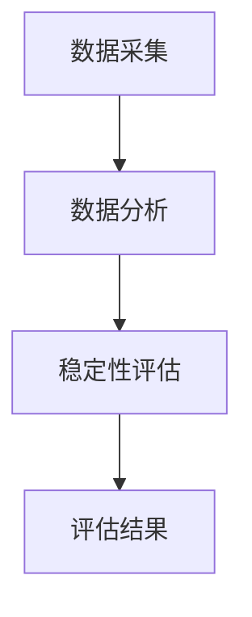
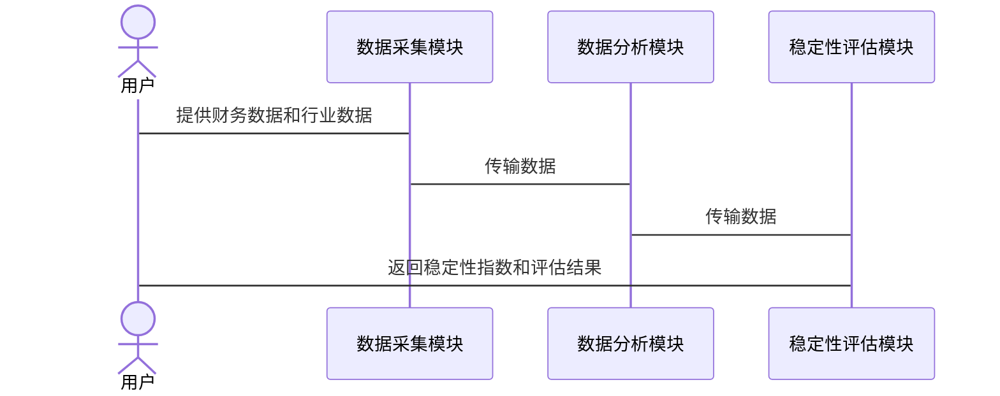

                 


# 巴菲特的行业选择：偏好稳定性

## 关键词：巴菲特，投资，稳定性，行业选择，价值投资

## 摘要：本文深入探讨巴菲特在选择行业时的偏好稳定性，分析其投资理念的核心，稳定性在投资中的重要性，以及如何通过数学模型和系统架构设计来实现稳定性评估。文章结合实际案例，详细讲解了稳定性指数的计算方法、系统设计与实现，并提供了最佳实践和未来研究方向。

---

## 第一部分: 巴菲特投资理念的背景与核心概念

### 第1章: 巴菲特投资理念概述

#### 1.1 巴菲特投资理念的背景

##### 1.1.1 投资领域的核心问题

投资领域的核心问题在于如何在不确定性中实现长期稳健的收益。巴菲特的投资理念强调长期价值和稳定性，这在波动的市场环境中尤为重要。

##### 1.1.2 巴菲特投资理念的提出背景

巴菲特的投资理念起源于价值投资理论，强调以低于内在价值的价格买入优质资产。他的成功在于对稳定性和持续性的高度重视。

##### 1.1.3 稳定性在投资中的重要性

稳定性是巴菲特选择行业和企业时的核心标准之一。他认为，稳定的行业和企业能够在经济波动中保持较好的表现，从而为投资者提供更可靠的回报。

#### 1.2 巴菲特的核心投资思想

##### 1.2.1 价值投资的定义与特点

价值投资是一种以低于市场价买入优质资产的投资策略，强调对企业的深入了解和长期持有。其特点包括注重内在价值、长期持有、避免短期波动。

##### 1.2.2 巴菲特的长期投资策略

巴菲特主张长期投资，避免频繁交易。他认为，短期波动无法决定企业的长期价值，只有时间才能验证企业的稳定性。

##### 1.2.3 稳定性在巴菲特投资中的地位

稳定性是巴菲特选择行业的核心标准。他认为，选择稳定行业的企业能够抵御经济波动，实现长期稳健的收益。

#### 1.3 巴菲特行业选择的核心原则

##### 1.3.1 稳定性在行业选择中的作用

稳定性是巴菲特选择行业的重要标准。他倾向于选择那些在经济周期中表现稳定的行业，如公用事业、消费品和金融行业。

##### 1.3.2 巴菲特对行业周期性的看法

巴菲特认为，行业周期性对企业的影响至关重要。他倾向于选择那些周期性较弱、需求稳定的企业，以降低投资风险。

##### 1.3.3 稳定性与企业长期价值的关系

稳定性与企业长期价值密切相关。稳定的行业和企业能够持续创造价值，为投资者提供长期稳定的回报。

### 第2章: 稳定性在投资中的核心概念

#### 2.1 稳定性在投资中的定义与特征

##### 2.1.1 稳定性的定义

稳定性指企业在不同经济环境下的表现一致性，能够在波动中保持稳定的收益和市场份额。

##### 2.1.2 稳定性的主要特征

- 收益稳定：企业盈利能力持续稳定。
- 市场份额稳定：企业在市场中占据稳定的份额。
- 财务状况稳定：企业财务健康，现金流充足。

##### 2.1.3 稳定性与风险的关系

稳定性与风险呈负相关。高稳定性的企业通常具有较低的投资风险。

#### 2.2 稳定性在不同行业的表现

##### 2.2.1 公用事业行业的稳定性分析

公用事业行业如电力、水务等，需求稳定，受经济波动影响较小，是巴菲特偏好的行业之一。

##### 2.2.2 消费品行业的稳定性分析

消费品行业如食品、饮料等，需求稳定，消费习惯不易改变，适合长期投资。

##### 2.2.3 金融行业的稳定性分析

金融行业如银行、保险等，虽然周期性较强，但通过选择具有强大资本实力和风险控制能力的金融机构，仍可实现较高的稳定性。

#### 2.3 稳定性与企业财务指标的关系

##### 2.3.1 稳定性与ROE（净资产收益率）的关系

ROE是衡量企业盈利能力的重要指标。高ROE且持续稳定的ROE表明企业具有较高的稳定性。

##### 2.3.2 稳定性与现金流指标的关系

现金流是企业财务健康的重要指标。稳定的现金流表明企业具有较强的偿债能力和持续经营能力。

##### 2.3.3 稳定性与企业盈利能力的关系

企业盈利能力的稳定性是衡量企业投资价值的重要因素。稳定的盈利能力表明企业具有持续创造价值的能力。

### 第3章: 巴菲特稳定性标准的数学模型

#### 3.1 稳定性评估的数学公式

##### 3.1.1 稳定性指数的定义

稳定性指数是一种量化企业稳定性的指标，通过对企业历史财务数据的分析，评估其收益、现金流和市场份额的稳定性。

##### 3.1.2 稳定性指数的计算公式

$$
\text{稳定性指数} = \frac{\text{连续三年ROE平均值}}{\text{行业平均ROE}}
$$

其中，ROE（净资产收益率）计算公式为：

$$
\text{ROE} = \frac{\text{净利润}}{\text{股东权益}}
$$

##### 3.1.3 稳定性指数的应用

稳定性指数越高的企业，表明其在行业中的稳定性越强，适合长期投资。

#### 3.2 稳定性评估的算法流程

##### 3.2.1 数据收集阶段

- 收集目标企业的历史财务数据（ROE、现金流等）。
- 收集行业平均ROE数据。

##### 3.2.2 数据处理阶段

- 计算目标企业的连续三年ROE平均值。
- 计算行业平均ROE。

##### 3.2.3 稳定性指数计算阶段

- 应用稳定性指数公式，计算目标企业的稳定性指数。

##### 3.2.4 评估结果

- 稳定性指数大于1的企业，具有较高的稳定性。
- 稳定性指数小于1的企业，稳定性较低。

### 第4章: 巴菲特行业选择的系统架构设计

#### 4.1 系统功能模块

##### 4.1.1 数据采集模块

- 采集目标企业的历史财务数据。
- 采集行业平均ROE数据。

##### 4.1.2 数据分析模块

- 计算连续三年ROE平均值。
- 计算行业平均ROE。

##### 4.1.3 稳定性评估模块

- 计算稳定性指数。
- 生成评估结果。

#### 4.2 系统架构设计

##### 4.2.1 系统架构图



#### 4.3 系统接口设计

##### 4.3.1 数据输入接口

- 输入目标企业的财务数据和行业数据。

##### 4.3.2 数据输出接口

- 输出稳定性指数和评估结果。

#### 4.4 系统交互流程

##### 4.4.1 交互流程图



---

## 第二部分: 稳定性评估的算法实现

### 第5章: 稳定性评估的Python实现

#### 5.1 环境安装

- 安装Python和相关库（pandas、numpy、matplotlib）。

#### 5.2 核心代码实现

##### 5.2.1 数据读取

```python
import pandas as pd
import numpy as np

# 读取数据
data = pd.read_csv('financial_data.csv')
```

##### 5.2.2 数据处理

```python
# 计算连续三年ROE平均值
roe = data['ROE'].rolling(3).mean().dropna()

# 计算行业平均ROE
industry_ave_roe = data['行业平均ROE'].mean()

# 计算稳定性指数
stability_index = roe / industry_ave_roe
```

##### 5.2.3 结果输出

```python
# 输出稳定性指数
print(stability_index)
```

#### 5.3 代码应用解读

通过上述代码，我们可以计算目标企业的稳定性指数，并根据结果判断其稳定性。稳定性指数大于1的企业适合长期投资。

---

## 第三部分: 项目实战

### 第6章: 稳定性评估的实际应用

#### 6.1 案例分析：银行业

##### 6.1.1 数据准备

收集银行行业的财务数据，计算连续三年ROE平均值和行业平均ROE。

##### 6.1.2 稳定性指数计算

应用上述算法，计算银行业企业的稳定性指数。

##### 6.1.3 结果分析

稳定性指数较高的银行企业适合长期投资。

#### 6.2 实际案例解读

通过具体案例分析，展示如何应用稳定性指数评估企业的投资价值。

---

## 第四部分: 最佳实践与总结

### 第7章: 最佳实践

#### 7.1 投资策略

- 选择稳定性指数高的企业进行投资。
- 长期持有，避免短期波动。

#### 7.2 注意事项

- 定期更新财务数据，重新评估稳定性指数。
- 考虑宏观经济环境对企业稳定性的影响。

### 第8章: 小结与展望

#### 8.1 小结

本文详细探讨了巴菲特行业选择的稳定性偏好，分析了其投资理念的核心，并通过数学模型和系统架构设计，展示了如何实现稳定性评估。

#### 8.2 未来研究方向

- 探讨更多行业稳定性评估的方法。
- 研究稳定性与企业长期价值的关系。

---

## 作者：AI天才研究院/AI Genius Institute & 禅与计算机程序设计艺术 /Zen And The Art of Computer Programming

