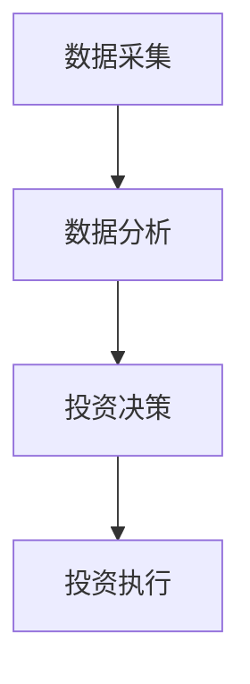

                 


# 巴菲特的行为金融学应用：利用市场非理性创造alpha

> 关键词：巴菲特，行为金融学，投资策略，市场非理性，alpha收益

> 摘要：本文深入探讨了巴菲特如何运用行为金融学原理，利用市场非理性现象创造alpha收益。通过分析其投资哲学、策略和具体案例，揭示了市场情绪、认知偏差等行为因素对投资决策的影响。文章结合理论与实践，提供了一套基于行为金融学的投资系统架构，并通过实际案例展示了如何量化市场情绪和价值评估，为投资者提供了实用的操作指南。

---

## 第一部分：引言

### 1.1 巴菲特与行为金融学的相遇

沃伦·巴菲特，作为全球最成功的投资者之一，他的投资哲学不仅仅是基于价值投资的理论，更深刻地融入了行为金融学的精髓。本文将从行为金融学的角度，分析巴菲特的投资策略，揭示他如何利用市场非理性现象创造超额收益（alpha）。

### 1.2 市场非理性与alpha收益

在传统金融学中，市场被认为是有效的，即价格反映了所有可获取的信息。然而，现实中市场往往存在非理性现象，如恐慌性抛售、盲目跟风等。这些非理性行为为精明的投资者提供了创造alpha收益的机会。巴菲特正是抓住了这些机会，成为投资界的传奇。

---

## 第二部分：行为金融学的核心概念

### 2.1 投资者心理与认知偏差

#### 2.1.1 认知偏差的定义与分类

认知偏差是人类在信息处理过程中产生的系统性错误。常见的认知偏差包括确认偏差、过度自信偏差、损失厌恶等。这些偏差会影响投资者的决策，导致非理性行为。

#### 2.1.2 投资者心理与市场情绪

投资者的心理波动直接影响市场情绪。当市场情绪高涨时，投资者倾向于高估资产价值；当市场情绪低落时，则倾向于低估资产价值。巴菲特认为，市场情绪是投资决策中不可忽视的因素。

#### 2.1.3 巴菲特对投资者心理的理解

巴菲特曾说过：“市场是投票机，而不是称重机。”他深刻理解市场情绪的波动，并利用这种波动进行投资。

---

### 2.2 市场非理性与alpha机会

#### 2.2.1 市场无效性与alpha

市场无效性是指市场价格未能反映所有相关信息。这种无效性为投资者提供了套利机会。巴菲特正是通过寻找市场无效性，实现超额收益。

#### 2.2.2 市场恐慌与贪婪

市场恐慌和贪婪是市场非理性的典型表现。在恐慌时，投资者往往抛售资产，导致价格低于其内在价值；在贪婪时，则相反。巴菲特善于在恐慌时买入优质资产。

#### 2.2.3 市场波动与alpha的创造

市场波动为投资者提供了低吸高抛的机会。巴菲特通过长期持有优质资产，利用市场的短期波动，实现长期收益。

---

## 第三部分：巴菲特的行为金融学分析

### 3.1 巴菲特的市场先生理论

#### 3.1.1 市场先生的定义与特点

市场先生是巴菲特用来描述市场的模型。市场先生每天为投资者提供买卖资产的机会，但他的定价往往偏离理性价值。

#### 3.1.2 市场先生与投资者决策

投资者需要与市场先生互动，但不能被市场先生的情绪左右。巴菲特强调，投资者应独立思考，避免随市场波动而盲目决策。

#### 3.1.3 巴菲特的市场先生应用

巴菲特通过分析市场先生的行为，判断市场是否处于非理性状态。当市场先生提供低于内在价值的价格时，巴菲特果断买入。

---

### 3.2 巴菲特的安全边际理论

#### 3.2.1 安全边际的定义与计算

安全边际是指资产的市场价格低于其内在价值的部分。计算公式为：安全边际 = 内在价值 - 市场价格。

#### 3.2.2 安全边际与市场非理性

市场非理性导致资产价格波动，从而产生安全边际。巴菲特通过寻找具有较大安全边际的资产，降低投资风险。

#### 3.2.3 巴菲特的安全边际应用

巴菲特在投资实践中，始终坚持寻找具有较大安全边际的资产，尤其是在市场恐慌时。

---

## 第四部分：市场非理性中的alpha机会

### 4.1 市场无效性与alpha

#### 4.1.1 市场无效性的定义与表现

市场无效性是指市场价格未能反映所有相关信息。这种无效性为投资者提供了套利机会。

#### 4.1.2 市场无效性中的alpha机会

巴菲特通过分析市场无效性，寻找被市场低估的资产。

#### 4.1.3 巴菲特的市场无效性案例

2008年金融危机期间，巴菲特利用市场的无效性，大量买入优质资产。

---

### 4.2 市场恐慌与alpha

#### 4.2.1 市场恐慌的定义与表现

市场恐慌是指投资者因情绪波动而大量抛售资产，导致资产价格大幅下跌。

#### 4.2.2 市场恐慌中的alpha机会

巴菲特通过在市场恐慌时买入优质资产，实现超额收益。

#### 4.2.3 巴菲特的恐慌市场案例

2008年金融危机期间，巴菲特大量买入高盛和美国银行的股票，最终实现巨大收益。

---

## 第五部分：巴菲特的行为金融学系统分析

### 5.1 投资决策系统的构建

#### 5.1.1 投资决策系统的定义与目标

投资决策系统旨在帮助投资者做出科学的投资决策。

#### 5.1.2 投资决策系统的功能模块

- 数据采集模块：收集市场数据和相关信息。
- 数据分析模块：分析市场情绪和资产价值。
- 投资决策模块：基于分析结果，制定投资策略。

#### 5.1.3 投资决策系统的流程图



---

### 5.2 投资策略的数学模型

#### 5.2.1 市场情绪指标的量化

市场情绪可以通过投资者情绪指数（AAI）量化。公式为：

$$ AAI = \frac{\text{市场情绪得分}}{\text{市场情绪标准差}} $$

#### 5.2.2 价值评估模型

资产的内在价值可以通过 discounted cash flow (DCF) 模型评估。公式为：

$$ V = \frac{CF}{(1 + r)^n} $$

其中，CF 为现金流，r 为贴现率，n 为时间跨度。

---

## 第六部分：项目实战

### 6.1 环境配置

#### 6.1.1 数据源选择

使用 Yahoo Finance 获取历史数据。

#### 6.1.2 工具安装

安装 Python 和相关库（如 pandas, numpy, matplotlib）。

---

### 6.2 数据获取与预处理

#### 6.2.1 数据获取

```python
import pandas as pd
import numpy as np

# 获取股票数据
data = pd.read_csv('stock.csv')
```

#### 6.2.2 数据清洗

```python
# 清洗数据
data.dropna(inplace=True)
```

---

### 6.3 情绪指标计算

#### 6.3.1 情绪指标计算

```python
# 计算市场情绪指数
data['情绪指数'] = data['收盘价'].rolling(20).mean()
```

---

### 6.4 投资策略实现

#### 6.4.1 价值评估模型

```python
def 计算内在价值(现金流, 贴现率, 时间跨度):
    return sum(现金流 / (1 + 贴现率) ** 时间跨度)
```

#### 6.4.2 安全边际计算

```python
def 计算安全边际(内在价值, 市场价格):
    return 内在价值 - 市场价格
```

---

## 第七部分：总结与展望

### 7.1 总结

本文从行为金融学的角度，分析了巴菲特的投资策略，揭示了市场非理性对投资决策的影响。通过构建投资决策系统和量化分析，为投资者提供了实用的操作指南。

### 7.2 展望

未来，随着人工智能和大数据技术的发展，行为金融学将更加深入地应用于投资领域。投资者可以通过更精准的情绪分析和价值评估，捕捉更多的alpha机会。

---

## 作者信息

作者：AI天才研究院/AI Genius Institute & 禅与计算机程序设计艺术 /Zen And The Art of Computer Programming

---

以上是完整的技术博客文章大纲和内容。

