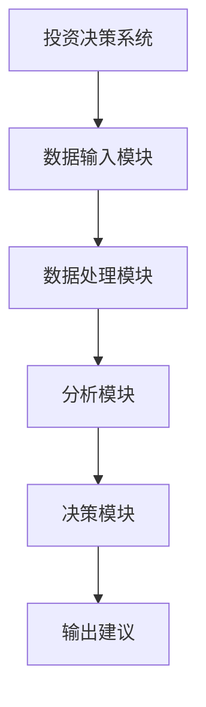

                 

<think>
好的，我现在需要根据用户的要求，详细撰写一篇关于《巴菲特的行为金融学应用：理解并利用市场非理性》的技术博客文章。首先，我需要明确文章的结构和各个部分的内容，确保涵盖所有必要的部分，如背景介绍、核心概念、算法原理、系统分析、项目实战等。

首先，我会从背景介绍开始，解释行为金融学的基本概念以及巴菲特的投资理念。然后，我会详细阐述市场非理性的表现及其对投资决策的影响，接着介绍行为金融学中的核心理论，如前景理论和认知偏差，并结合巴菲特的案例进行分析。

接下来，我会解释巴菲特如何利用市场非理性进行投资，包括他的投资策略和如何识别市场非理性。然后，我会讨论行为金融学模型在投资中的应用，如前景理论在投资组合管理中的应用，并提供相应的数学模型和公式。

在系统分析部分，我会构建投资决策系统的架构，包括系统目标、功能模块设计和架构图。然后，在项目实战部分，我会选择一个具体的案例，分析其中的非理性因素，并展示如何利用行为金融学的方法进行投资决策。

最后，我会总结全文，展望未来的发展，并给出一些最佳实践的建议和注意事项。整个过程中，我需要确保使用清晰、专业的技术语言，并提供丰富的细节和例子，使读者能够深入理解内容。

现在，我将根据这些思考，开始撰写文章。
</think>

# 巴菲特的行为金融学应用：理解并利用市场非理性

## 关键词：
- 巴菲特
- 行为金融学
- 市场非理性
- 投资策略
- 认知偏差
- 价值投资

## 摘要：
本文探讨巴菲特如何应用行为金融学原理，理解并利用市场中的非理性行为。通过分析行为金融学的核心理论和巴菲特的投资理念，揭示市场非理性对投资决策的影响，并提供实际案例和策略，帮助投资者在非理性市场中做出明智决策。

---

## 第一部分：行为金融学的概述

### 第1章：行为金融学的基本概念

#### 1.1 行为金融学的定义
行为金融学（Behavioral Finance）是研究投资者心理和行为如何影响金融市场决策的学科。它结合心理学、经济学和社会学，分析市场参与者的非理性行为对价格和收益的影响。

#### 1.2 巴菲特的投资理念
巴菲特是价值投资的倡导者，强调以合理价格投资优质企业。他的投资策略基于对企业内在价值的评估，而非市场波动。

### 第2章：市场非理性的表现与影响

#### 2.1 市场非理性的主要表现
- **投资者认知偏差**：如过度自信、确认偏差等。
- **市场情绪波动**：恐慌性抛售或贪婪性买入。
- **过度交易行为**：频繁交易增加成本，降低收益。

#### 2.2 市场非理性对投资决策的影响
- **非理性决策的后果**：可能导致投资损失。
- **市场定价的影响**：非理性行为扭曲资产价格。
- **长期策略的挑战**：投资者需识别短期波动中的机会。

---

## 第二部分：行为金融学的核心理论与模型

### 第3章：前景理论

#### 3.1 前景理论的基本框架
前景理论（Prospect Theory）由Kahneman和Tversky提出，描述投资者如何评估收益和损失。核心在于损失厌恶，即人们对损失的敏感性高于收益。

#### 3.2 前景理论在投资决策中的应用
- 投资者在面临损失时更倾向于卖出，反之在收益时更倾向于持有。

### 第4章：认知偏差与启发式

#### 4.1 认知偏差的主要类型
- **确认偏差**：选择性接受信息，忽略相反证据。
- **代表性偏差**：根据典型案例做出决策，忽略概率。

#### 4.2 启发式在投资决策中的应用
- **简化决策过程**：投资者依赖经验法则，如“买低卖高”。

---

## 第三部分：巴菲特如何利用市场非理性

### 第5章：巴菲特对市场非理性的理解

#### 5.1 巴菲特对市场波动的看法
市场波动是机会，而非风险。巴菲特定价低于内在价值时买入，反之卖出。

### 第6章：巴菲特的投资策略与行为金融学结合

#### 6.1 价值投资与市场非理性的结合
巴菲特定价低于内在价值时买入，利用市场低估的机会。

---

## 第四部分：行为金融学模型在投资中的应用

### 第7章：前景理论在投资组合管理中的应用

#### 7.1 投资组合管理模型
使用前景理论评估风险和收益，构建稳健组合。

---

## 第五部分：系统分析与架构设计

### 第8章：投资决策系统的构建

#### 8.1 系统目标与范围
- 分析市场情绪，识别非理性行为。
- 评估企业内在价值。

#### 8.2 系统功能模块设计
- 数据收集：市场数据、新闻情绪。
- 分析模块：情绪分析、认知偏差检测。
- 决策模块：基于模型的投资建议。

#### 8.3 系统架构图（Mermaid）

---

## 第六部分：项目实战

### 第9章：实际案例分析

#### 9.1 案例选择
分析某科技股在市场非理性情况下的投资机会。

#### 9.2 分析与实施
- 识别市场情绪。
- 评估企业价值。
- 制定投资策略。

---

## 第七部分：总结与展望

### 第10章：总结

#### 10.1 核心观点回顾
- 行为金融学帮助识别市场非理性。
- 巴菲特的策略有效利用了这些非理性。

### 第11章：未来展望

#### 11.1 未来趋势
- 结合AI技术分析市场情绪。
- 进一步优化投资模型。

---

## 作者：AI天才研究院 & 禅与计算机程序设计艺术

通过本文，我们深入探讨了巴菲特如何利用行为金融学理解市场非理性。从理论到实践，为投资者提供了实用的策略和工具。

