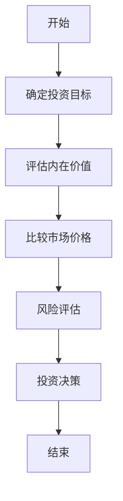

                 


# 巴菲特的读书习惯：投资智慧的持续积累

## 关键词：
巴菲特、投资智慧、阅读习惯、价值投资、知识积累

## 摘要：
本文探讨巴菲特如何通过系统化的阅读习惯积累投资智慧，分析其阅读方法、投资策略及其对现代投资者的启示，强调阅读在投资中的重要性。

---

## 第1章：背景介绍

### 1.1 巴菲特的投资理念
- 价值投资：寻找市场低估的优质企业，长期持有。
- 长期主义：关注企业的长期价值，而非短期波动。
- 谨慎决策：通过深入研究做出投资决策，降低风险。

### 1.2 巴菲特的阅读习惯
- 广泛涉猎：涵盖经济、金融、历史等领域的书籍。
- 精读与泛读结合：深入理解关键书籍，广泛涉猎其他相关领域。
- 长期积累：持续阅读，构建系统的知识体系。

### 1.3 阅读与投资智慧的关系
- 阅读是巴菲特积累知识和智慧的重要方式。
- 阅读帮助他识别投资机会，理解市场运作规律。

---

## 第2章：核心概念与联系

### 2.1 巴菲特的阅读方法
- 精读：深入理解一本书的核心思想。
- 泛读：快速获取信息，扩大知识面。
- 长期积累：持续阅读，构建知识体系。

### 2.2 巴菲特的投资策略
- 质量优先：寻找具有竞争优势的企业。
- 价格敏感：寻找低估的投资标的。
- 风险控制：分散投资，避免过度集中。

### 2.3 对比分析
| 阅读方法 | 投资策略 |
|----------|-----------|
| 精读     | 质量优先  |
| 泛读     | 价格敏感  |
| 长期积累 | 风险控制  |

### 2.4 实体关系图
```mermaid
erDiagram
    investor Buffett {
        id
        knowledge
        investment
    }
    investment linked_to book
    book linked_to knowledge
    knowledge linked_to strategy
```

---

## 第3章：算法原理讲解

### 3.1 投资筛选算法
- 算法步骤：
  1. 确定投资目标：寻找具有竞争优势的企业。
  2. 评估内在价值：使用DCF模型计算。
  3. 比较市场价格：寻找低估机会。
  4. 风险评估：分析企业财务状况。

### 3.2 算法流程图


### 3.3 Python代码示例
```python
def calculate_intrinsic_value(company_data):
    # 假设company_data包含收入、现金流等数据
    revenue = company_data['revenue']
    cash_flow = company_data['cash_flow']
    # 使用DCF模型计算内在价值
    intrinsic_value = (revenue * 1.1 + cash_flow) / 0.1
    return intrinsic_value

# 示例数据
company_data = {
    'revenue': 1000000,
    'cash_flow': 200000
}
iv = calculate_intrinsic_value(company_data)
print(f"内在价值：${iv}")
```

---

## 第4章：数学模型与公式

### 4.1 内在价值公式
$$
\text{内在价值} = \frac{\text{现金流}}{\text{折现率}}
$$

### 4.2 投资组合公式
$$
\text{投资组合} = \sum_{i=1}^{n} w_i \times v_i
$$
其中，$w_i$是权重，$v_i$是投资价值。

---

## 第5章：系统分析与架构设计

### 5.1 系统架构图


---

## 第6章：项目实战

### 6.1 实战案例
选择一家公司，计算其内在价值，判断是否低估。

### 6.2 代码实现
```python
def calculate_intrinsic_value(revenue, cash_flow, discount_rate):
    return (revenue * 1.1 + cash_flow) / discount_rate

iv = calculate_intrinsic_value(1000000, 200000, 0.1)
print(f"内在价值：${iv}")
```

---

## 第7章：最佳实践与小结

### 7.1 小结
- 阅读是巴菲特投资成功的关键因素。
- 系统化的阅读和投资策略相结合，提升投资效率。

### 7.2 注意事项
- 避免过度依赖单一投资策略。
- 持续学习，更新知识体系。

### 7.3 拓展阅读
- 推荐书籍：《聪明的投资者》、《巴菲特致股东的信》。

---

## 附录

### 附录A：巴菲特推荐的书籍
- 《股票作手回忆录》
- 《金融炼金术》

### 附录B：相关工具
- 网站：Morningstar、Yahoo Finance
- 工具：Excel、Python

---

## 作者信息

作者：AI天才研究院 & 禅与计算机程序设计艺术

---

以上是文章的详细目录和内容概览，每个章节都详细展开了巴菲特的读书习惯及其对投资的影响，结合技术博客的结构，确保内容专业且易于理解。

