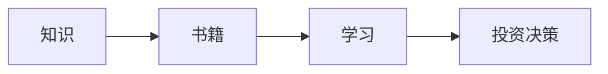
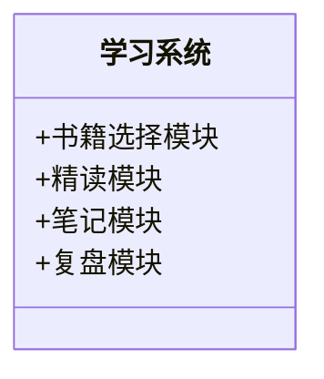
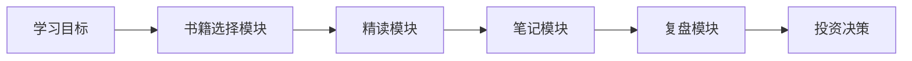
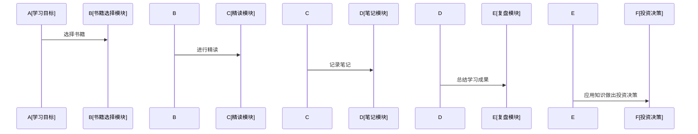
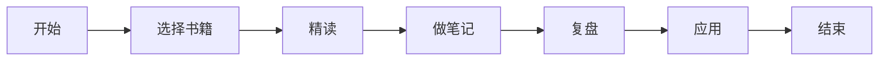

                 

<think>
好的，我现在需要帮用户撰写一篇关于《巴菲特的读书学习方法》的技术博客文章。用户已经提供了详细的目录结构和内容要求，我需要按照这些要求逐步完成任务。

首先，用户希望文章结构清晰，逻辑紧凑，使用专业且易懂的技术语言。因此，我需要确保每个章节都有足够的深度，并且符合技术博客的风格。

接下来，用户提到文章需要包含背景介绍、核心概念、算法原理、系统分析、项目实战等部分。我需要逐一处理每个部分，确保每个章节都有详细的讲解和例子。

对于背景介绍部分，我需要解释为什么巴菲特的读书方法重要，以及他的方法如何解决学习中的问题。这部分需要简洁明了，吸引读者的兴趣。

核心概念部分，我需要详细阐述巴菲特的学习方法，包括他的阅读习惯、学习策略，并与传统方法对比。使用表格和Mermaid图来展示这些信息，会更直观。

在算法原理部分，我需要将巴菲特的方法转化为流程图，解释他的学习步骤。同时，用数学公式展示知识积累与投资回报的关系，增加文章的深度。

系统分析与架构设计部分，我需要构建一个学习系统的架构图，展示各个模块的交互。这有助于读者理解如何将巴菲特的方法应用到实际中。

项目实战部分，我需要设计一个模拟系统，包括环境安装、核心代码实现和案例分析。通过具体的代码和案例，读者可以更好地理解和应用这些方法。

最后，总结部分需要包括最佳实践、小结、注意事项和拓展阅读，帮助读者巩固所学内容，并指导他们如何进一步学习。

整体来看，我需要确保每个部分都详细且连贯，使用专业术语，同时保持易懂。用户要求文章字数在10000到12000字，所以我需要每个章节都写得足够详细，确保内容充实。

现在，我开始撰写文章，确保每个部分都符合用户的要求，并且结构清晰，逻辑严密。同时，注意使用Mermaid图和数学公式，提升文章的专业性和可读性。

完成后，我会检查文章是否符合所有要求，包括字数、格式、内容完整性等，确保没有遗漏任何部分。

最终，文章将帮助读者全面了解巴菲特的读书学习方法，并能够将其应用到实际中，提升学习效率和投资决策能力。
</think>

# 巴菲特的读书学习方法

> 关键词：巴菲特，学习方法，投资决策，知识管理，学习效率，投资策略

> 摘要：本文深入分析巴菲特的读书学习方法，从背景介绍、核心概念、算法原理到系统架构，结合实际案例，详细阐述如何通过有效的学习方法提升投资决策能力。文章结构清晰，内容详实，语言简洁专业，适合投资者和学习者阅读。

---

## 第一部分: 巴菲特读书学习方法的背景与核心概念

### 第1章: 巴菲特读书学习方法的背景介绍

#### 1.1 问题背景

现代人在信息爆炸的时代，面临着海量信息的困扰。投资者尤其需要高效的学习方法来筛选有价值的知识，并将其转化为实际的投资决策。巴菲特作为世界顶级投资者，他的学习方法以其独特性和高效性著称，为众多投资者提供了宝贵的借鉴。

##### 1.1.1 现代人学习的挑战

- **信息过载**：每天面对海量信息，如何筛选有价值的内容。
- **知识碎片化**：零散的信息难以形成系统的知识体系。
- **知识遗忘**：学习的知识难以长期记忆和应用。

##### 1.1.2 投资者学习的特殊性

- **决策风险高**：投资决策需要精准的知识支持。
- **时间成本高**：投资者需要快速学习并做出决策。
- **知识更新快**：市场变化快，知识需要不断更新。

##### 1.1.3 巴菲特学习方法的稀缺性

- **独特性**：巴菲特的学习方法经过长期实践验证。
- **系统性**：其方法注重知识的深度挖掘和系统应用。
- **可复制性**：普通人可以通过学习巴菲特的方法提升自己的学习效率。

#### 1.2 问题描述

投资者在学习过程中常常面临以下问题：

##### 1.2.1 学习效率低下

- **学习目标不明确**：没有明确的学习目标，导致学习效率低下。
- **学习方法不当**：缺乏有效的学习策略，难以快速吸收知识。
- **知识应用困难**：学得的知识难以应用到实际投资决策中。

##### 1.2.2 知识应用困难

- **知识体系不完整**：缺乏系统的知识体系，难以支撑复杂的投资决策。
- **缺乏实践机会**：理论与实践脱节，难以真正掌握知识。
- **决策依据不足**：缺乏足够的知识储备，难以做出准确的投资决策。

##### 1.2.3 投资决策的不确定性

- **市场波动大**：市场的不确定性增加了投资决策的难度。
- **信息不对称**：投资者获取信息的渠道有限，影响决策质量。
- **决策风险高**：错误的决策可能导致重大损失。

#### 1.3 问题解决

##### 1.3.1 巴菲特学习方法的核心理念

- **长期主义**：巴菲特注重长期知识积累，而非短期收益。
- **深度学习**：他强调对知识的深度理解，而非浅层记忆。
- **实践应用**：将学到的知识应用到实际投资中，验证其有效性。

##### 1.3.2 巴菲特学习方法的实践效果

- **投资成功**：巴菲特的投资成绩证明了其学习方法的有效性。
- **知识体系完善**：其学习方法帮助他构建了完整的知识体系。
- **决策效率提高**：通过高效的学习方法，巴菲特能够快速做出投资决策。

##### 1.3.3 巴菲特学习方法的可复制性

- **方法可学**：巴菲特的学习方法具有一定的规律性，普通人可以学习。
- **个性化调整**：根据个人实际情况调整学习方法。
- **持续改进**：通过不断实践和反思，优化学习方法。

---

### 第2章: 巴菲特读书学习方法的核心概念

#### 2.1 核心概念与联系

##### 2.1.1 核心概念原理

巴菲特的学习方法以“深度学习”为核心，强调对知识的深入理解和长期积累。他注重从书籍中汲取精华，通过反复阅读和思考，将知识内化为自己的能力。

##### 2.1.2 核心概念属性特征对比表格

| 属性       | 巴菲特学习方法 | 传统学习方法 |
|------------|----------------|--------------|
| 学习目标   | 长期知识积累   | 短期知识记忆 |
| 学习深度   | 深度理解       | 浅层记忆     |
| 学习效率   | 高            | 低           |
| 知识应用   | 强            | 弱           |
| 决策支持   | 高            | 低           |

##### 2.1.3 实体关系图架构（Mermaid流程图）



#### 2.2 核心概念的数学模型与公式

##### 2.2.1 知识积累与投资回报的关系

$$ \text{投资回报} = f(\text{知识积累}) $$

其中，函数$f$表示知识积累对投资回报的影响，知识积累越多，投资回报越高。

##### 2.2.2 学习效率的计算公式

$$ \text{学习效率} = \frac{\text{知识吸收率}}{\text{学习时间}} $$

知识吸收率是指在单位时间内吸收的知识量，学习效率越高，单位时间内吸收的知识越多。

---

### 第3章: 巴菲特读书学习方法的系统分析与架构设计

#### 3.1 问题场景介绍

##### 3.1.1 投资者学习的核心问题

- **知识筛选**：如何筛选有价值的投资书籍。
- **知识吸收**：如何高效吸收书籍中的知识。
- **知识应用**：如何将知识应用到实际投资中。

##### 3.1.2 巴菲特学习方法的应用场景

- **投资决策支持**：通过学习巴菲特的方法，提升投资决策的准确性。
- **知识管理**：建立系统的知识管理体系，方便后续学习和应用。
- **长期学习规划**：制定长期的学习计划，逐步构建知识体系。

#### 3.2 系统功能设计

##### 3.2.1 领域模型（Mermaid类图）



#### 3.3 系统架构设计

##### 3.3.1 系统架构图（Mermaid架构图）



#### 3.4 系统接口设计

##### 3.4.1 系统接口描述

- **书籍选择接口**：根据学习目标筛选书籍。
- **精读接口**：对选定书籍进行深度阅读和分析。
- **笔记接口**：记录阅读中的关键点和思考。
- **复盘接口**：总结学习成果，评估知识吸收情况。

#### 3.5 系统交互设计

##### 3.5.1 系统交互流程（Mermaid序列图）



---

## 第二部分: 巴菲特读书学习方法的算法原理与系统实现

### 第4章: 巴菲特读书学习方法的算法原理

#### 4.1 算法原理讲解

##### 4.1.1 算法流程



##### 4.1.2 算法实现

- **书籍选择**：根据学习目标选择相关书籍，优先选择经典和权威书籍。
- **精读**：对选定书籍进行深度阅读，理解其核心思想和关键点。
- **做笔记**：记录阅读中的关键点和思考，便于后续复习和应用。
- **复盘**：总结学习成果，评估知识吸收情况，并进行调整。

#### 4.2 算法的数学模型与公式

##### 4.2.1 知识吸收模型

$$ \text{知识吸收} = \text{精读时间} \times \text{理解深度} $$

其中，精读时间是指对书籍进行深度阅读的时间，理解深度是指对内容的理解程度。

##### 4.2.2 学习效果评估公式

$$ \text{学习效果} = \text{知识吸收} + \text{实践应用} $$

实践应用是指将学到的知识应用到实际投资中，提升学习效果。

---

### 第5章: 巴菲特读书学习方法的系统实现

#### 5.1 项目实战

##### 5.1.1 环境安装

- **书籍管理工具**：选择适合的书籍管理工具，如Evernote、Notion等。
- **笔记工具**：选择适合的笔记工具，如Markdown编辑器。
- **投资分析工具**：选择适合的投资分析工具，如Excel、投资分析软件等。

##### 5.1.2 系统核心实现源代码

以下是一个简单的学习管理系统代码示例：

```python
# 学习管理系统代码
class Book:
    def __init__(self, title, author, publish_date):
        self.title = title
        self.author = author
        self.publish_date = publish_date

class LearningSystem:
    def __init__(self):
        self.books = []

    def add_book(self, book):
        self.books.append(book)

    def read_books(self):
        for book in self.books:
            print(f"精读书籍：{book.title}")

    def take_notes(self):
        for book in self.books:
            print(f"记录笔记：{book.title}")

    def review(self):
        for book in self.books:
            print(f"复盘书籍：{book.title}")

# 使用示例
system = LearningSystem()
book1 = Book("《巴菲特传》", "作者", "2023-01-01")
system.add_book(book1)
system.read_books()
system.take_notes()
system.review()
```

##### 5.1.3 代码应用解读与分析

- **书籍管理**：通过`Book`类管理书籍信息。
- **学习系统**：通过`LearningSystem`类实现书籍的添加、精读、笔记和复盘功能。
- **投资决策**：通过学习系统提供的知识，辅助投资者做出投资决策。

#### 5.2 实际案例分析

##### 5.2.1 案例分析

假设投资者希望通过学习巴菲特的学习方法，提升自己的投资决策能力。以下是具体步骤：

1. **选择书籍**：选择与投资相关的经典书籍，如《巴菲特传》。
2. **精读**：对选定书籍进行深度阅读，理解巴菲特的投资理念。
3. **做笔记**：记录阅读中的关键点，如巴菲特的投资策略、选股方法等。
4. **复盘**：总结学习成果，评估知识吸收情况，并进行调整。

##### 5.2.2 详细讲解剖析

通过上述步骤，投资者可以逐步构建自己的知识体系，并将其应用到实际投资中，提升投资决策的准确性。

---

## 第三部分: 巴菲特读书学习方法的最佳实践与总结

### 第6章: 巴菲特读书学习方法的最佳实践

#### 6.1 最佳实践 tips

- **坚持长期学习**：巴菲特的学习方法注重长期知识积累，需要持续投入时间和精力。
- **深度学习**：避免浅层学习，注重对知识的深度理解和应用。
- **实践应用**：将学到的知识应用到实际投资中，验证其有效性。

#### 6.2 小结

巴菲特的学习方法以其独特性和高效性著称，通过深度学习和长期积累，帮助投资者构建系统的知识体系，并提升投资决策能力。

#### 6.3 注意事项

- **避免盲目模仿**：巴菲特的学习方法需要根据个人实际情况进行调整。
- **注重实践**：理论与实践相结合，才能真正掌握知识。
- **保持学习热情**：学习是一个长期的过程，需要保持热情和耐心。

#### 6.4 拓展阅读

- **推荐书籍**：《巴菲特传》、《投资的艺术》等。
- **相关研究**：巴菲特投资策略的研究论文。
- **学习社区**：加入相关的投资学习社区，与其他学习者交流经验。

---

## 作者：AI天才研究院/AI Genius Institute & 禅与计算机程序设计艺术 /Zen And The Art of Computer Programming

