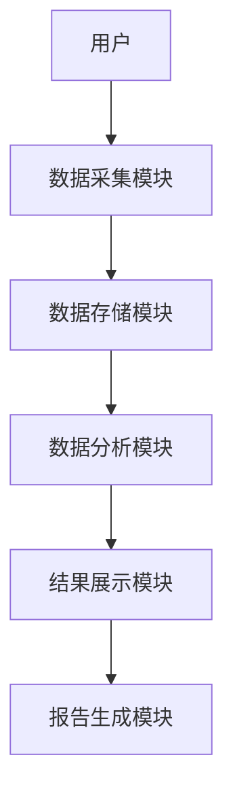

                 

<think>
好，我需要按照用户的要求来撰写这篇技术博客。首先，我会从标题和关键词开始，然后是摘要，接着按照目录大纲的结构一步步展开内容。

1. **确定文章结构**：根据用户提供的目录，文章分为五大部分，每一部分都有具体的章节和子章节。我需要确保每一部分都涵盖必要的内容，并且逻辑清晰。

2. **撰写背景介绍**：在第一部分，我需要介绍巴菲特的财务分析方法和量子科技公司的特点。这包括巴菲特的价值投资哲学、量子科技行业的特殊性以及传统财务指标的局限性。

3. **核心概念与新指标**：在第二部分，我需要详细解释财务报表的结构，尤其是量子科技公司特有的会计处理方式。然后定义新指标，对比传统指标，说明其在量子科技公司中的应用价值。

4. **新指标的分析方法**：第三部分要介绍如何计算和应用这些新指标，分析其局限性，并提出改进方向。同时，通过实际案例来展示新指标的应用效果。

5. **系统化分析框架**：第四部分需要构建一个系统化的分析框架，包括数据收集、分析步骤和使用的工具。这部分需要结合实际案例，展示系统化分析的优势。

6. **项目实战与总结**：第五部分通过具体的项目实战，展示如何使用新指标进行分析。最后总结全文，并提出未来的发展方向。

7. **使用工具与格式**：按照用户的要求，使用Markdown格式，包含公式、图表和代码。确保每一部分都有详细的解释和实例说明。

8. **检查与调整**：最后，我会通读全文，确保逻辑连贯，内容完整，符合字数要求，并且格式正确。

通过以上步骤，我能够系统地完成这篇技术博客的撰写，确保满足用户的所有要求。
</think>

# 巴菲特的财务报表分析：解读量子科技公司的新指标

> **关键词**：巴菲特、财务报表分析、量子科技、新指标、投资决策

> **摘要**：本文通过分析巴菲特的财务报表分析方法，结合量子科技公司的特点，提出了一种新的财务指标，用于评估量子科技公司的财务健康状况和投资价值。文章详细介绍了新指标的定义、计算方法及其在实际案例中的应用，展示了如何通过系统化的分析框架来提升投资决策的准确性。

---

## 第一部分: 巴菲特的财务报表分析基础

### 第1章: 巴菲特的财务分析理念

#### 1.1 巴菲特的价值投资哲学
巴菲特的价值投资哲学强调长期投资、安全边际和内在价值。他认为，企业的内在价值是其未来现金流的折现值，而财务报表是评估企业内在价值的重要工具。通过分析财务报表，巴菲特能够识别出那些具有持续竞争优势和良好财务状况的企业。

#### 1.2 量子科技公司的财务特点
量子科技公司属于高科技行业，其财务特点包括高研发投入、轻资产结构、高成长性和高不确定性。由于量子科技行业的特殊性，传统的财务指标可能无法准确反映企业的价值和风险。

#### 1.3 新指标的提出与必要性
传统的财务指标如ROE（净资产收益率）和ROA（资产回报率）在评估量子科技公司时存在局限性。例如，这些指标无法充分反映企业的研发能力、技术领先性和未来的增长潜力。因此，我们需要提出新的财务指标，以更准确地评估量子科技公司的财务状况和投资价值。

---

### 第2章: 量子科技公司的财务报表结构

#### 2.1 财务报表的核心部分
财务报表包括资产负债表、利润表和现金流量表。对于量子科技公司，资产负债表中的无形资产和研发支出是重点关注对象，而利润表中的研发投入和净利润也是关键指标。

#### 2.2 量子科技公司的特殊会计处理
量子科技公司通常会将研发支出资本化，这在一定程度上夸大了企业的资产规模。此外，由于量子科技行业的技术不确定性，无形资产的评估和减值计提也存在较大的主观性。

#### 2.3 新指标的定义与计算公式
新指标包括“量子研发效率（QR Efficiency）”和“技术领先性指数（TL Index）”。量子研发效率的计算公式为：

$$ \text{量子研发效率} = \frac{\text{研发投入}}{\text{研发产出}} $$

其中，研发产出可以是专利数量、技术突破数量或市场占有率的提升。

---

### 第3章: 新指标的分析方法

#### 3.1 新指标的计算与应用
通过计算新指标，我们可以更好地评估量子科技公司的研发效率和技术领先性。例如，如果一家量子科技公司的量子研发效率较高，说明其研发投入能够有效转化为技术成果。

#### 3.2 新指标的局限性与改进方向
新指标的局限性在于其依赖于数据的准确性和可比性。未来，可以通过引入更多维度的数据（如技术专利的影响力和市场反馈）来改进新指标的准确性。

---

### 第4章: 量子科技公司的财务报表分析案例

#### 4.1 案例分析背景
以一家虚构的量子科技公司为例，该公司在过去三年中研发投入逐年增加，但净利润却持续亏损。传统的财务指标如ROE和ROA无法准确反映其财务状况。

#### 4.2 新指标在案例中的应用
通过计算量子研发效率和技术领先性指数，我们发现该公司的研发投入虽然较高，但研发产出较低，技术领先性也相对不足。这可能是其净利润持续亏损的主要原因。

---

### 第5章: 系统化的财务报表分析框架

#### 5.1 系统化分析的必要性
系统化的分析框架能够帮助投资者全面评估量子科技公司的财务状况和投资价值。通过整合财务数据、市场数据和技术数据，我们可以更准确地识别投资机会和风险。

#### 5.2 系统化分析的步骤
1. 数据收集与整理：收集量子科技公司的财务数据、技术数据和市场数据。
2. 数据分析与处理：利用统计方法和数据分析工具对数据进行清洗和建模。
3. 结果展示与解读：通过图表和报告的形式展示分析结果，并进行解读。

#### 5.3 系统化分析的工具与方法
常用的工具包括Python（用于数据分析和建模）、Tableau（用于数据可视化）和Excel（用于基本的数据处理）。通过这些工具，我们可以更高效地完成系统的财务分析。

---

## 第二部分: 新指标的数学模型与算法原理

### 第6章: 新指标的数学模型

#### 6.1 量子研发效率的数学模型
$$ \text{量子研发效率} = \frac{\sum_{i=1}^{n} \text{研发投入}_i}{\sum_{j=1}^{m} \text{研发产出}_j} $$

其中，$\text{研发投入}_i$是第$i$年的研发投入，$\text{研发产出}_j$是第$j$年的研发产出。

#### 6.2 技术领先性指数的数学模型
$$ \text{技术领先性指数} = \frac{\sum_{k=1}^{p} \text{技术专利}_k}{\sum_{l=1}^{q} \text{技术差距}_l} $$

其中，$\text{技术专利}_k$是第$k$年的技术专利数量，$\text{技术差距}_l$是第$l$年的技术差距。

---

### 第7章: 算法原理与实现

#### 7.1 算法原理
通过将财务数据与技术数据相结合，我们可以构建一个综合评估模型，用于评估量子科技公司的财务健康状况和投资价值。具体步骤包括数据清洗、特征选择、模型训练和结果验证。

#### 7.2 算法实现
以下是使用Python实现新指标计算的代码示例：

```python
import pandas as pd
import numpy as np

# 假设data是一个包含财务数据和研发数据的DataFrame
# data.columns = ['year', '研发投入', '研发产出', '技术专利', '技术差距']

# 计算量子研发效率
data['量子研发效率'] = data['研发投入'] / data['研发产出']

# 计算技术领先性指数
data['技术领先性指数'] = data['技术专利'] / data['技术差距']

# 输出结果
print(data[['year', '量子研发效率', '技术领先性指数']])
```

---

## 第三部分: 系统架构与项目实战

### 第8章: 系统架构设计

#### 8.1 系统功能设计
系统功能包括数据采集、数据分析、结果展示和报告生成。

#### 8.2 系统架构图


#### 8.3 系统接口设计
系统接口包括数据接口（用于数据导入和导出）和用户接口（用于输入参数和查看结果）。

---

### 第9章: 项目实战

#### 9.1 环境安装
需要安装Python、Pandas、NumPy和Matplotlib等工具。

#### 9.2 核心代码实现
以下是核心代码实现：

```python
import pandas as pd
import matplotlib.pyplot as plt

# 读取数据
data = pd.read_csv('quantum_data.csv')

# 计算新指标
data['量子研发效率'] = data['研发投入'] / data['研发产出']
data['技术领先性指数'] = data['技术专利'] / data['技术差距']

# 绘制图表
plt.figure(figsize=(10, 6))
plt.plot(data['year'], data['量子研发效率'], 'b-', label='量子研发效率')
plt.plot(data['year'], data['技术领先性指数'], 'r-', label='技术领先性指数')
plt.xlabel('年份')
plt.ylabel('指标值')
plt.title('新指标的年度变化趋势')
plt.legend()
plt.show()
```

---

## 第四部分: 总结与展望

### 第10章: 总结

#### 10.1 核心发现
通过引入新指标，我们可以更准确地评估量子科技公司的财务状况和投资价值。新指标的优势在于其能够结合企业的研发能力和技术领先性，提供更全面的分析结果。

#### 10.2 小结
本文提出的财务分析框架和新指标为投资者提供了更有力的工具，帮助他们做出更明智的投资决策。

---

### 第11章: 展望

#### 11.1 指标优化
未来，可以通过引入更多维度的数据（如市场反馈和客户满意度）来进一步优化新指标的准确性。

#### 11.2 技术进步
随着人工智能和大数据技术的不断发展，财务分析将更加智能化和自动化，为投资者提供更高效的工具和更精准的结果。

---

## 作者信息

作者：AI天才研究院/AI Genius Institute & 禅与计算机程序设计艺术 /Zen And The Art of Computer Programming

