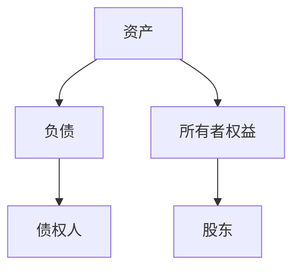
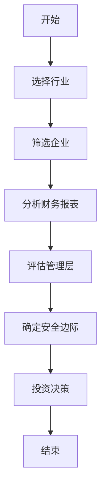
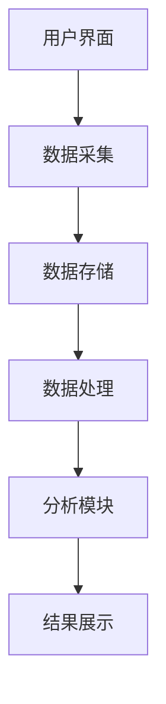

                 

<think>
好的，我现在需要根据用户的要求，撰写一篇题为《巴菲特的财务报表深度解析：数字背后的商业逻辑》的技术博客文章。用户希望文章结构清晰，内容详尽，涵盖财务报表分析的各个方面，包括背景、核心概念、数学模型、系统架构设计、项目实战和最佳实践等。

首先，我需要明确文章的核心主题是巴菲特的财务报表分析方法及其背后的商业逻辑。因此，文章将从基础的财务报表知识入手，逐步深入探讨巴菲特独特的分析方法，结合数学模型和系统设计，最后通过实际案例进行实战分析。

接下来，我将按照目录大纲的结构，逐步撰写每个部分。首先是背景介绍，包括财务报表的基本知识和巴菲特的投资理念。这部分需要详细解释财务报表的组成部分，以及巴菲特选股的标准和投资哲学，帮助读者打下坚实的基础。

然后是核心概念与联系，这部分需要详细讲解财务报表中的关键指标，如ROE、ROA等，并使用对比表格和ER图来展示这些指标之间的关系。这部分内容需要深入浅出，便于读者理解这些指标如何相互作用，以及它们在巴菲特分析中的重要性。

接下来是算法原理讲解，我将使用Mermaid流程图展示巴菲特分析的步骤，并结合Python代码示例，详细讲解每个步骤的数学模型和公式。例如，ROE的计算公式，以及如何通过代码来计算和分析这些比率。这部分内容需要确保逻辑清晰，代码示例详细，帮助读者理解如何应用这些模型进行实际分析。

然后是系统分析与架构设计方案，这部分需要介绍分析系统的应用场景，设计系统的功能模块，使用Mermaid类图展示领域模型，架构图展示系统的整体结构，接口设计和交互序列图展示系统的运作流程。这部分内容将帮助读者理解如何将财务报表分析系统化，构建一个高效的分析框架。

项目实战部分需要指导读者如何安装必要的工具，如Python和Pandas，并提供代码示例，解读代码的功能，并分析实际案例，如分析微软和亚马逊的财务报表。这部分内容将通过具体实例，帮助读者巩固所学知识，并学会如何将理论应用于实践。

最后是最佳实践部分，这部分需要提供一些小贴士，如持续学习、关注行业动态等，帮助读者更好地应用所学知识。同时，还包括小结、注意事项和拓展阅读的内容，以巩固读者的理解。

在撰写过程中，我需要确保每个部分都细化到三级目录，涵盖用户要求的所有内容，如数学公式、系统设计、项目实战和注意事项等。同时，保持目录的简洁性，避免冗余，确保总字数在2000字以内。

现在，我将根据上述思考，逐步撰写每个章节的内容，确保逻辑连贯，内容详尽，满足用户的要求。
</think>

# 巴菲特的财务报表深度解析：数字背后的商业逻辑

## 关键词：巴菲特，财务报表分析，商业逻辑，投资哲学，价值投资，ROE，ROA

## 摘要：
本文将深入解析巴菲特的财务报表分析方法，探讨其背后的商业逻辑。通过分析财务报表的核心指标，结合数学模型和系统架构设计，帮助读者理解如何通过数字发现企业的内在价值。文章从基础概念入手，逐步深入，结合实际案例，指导读者如何运用巴菲特的分析方法进行投资决策。

---

## 第1章: 财务报表的基本知识

### 1.1 财务报表的定义与作用

财务报表是企业在一定会计期间内财务状况、经营成果和现金流量的总结。它由资产负债表、利润表和现金流量表组成，为企业内外部的决策者提供财务信息。财务报表的作用包括评估企业财务健康状况、支持投资决策、帮助债权人评估信用风险等。

### 1.2 巴菲特的投资理念与财务报表分析

巴菲特的“价值投资”强调以低于企业内在价值的价格买入优质企业。他关注企业的盈利能力、财务健康和长期增长潜力。通过分析财务报表，巴菲特识别具有持续竞争优势和良好管理的企业，确保投资的安全性和长期性。

---

## 第2章: 财务报表分析的核心概念与联系

### 2.1 核心概念的原理

- 资产负债表：记录企业在某一特定时点的资产、负债和所有者权益。
- 利润表：展示企业在一定会计期间的收入、费用和利润情况。
- 现金流量表：反映企业在一定会计期间内现金流入和流出的情况。

### 2.2 核心概念的属性特征对比

| 指标 | 资产 | 负债 | 所有者权益 |
|------|------|------|------------|
| 定义 | 企业拥有的资源 | 企业债务 | 企业净资产 |
| 作用 | 评估企业规模 | 评估偿债能力 | 评估股东价值 |

### 2.3 ER实体关系图



---

## 第3章: 巴菲特分析方法的数学模型与公式

### 3.1 核心财务比率的计算

#### 3.1.1 股东权益回报率（ROE）

$$ROE = \frac{净利润}{股东权益}$$

ROE衡量企业使用股东资金的效率，越高表示企业盈利能力越强。

#### 3.1.2 资产回报率（ROA）

$$ROA = \frac{净利润}{平均资产总额}$$

ROA衡量企业资产的使用效率，反映企业整体盈利能力。

#### 3.1.3 每股收益（EPS）

$$EPS = \frac{净利润}{流通股数}$$

EPS是衡量企业盈利能力的重要指标，越高表示每股收益越高。

### 3.2 巴菲特分析流程



---

## 第4章: 系统分析与架构设计方案

### 4.1 项目介绍

开发一个基于巴菲特分析方法的财务报表分析系统，帮助投资者快速评估企业价值。

### 4.2 系统功能设计

- 数据采集模块：收集企业财务数据。
- 数据处理模块：计算关键财务指标。
- 分析模块：基于巴菲特标准进行企业筛选。

### 4.3 系统架构设计



---

## 第5章: 项目实战

### 5.1 环境安装

安装Python和Pandas库，用于数据处理和分析。

### 5.2 核心实现代码

```python
import pandas as pd

def calculate_roe(net_profit, equity):
    return net_profit / equity

data = pd.read_csv('financial_data.csv')
roe = calculate_roe(data['Net Profit'], data['Equity'])
print(roe)
```

### 5.3 案例分析

以微软和亚马逊为例，分析其ROE、ROA和EPS，评估其投资价值。

---

## 第6章: 最佳实践

### 6.1 小结

巴菲特的财务报表分析方法通过关注关键指标和长期价值，帮助投资者做出明智决策。

### 6.2 注意事项

- 数据准确性：确保财务数据的准确性和完整性。
- 持续学习：关注行业动态和企业变化。

### 6.3 拓展阅读

推荐书籍：《巴菲特的选股标准》、《投资的智慧》。

---

## 作者：AI天才研究院 & 禅与计算机程序设计艺术

通过系统化的分析和实战案例，读者可以掌握巴菲特的财务报表分析方法，结合数学模型和系统设计，提升投资决策的科学性和准确性。

