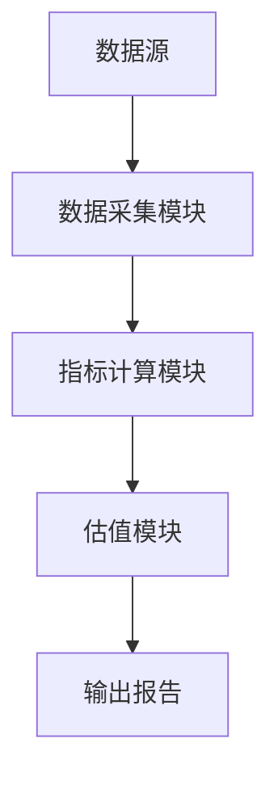

                 


```markdown
# 巴菲特的财务报表深度解析：洞察公司真实价值

## 关键词：巴菲特, 财务报表, 价值投资, 股票分析, 投资策略

## 摘要：  
本文将深入解析巴菲特如何通过财务报表分析来评估公司的真实价值。从财务报表的基本概念到具体的投资策略，结合实际案例分析，帮助读者掌握巴菲特的选股逻辑和投资哲学。通过详细解读资产负债表、利润表和现金流量表，分析关键财务指标，如ROE、ROA等，以及如何利用这些信息制定投资决策。

---

## 第一部分：财务报表分析基础

### 第1章：巴菲特的投资理念与财务报表分析

#### 1.1 财务报表分析的核心概念
- 财务报表是企业财务状况、经营成果和现金流量的总结。
- 资产负债表：记录企业的资产、负债和所有者权益。
- 利润表：展示企业在一定期间内的收入和支出，计算净利润。
- 现金流量表：反映企业现金流入和流出的动态。

#### 1.2 巴菲特的投资哲学
- 价值投资的核心是寻找具有持续竞争优势的企业。
- 通过财务报表分析企业的真实价值，而非市场波动。
- 关注企业的盈利能力、财务健康和长期增长潜力。

---

## 第二部分：资产负债表深度解析

### 第2章：资产负债表的核心要素

#### 2.1 资产的分类与评估
- 流动资产：现金、应收账款、存货等。
- 非流动资产：长期投资、固定资产、无形资产等。

#### 2.2 负债的分类与偿付能力
- 流动负债：短期借款、应付账款、应付工资等。
- 非流动负债：长期借款、债券发行等。

#### 2.3 所有者权益的构成
- 股本、资本公积、盈余公积和未分配利润。

#### 2.4 资产负债表的财务健康度分析
- 资产负债率：$负债总额 / 资产总额$，衡量企业的债务风险。
- 速动比率：$（流动资产 - 存货）/ 流动负债$，评估企业的短期偿债能力。

### 第3章：利润表与盈利能力分析

#### 3.1 利润表的核心指标
- 营业收入：企业主要业务收入的总和。
- 毛利润：$营业收入 - 营业成本$。
- 净利润：$营业收入 - 营业成本 - 费用 - 税费$。

#### 3.2 盈利能力分析的维度
- 净资产收益率（ROE）：$$ROE = \frac{净利润}{平均股东权益}$$
- 资产回报率（ROA）：$$ROA = \frac{净利润}{平均总资产}$$
- 资本回报率（ROIC）：$$ROIC = \frac{净利润}{平均资本}$$

---

## 第三部分：现金流量表与现金流管理

### 第4章：现金流量表的核心内容

#### 4.1 经营活动现金流
- 来自主营业务的现金流入和流出。

#### 4.2 投资活动现金流
- 购买或出售资产的现金流入和流出。

#### 4.3 筹资活动现金流
- 通过借款或发行股票获得的现金流入和流出。

#### 4.4 现金流量表的分析意义
- 现金流量表反映了企业的实际资金流动情况。
- 正常经营活动产生的现金流是企业健康发展的关键。

---

## 第四部分：数学模型与估值方法

### 第5章：财务指标与估值模型

#### 5.1 市盈率（P/E）计算
$$P/E = \frac{股价}{每股净利润}$$

#### 5.2 市净率（P/B）计算
$$P/B = \frac{股价}{每股净资产}$$

#### 5.3 内在价值计算（简化模型）
$$内在价值 = \frac{净利润 \times (1 + g)}{r - g}$$
其中，$g$ 为净利润增长率，$r$ 为折现率。

---

## 第五部分：系统分析与架构设计

### 第6章：企业价值评估系统架构

#### 6.1 系统功能设计
- 数据采集模块：从财务报表中提取关键数据。
- 指标计算模块：计算ROE、ROA等财务指标。
- 估值模块：基于财务指标进行企业价值评估。

#### 6.2 系统架构图


---

## 第六部分：项目实战

### 第7章：实战案例分析

#### 7.1 实战目标
- 分析某公司（如苹果）的财务报表，评估其投资价值。

#### 7.2 分析步骤
1. 收集财务数据。
2. 计算关键财务指标。
3. 评估企业的财务健康状况。
4. 得出投资建议。

---

## 第七部分：最佳实践与小结

### 第8章：总结与注意事项

#### 8.1 关键点回顾
- 关注企业的盈利能力、财务健康和长期增长潜力。
- 结合市场环境和行业趋势进行综合判断。

#### 8.2 投资建议
- 选择具有持续竞争优势的企业。
- 保持长期投资视角，避免短期市场波动干扰。

#### 8.3 注意事项
- 财务报表分析只是投资决策的一部分，需结合其他因素。
- 企业财务造假风险需警惕。

---

## 作者：AI天才研究院 & 禅与计算机程序设计艺术
```

