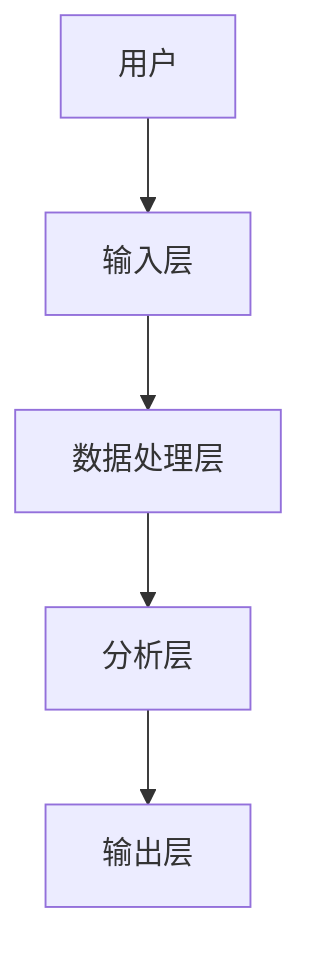

                 


# 巴菲特的资产负债表分析：数字资产时代的财务健康

**关键词：** 巴菲特，资产负债表分析，数字资产，财务健康，财务分析

**摘要：**  
本文将结合巴菲特的经典财务分析方法，深入探讨数字资产时代下资产负债表的分析与应用。通过分析数字资产对传统财务报表的影响，探讨如何在数字资产时代评估企业的财务健康状况，为企业投资者和财务分析人员提供新的视角和方法。

---

# 第1章: 数字资产时代的财务分析背景

## 1.1 数字资产的兴起与影响

### 1.1.1 数字资产的定义与分类
- 数字资产的定义：数字资产是指以数字形式存在的资产，包括比特币、以太坊等 cryptocurrencies，以及智能合约、NFTs 等。
- 数字资产的分类：
  - 原生数字资产：比特币、以太坊等。
  - 衍生数字资产：基于原生数字资产的金融衍生品。
  - 实用型数字资产：用于支付或服务的代币。

### 1.1.2 数字资产与传统资产的对比
- 数字资产的特性：
  - 去中心化：不依赖传统金融机构。
  - 可分割性：部分数字资产可以无限分割。
  - 不可篡改性：区块链技术确保交易记录不可修改。
- 传统资产的特性：
  - 中心化：依赖银行、政府等机构。
  - 不可分割性：如房地产、股票等。

### 1.1.3 数字资产对财务分析的挑战
- 资产负债表中数字资产的确认与计量难题。
- 数字资产价格波动性大，影响财务报表的稳定性。

## 1.2 巴菲特的财务分析方法

### 1.2.1 巴菲特的投资理念概述
- 巴菲特的“价值投资”理念：寻找具有持续竞争优势的企业，长期持有。
- 财务报表分析的核心地位：巴菲特通过分析资产负债表、利润表和现金流量表来评估企业的财务健康状况。

### 1.2.2 资产负债表分析的核心地位
- 资产负债表反映企业的资产、负债和所有者权益，是评估企业财务状况的基础。
- 巴菲特关注的重点：企业的资产质量、负债结构和所有者权益的变化。

### 1.2.3 巴菲特分析方法的现代应用
- 数字资产时代下，巴菲特的分析方法需要结合新的资产类别进行调整。

## 1.3 数字资产时代财务分析的新维度

### 1.3.1 数字资产对财务报表的影响
- 数字资产的引入改变了资产负债表的结构。
- 数字资产的估值方法与传统资产不同。

### 1.3.2 数字资产的估值挑战
- 数字资产价格的波动性：影响其在财务报表中的价值评估。
- 数字资产的计量问题：如何在财务报表中反映数字资产的价值。

### 1.3.3 数字资产与财务健康的关系
- 数字资产的持有是否影响企业的偿债能力。
- 数字资产的流动性对财务健康的影响。

---

# 第2章: 资产负债表的核心概念与数字资产的联系

## 2.1 资产负债表的基本结构

### 2.1.1 资产、负债、所有者权益的定义
- 资产：企业拥有的资源，预期能带来经济利益。
- 负债：企业承担的义务，预期会导致经济利益流出。
- 所有者权益：资产减去负债后的剩余部分。

### 2.1.2 资产负债表的核心公式：资产 = 负债 + 所有者权益
$$ 资产 = 负债 + 所有者权益 $$

### 2.1.3 资产负债表的编制与分析
- 编制方法：根据企业会计准则进行。
- 分析方法：通过比率分析、趋势分析等方法评估企业的财务状况。

## 2.2 数字资产在资产负债表中的体现

### 2.2.1 数字资产的会计分类
- 数字资产的分类：
  - 数字货币：比特币、以太坊。
  - 数字权益：NFTs、智能合约。
  - 数字债权：区块链上的债券、票据。

### 2.2.2 数字资产确认与计量的挑战
- 确认标准：如何判断数字资产是否属于企业的资产。
- 计量方法：数字资产价格波动大，如何计量其价值。

### 2.2.3 数字资产对资产负债表结构的影响
- 数字资产的引入增加了资产的多样性。
- 数字资产的高波动性可能影响企业的财务稳定性。

## 2.3 数字资产与传统资产的对比分析

### 2.3.1 数字资产的特性
- 去中心化：不依赖传统金融机构。
- 可分割性：部分数字资产可以无限分割。
- 不可篡改性：区块链技术确保交易记录不可修改。

### 2.3.2 传统资产的特性
- 中心化：依赖银行、政府等机构。
- 不可分割性：如房地产、股票等。

### 2.3.3 数字资产与传统资产的优劣势对比
| 特性      | 数字资产                  | 传统资产                  |
|-----------|---------------------------|---------------------------|
| 流动性     | 高                        | 中                        |
| 安全性     | 高（区块链技术保障）     | 中                        |
| 管理成本   | 低（去中心化）            | 高（需要中介机构）        |
| 估值难度   | 高（价格波动大）          | 中                        |

---

# 第3章: 财务比率分析与数字资产的价值评估

## 3.1 财务比率分析的核心公式

### 3.1.1 流动性比率
- 流动比率：
$$ 流动比率 = \frac{流动资产}{流动负债} $$
- 速动比率：
$$ 速动比率 = \frac{速动资产}{流动负债} $$

### 3.1.2 偿债能力比率
- 资产负债率：
$$ 资产负债率 = \frac{总负债}{总资产} $$
- 利息保障倍数：
$$ 利息保障倍数 = \frac{息税前利润}{利息支出} $$

### 3.1.3 运营效率比率
- 存货周转率：
$$ 存货周转率 = \frac{成本 of goods sold}{平均存货} $$

### 3.1.4 盈利能力比率
- 净资产收益率（ROE）：
$$ ROE = \frac{净利润}{净资产} $$
- 毛利率：
$$ 毛利率 = \frac{营业收入 - 营业成本}{营业收入} $$

## 3.2 数字资产对财务比率的影响

### 3.2.1 数字资产对流动性的影响
- 数字资产的流动性高，可以提高企业的流动比率。

### 3.2.2 数字资产对偿债能力的影响
- 数字资产作为资产的一部分，可以增强企业的偿债能力。

### 3.2.3 数字资产对运营效率的影响
- 数字资产的引入可能改变企业的运营模式，影响运营效率。

## 3.3 数字资产的价值评估

### 3.3.1 数字资产的市场价格波动
- 数字资产价格受市场供需影响，波动较大。

### 3.3.2 数字资产的内在价值
- 数字资产的内在价值：技术、网络效应、社区支持等。

### 3.3.3 数字资产的估值方法
- 市场法：基于市场价格进行估值。
- 收益法：基于未来现金流进行估值。

---

# 第4章: 数字资产的会计处理与财务报告

## 4.1 数字资产的会计分类

### 4.1.1 数字货币的会计处理
- 数字货币作为资产记录在资产负债表中。

### 4.1.2 数字权益的会计处理
- NFTs、智能合约等作为无形资产记录。

## 4.2 数字资产的确认与计量

### 4.2.1 数字资产的确认标准
- 数字资产是否符合资产定义。
- 数字资产是否可计量。

### 4.2.2 数字资产的计量方法
- 市场价格法：基于市场价格进行计量。
- 成本法：基于取得成本进行计量。

## 4.3 数字资产对财务报告的影响

### 4.3.1 数字资产对资产负债表的影响
- 增加资产总额。
- 影响所有者权益。

### 4.3.2 数字资产对利润表的影响
- 数字资产的减值损失会影响利润。

---

# 第5章: 数字资产时代资产负债表分析的系统架构

## 5.1 系统设计与功能需求

### 5.1.1 系统目标
- 提供数字资产时代下资产负债表分析的工具和方法。

### 5.1.2 系统功能需求
- 资产负债表数据输入。
- 财务比率计算。
- 数字资产价值评估。

## 5.2 系统架构设计

### 5.2.1 系统架构图


### 5.2.2 系统接口设计
- 输入接口：用户输入资产负债表数据。
- 输出接口：显示财务比率分析结果。

## 5.3 系统实现

### 5.3.1 环境安装
- 需要安装的工具：Python、Pandas、Matplotlib。

### 5.3.2 核心实现代码
```python
import pandas as pd

# 输入资产负债表数据
data = {
    '资产': [100, 200, 300],
    '负债': [50, 100, 150],
    '所有者权益': [50, 100, 150]
}

df = pd.DataFrame(data)

# 计算财务比率
df['流动比率'] = df['资产'] / df['负债']
df['资产负债率'] = df['负债'] / df['资产']
print(df)
```

---

# 第6章: 数字资产时代的投资策略与风险管理

## 6.1 数字资产投资策略

### 6.1.1 巴菲特投资理念的现代应用
- 长期投资：持有优质数字资产。
- 价值投资：选择有持续价值的数字资产。

## 6.2 数字资产风险管理

### 6.2.1 数字资产价格波动的风险
- 如何通过分散投资降低风险。

### 6.2.2 数字资产安全风险
- 如何保护数字资产的安全。

## 6.3 数字资产投资的注意事项

### 6.3.1 投资前的尽职调查
- 研究数字资产的技术和团队。

### 6.3.2 投资后的监控
- 定期评估数字资产的价值和风险。

---

# 第7章: 数字资产时代的财务分析展望

## 7.1 数字资产对财务分析的长期影响

### 7.1.1 数字资产的普及化
- 数字资产将成为企业资产的重要组成部分。

### 7.1.2 财务分析方法的创新
- 新的财务比率和分析方法将被开发。

## 7.2 数字资产与传统资产的融合

### 7.2.1 数字资产与传统资产的结合
- 如何将数字资产与传统资产结合起来进行分析。

### 7.2.2 混合资产的投资策略
- 在数字资产和传统资产之间寻找平衡点。

---

# 作者：AI天才研究院/AI Genius Institute & 禅与计算机程序设计艺术 /Zen And The Art of Computer Programming

