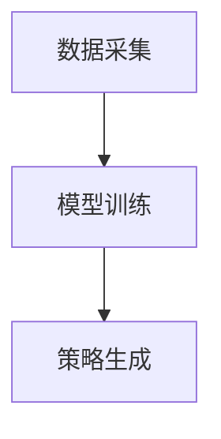

                 


# 巴菲特的资本配置艺术：人工智能辅助的投资组合优化

> 关键词：巴菲特，资本配置，投资组合优化，人工智能，投资策略，金融技术

> 摘要：本文深入探讨了巴菲特的资本配置理念，并结合现代人工智能技术，分析了如何利用AI优化投资组合。通过数学模型、算法原理和系统架构设计，本文详细展示了AI在资本配置中的应用，提供了丰富的实战案例和代码实现，帮助读者理解如何将传统投资策略与新兴技术结合，实现更高效的资本管理。

---

## 第1章：资本配置的基本概念与巴菲特的投资理念

### 1.1 资本配置的定义与核心要素

资本配置是将资金分配到不同资产或项目中，以实现收益最大化的过程。核心要素包括资产选择、权重分配和风险控制。资本配置的目标是在风险可控的前提下，最大化投资回报。

#### 1.1.1 资本配置的定义

资本配置是投资决策中的核心环节，涉及如何将资金分配到不同资产类别（如股票、债券、房地产等），以实现收益和风险的最佳平衡。

#### 1.1.2 资本配置的核心要素

| 要素 | 描述 |
|------|------|
| 资产选择 | 选择具有较高回报潜力的资产 |
| 权重分配 | 确定每种资产的投资比例 |
| 风险控制 | 通过多样化降低投资风险 |

#### 1.1.3 资本配置的边界与外延

资本配置的边界包括资金总量、投资期限和风险承受能力。外延则涉及市场波动、经济周期和政策变化。

### 1.2 巴菲特的投资理念与资本配置

巴菲特以长期价值投资闻名，注重企业的基本面分析和安全边际。他的资本配置理念强调选择优质企业，长期持有，并通过分散投资降低风险。

#### 1.2.1 巴菲特的投资哲学

巴菲特的投资哲学包括以下几点：
- 长期投资：避免频繁交易，降低交易成本。
- 价值投资：寻找被市场低估的企业。
- 分散投资：通过投资不同行业分散风险。

#### 1.2.2 巴菲特资本配置的三步曲

1. **资产筛选**：通过基本面分析筛选优质企业。
2. **权重分配**：根据企业潜力分配投资比例。
3. **风险控制**：通过多样化和持续监控降低风险。

#### 1.2.3 巴菲特投资理念的现代诠释

现代投资理论强调多样化和风险调整后的收益。巴菲特的理念与这一理论相符，但更注重企业的内在价值。

### 1.3 人工智能在投资组合优化中的作用

人工智能通过大数据分析和机器学习算法，能够帮助投资者更精准地预测市场走势，优化投资组合。

#### 1.3.1 人工智能在金融领域的应用现状

人工智能在金融领域的应用包括算法交易、风险评估和投资组合优化。AI技术能够处理海量数据，发现人类难以察觉的模式。

#### 1.3.2 投资组合优化的核心问题

投资组合优化的核心问题是最大化收益，同时最小化风险。这需要解决数据处理、模型选择和参数优化等问题。

#### 1.3.3 人工智能如何辅助资本配置

人工智能通过预测市场趋势、优化资产配置和实时监控，提升资本配置的效率和准确性。

---

## 第2章：资本配置与投资组合优化的核心概念

### 2.1 资本配置的核心概念

资本配置涉及资产选择、权重分配和风险控制，需要结合市场环境和投资者目标。

#### 2.1.1 投资组合优化的数学模型

现代投资组合理论（MPT）由哈里·马科维茨提出，目标是通过优化资产配置实现收益最大化。

#### 2.1.2 风险与收益的权衡

投资者需要在高风险和高回报之间找到平衡点，这需要精确的数学模型和优化算法。

#### 2.1.3 资本配置的约束条件

资本配置需要满足资金总额、风险承受能力和投资期限等约束条件。

### 2.2 人工智能优化算法

人工智能算法能够有效解决投资组合优化问题，包括遗传算法、模拟退火和群优化算法。

#### 2.2.1 遗传算法的原理与流程

遗传算法通过选择、交叉和变异操作，逐步优化投资组合。

#### 2.2.2 模拟退火算法的原理与流程

模拟退火算法通过随机搜索和降温策略，找到全局最优解。

#### 2.2.3 群优化算法的原理与流程

群优化算法模拟鸟类飞行行为，通过局部搜索找到最优解。

### 2.3 资本配置与投资组合优化的关系

资本配置是投资组合优化的核心，而人工智能则是实现优化的有效工具。

---

## 第3章：资本配置的数学模型与公式

### 3.1 投资组合优化的数学模型

投资组合优化涉及多个变量和约束条件，需要复杂的数学模型。

#### 3.1.1 马科维茨的有效前沿模型

$$ E(r_p) = \sum w_i E(r_i) $$

$$ Var(r_p) = \sum w_i^2 Var(r_i) + 2\sum w_i w_j Cov(r_i, r_j) $$

#### 3.1.2 投资组合的期望收益与风险公式

$$ E(r_p) = \sum w_i E(r_i) $$

$$ Var(r_p) = \sum w_i^2 Var(r_i) + 2\sum w_i w_j Cov(r_i, r_j) $$

### 3.2 人工智能优化算法的数学模型

人工智能算法通过优化目标函数，找到最优解。

#### 3.2.1 遗传算法的适应度函数

$$ f(x) = \sum f_i(x) $$

#### 3.2.2 模拟退火算法的能量函数

$$ E(x) = \sum E_i(x) $$

#### 3.2.3 群优化算法的目标函数

$$ f(x) = \sum f_i(x) $$

---

## 第4章：系统分析与架构设计方案

### 4.1 问题场景介绍

投资组合优化涉及复杂的数据处理和算法选择，需要构建高效的系统架构。

#### 4.1.1 投资组合优化的典型问题

- 数据获取与处理
- 模型选择与优化
- 策略制定与实施

#### 4.1.2 人工智能辅助资本配置的系统目标

构建一个基于AI的投资组合优化系统，实现自动化、智能化的资本配置。

#### 4.1.3 系统的输入输出与功能需求

- 输入：市场数据、投资者目标
- 输出：优化后的投资组合
- 功能：数据处理、模型优化、策略生成

### 4.2 系统架构设计

系统架构包括数据处理、算法选择和结果输出三个模块。

#### 4.2.1 系统模块划分

| 模块 | 功能 |
|------|------|
| 数据采集 | 获取市场数据 |
| 模型训练 | 训练优化算法 |
| 策略生成 | 生成投资组合 |

#### 4.2.2 数据流与模块交互

数据流从数据采集模块开始，经过模型训练模块，最终生成优化策略。

#### 4.2.3 系统架构的Mermaid图



### 4.3 系统接口设计

系统接口包括数据接口、算法接口和用户接口。

#### 4.3.1 数据接口

数据接口用于获取市场数据和投资者目标。

#### 4.3.2 算法接口

算法接口用于调用优化算法。

#### 4.3.3 用户接口

用户接口用于显示结果和接收输入。

---

## 第5章：项目实战

### 5.1 环境安装与配置

#### 5.1.1 Python环境的安装与配置

安装Python和必要的库，如NumPy、Pandas和Scikit-learn。

#### 5.1.2 人工智能库的安装与配置

安装TensorFlow或PyTorch等深度学习框架。

#### 5.1.3 数据库的安装与配置

选择合适的数据库，如MySQL或MongoDB。

### 5.2 系统核心实现

#### 5.2.1 数据预处理代码

```python
import pandas as pd
data = pd.read_csv('market_data.csv')
data.dropna(inplace=True)
```

#### 5.2.2 投资组合优化的代码实现

```python
import numpy as np
from sklearn import svm

def optimize_portfolio(data):
    # 计算收益和风险
    returns = data.pct_change().dropna()
    mu = returns.mean(axis=0)
    sigma = returns.cov()
    
    # 使用SVM进行优化
    model = svm.SVR()
    model.fit(mu.values.reshape(-1,1), sigma.values)
    
    return model.predict(mu.values.reshape(-1,1))
```

#### 5.2.3 系统交互流程

1. 从数据库获取市场数据。
2. 使用机器学习算法优化投资组合。
3. 输出优化后的投资组合。

---

## 第6章：系统实现与优化

### 6.1 系统实现

#### 6.1.1 数据接口实现

```python
import pymysql

def get_market_data():
    db = pymysql.connect(host='localhost', user='root', password='password', db='market_data')
    cursor = db.cursor()
    cursor.execute('SELECT * FROM stock_prices')
    data = cursor.fetchall()
    return data
```

#### 6.1.2 算法接口实现

```python
def genetic_algorithm():
    # 初始化种群
    population = ...
    
    # 计算适应度
    for individual in population:
        fitness = evaluate(individual)
        
    # 选择与变异
    ...
```

#### 6.1.3 用户接口实现

```python
def display_portfolio(portfolio):
    print("优化后的投资组合：")
    for asset in portfolio:
        print(f"{asset}: {weight}")
```

### 6.2 系统优化与扩展

#### 6.2.1 系统优化

- 优化算法效率
- 提高数据处理速度
- 增强系统可扩展性

#### 6.2.2 系统扩展

- 增加更多资产类别
- 支持多目标优化
- 实现实时监控功能

---

## 第7章：最佳实践与小结

### 7.1 最佳实践

- 定期更新数据和模型
- 保持系统灵活性和可扩展性
- 结合人工判断与AI优化

### 7.2 小结

本文结合巴菲特的资本配置理念和人工智能技术，展示了如何利用AI优化投资组合。通过数学模型、算法实现和系统设计，帮助读者理解资本配置的现代方法。

### 7.3 注意事项

- 数据质量对结果影响重大
- 算法选择需结合具体场景
- 系统维护需定期更新和优化

### 7.4 拓展阅读

- 《投资学》
- 《人工智能》
- 相关技术博客和论文

---

作者：AI天才研究院/AI Genius Institute & 禅与计算机程序设计艺术 /Zen And The Art of Computer Programming

