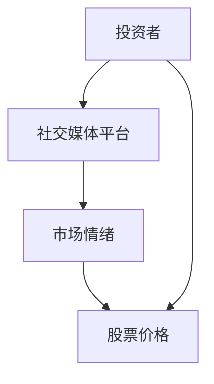
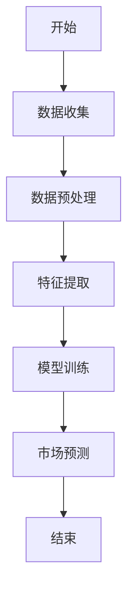
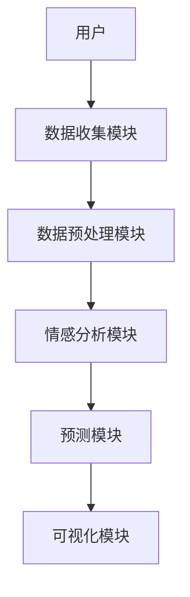

                 


# 巴菲特的逆向投资策略：在社交媒体影响下的执行

## 关键词：
- 逆向投资策略
- 社交媒体影响
- 投资决策
- 情感分析
- 数据驱动

## 摘要：
本文探讨了巴菲特的逆向投资策略在社交媒体影响下的执行方式。通过分析社交媒体数据，结合情感分析和回归模型，构建了一个实时监测系统，帮助投资者在社交媒体情绪中识别投资机会。文章详细阐述了算法原理、系统架构和项目实战，为投资者提供了新的视角和工具。

---

## 第一部分：背景介绍

### 第1章：逆向投资策略的背景与核心概念

#### 1.1 逆向投资策略的定义与特点

##### 1.1.1 逆向投资的定义
逆向投资是一种投资策略，强调在市场恐慌时买入，在市场狂热时卖出。这种方法基于价值投资理念，寻找被市场低估的机会。

##### 1.1.2 逆向投资的核心特点
- **逆周期性**：在市场低谷时投资，避免在高点买入。
- **非流动性偏好**：倾向于投资不被广泛关注的资产。
- **长期视角**：注重长期价值而非短期波动。

##### 1.1.3 逆向投资的边界与外延
逆向投资不等于盲目抄底，需结合市场环境和公司基本面。其外延包括风险管理、组合优化等。

#### 1.2 社交媒体对投资决策的影响

##### 1.2.1 社交媒体在现代投资中的角色
社交媒体成为投资者获取信息的重要渠道，影响市场情绪和交易决策。

##### 1.2.2 社交媒体信息的特点与局限性
- **实时性**：信息更新快，但准确性参差不齐。
- **情绪化**：用户情绪主导内容，可能引发非理性决策。

##### 1.2.3 社交媒体对市场情绪的影响
社交媒体放大市场波动，创造短期趋势，但长期价值仍取决于基本面。

#### 1.3 逆向投资与社交媒体的结合

##### 1.3.1 逆向投资策略的社交媒体应用场景
- 利用社交媒体识别市场恐慌点，寻找低估资产。
- 通过情绪分析预测市场拐点。

##### 1.3.2 社交媒体数据在逆向投资中的价值
- 提供实时市场情绪，辅助决策。
- 帮助识别市场共识，发现潜在机会。

##### 1.3.3 逆向投资与社交媒体结合的意义
- 增强投资决策的时效性和准确性。
- 通过大数据分析优化投资策略。

---

## 第二部分：核心概念与联系

### 第2章：逆向投资策略与社交媒体分析的核心概念

#### 2.1 核心概念原理

逆向投资依赖市场情绪分析，社交媒体数据提供情绪指标，帮助识别市场非理性行为。

#### 2.2 核心概念对比表

| 特性         | 逆向投资策略                | 社交媒体分析              |
|--------------|-----------------------------|---------------------------|
| 核心目标     | 寻找被低估的投资机会         | 分析市场情绪和趋势          |
| 数据来源     | 历史数据、基本面分析         | 用户评论、新闻报道          |
| 决策依据     | 价值评估、风险偏好          | 情感分析、市场情绪          |

#### 2.3 实体关系图（ER图）



---

## 第三部分：算法原理

### 第3章：基于社交媒体数据的逆向投资算法

#### 3.1 算法流程图



#### 3.2 情感分析实现

```python
from textblob import TextBlob

def get_sentiment(text):
    blob = TextBlob(text)
    return blob.sentiment.polarity

# 示例
text = "This stock is a great buy!"
print(get_sentiment(text))  # 输出：0.8
```

#### 3.3 回归模型构建

$$\text{预测价格} = \beta_0 + \beta_1 \times \text{情绪指数} + \epsilon$$

其中，$\beta_0$和$\beta_1$通过最小二乘法估计。

---

## 第四部分：系统分析与架构设计

### 第4章：实时监测系统的设计与实现

#### 4.1 系统架构设计



#### 4.2 系统功能模块

- **数据收集模块**：获取社交媒体数据。
- **预处理模块**：清洗和转换数据。
- **情感分析模块**：提取情绪特征。
- **预测模块**：生成投资建议。
- **可视化模块**：展示结果。

---

## 第五部分：项目实战

### 第5章：基于Python的社交媒体情感分析

#### 5.1 环境安装

```bash
pip install tweepy textblob
python -m textblob.download_corpora
```

#### 5.2 核心代码实现

```python
import tweepy
from textblob import TextBlob

def main():
    # 初始化API
    auth = tweepy.OAuthHandler('API_KEY', 'API_SECRET')
    auth.set_access_token('ACCESS_TOKEN', 'ACCESS_SECRET')
    api = tweepy.API(auth)

    # 获取推文
    tweets = api.search('stock', count=100)
    sentiments = []
    for tweet in tweets:
        blob = TextBlob(tweet.text)
        sentiments.append(blob.sentiment.polarity)

    # 计算情绪指数
    import numpy as np
    emotion_index = np.mean(sentiments)
    print(f"情绪指数：{emotion_index}")

if __name__ == "__main__":
    main()
```

---

## 第六部分：最佳实践

### 第6章：逆向投资策略与社交媒体结合的实践总结

#### 6.1 小结

社交媒体数据为逆向投资提供了新工具，帮助投资者捕捉市场情绪，优化决策。

#### 6.2 注意事项

- 数据实时性：需持续监控市场情绪。
- 模型局限性：社交媒体数据存在噪声，需结合基本面分析。

#### 6.3 拓展阅读

- 《巴菲特投资之道》
- 《社交媒体与金融市场》

---

## 作者：AI天才研究院 & 禅与计算机程序设计艺术

---

通过本文的详细分析，读者可以理解如何利用社交媒体数据优化逆向投资策略，捕捉市场机会。这种结合不仅提升了投资决策的科学性，也为投资者提供了新的视角和工具。

