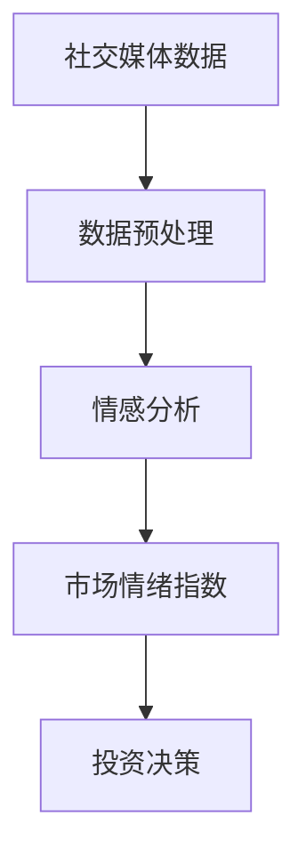

                 


# 巴菲特的逆向投资艺术：在社交媒体时代的执行挑战

> **关键词**：逆向投资，巴菲特，社交媒体，市场情绪，投资策略，算法分析，风险管理
>
> **摘要**：本文探讨了巴菲特的逆向投资艺术在社交媒体时代的执行挑战。通过分析社交媒体对市场情绪的影响，结合算法和数学模型，提出了一种逆向投资的系统架构，帮助投资者在信息过载的环境中做出更明智的投资决策。

---

## 第1章: 巴菲特的逆向投资概述

### 1.1 逆向投资的定义与核心理念

#### 1.1.1 逆向投资的定义
逆向投资是一种与市场情绪相反的投资策略，强调在市场恐慌时买入，在市场狂热时卖出。其核心理念是利用市场的非理性行为，捕捉低估或高估的机会。

#### 1.1.2 逆向投资的核心理念
- **价值发现**：寻找被市场低估的资产。
- **逆向思维**：在市场情绪低落时保持乐观，在市场情绪高涨时保持谨慎。

#### 1.1.3 逆向投资与传统投资的区别
| 方面       | 逆向投资                     | 传统投资                     |
|------------|------------------------------|-------------------------------|
| 时间选择   | 在市场低谷时行动             | 在市场高点时行动             |
| 风险态度   | 更倾向于承担短期波动风险     | 更倾向于规避短期波动风险     |
| 情绪影响   | 利用市场恐慌                | 受市场乐观影响               |

### 1.2 巴菲特的逆向投资策略

#### 1.2.1 巴菲特的投资哲学
巴菲特强调长期投资、价值投资和安全边际。他选择那些具有持续竞争优势和良好治理结构的企业。

#### 1.2.2 巴菲特的选股标准
- **护城河**：企业具备独特的竞争优势。
- **管理层**：管理层诚实、有能力。
- **财务状况**：企业具备稳健的财务状况。

#### 1.2.3 巴菲特的长期投资策略
巴菲特注重企业的长期价值，而非短期价格波动。他通过持有优质资产，分享企业的长期增长。

---

## 第2章: 社交媒体时代的投资环境

### 2.1 社交媒体对投资的影响

#### 2.1.1 社交媒体的传播特性
社交媒体的信息传播速度快，覆盖面广，但信息的真实性和深度可能不足。

#### 2.1.2 社交媒体对市场情绪的影响
社交媒体上的信息会放大市场情绪，导致市场波动加剧。

#### 2.1.3 社交媒体信息的双刃剑效应
- **积极影响**：快速获取信息，发现投资机会。
- **消极影响**：信息过载，导致决策失误。

### 2.2 逆向投资在社交媒体时代的挑战

#### 2.2.1 信息过载与噪声干扰
社交媒体上的信息量巨大，投资者难以筛选出有价值的信息。

#### 2.2.2 市场情绪的快速变化
社交媒体上的信息会导致市场情绪快速变化，逆向投资者需要快速反应。

#### 2.2.3 逆向投资的执行难度增加
社交媒体时代的市场波动加剧，逆向投资的执行难度增加。

---

## 第3章: 逆向投资的核心概念与原理

### 3.1 逆向投资的核心原理

#### 3.1.1 市场情绪与价格波动的关系
市场情绪会影响资产价格，但价格波动并不总是反映资产的真实价值。

#### 3.1.2 逆向投资的时机选择
逆向投资的时机选择基于市场情绪的极端化，而非基本面分析。

#### 3.1.3 逆向投资的风险与收益平衡
逆向投资的风险较高，但潜在收益也较大。

### 3.2 社交媒体信息的分析与利用

#### 3.2.1 社交媒体数据的特征
- **实时性**：信息更新快。
- **多样性**：信息来源广泛。
- **情感性**：信息带有强烈的情感色彩。

#### 3.2.2 市场情绪的量化方法
通过分析社交媒体上的关键词和情感词汇，量化市场情绪。

#### 3.2.3 信息传播对投资决策的影响
信息传播会影响市场参与者的决策，进而影响市场价格。

---

## 第4章: 逆向投资的算法与数学模型

### 4.1 逆向投资的数学模型

#### 4.1.1 市场情绪指数的计算
市场情绪指数可以通过分析社交媒体上的情感词汇，计算出一个指数值。

$$ \text{市场情绪指数} = \frac{\text{正面情感词数量} - \text{负面情感词数量}}{\text{总评论数}} $$

#### 4.1.2 时间序列分析
通过时间序列分析，预测市场情绪的变化趋势。

$$ \text{未来情绪预测} = \text{当前情绪} + \text{趋势变化} $$

### 4.2 算法实现

#### 4.2.1 数据采集
从社交媒体平台获取相关数据。

#### 4.2.2 情感分析
使用自然语言处理技术，分析社交媒体上的评论情感。

#### 4.2.3 投资决策
根据市场情绪指数，制定投资策略。

---

## 第5章: 逆向投资的系统架构设计

### 5.1 系统功能设计

#### 5.1.1 数据采集模块
实时采集社交媒体上的相关数据。

#### 5.1.2 情感分析模块
分析数据的情感倾向，计算市场情绪指数。

#### 5.1.3 投资决策模块
根据市场情绪指数，制定投资策略。

### 5.2 系统架构图


---

## 第6章: 项目实战

### 6.1 环境安装

#### 6.1.1 安装Python环境
使用Anaconda安装Python环境。

#### 6.1.2 安装相关库
安装自然语言处理库（如NLTK）和情感分析库（如TextBlob）。

### 6.2 核心代码实现

#### 6.2.1 数据采集
```python
import tweepy

# 授权信息
consumer_key = 'your_consumer_key'
consumer_secret = 'your_consumer_secret'
access_token = 'your_access_token'
access_token_secret = 'your_access_token_secret'

# 初始化API
api = tweepy.API(authenticate_with_Twitter(consumer_key, consumer_secret, access_token, access_token_secret))

# 获取推文
tweets = api.search('关键词', count=100)
```

#### 6.2.2 情感分析
```python
from textblob import TextBlob

def analyze_sentiment(tweets):
    sentiments = []
    for tweet in tweets:
        blob = TextBlob(tweet.text)
        sentiments.append(blob.sentiment.polarity)
    return sentiments

sentiments = analyze_sentiment(tweets)
```

#### 6.2.3 投资决策
```python
import numpy as np

def calculate_market_sentiment(sentiments):
    return np.mean(sentiments)

market_sentiment = calculate_market_sentiment(sentiments)
```

### 6.3 案例分析

#### 6.3.1 案例背景
假设市场情绪指数为-0.5，表明市场情绪处于低谷。

#### 6.3.2 投资决策
根据逆向投资策略，市场情绪低谷时买入。

---

## 第7章: 总结与展望

### 7.1 总结
社交媒体时代的逆向投资需要结合算法和数学模型，利用市场情绪指数进行投资决策。

### 7.2 最佳实践
- **数据质量**：确保数据来源可靠。
- **风险管理**：制定风险管理策略，避免重大损失。
- **持续学习**：关注市场变化，不断优化投资策略。

### 7.3 注意事项
- **信息过载**：避免被过多信息干扰。
- **算法优化**：定期优化算法，提高预测准确性。

### 7.4 拓展阅读
- 《巴菲特传》
- 《逆向思考的艺术》

---

## 作者信息

作者：AI天才研究院/AI Genius Institute & 禅与计算机程序设计艺术/Zen And The Art of Computer Programming

