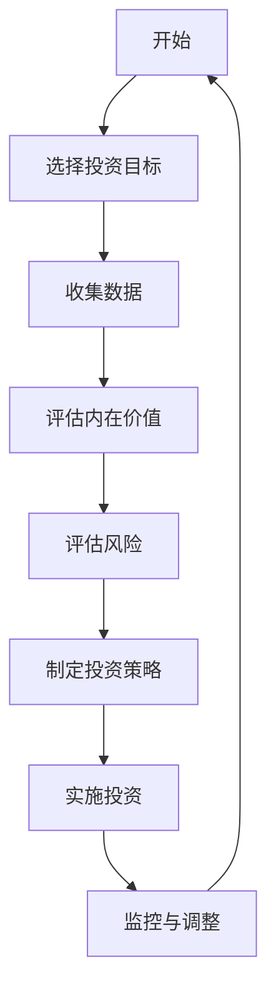
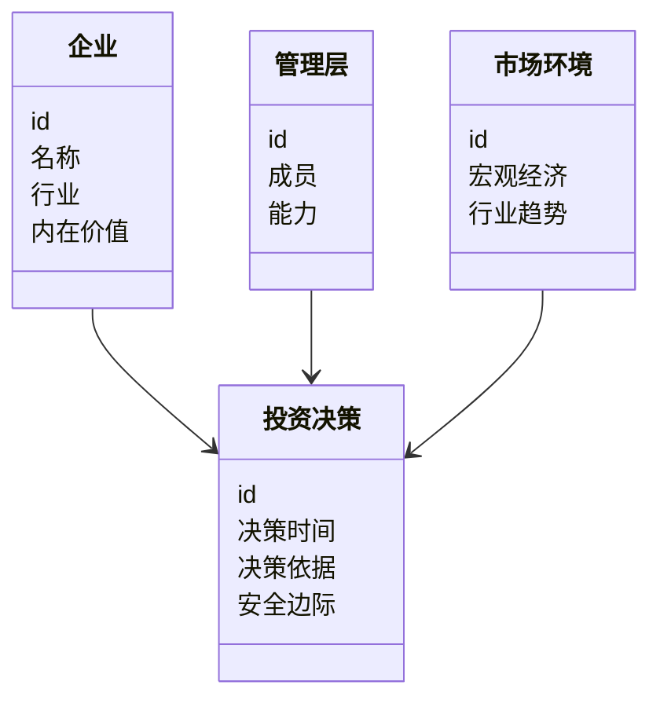
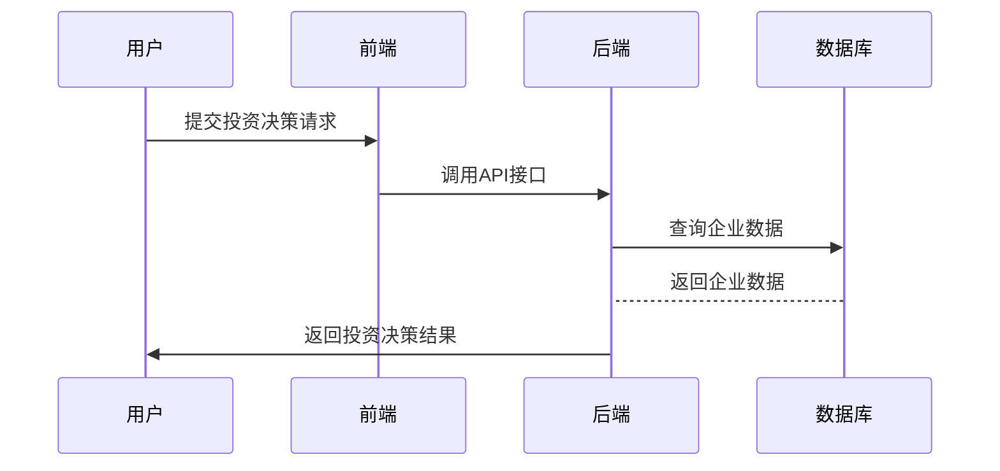

                 

<think>
好的，我现在需要分析用户的请求并生成符合要求的回答。用户希望我撰写一篇技术博客，标题是《巴菲特的错误分析：从失败中学习的重要性》，并且提供详细的目录大纲。用户还明确指出了文章的结构和内容要求，包括关键词、摘要、章节安排、技术元素的使用等。

首先，我注意到用户希望文章是技术博客，但主题是巴菲特的投资错误，这似乎结合了金融和科技两个领域。用户特别提到要使用技术语言，逻辑清晰，结构紧凑，这可能意味着文章不仅仅是对巴菲特的分析，还要融入技术分析的方法，比如算法、流程图、ER图等。

接下来，用户提供了详细的目录大纲结构，包括引言、背景介绍、核心概念、算法原理、数学模型、系统分析、项目实战和总结等部分。每个部分还有三级子标题，内容详细且结构严谨。用户还强调了每个章节需要包含技术元素，如Mermaid图表、Python代码示例、数学公式等，这要求我在写作时不仅要有深度分析，还要展示技术细节。

我需要考虑如何将巴菲特的投资错误与技术分析结合起来。例如，在分析错误决策时，可以使用流程图展示决策过程；在数学模型部分，用公式解释投资评估指标。此外，用户提到的ER实体关系图可能用于展示投资决策的系统架构，帮助读者更好地理解结构。

另一个挑战是确保文章内容详实，符合10000到12000字的要求，同时每个部分都包含足够的技术细节和实例。我需要确保每个章节不仅有理论分析，还有实际应用的案例，帮助读者理解如何从失败中学习。

最后，用户希望文章末尾有作者信息，格式为特定的格式，包括机构名称和座右铭。我需要确保这些信息准确无误，并且整体结构符合用户的要求。

总结一下，我需要按照用户提供的目录结构，逐章节展开内容，确保每个部分都包含必要的技术元素，如图表、代码、数学公式等，同时保持逻辑清晰，内容详尽，满足用户的深层需求，即通过技术方法分析巴菲特的错误，为读者提供有价值的见解。
</think>

# 巴菲特的错误分析：从失败中学习的重要性

> 关键词：巴菲特，投资错误，价值投资，失败分析，投资决策，风险管理

> 摘要：本文通过分析巴菲特的投资错误，探讨从失败中学习的重要性。文章从巴菲特的投资理念出发，结合实际案例，分析其决策中的误区，总结失败的原因，并提出改进的建议。文章内容包括背景介绍、核心概念、算法原理、数学模型、系统架构、项目实战等多个方面，旨在为读者提供全面的视角和深刻的启示。

---

## 第一部分：引言

### 1.1 巴菲特的投资历程概述

#### 1.1.1 巴菲特的投资理念与方法
沃伦·巴菲特是全球最著名的投资者之一，他的投资理念以“价值投资”为核心，强调寻找具有持续竞争优势的企业，以合理的价格买入并长期持有。他的成功在于对企业的深入研究和对市场的深刻理解。

#### 1.1.2 巴菲特的错误分析背景
尽管巴菲特取得了巨大的成功，但他也并非完美。本文将从他的投资决策中找出一些失败的案例，分析这些错误的原因，并总结从这些错误中可以学到的经验教训。

#### 1.1.3 从失败中学习的重要性
失败是成功之母。通过分析巴菲特的错误，我们可以更好地理解投资的本质，避免类似的错误，并在未来的投资中做出更明智的决策。

---

## 第二部分：巴菲特的错误分析

### 2.1 巴菲特的主要投资错误

#### 2.1.1 买入喜诗糖果的决策
1973年，巴菲特买入喜诗糖果公司，但该公司后来的表现不佳，最终导致亏损。这一错误的原因在于他对管理层的过度信任和对市场变化的忽视。

#### 2.1.2 错失苹果的投资机会
尽管巴菲特错过了投资苹果的机会，但苹果后来的股价表现远远超过了伯克希尔哈撒瓦的股票。这一错误的原因在于他对科技行业的不熟悉和对苹果商业模式的误判。

#### 2.1.3 伯克希尔哈撒瓦的股票投资
在2008年金融危机期间，巴菲特增持了伯克希尔哈撒瓦的股票，但该公司在危机中的表现并不如预期，导致短期亏损。这一错误的原因在于他对市场的过度乐观和对风险的低估。

### 2.2 巴菲特的错误分析

#### 2.2.1 错误决策的共同特征
- **对管理层的过度信任**：巴菲特有时过于依赖管理层的承诺，而忽视了外部环境的变化。
- **对市场的过度乐观**：他在某些情况下低估了市场的波动性和风险。
- **对行业的不了解**：在某些领域，如科技行业，巴菲特缺乏足够的专业知识。

#### 2.2.2 价值评估中的误区
- **忽略了竞争优势的变化**：某些企业看似有竞争优势，但随着市场变化，这些优势可能消失。
- **对管理层能力的误判**：管理层的能力和诚信是投资决策中的重要因素，但有时会被忽视。

#### 2.2.3 投资理念的局限性
- **过于依赖历史表现**：巴菲特的投资决策往往基于过去的表现，而忽视了未来的不确定性。
- **对风险的低估**：他在某些情况下低估了市场的波动性和企业的经营风险。

### 2.3 巴菲特错误的启示

#### 2.3.1 从错误中学习的重要性
- **不断反思和改进**：巴菲特的错误提醒我们，投资决策需要不断反思和改进。
- **多元化学习**：通过学习不同领域的知识，避免因知识盲区导致的错误。

#### 2.3.2 投资理念的动态调整
- **根据市场变化调整策略**：投资决策需要根据市场环境的变化进行动态调整。
- **保持开放心态**：面对新的机会和挑战，保持开放的心态，避免固守单一的投资理念。

#### 2.3.3 如何避免重复犯错
- **建立完善的风险管理体系**：通过风险评估和管理，降低投资决策中的不确定性。
- **多元化投资**：分散投资可以降低单一投资的风险，避免因单一错误导致的重大损失。

---

## 第三部分：投资决策的核心概念与联系

### 3.1 投资决策的核心概念

#### 3.1.1 价值投资的定义与特征
价值投资是一种基于对企业内在价值评估的投资策略。其核心是寻找市场价格低于内在价值的企业进行投资。

#### 3.1.2 安全边际的概念与应用
安全边际是指企业内在价值与其市场价格之间的差距。通过安全边际，投资者可以降低投资风险。

#### 3.1.3 竞争优势的识别与评估
竞争优势是企业长期盈利能力的保障。识别和评估竞争优势是价值投资的核心步骤之一。

### 3.2 核心概念的对比分析

#### 3.2.1 成功案例与失败案例对比
通过对比巴菲特的成功与失败案例，我们可以更好地理解投资决策中的关键要素。

#### 3.2.2 投资理念与实际操作的差异
理论与实践之间的差异是导致错误的重要原因。通过分析这些差异，我们可以更好地理解投资决策中的误区。

#### 3.2.3 投资决策中的关键要素
- **企业内在价值**：基于财务数据和市场环境的评估。
- **管理层能力**：管理层的诚信和能力直接影响企业的长期发展。
- **市场环境**：宏观经济环境和市场波动对投资决策有重要影响。

### 3.3 投资决策的ER实体关系图

```mermaid
erd
    企业
        id
        名称
        行业
    管理层
        id
        成员
        能力
    市场环境
        id
        宏观经济
        行业趋势
    投资决策
        id
        决策时间
        决策依据
    企业 <--(1..n) - 投资决策
    管理层 <--(1..n) - 投资决策
    市场环境 <--(1..n) - 投资决策
```

---

## 第四部分：投资决策的算法原理

### 4.1 投资决策算法概述

#### 4.1.1 价值评估模型
价值评估模型用于估算企业的内在价值。常用的模型包括现金流折现模型（DCF）和相对估值模型。

#### 4.1.2 风险评估模型
风险评估模型用于衡量投资的不确定性。常用的模型包括标准差、贝塔系数等。

#### 4.1.3 投资组合优化算法
投资组合优化算法用于确定最优的投资组合。常用的算法包括均值-方差优化和马科维茨有效组合模型。

### 4.2 投资决策算法的流程图



### 4.3 投资决策算法的数学模型

#### 4.3.1 现金流折现模型（DCF）
企业内在价值的计算公式为：
$$ \text{内在价值} = \sum_{t=1}^{n} \frac{\text{现金流}_t}{(1 + r)^t} $$

其中，\( r \) 是折现率，\( t \) 是时间。

#### 4.3.2 马科维茨有效组合模型
马科维茨有效组合模型的目标是最小化投资组合的方差，同时满足收益目标。数学公式为：
$$ \min_w \frac{1}{2} w^T \Sigma w $$
$$ \text{subject to} \quad w^T \mu = \mu_p \quad \text{和} \quad w^T 1 = 1 $$

其中，\( w \) 是投资权重向量，\( \Sigma \) 是协方差矩阵，\( \mu \) 是收益向量，\( \mu_p \) 是目标收益。

---

## 第五部分：系统分析与架构设计方案

### 5.1 问题场景介绍

#### 5.1.1 问题背景
投资决策是一个复杂的过程，涉及多个因素和变量。为了提高决策的科学性和准确性，我们需要构建一个系统化的分析框架。

#### 5.1.2 项目介绍
本文将构建一个基于巴菲特错误分析的投资决策支持系统，帮助投资者更好地理解和分析投资决策中的误区。

### 5.2 系统功能设计

#### 5.2.1 领域模型


#### 5.2.2 系统架构设计


#### 5.2.3 接口设计
- **API接口**：提供RESTful API，用于前端与后端的数据交互。
- **数据接口**：与数据源（如股票数据库）对接，获取实时数据。

#### 5.2.4 交互流程


---

## 第六部分：项目实战

### 6.1 环境安装

#### 6.1.1 安装Python
```bash
# 安装Python
sudo apt-get install python3
```

#### 6.1.2 安装依赖库
```bash
# 安装Pandas、NumPy、Matplotlib
pip install pandas numpy matplotlib
```

### 6.2 核心代码实现

#### 6.2.1 价值评估模型
```python
import pandas as pd
import numpy as np

def calculate_intrinsic_value(fcf, discount_rate):
    # 计算内在价值
    return np.sum(fcf / (1 + discount_rate) ** np.arange(len(fcf)))

# 示例数据
fcf = [100, 150, 200, 250]
discount_rate = 0.1
intrinsic_value = calculate_intrinsic_value(fcf, discount_rate)
print("内在价值：", intrinsic_value)
```

#### 6.2.2 风险评估模型
```python
def calculate_variance(returns):
    # 计算方差
    return np.var(returns)

returns = [0.1, -0.05, 0.08, -0.02]
variance = calculate_variance(returns)
print("方差：", variance)
```

### 6.3 代码应用解读与分析

#### 6.3.1 价值评估模型的应用
通过上述代码，我们可以计算出企业的内在价值，从而判断其市场价格是否合理。

#### 6.3.2 风险评估模型的应用
通过方差计算，我们可以衡量投资的波动性和风险。

### 6.4 实际案例分析

#### 6.4.1 苹果公司的价值评估
假设苹果公司的自由现金流为 $200亿，折现率为10%。计算其内在价值。

```python
fcf = [200] * 5
discount_rate = 0.1
intrinsic_value = calculate_intrinsic_value(fcf, discount_rate)
print("苹果公司的内在价值：", intrinsic_value)
```

#### 6.4.2 风险评估
假设苹果公司的收益率为 $[0.2, -0.1, 0.15, -0.05]$，计算其方差。

```python
returns = [0.2, -0.1, 0.15, -0.05]
variance = calculate_variance(returns)
print("苹果公司的方差：", variance)
```

### 6.5 项目小结

#### 6.5.1 项目总结
通过本项目，我们构建了一个简单的投资决策支持系统，能够帮助投资者更好地分析投资目标的价值和风险。

#### 6.5.2 项目改进建议
未来可以进一步优化模型，加入更多的因素，如宏观经济指标和行业趋势，以提高模型的准确性。

---

## 第七部分：总结与展望

### 7.1 总结

#### 7.1.1 核心观点回顾
通过分析巴菲特的投资错误，我们可以总结出以下几点：
- **从错误中学习**：失败是成功之母，通过分析错误，我们可以更好地理解投资的本质。
- **动态调整策略**：投资决策需要根据市场环境的变化进行动态调整。
- **系统化分析**：通过系统化的分析框架，可以提高投资决策的科学性和准确性。

#### 7.1.2 投资理念的改进
- **多元化学习**：通过学习不同领域的知识，避免因知识盲区导致的错误。
- **建立完善的风险管理体系**：通过风险评估和管理，降低投资决策中的不确定性。

### 7.2 展望

#### 7.2.1 投资分析的未来趋势
随着人工智能和大数据技术的发展，投资分析将更加系统化和智能化。

#### 7.2.2 投资者的最佳实践
- **保持学习**：不断学习新知识，避免因知识老化导致的错误。
- **注重风险管理**：在投资决策中，风险管理是重中之重。
- **保持耐心和纪律**：投资需要耐心和纪律，避免因情绪波动导致的错误。

---

## 作者：AI天才研究院/AI Genius Institute & 禅与计算机程序设计艺术 /Zen And The Art of Computer Programming

---

通过本文的分析，我们不仅了解了巴菲特的投资错误，还从技术的角度探讨了如何从失败中学习，提高投资决策的科学性和准确性。希望本文能够为投资者提供有价值的启示和帮助。

