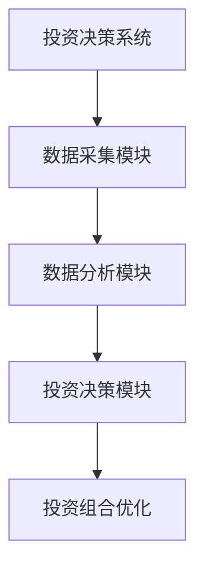
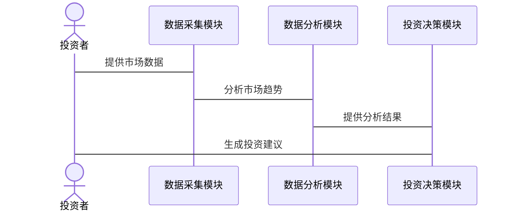

                 


# 巴菲特的长期主义再探讨：在快速变化的市场中保持定力

---

## 关键词：
- 长期主义
- 巴菲特投资策略
- 价值投资
- 风险管理
- 投资系统架构

---

## 摘要：
本文深入探讨了巴菲特的长期主义投资理念，并分析了其在快速变化市场中的应用。通过结合数学模型、系统架构和项目实战，本文详细阐述了长期主义的核心概念、理论基础、算法原理以及系统实现。同时，本文还提供了实际案例和最佳实践，帮助投资者在复杂多变的市场中保持定力，实现长期稳健的投资回报。

---

## 正文：

---

## 第一部分：引言

### 第1章：长期主义的背景与重要性

#### 1.1 问题背景与问题描述
- 长期主义的定义与内涵
- 快速变化市场中的投资挑战
- 长期主义与短期收益的矛盾

#### 1.2 核心概念与联系
- 长期主义的哲学基础
- 投资决策的逻辑框架
- 长期主义与价值投资的关系

#### 1.3 关键概念对比与ER图
- 长期主义与其他投资策略的对比
- 长期主义与短期交易的对比
- 长期主义与趋势投资的对比

---

## 第二部分：巴菲特长期主义的理论基础

### 第2章：价值投资与长期主义

#### 2.1 价值投资的核心理念
- 价值投资的定义与特点
- 价值投资与市场波动的关系
- 高质量企业的选股标准

#### 2.2 安全边际与长期持有
- 安全边际的数学模型
- 安全边际与投资风险的关系
- 长期持有策略的优缺点

---

## 第三部分：长期主义的数学模型与算法原理

### 第3章：长期主义的数学模型

#### 3.1 投资收益的数学模型
- 投资收益的计算公式：$$\text{收益} = \text{最终价值} - \text{初始投资}$$
- 复利计算公式：$$A = P \times (1 + r)^n$$

#### 3.2 风险管理模型
- 马科维茨均值-方差模型
- 风险调整后的收益公式：$$\text{夏普比率} = \frac{\text{超额收益}}{\text{收益的标准差}}$$

#### 3.3 长期投资组合优化
- 现金流贴现模型（DCF）
- 股票内在价值公式：$$\text{内在价值} = \frac{\text{现金流}}{\text{折现率}}$$

---

## 第四部分：系统架构与实现

### 第4章：投资决策系统的架构设计

#### 4.1 系统功能设计
- 数据采集模块
- 数据分析模块
- 投资决策模块

#### 4.2 系统架构图


#### 4.3 系统交互流程


---

## 第五部分：项目实战

### 第5章：基于长期主义的投资组合管理

#### 5.1 环境安装与配置
- Python环境安装
- 数据分析库（Pandas、NumPy）安装
- 图表库（Matplotlib、Seaborn）安装

#### 5.2 核心实现代码
```python
import pandas as pd
import numpy as np
import matplotlib.pyplot as plt

# 示例数据
data = {'股票': ['A', 'B', 'C'], '股价': [100, 200, 150}
df = pd.DataFrame(data)

# 计算股价趋势
df['趋势'] = df['股价'].pct_change()

# 绘制股价趋势图
plt.figure(figsize=(10, 6))
df['趋势'].plot(kind='bar')
plt.title('股价趋势')
plt.xlabel('股票')
plt.ylabel('趋势')
plt.show()
```

#### 5.3 实际案例分析
- 案例背景介绍
- 数据分析过程
- 投资决策结果

---

## 第六部分：总结与展望

### 第6章：长期主义的成功关键与注意事项

#### 6.1 成功关键
- 明确的投资目标
- 严格的风险管理
- 长期的纪律性

#### 6.2 注意事项
- 避免过度优化
- 防范黑天鹅事件
- 定期审视和调整投资策略

#### 6.3 未来趋势与建议
- 技术驱动的投资创新
- 长期主义与人工智能的结合
- 可持续投资的发展

---

## 作者：
AI天才研究院/AI Genius Institute  
禅与计算机程序设计艺术 / Zen And The Art of Computer Programming

