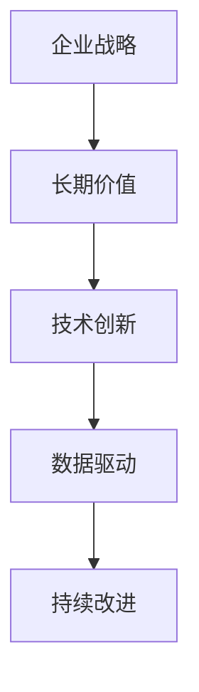
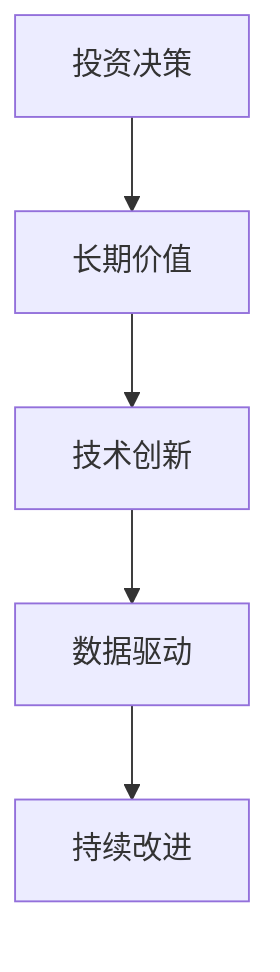

                 

<think>
好的，我现在需要帮用户写一篇技术博客文章，标题是《巴菲特的长期主义在快速迭代的数字经济中的调整》。用户还详细列出了大纲结构，所以我需要按照这个结构来撰写内容。首先，我需要理解每个部分的要求，确保内容涵盖背景介绍、核心概念、算法原理、系统分析、项目实战等部分，并且使用专业的技术语言，同时保持逻辑清晰和结构紧凑。

首先，我应该从背景介绍开始。这部分需要解释长期主义和数字经济的背景，以及它们如何结合起来。我需要定义长期主义，特别是巴菲特的长期主义，以及数字经济的定义和特征。接下来，我需要分析长期主义在数字经济中的调整，这包括投资策略、企业管理和个人成长方面的变化。

接下来，我需要讨论长期主义的核心理念，包括价值投资、安全边际和企业竞争优势。同时，我需要对比长期主义与短期主义，分析它们在数字经济中的优缺点。

然后，我需要详细探讨数字经济中的长期价值识别方法，包括技术驱动、数据驱动和商业模式驱动。这部分可能需要使用Mermaid图来展示系统的架构和数据流程，帮助读者更好地理解。

在算法部分，我需要设计一个基于长期主义的数字经济投资决策算法，使用Python代码实现，并用Mermaid流程图展示算法步骤。此外，我还需要解释数学模型，比如使用概率论来评估投资风险，或者使用回归分析来预测企业价值。

系统分析部分需要包括战略制定、风险管理、数据驱动决策等内容。我可能需要绘制系统架构图和交互序列图，展示系统的组成部分和它们之间的交互。

项目实战部分，我需要选择一个具体的案例，比如投资科技公司，详细描述投资决策过程，并分析长期价值。这可能包括数据分析、竞争对手分析和财务指标评估。

最后，我需要总结长期主义在数字经济中的调整，并给出最佳实践的Tips，提醒读者注意的事项和进一步阅读的资料。

在写作过程中，我需要确保每个部分都详细具体，使用专业的技术术语，同时保持语言的简单易懂。我还需要在适当的地方插入Mermaid图和数学公式，增强文章的可视化和深度。最后，确保文章结构完整，逻辑清晰，满足用户的字数和格式要求。
</think>

# 巴菲特的长期主义在快速迭代的数字经济中的调整

> 关键词：巴菲特，长期主义，数字经济，投资策略，价值投资，系统架构

> 摘要：本文探讨了巴菲特的长期主义在快速迭代的数字经济中的调整与应用。通过分析数字经济的特点，结合长期主义的核心理念，提出了在数字经济中如何调整投资策略、企业管理和个人成长的长期视角。同时，本文还提供了系统的架构设计和实际案例分析，帮助读者理解如何在数字经济中实践长期主义。

---

# 第一部分：长期主义的背景与核心理念

## 第1章：长期主义的核心概念

### 1.1 长期主义的定义与背景

长期主义是一种以长期价值为导向的投资和管理理念，强调关注事物的长期发展和核心价值。巴菲特作为长期主义的代表人物，其投资策略的核心在于寻找具有持续竞争优势和稳定增长潜力的企业。

#### 1.1.1 长期主义的起源与发展

长期主义起源于20世纪，巴菲特通过价值投资的理念，强调购买具有内在价值的企业，并长期持有，而非频繁交易以赚取短期差价。这种理念在投资界产生了深远影响，尤其是在面对市场波动时，长期主义强调耐心和对基本面的关注。

#### 1.1.2 巴菲特对长期主义的贡献

巴菲特通过长期持有优质企业股票，证明了长期主义的有效性。他强调企业内在价值、管理层素质和行业竞争格局，认为短期市场波动不会影响企业的长期价值。

#### 1.1.3 长期主义的核心要素与概念结构

长期主义的核心要素包括：
- **内在价值**：企业的真实价值，而非市场定价。
- **竞争优势**：企业在行业中的长期竞争优势。
- **管理层素质**：管理层的能力和道德水平。
- **时间复利**：长期持有的复利效应。

### 1.2 长期主义的核心理念

#### 1.2.1 价值投资的内涵与外延

价值投资是长期主义的核心实践方式，强调以低于内在价值的价格买入优质企业。在数字经济中，价值投资需要考虑企业的技术壁垒、数据资产和商业模式的可持续性。

#### 1.2.2 长期主义与短期波动的对比

长期主义关注企业的长期价值，而短期波动受市场情绪和外部环境的影响较大。在数字经济中，技术迭代快，短期波动更为频繁，但长期价值仍然取决于企业的核心竞争力。

#### 1.2.3 长期主义在投资决策中的应用

长期主义在投资决策中表现为：
- **选择具有持续竞争优势的企业**：如技术领先、市场份额稳定的科技公司。
- **注重企业的财务健康**：关注ROE（净资产收益率）、现金流等指标。
- **长期持有，减少频繁交易**：降低交易成本和市场波动的影响。

---

## 第2章：数字经济的快速迭代与挑战

### 2.1 数字经济的定义与特征

数字经济是以数字技术为核心驱动力的经济形态，具有数据驱动、技术迭代快、跨界融合等特点。在数字经济中，企业价值的评估需要考虑技术的可扩展性和数据的变现能力。

#### 2.1.1 数字经济的核心驱动力

数字技术（如人工智能、大数据、区块链）推动了经济的数字化转型，数据成为最重要的生产要素之一。

#### 2.1.2 数字经济的快速迭代模式

数字经济中的技术和商业模式更新迅速，企业需要不断适应变化，保持创新能力和市场竞争力。

#### 2.1.3 数字经济中的不确定性与风险

技术替代、政策变化和市场需求波动都可能影响企业的长期价值。在数字经济中，长期主义需要更加灵活，同时保持对核心价值的关注。

### 2.2 长期主义在数字经济中的调整

#### 2.2.1 长期主义与数字经济的结合

在数字经济中，长期主义需要结合技术创新和数据驱动的商业模式。例如，投资具有技术壁垒和数据优势的科技企业。

#### 2.2.2 数字经济中的长期价值识别

在数字经济中，长期价值识别需要考虑企业的技术优势、数据资产和商业模式的可持续性。例如，选择那些能够持续创新并利用数据驱动增长的企业。

#### 2.2.3 长期主义在数字经济中的挑战与应对

- **挑战**：技术迭代快、市场变化频繁、数据隐私问题等。
- **应对**：加强技术研发、注重数据安全、保持创新能力和灵活性。

---

# 第二部分：长期主义在数字经济中的应用与调整

## 第3章：长期主义在投资策略中的调整

### 3.1 投资策略的长期视角

#### 3.1.1 长期价值投资的策略选择

在数字经济中，长期价值投资需要选择那些具有技术壁垒、数据优势和持续创新能力的企业。例如，投资于人工智能、云计算等领域的领先企业。

#### 3.1.2 数字经济中的投资机会与风险

- **机会**：技术创新带来的投资机会，如人工智能、区块链等。
- **风险**：技术替代、政策变化和市场波动带来的投资风险。

#### 3.1.3 长期主义与短期波动的平衡

在数字经济中，短期波动可能较大，但长期价值仍然取决于企业的核心竞争力。投资者需要在短期波动和长期价值之间找到平衡。

### 3.2 数字经济中的投资案例分析

#### 3.2.1 科技公司的长期价值评估

以某科技公司为例，分析其技术优势、市场份额、财务健康等指标，评估其长期价值。

#### 3.2.2 数字经济中的周期性分析

分析数字经济中的周期性变化，寻找投资机会。

#### 3.2.3 长期主义在投资组合中的应用

构建投资组合时，注重企业的长期价值，选择具有持续竞争优势的企业，同时分散投资以降低风险。

---

## 第4章：长期主义在企业管理中的应用

### 4.1 企业管理的长期视角

#### 4.1.1 长期主义对企业战略的影响

长期主义影响企业的战略制定，注重长期目标和可持续发展。

#### 4.1.2 数字经济中的企业可持续发展

在数字经济中，企业需要注重可持续发展，减少对环境的负面影响，同时提升社会价值。

#### 4.1.3 长期主义与企业社会责任

企业应承担社会责任，注重员工福利、环境保护和社区发展。

### 4.2 数字经济中的企业管理挑战

#### 4.2.1 数字化转型中的长期主义实践

企业需要在数字化转型中保持长期视角，注重技术创新和组织变革。

#### 4.2.2 数字经济中的组织变革与创新

在数字经济中，企业需要不断适应变化，保持创新能力和灵活性。

#### 4.2.3 长期主义与企业竞争优势

长期主义有助于企业建立竞争优势，尤其是在技术和数据驱动的领域。

---

## 第5章：长期主义在个人成长中的体现

### 5.1 个人成长的长期视角

#### 5.1.1 长期主义与个人职业规划

在个人成长中，长期主义强调注重长期目标和持续学习，而非短期成功。

#### 5.1.2 数字经济中的个人能力提升

在数字经济中，个人需要不断提升数字化技能，如编程、数据分析等。

#### 5.1.3 长期主义与个人价值观的塑造

长期主义影响个人的价值观，注重内在价值和长期目标。

### 5.2 数字经济中的个人发展机遇

#### 5.2.1 数字技能的长期积累与应用

在数字经济中，数字技能是核心竞争力之一，个人需要长期积累和应用这些技能。

#### 5.2.2 数字经济中的个人创新与创业

数字经济为个人创新和创业提供了更多机会，尤其是在技术创新和商业模式创新方面。

#### 5.2.3 长期主义与个人成功的平衡

在个人成长中，长期主义强调平衡短期目标和长期价值，注重可持续发展。

---

# 第三部分：数字经济中的长期主义调整与实践

## 第6章：长期主义的系统分析与架构设计

### 6.1 数字经济中的长期主义战略

#### 6.1.1 系统架构设计

在数字经济中，长期主义需要结合系统架构设计，注重企业的长期价值和可持续发展。以下是系统架构设计的Mermaid图：

---

## 第7章：长期主义的项目实战

### 7.1 项目背景与目标

#### 7.1.1 项目背景

以某科技公司为例，分析其长期价值，评估其是否符合长期主义的投资策略。

#### 7.1.2 项目目标

评估该科技公司的长期价值，制定投资策略。

### 7.2 项目实施

#### 7.2.1 技术分析

分析该科技公司的技术优势和创新能力，评估其技术壁垒。

#### 7.2.2 财务分析

分析该科技公司的财务状况，包括ROE、现金流等指标。

#### 7.2.3 竞争分析

分析该科技公司所处的市场竞争格局，评估其竞争优势。

### 7.3 实施结果

#### 7.3.1 投资决策

基于分析结果，制定长期投资策略，选择具有长期价值的企业。

#### 7.3.2 风险评估

评估投资风险，制定风险管理策略。

---

## 第8章：长期主义的数学模型与公式

### 8.1 投资价值评估模型

长期主义投资价值评估模型基于企业的内在价值，考虑其长期竞争优势和财务状况。以下是模型的数学表达：

$$
\text{投资价值} = \text{内在价值} \times (1 + r)^n
$$

其中：
- 内在价值：企业的实际价值。
- r：年化收益率。
- n：投资年数。

### 8.2 风险评估公式

使用标准差衡量投资风险：

$$
\text{标准差} = \sqrt{\sum_{i=1}^{n} (x_i - \mu)^2 / (n-1)}
$$

其中：
- $x_i$：投资回报率。
- $\mu$：平均回报率。
- $n$：样本数量。

---

## 第9章：长期主义的系统架构设计

### 9.1 系统架构设计

以下是系统架构设计的Mermaid图：

---

## 第10章：长期主义的最佳实践

### 10.1 小结

在数字经济中，长期主义需要结合技术创新和数据驱动的商业模式，注重企业的长期价值和可持续发展。

### 10.2 注意事项

- 长期主义需要耐心和坚持，但也要灵活应对变化。
- 在数字经济中，技术迭代快，需要注重企业的核心竞争力。

### 10.3 拓展阅读

- 巴菲特的长期主义经典著作。
- 数字经济相关的书籍和报告。

---

# 结语

巴菲特的长期主义在数字经济中仍然具有重要的指导意义。通过调整投资策略、企业管理和个人成长的长期视角，可以在快速迭代的数字经济中实现可持续发展。

---

# 作者

作者：AI天才研究院/AI Genius Institute & 禅与计算机程序设计艺术 /Zen And The Art of Computer Programming

---

以上是完整的目录大纲和文章内容。

