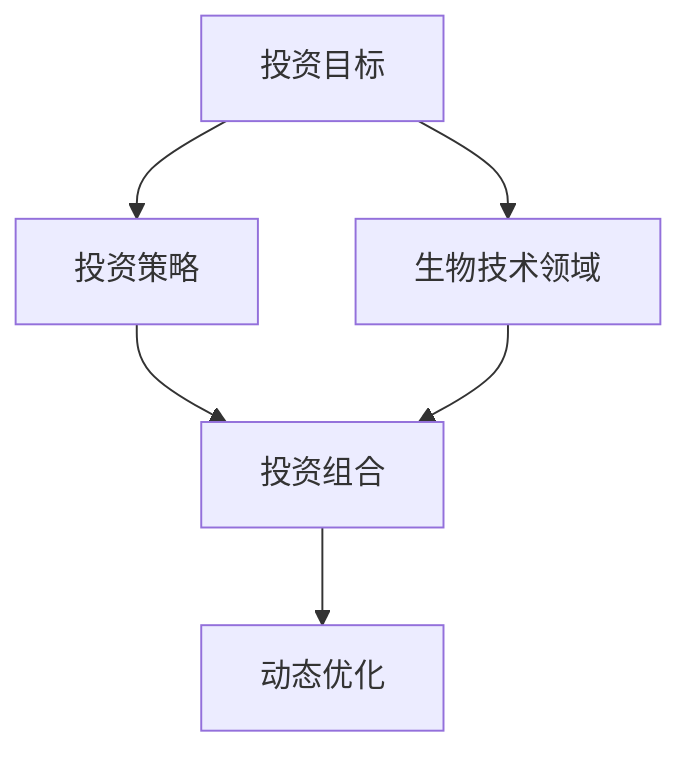

                 

# 巴菲特的长期主义在快速迭代的生物技术领域的调整

## 关键词：巴菲特，长期主义，生物技术，投资策略，系统架构，动态优化，数学模型

## 摘要： 
本文探讨了巴菲特的长期主义投资理念在快速迭代的生物技术领域的应用与调整。通过分析生物技术领域的特点、挑战及投资策略，结合数学模型和系统架构设计，展示了如何在动态变化的环境中优化投资决策。文章还提供了具体的案例分析和实战指导，为投资者提供了可操作的策略。

---

# 第1章: 长期主义与生物技术的结合

## 1.1 长期主义的核心概念

### 1.1.1 长期主义的定义与背景

长期主义（Long-termism）是一种投资理念，强调关注企业的长期价值和可持续发展，而非短期市场波动。巴菲特作为长期主义的代表人物，其投资哲学的核心在于寻找具有强大护城河（moat）的企业，这些企业能够在长期内保持竞争优势并为股东创造价值。

在生物技术领域，长期主义的适用性面临挑战。生物技术领域的特点是快速迭代、高风险和高不确定性，这些特性与传统行业的长期稳定性形成鲜明对比。

### 1.1.2 生物技术领域的特点与挑战

生物技术领域的特点包括：

- **快速迭代**：生物技术的进步通常以指数速度增长，新技术和新产品层出不穷。
- **高风险与高回报**：生物技术的研发周期长、成本高，但成功的产品往往具有巨大的市场潜力。
- **政策与伦理影响**：生物技术领域受到严格的政策监管和伦理约束，这些因素可能影响企业的长期发展。

### 1.1.3 长期主义与生物技术的契合点

尽管生物技术领域存在不确定性，长期主义仍有一定的适用性。例如，长期主义关注企业的核心竞争力和管理层能力，这些因素在生物技术企业中同样重要。此外，长期主义强调对管理层的信任和企业治理的关注，这也是生物技术领域成功的关键因素之一。

---

## 1.2 巴菲特投资理念的核心要素

### 1.2.1 巴菲特的价值投资原则

巴菲特的价值投资原则包括以下几点：

1. **寻找具有护城河的企业**：护城河是企业在长期竞争中保持优势的关键因素，例如专利、品牌、技术壁垒等。
2. **关注企业的管理层**：管理层的能力和决策对企业的长期发展至关重要。
3. **注重企业的财务健康**：企业需要具备健康的财务状况，能够经受住经济周期的波动。

### 1.2.2 巴菲特对生物技术领域的关注点

巴菲特对生物技术领域的关注点包括：

1. **企业的技术壁垒**：生物技术企业的核心竞争力在于其专利和技术。
2. **管理层的能力和决策**：管理层需要具备战略眼光和创新能力。
3. **企业的财务状况**：企业的财务健康是长期发展的基础。

### 1.2.3 巴菲特投资成功的案例分析

以巴菲特投资的生物技术企业为例，分析其成功的原因：

- **案例分析**：以基因测序公司为例，巴菲特关注其技术壁垒和管理层能力。
- **成功因素**：基因测序公司的技术壁垒和管理层的战略眼光是巴菲特投资的关键因素。

---

## 1.3 生物技术领域的快速迭代与不确定性

### 1.3.1 生物技术的快速迭代特点

生物技术领域的快速迭代特点：

- **技术更新速度快**：新技术和新产品不断涌现，企业需要持续创新。
- **研发周期长**：生物技术的研发周期通常较长，且成本高。
- **不确定性高**：生物技术的研发结果具有高度不确定性，可能成功也可能失败。

### 1.3.2 生物技术领域的高风险与高回报

生物技术领域的高风险与高回报：

- **高风险**：生物技术的研发失败率高，企业的生存风险较大。
- **高回报**：成功的生物技术产品具有巨大的市场潜力和盈利能力。

### 1.3.3 长期主义在生物技术领域的适应性

长期主义在生物技术领域的适应性：

- **适应性**：长期主义的投资理念可以适应生物技术领域的长期性和不确定性。
- **挑战**：生物技术领域的快速迭代和高风险对长期主义提出了更高的要求。

---

# 第2章: 巴菲特长期主义在生物技术领域的调整策略

## 2.1 长期主义在生物技术领域的核心调整

### 2.1.1 投资目标的重新定义

投资目标的重新定义：

- **长期价值**：关注企业的长期价值和可持续发展。
- **技术创新**：重视企业的技术创新能力和研发能力。
- **风险控制**：在高风险的生物技术领域，风险控制是投资成功的关键。

### 2.1.2 投资周期的动态调整

投资周期的动态调整：

- **动态调整**：根据生物技术领域的快速变化，动态调整投资周期。
- **灵活应对**：在高风险的环境中，保持投资策略的灵活性。

### 2.1.3 投资策略的灵活性与稳健性

投资策略的灵活性与稳健性：

- **灵活性**：在生物技术领域，投资策略需要具备灵活性，能够快速适应变化。
- **稳健性**：在高风险的环境中，投资策略需要稳健，避免过度冒险。

---

## 2.2 生物技术领域的投资风险与应对

### 2.2.1 技术风险的识别与评估

技术风险的识别与评估：

- **技术评估**：对生物技术企业的技术创新能力进行评估。
- **风险识别**：识别可能的技术失败风险和替代技术风险。

### 2.2.2 市场风险的分析与应对

市场风险的分析与应对：

- **市场分析**：分析生物技术市场的竞争格局和市场潜力。
- **应对策略**：制定应对市场变化的策略，例如多元化投资。

### 2.2.3 伦理与政策风险的考量

伦理与政策风险的考量：

- **政策风险**：关注生物技术领域的政策变化和监管风险。
- **伦理风险**：考虑生物技术产品可能引发的伦理问题。

---

## 2.3 巴菲特投资理念的创新与突破

### 2.3.1 从传统行业到生物技术的转变

从传统行业到生物技术的转变：

- **行业转换**：巴菲特的投资理念从传统行业扩展到生物技术领域。
- **经验积累**：在生物技术领域的投资需要积累更多的经验。

### 2.3.2 长期主义与创新的结合

长期主义与创新的结合：

- **创新投资理念**：在生物技术领域，长期主义需要与创新相结合。
- **动态优化**：通过动态优化投资策略，适应生物技术领域的快速变化。

### 2.3.3 投资决策的动态优化

投资决策的动态优化：

- **动态调整**：根据市场变化和企业情况，动态优化投资决策。
- **数据驱动**：利用数据分析和模型优化，提高投资决策的科学性。

---

# 第3章: 生物技术领域的系统性分析与架构设计

## 3.1 生物技术领域的系统性分析

### 3.1.1 生物技术领域的关键成功因素

生物技术领域的关键成功因素：

- **技术创新**：企业的技术创新能力是成功的关键。
- **研发能力**：企业的研发能力是长期发展的核心。
- **市场定位**：企业在市场中的定位和竞争力。

### 3.1.2 生物技术领域的竞争格局分析

生物技术领域的竞争格局分析：

- **竞争分析**：分析生物技术领域的竞争格局和主要竞争对手。
- **市场定位**：确定企业在市场中的位置和竞争优势。

### 3.1.3 生物技术领域的技术趋势预测

生物技术领域的技术趋势预测：

- **技术预测**：预测生物技术领域的技术发展趋势。
- **投资方向**：根据技术趋势确定投资方向和重点。

---

## 3.2 长期主义投资的系统架构设计

### 3.2.1 投资目标的系统化分解

投资目标的系统化分解：

- **目标分解**：将长期投资目标分解为具体可执行的子目标。
- **层次结构**：构建投资目标的层次结构，明确每个层次的目标和责任。

### 3.2.2 投资策略的模块化设计

投资策略的模块化设计：

- **模块设计**：将投资策略分解为多个模块，例如技术评估模块、风险评估模块等。
- **模块交互**：明确各模块之间的交互关系和数据流。

### 3.2.3 投资组合的动态优化

投资组合的动态优化：

- **动态调整**：根据市场变化和企业情况，动态优化投资组合。
- **模型优化**：利用数学模型优化投资组合的配置和权重。

---

## 3.3 生物技术领域的投资架构图

---

# 第4章: 生物技术领域的动态优化与数学模型

## 4.1 动态优化的数学模型

### 4.1.1 动态优化模型的构建

动态优化模型的构建：

- **模型构建**：构建动态优化的数学模型，包括目标函数和约束条件。
- **变量定义**：定义模型中的变量，例如投资金额、投资周期等。

### 4.1.2 动态优化模型的实现

动态优化模型的实现：

- **算法选择**：选择适合的优化算法，例如动态规划、遗传算法等。
- **代码实现**：用Python代码实现动态优化模型的优化算法。

### 4.1.3 动态优化模型的验证

动态优化模型的验证：

- **模型验证**：验证模型的有效性和准确性。
- **结果分析**：分析优化结果，评估模型的性能。

---

## 4.2 生物技术领域的动态优化案例分析

### 4.2.1 案例背景介绍

案例背景介绍：

- **案例选择**：选择一个具体的生物技术企业作为案例，例如某基因测序公司。
- **背景分析**：分析该企业的基本情况、市场地位和财务状况。

### 4.2.2 动态优化模型的应用

动态优化模型的应用：

- **模型应用**：将动态优化模型应用于该企业的投资决策中。
- **结果分析**：分析优化结果，评估模型的适用性和效果。

### 4.2.3 投资策略的调整

投资策略的调整：

- **策略调整**：根据优化结果调整投资策略，例如调整投资金额和投资周期。
- **效果评估**：评估调整后的投资策略的效果，验证模型的有效性。

---

# 第5章: 生物技术领域的实战与最佳实践

## 5.1 实战环境安装与配置

### 5.1.1 环境安装

环境安装：

- **操作系统**：建议使用Linux或MacOS系统。
- **Python版本**：建议使用Python 3.8及以上版本。
- **工具安装**：安装必要的工具和库，例如Python的Pandas、NumPy、Scipy等。

### 5.1.2 代码实现

代码实现：

- **数据获取**：获取生物技术企业的相关数据，例如财务数据、市场数据等。
- **模型实现**：实现动态优化模型的代码，例如使用Python的优化库进行优化计算。

## 5.2 系统实现与优化

### 5.2.1 系统实现

系统实现：

- **系统设计**：设计系统的功能模块，例如数据采集模块、优化模块、结果分析模块等。
- **模块实现**：实现各个功能模块的代码，例如数据采集模块使用爬虫技术，优化模块使用优化算法等。

### 5.2.2 系统优化

系统优化：

- **性能优化**：优化系统的运行效率，例如使用并行计算、缓存技术等。
- **可扩展性优化**：优化系统的可扩展性，例如模块化设计、接口设计等。

## 5.3 案例分析与实战指导

### 5.3.1 案例分析

案例分析：

- **案例选择**：选择一个具体的生物技术企业作为案例，例如某基因测序公司。
- **数据分析**：对企业的财务数据、市场数据等进行分析，评估其长期投资价值。

### 5.3.2 实战指导

实战指导：

- **步骤指导**：详细指导读者如何在实际操作中应用动态优化模型。
- **注意事项**：提醒读者在实际操作中需要注意的问题，例如数据的准确性、模型的适用性等。

---

# 第6章: 总结与展望

## 6.1 总结

### 6.1.1 本文总结

本文总结：

- **主要结论**：总结本文的主要结论和观点。
- **核心内容**：回顾本文的核心内容和重点。

### 6.1.2 投资策略调整的关键点

投资策略调整的关键点：

- **关键点总结**：总结在生物技术领域应用长期主义投资理念的关键点。
- **未来展望**：展望未来生物技术领域的投资机会和挑战。

---

## 6.2 展望

### 6.2.1 未来生物技术领域的投资机会

未来生物技术领域的投资机会：

- **技术创新**：生物技术领域的技术创新将继续推动行业发展。
- **市场扩展**：生物技术市场的扩展将为投资者提供更多的机会。

### 6.2.2 长期主义与生物技术的结合

长期主义与生物技术的结合：

- **未来趋势**：预测未来长期主义与生物技术结合的趋势和方向。
- **投资策略**：提出未来在生物技术领域应用长期主义投资策略的具体建议。

---

# 作者

作者：AI天才研究院/AI Genius Institute & 禅与计算机程序设计艺术 /Zen And The Art of Computer Programming

---

* 本文遵循CC BY-NC-SA 4.0 Attribution-NonCommercial-NoDerivatives License
* 本文仅作为学术研究和专业参考，不构成投资建议

