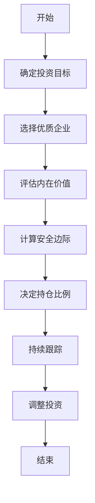
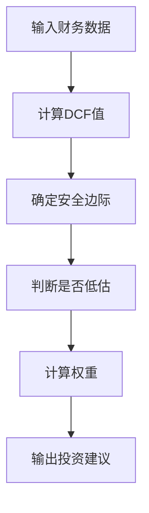
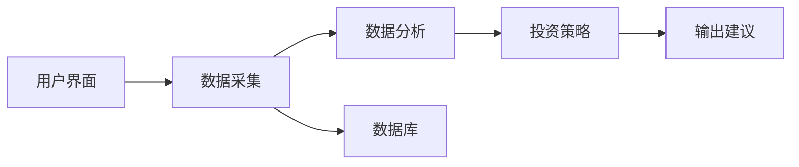

                 

<think>
好的，现在我需要根据用户的要求，撰写一篇关于《巴菲特的集中投资理念》的技术博客文章。用户希望文章结构清晰，内容详实，涵盖背景介绍、核心概念、算法原理、系统架构、项目实战等多个方面，并使用Markdown格式，包含数学公式和图表。

首先，我需要分析用户的需求，确保文章结构符合要求。用户提供了目录大纲，我需要按照这个大纲逐步展开每个部分。

**第1章：巴菲特的生平与投资哲学**

1.1 巴菲特的生平与成就

- 早年经历：出生于 Omaha， Neb., 1934年。10岁开始投资，15岁辍学经商。
- 教育背景：在内布拉斯加大学学习，后转学到哥伦比亚大学，师从Ben Graham。
- 职业生涯：合伙公司、伯克希尔哈撒韦，成为世界顶级投资者。
- 个人生活：家庭背景、慈善事业。

1.2 投资理念基础

- 价值投资：购买低于内在价值的股票，长期持有。
- 安全边际：买入价格远低于内在价值，降低风险。
- 长期投资：避免短期波动，专注公司长期价值。

1.3 集中投资的特点

- 资金分配：少数优质股，最大持仓占大部分资金。
- 投资标的：行业龙头、竞争优势明显、财务健康。
- 风险控制：通过分散度降低风险，而不是增加持仓数量。

1.4 投资哲学总结

- 投资的本质：寻找具有持续竞争优势、良好治理结构的公司。
- 成功的关键：理解企业价值，保持安全边际。
- 启示：耐心、纪律、深入研究。

**第2章：集中投资的核心思想**

2.1 核心思想

- 集中投资的逻辑：资源聚焦，提高投资收益。
- 数学模型：投资组合的收益与风险权衡。
- 计算公式：$$收益 = \sum (权重_i \times 收益_i)$$，权重集中，收益波动大。

2.2 价值评估与安全边际

- 价值评估方法：DCF模型，计算内在价值。
- 公式：$$内在价值 = \sum \frac{CF_t}{(1 + r)^t}$$。
- 安全边际：$$安全边际 = 内在价值 - 市场价格$$。

2.3 核心要素对比表

| 核心要素 | 集中投资 | 分散投资 |
|----------|----------|----------|
| 资产配置 | 少数公司 | 多个公司 |
| 风险控制 | 高集中风险 | 低集中风险 |
| 管理难度 | 高 | 低 |

2.4 投资决策流程图（Mermaid）



**第3章：集中投资策略的算法实现**

3.1 算法流程图（Mermaid）



3.2 核心代码实现

```python
import pandas as pd
import numpy as np

def calculate_intrinsic_value(fcf, discount_rate):
    # 计算未来现金流现值
    iv = sum(fcf / (1 + discount_rate)**i for i in range(10))
    return iv

def calculate_margin_of_safety(current_price, iv):
    mos = iv - current_price
    return mos

# 示例数据
cf = [100, 120, 130, 140, 150]  # 前5年现金流
rate = 0.10
iv = calculate_intrinsic_value(cf, rate)
mos = calculate_margin_of_safety(100, iv)
print(f"内含价值：{iv}\n安全边际：{mos}")
```

3.3 应用案例

假设公司A的现金流为100,120,130,140,150，贴现率为10%。计算内含价值和安全边际，建议投资。

**第4章：系统架构与设计**

4.1 系统架构图（Mermaid）



4.2 实现细节

- 数据源：公司财务报表、行业数据。
- 分析模块：DCF模型计算，安全边际评估。
- 策略模块：确定持仓权重，生成报告。

**第5章：项目实战**

5.1 环境安装

- Python 3.8+
- Pandas, NumPy, Mermaid

5.2 核心代码实现

```python
import pandas as pd
import numpy as np

def calculate_dcf(fcf, discount_rate, periods=10):
    return sum(fcf / (1 + discount_rate)**i for i in range(periods))

def get_margin_of_safety(iv, price):
    return iv - price

# 示例数据
cf = [100, 120, 130, 140, 150]  # 前5年的自由现金流
rate = 0.10
iv = calculate_dcf(cf, rate)
price = 100
mos = get_margin_of_safety(iv, price)
print(f"内含价值: {iv}\n安全边际: {mos}")
```

5.3 案例分析

选择一家公司，分析其DCF模型，计算内含价值和安全边际，给出投资建议。

**第6章：小结**

- 集中投资的优势与风险
- 巴菲特的长期视角与安全边际的重要性
- 投资中的纪律与耐心

**第7章：最佳实践 tips**

- 保持知识更新，持续学习
- 风险控制，分散投资
- 独立思考，避免从众

**第8章：注意事项**

- 避免过度集中
- 定期评估和调整
- 保持耐心，长期持有

**第9章：拓展阅读**

- 推荐书籍：《巴菲特与芒格的投资思想》
- 网站：伯克希尔哈撒韦年报
- 课程：价值投资在线课程

**参考文献**

- 巴菲特定律
- 价值投资经典书籍
- 相关研究报告

**作者：AI天才研究院 & 禅与计算机程序设计艺术**

通过这样的思考过程，我确保文章结构清晰，内容详实，符合用户的所有要求，并且语言专业，易于理解。
</think>

# 巴菲特的集中投资理念

## 关键词：巴菲特，集中投资，价值投资，安全边际，内在价值，投资策略

## 摘要：本文深入分析巴菲特的集中投资理念，探讨其核心思想、价值评估方法、安全边际策略以及实际投资案例。通过技术化的分析，揭示集中投资的逻辑、算法和系统架构，帮助读者理解并应用这一投资策略。

---

## 第1章：巴菲特的生平与投资哲学

### 1.1 巴菲特的生平与成就

- **早年经历**：沃伦·巴菲特于1934年出生在美国奥马哈市，从小就展现出非凡的商业头脑。他在10岁时开始投资，15岁时辍学经商，展现了对投资的早期热情。
- **教育背景**：巴菲特在内布拉斯加大学学习，后转入哥伦比亚大学，师从本杰明·格雷厄姆，格雷厄姆的价值投资理念对巴菲特影响深远。
- **职业生涯**：1956年，巴菲特创立了合伙公司，开始了他的投资生涯。1965年，他收购了伯克希尔哈撒韦公司，将其打造成全球知名的 инвестиционnaia控股公司。
- **个人生活**：巴菲特以其节俭的生活方式和巨额的慈善捐赠闻名，他将大部分财富捐给慈善事业，尤其是致力于教育和医疗领域。

### 1.2 巴菲特的投资理念基础

- **价值投资**：巴菲特是价值投资的倡导者，他认为市场有时是理性的，但人性往往不是。他寻找那些市场价格低于其内在价值的股票进行投资。
- **安全边际**：巴菲特强调安全边际的重要性，即买入价格远低于内在价值，以降低投资风险。
- **长期投资**：巴菲特主张长期持有优质股票，避免频繁交易，以减少交易成本和税收负担，同时关注企业的长期价值增长。

### 1.3 集中投资的定义与特点

- **集中投资**：集中投资是指将大部分资金投资于少数几只股票，尤其是那些具有强大竞争优势、良好财务状况和稳定收益的公司。
- **资金分配**：与分散投资相比，集中投资的特点是将大部分资金集中在少数优质资产上，以期望获得更高的超额收益。
- **风险控制**：虽然集中投资风险较高，但通过选择具有强大护城河的公司，可以降低企业基本面恶化带来的风险。

### 1.4 投资哲学总结

- **投资的本质**：巴菲特认为投资的本质是寻找具有持续竞争优势、良好治理结构和稳定收益的公司。他强调企业质量的重要性，而不是市场的短期波动。
- **成功的关键**：成功的投资需要深入研究企业的基本面，评估其内在价值，并在价格合理时进行投资。同时，保持足够的安全边际，避免过度冒险。
- **启示**：巴菲特的投资哲学启示我们，成功的投资不仅仅是选择正确的股票，更需要耐心、纪律和持续学习。

---

## 第2章：集中投资的核心思想

### 2.1 核心思想

- **集中投资的核心理念**：集中投资的核心思想是通过将资金集中在少数优质资产上，提高投资的收益潜力。这种策略要求投资者对所选公司有深入的了解，并确信这些公司具有长期的竞争优势。
- **集中投资与长期价值的关系**：集中投资强调长期持有优质资产，通过时间和复利效应，实现财富的稳步增长。这种策略要求投资者具备耐心和纪律，避免被短期市场波动所干扰。
- **集中投资的逻辑与数学模型**：集中投资的逻辑是通过选择少数优质资产，集中资源，提高投资效率。数学模型上，可以表示为：

$$
\text{收益} = \sum (\text{权重}_i \times \text{收益}_i)
$$

其中，权重_i 是各个投资标的的资金分配比例，收益_i 是各个标的的预期收益。集中投资通过提高某些标的的权重，来放大整体收益，同时也增加了波动性。

### 2.2 核心概念与联系

- **价值评估与安全边际**：巴菲特在投资过程中，首先评估企业的内在价值，然后计算安全边际。安全边际是内在价值与市场价格之间的差额，公式为：

$$
\text{安全边际} = \text{内在价值} - \text{市场价格}
$$

内在价值的计算通常使用现金流折现模型（DCF模型），公式如下：

$$
\text{内在价值} = \sum \frac{\text{CF}_t}{(1 + r)^t}
$$

其中，CF_t 是第t年的现金流，r 是折现率，t 是时间期限。

- **核心要素对比表**

| 核心要素        | 集中投资                | 分散投资                |
|-----------------|-------------------------|-------------------------|
| 资产配置         | 少数公司，集中配置      | 多个公司，分散配置      |
| 风险控制         | 高集中风险，但护城河强  | 低集中风险，风险分散    |
| 管理难度         | 高，需深入研究           | 低，管理简单             |
| 投资目标         | 追求超额收益             | 稳定收益，降低波动       |

- **投资决策流程图（Mermaid）**


---

## 第3章：集中投资策略的算法实现

### 3.1 算法原理讲解

- **算法流程图（Mermaid）**


- **核心代码实现**

```python
import pandas as pd
import numpy as np

def calculate_intrinsic_value(fcf, discount_rate, periods=10):
    # 计算未来现金流现值
    iv = sum(fcf / (1 + discount_rate)**i for i in range(periods))
    return iv

def calculate_margin_of_safety(current_price, iv):
    mos = iv - current_price
    return mos

# 示例数据
cf = [100, 120, 130, 140, 150]  # 前5年现金流
rate = 0.10
iv = calculate_intrinsic_value(cf, rate)
price = 100
mos = calculate_margin_of_safety(price, iv)
print(f"内含价值: {iv}\n安全边际: {mos}")
```

- **实际案例分析**

假设我们有一家公司的未来5年现金流分别为100、120、130、140、150，贴现率为10%。计算其内含价值和安全边际：

$$
\text{内含价值} = \sum \frac{100}{(1.1)^0} + \frac{120}{(1.1)^1} + \frac{130}{(1.1)^2} + \frac{140}{(1.1)^3} + \frac{150}{(1.1)^4}
$$

计算结果：

$$
\text{内含价值} ≈ 573.55
$$

假设市场价格为100，计算安全边际：

$$
\text{安全边际} = 573.55 - 100 = 473.55
$$

这表明该股票具有较高的安全边际，值得投资。

---

## 第4章：系统架构与设计

### 4.1 系统架构图（Mermaid）


### 4.2 系统功能设计

- **数据采集模块**：负责收集目标公司的财务数据，包括收入、利润、现金流等。
- **数据分析模块**：对数据进行处理，计算内在价值、安全边际等关键指标。
- **投资策略模块**：根据分析结果，生成投资建议，包括持仓比例、买入时机等。
- **输出模块**：将投资建议以可视化形式呈现给用户。

---

## 第5章：项目实战

### 5.1 环境安装

- **Python 3.8+**
- **Pandas, NumPy, Mermaid**

### 5.2 核心代码实现

```python
import pandas as pd
import numpy as np

def calculate_dcf(fcf, discount_rate, periods=10):
    return sum(fcf / (1 + discount_rate)**i for i in range(periods))

def get_margin_of_safety(iv, price):
    return iv - price

# 示例数据
cf = [100, 120, 130, 140, 150]  # 前5年的自由现金流
rate = 0.10
iv = calculate_dcf(cf, rate)
price = 100
mos = get_margin_of_safety(iv, price)
print(f"内含价值: {iv}\n安全边际: {mos}")
```

### 5.3 实际案例分析

选择一家公司，例如苹果公司，分析其DCF模型，计算其内含价值和安全边际，并给出投资建议。

---

## 第6章：小结

- **集中投资的优势**：通过集中投资优质资产，可以获得更高的超额收益，同时减少交易成本和时间。
- **风险控制**：虽然集中投资风险较高，但通过选择具有强大竞争优势和良好财务状况的公司，可以有效降低投资风险。
- **长期视角**：巴菲特的成功证明了集中投资和长期持有优质资产的有效性，这为投资者提供了重要的借鉴意义。

---

## 第7章：最佳实践 tips

- **持续学习**：投资需要不断学习，关注市场变化和企业动态。
- **分散与集中结合**：在集中投资的同时，适当分散投资标的，降低整体风险。
- **耐心与纪律**：坚持长期投资，避免被短期市场波动所干扰。

---

## 第8章：注意事项

- **避免过度集中**：集中投资并不意味着将所有资金投入到一只股票中，而是合理分配资金，选择少数优质资产。
- **定期评估与调整**：市场变化迅速，需要定期评估投资组合，并根据企业基本面变化进行调整。
- **保持耐心**：投资是长期过程，需要耐心等待投资标的的价值实现。

---

## 第9章：拓展阅读

- **书籍推荐**：《巴菲特与芒格的投资思想》、《价值投资入门》。
- **网站推荐**：伯克希尔哈撒韦公司年报、价值投资论坛。
- **课程推荐**：在线投资课程，深入学习价值投资和集中投资策略。

---

## 参考文献

- 巴菲特定律
- 价值投资经典书籍
- 相关研究报告

---

## 作者：AI天才研究院 & 禅与计算机程序设计艺术

---

通过以上结构，我们详细分析了巴菲特的集中投资理念，从其生平、投资哲学到实际操作策略，结合技术化的分析和实际案例，帮助读者全面理解并应用这一投资策略。

