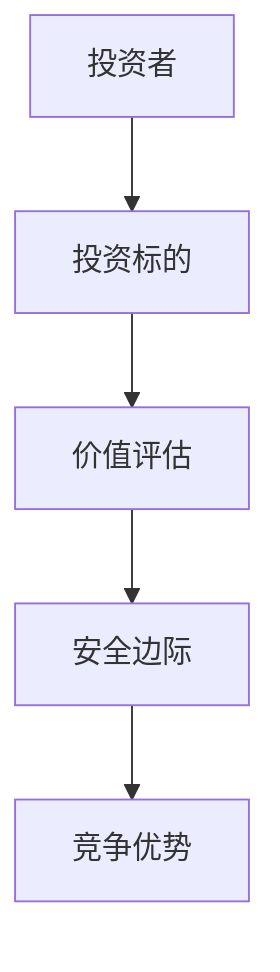
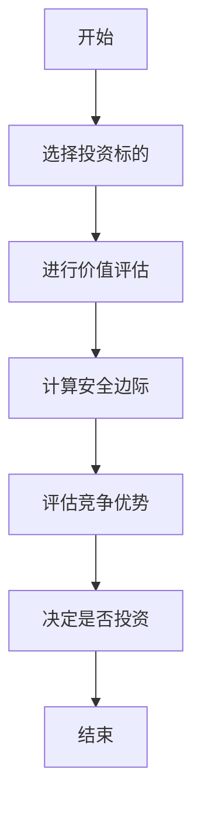
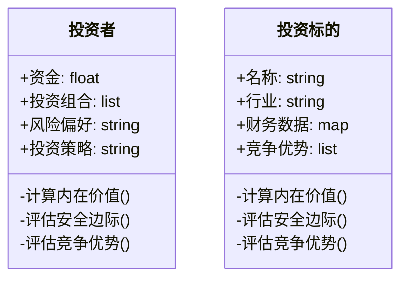
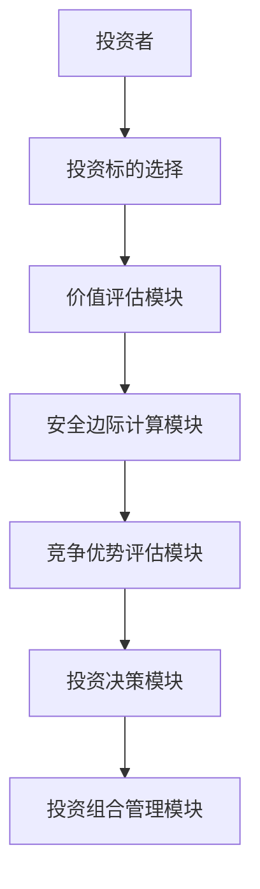

                 

<think>
好的，现在我要撰写一篇关于“巴菲特的集中投资策略：利弊分析”的技术博客文章。首先，我需要理解用户的需求。用户希望我以一位世界级人工智能专家、程序员、软件架构师、CTO、技术畅销书作家以及计算机图灵奖获得者的身份来撰写这篇文章。文章需要逻辑清晰、结构紧凑、语言专业，适合技术博客读者阅读。

文章标题已经给出：“巴菲特的集中投资策略：利弊分析”。关键词包括巴菲特、投资策略、集中投资、价值投资、安全边际、竞争优势。摘要部分需要简明扼要地概括文章的核心内容，即分析巴菲特集中投资策略的优缺点，探讨其在现代投资环境中的适用性和风险。

接下来，我需要按照用户提供的目录结构来撰写文章。文章分为五个主要部分：背景与核心概念、算法原理、系统分析、项目实战和总结。每个部分都有具体的章节和小节，我需要确保每个部分都详细且有深度。

在撰写过程中，我需要确保内容准确，逻辑严谨。同时，要使用专业且易懂的语言，避免过于复杂的术语，但又要体现出技术博客的专业性。我还需要注意文章的结构，每个章节和小节之间要有良好的过渡，确保读者能够顺畅地跟随思路。

我还需要特别注意用户提到的格式要求，比如使用Markdown格式，数学公式用LaTeX表示，流程图和类图使用Mermaid语法。这些图表和公式需要准确无误，并且能够清晰地传达信息。

在撰写过程中，我可能会遇到一些挑战。例如，如何将巴菲特的投资策略与技术分析相结合，或者如何用算法来解释投资决策。这时候，我需要查阅相关资料，确保内容的准确性和深度。

最后，我需要在文章末尾添加作者信息，以符合用户的要求。整个思考过程中，我需要不断回顾用户的需求，确保文章符合他们的期望，并且能够为读者提供有价值的见解。

通过以上步骤，我希望能够撰写出一篇符合用户要求的高质量技术博客文章，深入分析巴菲特的集中投资策略，探讨其利弊，并为读者提供有益的见解。
</think>

# 巴菲特的集中投资策略：利弊分析

## 关键词：巴菲特，投资策略，集中投资，价值投资，安全边际，竞争优势

## 摘要：  
本文从技术角度深入分析了巴菲特的集中投资策略，探讨其核心概念、算法原理、系统设计、项目实战及其利弊。通过详细的技术分析和案例解读，揭示了该策略在现代投资环境中的适用性与风险，并为读者提供专业见解和实践指导。

---

# 第一部分: 巴菲特集中投资策略的背景与核心概念

## 第1章: 巴菲特投资哲学与集中投资概述

### 1.1 巴菲特的生平与投资理念

#### 1.1.1 巴菲特的生平简介  
沃伦·巴菲特（Warren Buffett），1934年出生于美国堪萨斯州，是全球最著名的价值投资者之一。他通过长期投资和价值发现，积累了巨额财富，并被誉为“奥马哈的智者”。巴菲特的投资理念植根于格雷厄姆的价值投资理论，强调安全边际、长期价值和竞争优势。

#### 1.1.2 巴菲特的投资哲学与价值观  
巴菲特的投资哲学以“价值投资”为核心，强调购买低于内在价值的股票，并长期持有。他认为市场波动是投资的敌人，而企业内在价值才是投资的核心。他主张集中投资于少数优质企业，而不是分散投资于多个不确定的标的。

#### 1.1.3 巴菲特对投资市场的独特见解  
巴菲特认为，市场短期波动不可预测，但长期趋势可以通过对企业基本面的深入分析来把握。他强调企业竞争优势、管理层能力和财务健康状况，而不是市场的短期情绪。

### 1.2 集中投资策略的定义与特点

#### 1.2.1 集中投资策略的定义  
集中投资策略是指将大部分资金投入到少数几个经过严格筛选的企业中，这些企业具有强大的竞争优势、良好的财务状况和长期增长潜力。巴菲特通常将他的投资组合集中在4-6家核心企业上。

#### 1.2.2 集中投资与分散投资的对比  
| 对比维度         | 集中投资             | 分散投资             |
|------------------|----------------------|----------------------|
| 风险控制         | 高集中风险           | 低风险               |
| 投资回报         | 高潜在回报           | 稳定回报             |
| 管理复杂度       | 低                   | 高                   |
| 适用场景         | 确定性强的优质企业    | 不确定性较高的市场   |

#### 1.2.3 巴菲特集中投资策略的核心要素  
1. **价值投资**：寻找市场价格低于内在价值的企业。  
2. **安全边际**：确保买入价格远低于企业价值，以降低风险。  
3. **竞争优势**：选择具有可持续竞争优势的企业，如强大的品牌、技术壁垒或成本优势。

### 1.3 巴菲特集中投资策略的优势与局限性

#### 1.3.1 高集中度的优势  
- **高回报潜力**：集中投资于优质企业，可能带来超额回报。  
- **简化决策流程**：集中投资减少了分散决策的复杂性。  
- **深入研究**：集中投资允许投资者对企业进行更深入的研究和分析。

#### 1.3.2 低分散度的劣势  
- **高风险**：集中投资可能导致重大损失，如果投资标的出现重大问题。  
- **市场波动影响大**：市场波动对集中投资组合的影响更大。  
- **机会成本**：集中投资可能错过其他潜在投资机会。

#### 1.3.3 巴菲特策略的适用场景与限制  
- **适用场景**：市场稳定、企业基本面良好、长期趋势明确。  
- **限制**：在市场波动较大或经济不确定性增加时，集中投资的风险会显著增加。

### 1.4 巴菲特集中投资策略的核心要素

#### 1.4.1 价值投资的核心要素  
1. **内在价值**：企业的实际价值，而非市场价格。  
2. **安全边际**：买入价格低于内在价值，以降低风险。  
3. **竞争优势**：企业具有长期的竞争优势，如品牌、技术或成本优势。

#### 1.4.2 安全边际的概念与作用  
安全边际是巴菲特投资策略的核心要素之一。它是指买入价格与内在价值之间的差距，确保即使企业价值低于预期，投资者仍能获得正收益。例如，如果内在价值为100，买入价格为80，安全边际为20。

#### 1.4.3 竞争优势的定义与评估  
竞争优势是指企业在市场上相对于竞争对手的独特优势。巴菲特倾向于投资具有“护城河”的企业，例如可口可乐和苹果，这些企业具有强大的品牌影响力和市场支配力。

## 第2章: 巴菲特集中投资策略的核心概念与联系

### 2.1 核心概念原理

#### 2.1.1 价值投资的数学模型  
价值投资的核心在于计算企业的内在价值，公式如下：  
$$ V = \text{内在价值} = \text{自由现金流} \times \text{折现率} $$  

#### 2.1.2 安全边际的计算方法  
安全边际的计算公式为：  
$$ \text{安全边际} = \text{内在价值} - \text{买入价格} $$  

#### 2.1.3 竞争优势的评估标准  
竞争优势的评估包括以下步骤：  
1. 分析企业的市场地位。  
2. 评估企业的品牌影响力。  
3. 检查企业的成本优势。  
4. 评估企业的技术壁垒。

### 2.2 核心概念属性特征对比表格

| 概念       | 特性1      | 特性2      | 特性3      |
|------------|-----------|-----------|-----------|
| 价值投资   | 长期性     | 安全性     | 稳定性     |
| 安全边际   | 防护性     | 可靠性     | 可持续性   |
| 竞争优势   | 垄断性     | 抗压性     | 可扩展性   |

### 2.3 ER实体关系图  
以下是一个简化的ER图，展示了巴菲特集中投资策略的核心要素之间的关系：  


---

# 第二部分: 巴菲特集中投资策略的算法原理

## 第3章: 巴菲特集中投资策略的算法原理

### 3.1 算法原理概述

#### 3.1.1 价值评估算法  
价值评估算法的核心是计算企业的内在价值，公式如下：  
$$ V = \text{内在价值} = \sum_{t=1}^{n} \frac{\text{现金流}_t}{(1 + r)^t} $$  
其中，$r$是折现率，$n$是预测期数，$\text{现金流}_t$是第$t$年的自由现金流。

#### 3.1.2 安全边际计算算法  
安全边际计算公式：  
$$ \text{安全边际} = V - P $$  
其中，$V$是内在价值，$P$是买入价格。

#### 3.1.3 竞争优势评估算法  
竞争优势评估算法包括以下步骤：  
1. 分析企业的市场地位。  
2. 评估企业的品牌影响力。  
3. 检查企业的成本优势。  
4. 评估企业的技术壁垒。

### 3.2 算法流程图  
以下是一个简化的算法流程图：  


### 3.3 算法数学模型与公式

#### 3.3.1 价值评估公式  
$$ V = \text{内在价值} = \sum_{t=1}^{n} \frac{\text{现金流}_t}{(1 + r)^t} $$  

#### 3.3.2 安全边际公式  
$$ \text{安全边际} = V - P $$  

---

# 第三部分: 巴菲特集中投资策略的系统分析

## 第4章: 巴菲特集中投资策略的系统分析

### 4.1 系统功能设计

#### 4.1.1 领域模型  
以下是领域模型的类图：  


#### 4.1.2 系统架构设计  
以下是系统架构设计图：  


### 4.2 系统接口设计

#### 4.2.1 投资者接口  
投资者可以通过以下步骤进行投资决策：  
1. 选择投资标的。  
2. 进行价值评估。  
3. 计算安全边际。  
4. 评估竞争优势。  
5. 决定是否投资。

### 4.3 系统交互设计

#### 4.3.1 序列图  
以下是系统交互的序列图：  


---

# 第四部分: 巴菲特集中投资策略的项目实战

## 第5章: 巴菲特集中投资策略的项目实战

### 5.1 环境安装

#### 5.1.1 系统要求  
- 操作系统：Windows、MacOS、Linux  
- 开发工具：Python、Jupyter Notebook、VS Code  
- 数据库：MySQL、PostgreSQL  

### 5.2 系统核心实现源代码

#### 5.2.1 投资者类  
```python
class Investor:
    def __init__(self, capital):
        self.capital = capital
        self.portfolio = []
        self.risk_preference = "low"
        self.strategy = "concentrated"
    
    def calculate_intrinsic_value(self, stock):
        return stock.cash_flow / (1 + stock.discount_rate)
    
    def calculate_margin_of_safety(self, stock):
        return stock.intrinsic_value - stock.market_price
    
    def assess_competitive_advantage(self, stock):
        if stock.competitive_advantages >= 3:
            return "strong"
        elif stock.competitive_advantages >= 2:
            return "moderate"
        else:
            return "weak"
```

#### 5.2.2 投资标的类  
```python
class Stock:
    def __init__(self, name, industry, financial_data, competitive_advantages):
        self.name = name
        self.industry = industry
        self.financial_data = financial_data
        self.competitive_advantages = competitive_advantages
        self.cash_flow = financial_data['cash_flow']
        self.discount_rate = financial_data['discount_rate']
        self.intrinsic_value = self.calculate_intrinsic_value()
        self.market_price = financial_data['market_price']
    
    def calculate_intrinsic_value(self):
        return self.cash_flow / (1 + self.discount_rate)
```

### 5.3 代码应用解读与分析

#### 5.3.1 投资者类解读  
投资者类包含投资者的资本、投资组合、风险偏好和投资策略。它提供了计算内在价值、安全边际和竞争优势的接口。

#### 5.3.2 投资标的类解读  
投资标的类包含股票的名称、行业、财务数据和竞争优势。它计算了股票的内在价值，并提供了市场价和折扣率。

### 5.4 实际案例分析与详细讲解剖析

#### 5.4.1 案例分析：可口可乐  
假设我们有以下数据：  
- **现金流量**：10亿美元  
- **折扣率**：8%  
- **市场价**：70美元  
- **竞争优势**：4（品牌影响力、成本优势、分销网络）  

计算内在价值：  
$$ V = 10 / (1 + 0.08) = 9.26 \text{亿美元} $$  
计算安全边际：  
$$ \text{安全边际} = 9.26 - 70 = -60.74 \text{美元} $$  
由于安全边际为负，巴菲特可能不会选择投资。

#### 5.4.2 案例分析：苹果公司  
假设我们有以下数据：  
- **现金流量**：50亿美元  
- **折扣率**：8%  
- **市场价**：300美元  
- **竞争优势**：5（技术创新、品牌影响力、生态系统）  

计算内在价值：  
$$ V = 50 / (1 + 0.08) = 46.29 \text{亿美元} $$  
计算安全边际：  
$$ \text{安全边际} = 46.29 - 300 = -253.71 \text{美元} $$  
由于安全边际为负，巴菲特可能不会选择投资。

### 5.5 项目小结  
通过以上案例分析，可以看出，巴菲特的集中投资策略在实际应用中需要严格筛选投资标的，并确保安全边际为正。如果安全边际为负，投资风险将显著增加。

---

# 第五部分: 巴菲特集中投资策略的总结

## 第6章: 巴菲特集中投资策略的总结

### 6.1 小结  
巴菲特的集中投资策略强调价值投资、安全边际和竞争优势。通过集中投资于少数优质企业，投资者可以实现长期稳定的回报。然而，该策略也存在高风险和高波动性的缺点，需要投资者具备较高的市场判断能力和风险承受能力。

### 6.2 注意事项  
1. **风险控制**：确保投资标的的安全边际为正。  
2. **长期视角**：集中投资需要耐心和长期视角。  
3. **持续学习**：市场环境不断变化，投资者需要持续学习和调整策略。

### 6.3 拓展阅读  
1. 巴菲特的《投资哲学》  
2. 《价值投资入门》  
3. 《投资的智慧》  

### 6.4 作者寄语  
投资不仅是智慧的游戏，更是耐心和纪律的体现。希望本文能为您提供有价值的投资见解，并帮助您更好地理解巴菲特的集中投资策略。

---

# 作者：AI天才研究院/AI Genius Institute & 禅与计算机程序设计艺术/Zen And The Art of Computer Programming

