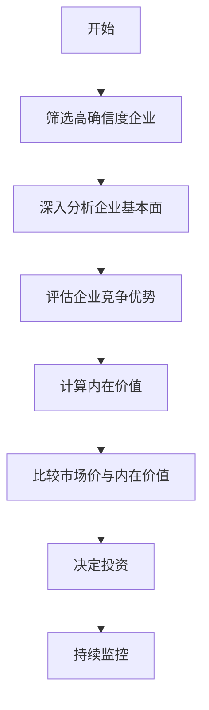
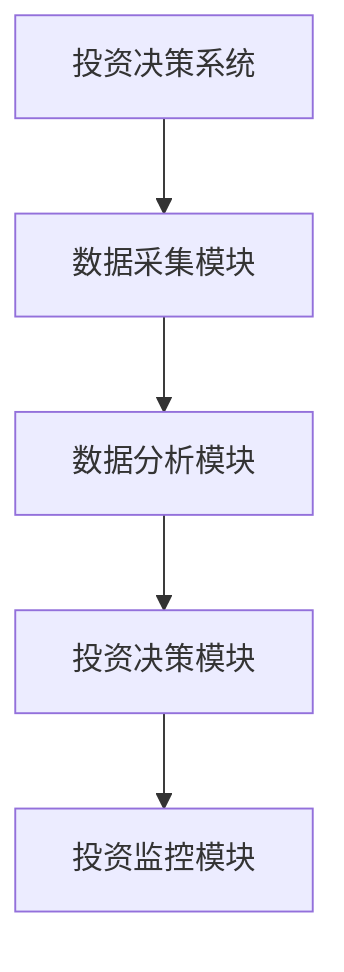

                 


# 巴菲特的集中投资策略：高确信度机会的重要性

## 关键词
集中投资，巴菲特，高确信度，价值投资，风险管理，投资策略，长期回报

## 摘要
本文深入探讨巴菲特的集中投资策略，强调高确信度机会的重要性。文章从背景介绍、核心概念、算法原理、系统分析、项目实战和最佳实践等多个角度进行详细分析，帮助读者全面理解集中投资的策略和实施方法。通过实例分析和数学模型，文章展示了如何通过高确信度机会实现长期稳定的回报。

---

## 第一部分：背景介绍

### 1.1 集中投资策略的定义
集中投资是一种投资策略，强调将大部分资金投入到少数几只具有高确信度的股票中，以追求长期稳定的回报。与分散投资不同，集中投资更注重深度研究和长期持有的优质资产。

### 1.2 巴菲特的投资理念
巴菲特是价值投资的倡导者，他强调购买具有持续竞争优势、良好管理和强大财务状况的企业。他的投资策略基于对企业内在价值的深入分析，而非短期市场波动。

### 1.3 高确信度机会的重要性
高确信度机会是指那些经过严格分析，具有显著竞争优势和长期增长潜力的企业。集中投资通过将资金集中在少数高确信度机会上，能够在长期实现更高的回报。

---

## 第二部分：核心概念与联系

### 2.1 高确信度机会的定义
高确信度机会是指那些在行业内具有显著竞争优势、财务状况稳健、管理团队优秀的企业。这些企业在市场波动中能够保持稳定增长，为投资者带来超额回报。

### 2.2 核心概念对比表格
以下是高确信度机会与非高确信度机会的对比：

| 属性                | 高确信度机会                   | 非高确信度机会                 |
|---------------------|-------------------------------|-------------------------------|
| 企业竞争优势        | 显著，行业领先                | 不明显或较弱                  |
| 财务状况            | 稳健，现金流充足              | 财务不稳定或负债较高          |
| 管理团队            | 经验丰富，能力强              | 管理能力一般或团队不稳定      |
| 长期增长潜力        | 高，市场地位稳固              | 低，行业竞争激烈或增长受限    |

### 2.3 实体关系图
以下是一个简单的ER实体关系图，展示高确信度机会的核心要素：

```mermaid
er
actor 高确信度机会 {
    attribute 企业竞争优势
    attribute 财务状况
    attribute 管理团队
    attribute 长期增长潜力
}
```

---

## 第三部分：算法原理

### 3.1 投资决策流程
以下是集中投资的决策流程：



### 3.2 多因子筛选模型
以下是用于筛选高确信度机会的多因子模型：

```python
import pandas as pd
import numpy as np

def calculate_intrinsic_value(financial_data):
    # 计算内在价值
    roe = financial_data['ROE']
    growth_rate = financial_data['增长率']
    return (roe * (1 + growth_rate)) / (0.1 * (1 - 0.1))

def screen_high_confidence_stocks(tickers):
    high_confidence = []
    for ticker in tickers:
        data = get_financial_data(ticker)
        iv = calculate_intrinsic_value(data)
        if iv > data['股价']:
            high_confidence.append(ticker)
    return high_confidence

# 示例
tickers = ['AAPL', 'MSFT', 'GOOGL']
high_confidence = screen_high_confidence_stocks(tickers)
print(high_confidence)
```

### 3.3 数学模型
以下是夏普比率的计算公式，用于衡量投资组合的风险调整后收益：

$$ \text{夏普比率} = \frac{\text{投资组合收益} - \text{无风险利率}}{\text{投资组合收益的标准差}} $$

---

## 第四部分：系统分析

### 4.1 系统架构
以下是集中投资系统的架构图：



### 4.2 核心功能模块
- 数据采集模块：负责收集企业的财务数据和市场数据。
- 数据分析模块：对数据进行清洗、分析和建模。
- 投资决策模块：根据分析结果生成投资建议。
- 投资监控模块：实时监控投资组合的表现并进行调整。

### 4.3 接口设计
以下是系统的主要接口：

- 数据接口：从第三方数据源获取数据。
- 分析接口：调用数据分析模块进行计算。
- 决策接口：生成投资建议并通知执行系统。

---

## 第五部分：项目实战

### 5.1 环境安装
安装必要的Python库：

```bash
pip install pandas numpy matplotlib
```

### 5.2 核心代码实现
以下是集中投资策略的实现代码：

```python
import pandas as pd
import numpy as np

def calculate_intrinsic_value(financial_data):
    roe = financial_data['ROE']
    growth_rate = financial_data['增长率']
    return (roe * (1 + growth_rate)) / (0.1 * (1 - 0.1))

def screen_high_confidence_stocks(tickers):
    high_confidence = []
    for ticker in tickers:
        data = get_financial_data(ticker)
        iv = calculate_intrinsic_value(data)
        if iv > data['股价']:
            high_confidence.append(ticker)
    return high_confidence

# 示例
tickers = ['AAPL', 'MSFT', 'GOOGL']
high_confidence = screen_high_confidence_stocks(tickers)
print(high_confidence)
```

### 5.3 案例分析
以苹果公司为例，分析其是否为高确信度机会：

- 苹果公司在技术创新和市场占有率方面具有显著优势。
- 公司财务状况稳健，现金流充足。
- 管理团队经验丰富，长期增长潜力大。

---

## 第六部分：最佳实践

### 6.1 心态调整
集中投资需要耐心和纪律，避免被短期市场波动干扰。

### 6.2 知识储备
持续学习财务分析和投资理论，提高对企业基本面的判断能力。

### 6.3 持续优化
定期评估投资组合，根据市场变化进行适当调整。

---

## 总结

巴菲特的集中投资策略强调高确信度机会的重要性。通过深入分析企业的基本面和竞争优势，投资者可以构建一个稳健的投资组合，实现长期稳定的回报。本文通过理论分析、算法实现和案例研究，为读者提供了全面的指导。

---

## 作者
作者：AI天才研究院 & 禅与计算机程序设计艺术

---

通过本文，读者可以深入了解巴菲特的集中投资策略，并在实际操作中应用这些方法，以实现投资目标。

