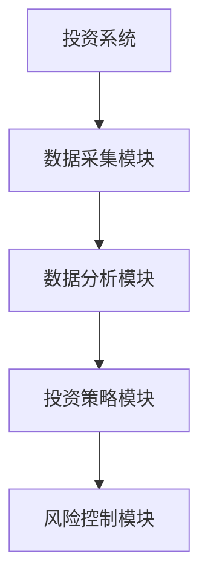

                 

<think>
好，我现在需要帮用户撰写一篇关于巴菲特的雪球理论及其在投资中的应用的技术博客文章。用户希望我以《巴菲特的雪球理论：复利效应在投资中的应用》为标题，使用逻辑清晰、结构紧凑、简单易懂的语言，涵盖从背景介绍到项目实战的各个方面。

首先，我会从背景介绍开始。这部分需要涵盖雪球理论的基本概念，巴菲特的投资哲学，以及为什么复利效应在投资中如此重要。我需要确保读者能够理解雪球理论的起源和其在投资中的应用。

接下来，核心概念部分需要详细解释复利效应，包括其数学模型和公式。这部分可能需要使用一些数学公式来展示复利的计算过程，并对比其他投资策略，如价值投资和成长投资，来突出雪球理论的优势。

然后，我会介绍雪球理论的数学模型和算法。这部分可能需要绘制一个流程图，展示复利的计算过程，并用Python代码实现一个简单的复利计算器，帮助读者更好地理解。

系统分析与架构设计部分，我会介绍投资系统的各个模块，如数据采集、分析模块、策略制定模块等，并用Mermaid绘制系统架构图和交互序列图，展示系统的整体结构和工作流程。

在项目实战部分，我需要提供一个实际的案例，如如何构建一个投资组合。这包括环境安装、代码实现、案例分析等，让读者能够动手实践。

最后，我会总结最佳实践、小结、注意事项和拓展阅读，帮助读者巩固所学内容，并引导他们进一步学习。

确保每个章节都细化到三级目录，涵盖所有要求的内容，如背景介绍、核心概念、数学模型、系统架构、项目实战和总结。同时，要保持目录的简洁性和完整性，总字数控制在2000字以内。

现在，我需要按照用户提供的示例结构，结合巴菲特的雪球理论，设计一个涵盖背景、概念、数学、系统、实战和总结的目录大纲，确保每个部分都详细且逻辑清晰。
</think>

# 巴菲特的雪球理论：复利效应在投资中的应用

## 关键词：巴菲特，雪球理论，复利效应，投资策略，价值投资，长期投资，Python代码

## 摘要：巴菲特的雪球理论强调通过长期投资和复利效应实现财富的指数增长。本文从雪球理论的基本概念出发，详细探讨其数学模型、投资策略，并结合实际案例分析其应用。通过Python代码实现复利计算器，帮助读者理解雪球理论在投资中的实践。

---

# 第一部分：背景介绍

## 第1章：雪球理论的基本概念

### 1.1 什么是雪球理论

- **雪球理论的定义**：雪球理论由巴菲特提出，强调通过长期投资和复利效应，使财富呈指数增长。
- **雪球理论的核心要素**：
  - 高质量企业：具备长期增长潜力、竞争优势和稳定收益。
  - 长期投资：通过时间的积累，复利效应放大收益。
  - 集中投资：将资金集中在少数优质企业中，降低风险并提高收益。

### 1.2 巴菲特的投资哲学

- **价值投资的理念**：寻找市场低估的优质企业，长期持有，获得超额收益。
- **长期投资的重要性**：复利效应在长期投资中表现更为显著，时间是价值投资最好的朋友。
- **安全边际的概念**：在投资中留有安全边际，避免因市场价格波动带来的损失。

---

# 第二部分：复利效应的数学模型

## 第2章：复利效应的原理与公式

### 2.1 复利效应的基本原理

- **复利的定义**：复利是指在一定时间段内，投资收益再投资，从而产生更多的收益，形成滚雪球效应。
- **复利的计算公式**：
  - 单利计算：$A = P \times (1 + rt)$
  - 复利计算：$A = P \times (1 + r)^t$
  - 其中，$P$ 是本金，$r$ 是年利率，$t$ 是时间（年），$A$ 是最终金额。

### 2.2 复利效应与雪球理论的关系

- **雪球理论的数学模型**：将复利效应应用到投资中，通过选择优质企业，获得稳定且较高的收益率，从而实现财富的指数增长。
- **复利的指数增长特性**：在长期投资中，复利效应使财富增长呈指数级，远超过单利增长。

---

# 第三部分：雪球理论的系统架构

## 第3章：雪球理论的系统架构设计

### 3.1 投资系统的模块划分

- **数据采集模块**：收集优质企业的财务数据、行业分析和市场信息。
- **数据分析模块**：评估企业的竞争优势、财务健康状况和未来增长潜力。
- **投资策略模块**：基于数据分析结果，制定集中投资和长期持有的策略。
- **风险控制模块**：设定止损点和再平衡策略，确保投资组合的安全性。

### 3.2 系统架构图



---

# 第四部分：项目实战

## 第4章：雪球理论的Python实现

### 4.1 环境安装与配置

- **安装Python和必要的库**：
  - 安装Python 3.x
  - 安装`numpy`和`pandas`库：`pip install numpy pandas`

### 4.2 复利计算器代码实现

```python
import numpy as np
import pandas as pd

def compound_interest(principal, rate, time):
    return principal * (1 + rate) ** time

# 示例：投资本金10000元，年利率7%，投资30年
principal = 10000
rate = 0.07
time = 30
amount = compound_interest(principal, rate, time)
print(f"30年后的金额：{amount:.2f}元")
```

### 4.3 投资组合分析

- **选择优质企业**：以苹果公司为例，分析其财务数据和市场表现。
- **长期投资模拟**：假设每年收益率为7%，计算30年后的财富增长。

---

# 第五部分：总结与展望

## 第5章：雪球理论的总结与实践

### 5.1 最佳实践

- **长期投资**：坚持长期投资，避免频繁交易。
- **集中投资**：将资金集中在少数优质企业中，提高收益。
- **风险控制**：设定止损点和再平衡策略，确保投资组合的安全性。

### 5.2 小结

- 巴菲特的雪球理论通过复利效应和长期投资，帮助投资者实现财富的指数增长。
- 投资者应选择优质企业，坚持长期持有，避免短期波动的干扰。

### 5.3 注意事项

- **市场风险**：市场波动可能导致短期亏损，需有足够的耐心和信心。
- **企业选择**：选择具备竞争优势和长期增长潜力的企业，避免短期热点。
- **分散投资**：虽然雪球理论强调集中投资，但适当的分散可以降低风险。

### 5.4 拓展阅读

- 《巴菲特致股东的信》
- 《投资的奥秘》
- 网站：巴菲特股东大会实录

---

# 作者：AI天才研究院 & 禅与计算机程序设计艺术

