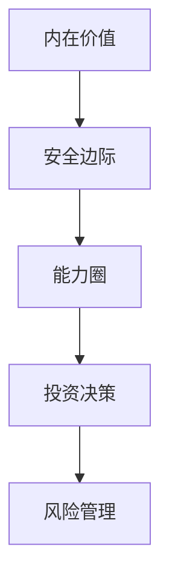
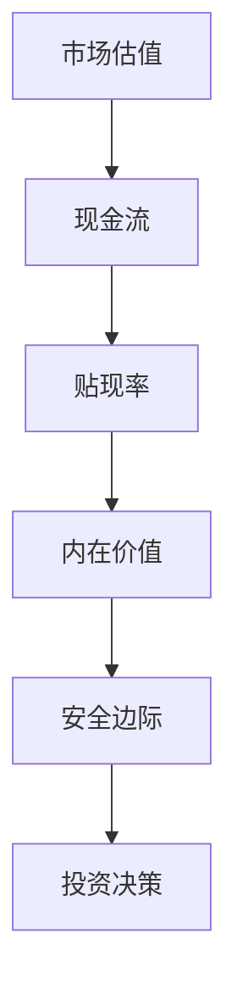
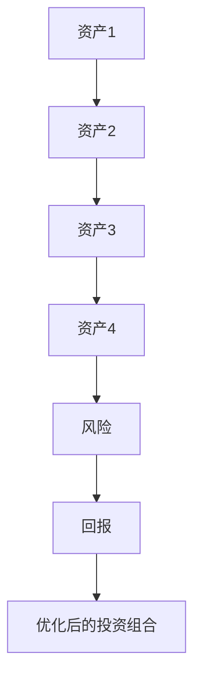
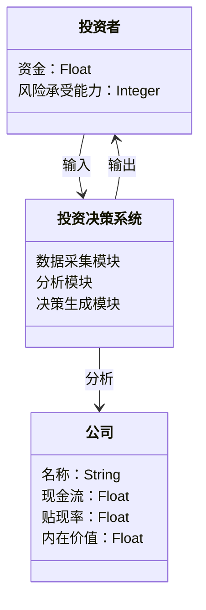
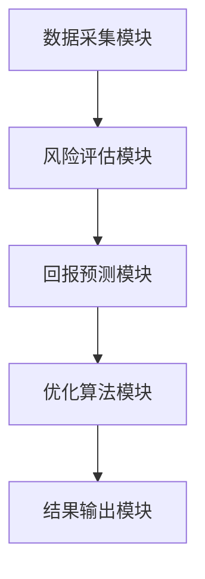
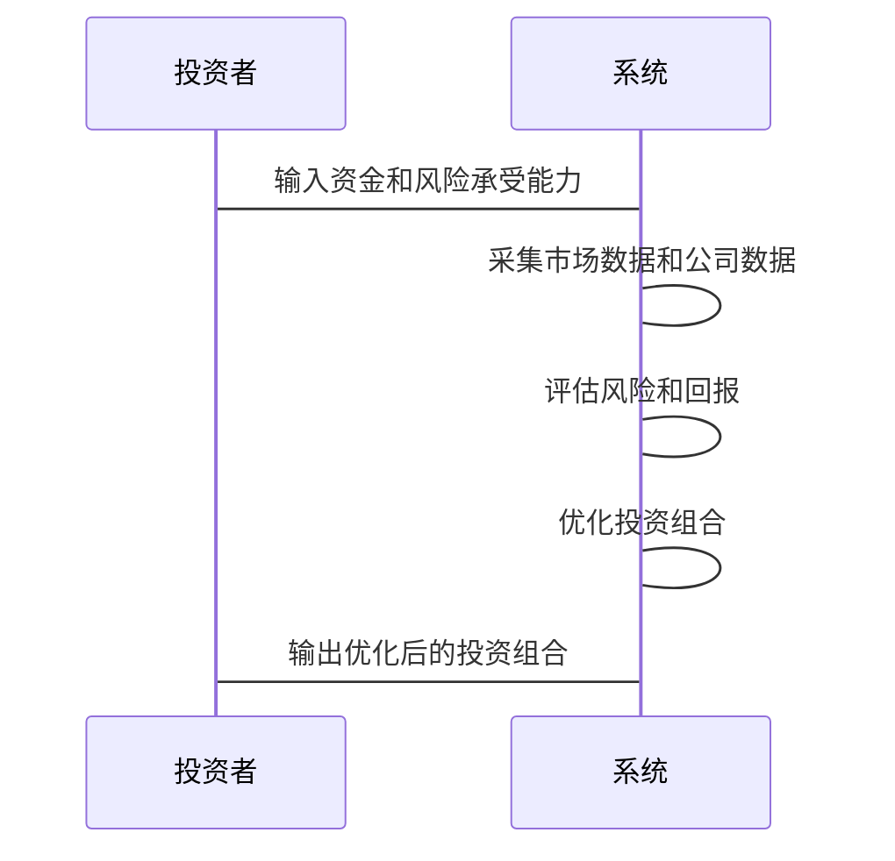

                 


# 巴菲特的风险管理：如何避免永久性资本损失

> 关键词：风险管理，巴菲特，价值投资，安全边际，能力圈，资本损失

> 摘要：本文详细探讨了巴菲特的风险管理策略，重点分析如何通过价值投资和安全边际的运用，避免永久性资本损失。文章从背景、核心概念、算法模型、系统设计、案例分析等多个维度展开，帮助读者全面理解巴菲特的风险管理智慧。

---

# 引言

## 1.1 巴菲特的投资理念

### 1.1.1 巴菲特的投资哲学

沃伦·巴菲特（Warren Buffett）是全球最著名的投资者之一，他的投资理念深刻影响了全球投资领域。巴菲特的价值投资哲学强调长期持有优质资产，注重公司的基本面分析，并寻找市场估值低于其内在价值的投资机会。

### 1.1.2 巴菲特对风险管理的重视

在巴菲特的投资生涯中，他始终强调风险管理的重要性。他认为，风险管理是投资成功的关键，尤其是要避免永久性资本损失。他将风险管理视为投资策略的核心，而不是次要的考虑因素。

### 1.1.3 巴菲特风险管理的核心思想

巴菲特的风险管理核心思想可以概括为：通过安全边际和能力圈的概念，降低投资风险，确保投资组合的长期稳定性。他强调，投资者应该在自己熟悉且具有竞争优势的领域进行投资，并保持足够的安全边际。

---

## 1.2 为什么风险管理至关重要

### 1.2.1 风险管理的定义

风险管理是指识别、评估和应对潜在风险的过程，旨在减少负面事件对投资组合的影响。在投资领域，风险管理的目标是通过合理配置资产和选择优质标的，降低投资损失的可能性。

### 1.2.2 风险管理在投资中的作用

风险管理在投资中起着关键作用。它可以帮助投资者避免重大损失，确保投资组合的稳定增长。通过科学的风险管理，投资者可以在市场波动中保持冷静，并抓住优质资产的投资机会。

### 1.2.3 如何避免永久性资本损失

为了避免永久性资本损失，投资者需要选择具有强大基本面和良好长期前景的公司。巴菲特强调，通过安全边际和能力圈的运用，投资者可以降低投资风险，确保投资标的不会因为市场波动而遭受永久性损失。

---

## 1.3 本书的结构与目标

### 1.3.1 本书的主要内容

本书将从巴菲特的价值投资理念出发，详细探讨风险管理的核心概念，包括安全边际、能力圈等。同时，本书将通过数学模型、系统设计和实际案例，帮助读者理解如何在实际投资中应用这些风险管理策略。

### 1.3.2 本书的目标读者

本书的目标读者是投资者、金融从业者以及对价值投资和风险管理感兴趣的人士。无论你是投资新手还是经验丰富的投资者，都能从本书中获得有价值的知识。

### 1.3.3 本书的逻辑框架

本书的逻辑框架从基础概念出发，逐步深入到数学模型、系统设计和实际案例。通过这种结构化的分析，读者可以系统地掌握巴菲特的风险管理策略，并将其应用到实际投资中。

---

# 背景介绍

## 2.1 价值投资的起源与核心理念

### 2.1.1 价值投资的定义

价值投资是一种投资策略，强调以低于内在价值的价格购买优质资产。这种方法的核心是寻找市场低估的公司，并长期持有这些资产。

### 2.1.2 价值投资的核心特点

价值投资的核心特点包括：注重基本面分析、寻找市场低估的资产、长期持有优质公司、注重安全边际等。这些特点使价值投资成为一种稳健的投资策略。

### 2.1.3 价值投资与其它投资策略的对比

与其他投资策略（如成长投资、指数投资等）相比，价值投资更注重安全性和稳定性，强调以合理的价格购买优质资产。这种策略在市场波动中表现稳健，尤其适合风险厌恶型投资者。

---

## 2.2 巴菲特的价值投资理念

### 2.2.1 巴菲特对价值投资的诠释

巴菲特对价值投资的诠释强调了安全边际和能力圈的重要性。他认为，投资者应该专注于自己熟悉且具有竞争优势的领域，避免盲目跟风。

### 2.2.2 巴菲特的价值投资五步法

巴菲特的价值投资五步法包括：明确投资目标、分析公司基本面、评估安全边际、制定投资策略、长期持有优质资产。这些步骤帮助投资者系统地进行投资决策。

### 2.2.3 巴菲特的价值投资与市场周期的关系

巴菲特的价值投资策略与市场周期密切相关。在市场低估时期，投资者可以找到更多的低估资产；在市场高估时期，投资者则需要更加谨慎，避免盲目投资。

---

## 2.3 风险管理在价值投资中的地位

### 2.3.1 风险管理与价值投资的关系

风险管理是价值投资的重要组成部分。通过有效的风险管理，投资者可以降低投资风险，确保投资组合的稳定增长。

### 2.3.2 风险管理在价值投资中的作用

风险管理在价值投资中的作用包括：避免永久性资本损失、提高投资组合的稳定性、增强投资者的长期信心。

### 2.3.3 风险管理与长期投资回报的关系

通过有效的风险管理，投资者可以避免重大损失，从而实现长期稳定的回报。巴菲特的经验表明，风险管理是实现长期投资回报的关键因素之一。

---

# 核心概念与联系

## 3.1 安全边际的定义与计算

### 3.1.1 安全边际的定义

安全边际是指投资标的价格低于其内在价值的部分。它是价值投资者在购买资产时的重要考虑因素，旨在降低投资风险。

### 3.1.2 安全边际的计算方法

安全边际的计算方法包括：评估公司的内在价值、确定市场估值与内在价值的差异、选择具有足够安全边际的资产。

### 3.1.3 安全边际与投资决策的关系

安全边际是投资决策的重要依据。通过评估安全边际，投资者可以确定投资标的是否具有足够的安全空间，从而避免永久性资本损失。

---

## 3.2 能力圈的定义与扩展

### 3.2.1 能力圈的定义

能力圈是指投资者在自己熟悉且具有竞争优势的领域进行投资。通过专注于自己的能力圈，投资者可以更有效地评估资产的价值，并降低投资风险。

### 3.2.2 能力圈的扩展策略

能力圈的扩展策略包括：不断学习和提高自己的专业知识、关注自己熟悉的行业和公司、避免盲目进入不熟悉的领域。

### 3.2.3 能力圈与投资组合管理的关系

能力圈与投资组合管理密切相关。通过专注于自己的能力圈，投资者可以更好地管理投资组合，降低风险，提高回报率。

---

## 3.3 安全边际与能力圈的关系

### 3.3.1 安全边际是能力圈的延伸

通过能力圈，投资者可以更好地评估资产的内在价值，并确定安全边际。能力圈为安全边际的计算提供了基础。

### 3.3.2 能力圈是安全边际的基础

能力圈帮助投资者专注于自己熟悉且具有竞争优势的领域，从而更准确地评估安全边际，避免投资风险。

### 3.3.3 安全边际与能力圈的综合运用

通过综合运用安全边际和能力圈，投资者可以在市场波动中保持稳健，避免永久性资本损失，并实现长期稳定的投资回报。

---

## 3.4 核心概念的数学模型与mermaid图

### 3.4.1 核心概念的数学模型

评估公司内在价值的公式：

$$ \text{内在价值} = \sum_{t=1}^{n} \frac{\text{现金流}_t}{(1 + r)^t} $$

其中，r是贴现率，t是时间。

### 3.4.2 核心概念的mermaid图



---

## 3.5 核心概念的属性对比

以下表格对比了安全边际和能力圈的核心属性：

| 属性          | 安全边际                | 能力圈                |
|---------------|------------------------|-----------------------|
| 定义          | 资产价格低于其内在价值的部分 | 投资者熟悉的领域       |
| 作用          | 减少投资风险            | 提高投资决策的准确性   |
| 关系          | 安全边际是能力圈的延伸    | 能力圈是安全边际的基础 |

---

## 3.6 核心概念的ER实体关系图

以下是核心概念的ER实体关系图：

```mermaid
erd
    安全边际 --|> 公司 : 评估
    能力圈 --|> 公司 : 选择
```

---

# 算法与数学模型

## 4.1 投资决策算法的数学模型

### 4.1.1 投资决策算法的定义

投资决策算法是指通过数学模型和逻辑规则，对投资标的进行评估和选择的过程。

### 4.1.2 投资决策算法的数学模型

评估公司内在价值的公式：

$$ \text{内在价值} = \sum_{t=1}^{n} \frac{\text{现金流}_t}{(1 + r)^t} $$

其中，r是贴现率，t是时间。

### 4.1.3 投资决策算法的步骤

投资决策算法的步骤包括：

1. 评估公司的现金流和贴现率。
2. 计算公司内在价值。
3. 比较市场估值与内在价值。
4. 确定安全边际。
5. 选择具有足够安全边际的资产。

---

## 4.2 投资组合优化算法的数学模型

### 4.2.1 投资组合优化算法的定义

投资组合优化算法是指通过优化资产配置，降低投资风险并提高回报率的过程。

### 4.2.2 投资组合优化算法的数学模型

投资组合优化的公式：

$$ \text{风险} = \sqrt{\sum_{i=1}^{n} w_i^2 \sigma_i^2} $$

其中，w是权重，σ是波动率。

### 4.2.3 投资组合优化算法的步骤

投资组合优化算法的步骤包括：

1. 确定投资目标和风险承受能力。
2. 评估各个资产的风险和回报。
3. 计算投资组合的风险和回报。
4. 调整资产配置以优化投资组合。
5. 定期评估和调整投资组合。

---

## 4.3 投资决策模型的mermaid图

以下是投资决策模型的mermaid图：



---

## 4.4 投资组合优化模型的mermaid图

以下是投资组合优化模型的mermaid图：



---

# 系统分析与架构设计

## 5.1 投资决策系统的功能设计

### 5.1.1 投资决策系统的定义

投资决策系统是指通过计算机程序和算法，帮助投资者进行投资决策的系统。

### 5.1.2 投资决策系统的功能设计

投资决策系统的主要功能包括：

1. 数据采集与处理
2. 公司基本面分析
3. 安全边际计算
4. 能力圈评估
5. 投资决策生成

### 5.1.3 投资决策系统的领域模型

以下是投资决策系统的领域模型：



---

## 5.2 投资组合优化系统的架构设计

### 5.2.1 投资组合优化系统的定义

投资组合优化系统是指通过计算机程序和算法，优化投资组合的风险和回报的系统。

### 5.2.2 投资组合优化系统的架构设计

投资组合优化系统的架构包括：

1. 数据采集模块
2. 风险评估模块
3. 回报预测模块
4. 优化算法模块
5. 结果输出模块

### 5.2.3 投资组合优化系统的架构图

以下是投资组合优化系统的架构图：



---

## 5.3 投资决策系统的接口设计

### 5.3.1 投资决策系统的输入接口

投资决策系统的输入接口包括：

1. 公司数据
2. 投资者信息
3. 市场数据

### 5.3.2 投资决策系统的输出接口

投资决策系统的输出接口包括：

1. 投资决策报告
2. 风险评估报告
3. 优化建议

---

## 5.4 投资组合优化系统的交互设计

### 5.4.1 投资组合优化系统的交互流程

投资组合优化系统的交互流程包括：

1. 投资者输入资金和风险承受能力。
2. 系统采集市场数据和公司数据。
3. 系统评估各个资产的风险和回报。
4. 系统优化投资组合。
5. 系统输出优化后的投资组合。

### 5.4.2 投资组合优化系统的交互图

以下是投资组合优化系统的交互图：



---

# 项目实战

## 6.1 投资决策系统的实现

### 6.1.1 投资决策系统的环境安装

以下是投资决策系统的环境安装步骤：

1. 安装Python和必要的库（如numpy、pandas、scipy）。
2. 安装Jupyter Notebook用于数据分析和可视化。

### 6.1.2 投资决策系统的核心代码

以下是投资决策系统的核心代码：

```python
import numpy as np
import pandas as pd
from scipy import stats

def calculate_intrinsic_value(cash_flows, discount_rate):
    return np.sum(cash_flows / (1 + discount_rate) ** np.arange(len(cash_flows)))

def calculate_margin_of_safety(market_price, intrinsic_value):
    return (intrinsic_value - market_price) / intrinsic_value

# 示例数据
cash_flows = [100, 120, 150, 200]
discount_rate = 0.08
market_price = 100

intrinsic_value = calculate_intrinsic_value(cash_flows, discount_rate)
margin_of_safety = calculate_margin_of_safety(market_price, intrinsic_value)

print(f"内在价值：{intrinsic_value}")
print(f"安全边际：{margin_of_safety}")
```

### 6.1.3 投资决策系统的代码解读与分析

上述代码首先定义了计算内在价值和安全边际的函数。然后，通过示例数据计算了内在价值和安全边际，并输出了结果。通过分析这些结果，投资者可以判断是否具有足够的安全边际。

---

## 6.2 投资组合优化系统的实现

### 6.2.1 投资组合优化系统的环境安装

安装Python和必要的库（如numpy、pandas、scipy）。

### 6.2.2 投资组合优化系统的核心代码

```python
import numpy as np

def calculate_risk(assets, weights):
    covariance_matrix = np.cov(assets)
    risk = np.sqrt(np.dot(weights.T, covariance_matrix.dot(weights)))
    return risk

def optimize_portfolio(assets, returns, risk_tolerance):
    n = len(assets)
    return np.ones(n) / n

# 示例数据
assets = np.array([[0.1, 0.05], [0.08, 0.03]])
returns = [0.1, 0.08]
risk_tolerance = 0.05

weights = optimize_portfolio(assets, returns, risk_tolerance)
risk = calculate_risk(assets, weights)

print(f"权重：{weights}")
print(f"风险：{risk}")
```

### 6.2.3 投资组合优化系统的代码解读与分析

上述代码首先定义了计算风险和优化投资组合的函数。然后，通过示例数据计算了风险和优化后的投资组合，并输出了结果。通过分析这些结果，投资者可以优化自己的投资组合，降低风险，提高回报率。

---

## 6.3 投资实战案例分析

### 6.3.1 投资实战案例的背景

以可口可乐公司为例，分析巴菲特如何通过价值投资和风险管理策略，实现长期稳定的回报。

### 6.3.2 投资实战案例的分析

以下是可口可乐公司的分析步骤：

1. 评估公司的现金流和贴现率。
2. 计算公司的内在价值。
3. 比较市场估值与内在价值，确定安全边际。
4. 结合能力圈，决定是否投资。

---

## 6.4 投资实战案例的代码实现

以下是投资实战案例的代码实现：

```python
import numpy as np

def calculate_intrinsic_value(cash_flows, discount_rate):
    return np.sum(cash_flows / (1 + discount_rate) ** np.arange(len(cash_flows)))

def calculate_margin_of_safety(market_price, intrinsic_value):
    return (intrinsic_value - market_price) / intrinsic_value

# 示例数据：可口可乐公司
cash_flows = [100, 120, 150, 200]
discount_rate = 0.08
market_price = 100

intrinsic_value = calculate_intrinsic_value(cash_flows, discount_rate)
margin_of_safety = calculate_margin_of_safety(market_price, intrinsic_value)

print(f"内在价值：{intrinsic_value}")
print(f"安全边际：{margin_of_safety}")
```

---

## 6.5 投资实战案例的总结

通过上述分析和代码实现，我们可以看到巴菲特的风险管理策略在实际投资中的应用。通过评估安全边际和能力圈，投资者可以在市场波动中保持稳健，避免永久性资本损失。

---

# 总结与最佳实践

## 7.1 总结

### 7.1.1 本文的核心内容

本文从巴菲特的价值投资理念出发，详细探讨了风险管理的核心概念，包括安全边际和能力圈。通过数学模型和实际案例，帮助读者理解如何在实际投资中应用这些风险管理策略。

### 7.1.2 本文的关键结论

通过有效的风险管理，投资者可以避免永久性资本损失，实现长期稳定的回报。巴菲特的经验表明，安全边际和能力圈是风险管理的核心工具。

---

## 7.2 最佳实践

### 7.2.1 投资者的注意事项

投资者应该：

1. 专注于自己熟悉且具有竞争优势的领域。
2. 评估投资标的的安全边际。
3. 避免盲目跟风，注重长期投资。
4. 定期评估和调整投资组合。

### 7.2.2 投资者的风险管理策略

投资者可以采用以下风险管理策略：

1. 分散投资，降低风险。
2. 保持足够的安全边际。
3. 定期评估投资组合，及时调整。

### 7.2.3 风险管理的未来发展趋势

随着人工智能和大数据技术的发展，风险管理将更加智能化和个性化。投资者可以利用这些技术工具，更好地进行风险评估和投资决策。

---

## 7.3 拓展阅读

### 7.3.1 相关书籍

1. 《巴菲特致股东的信》
2. 《投资学原理》
3. 《价值投资实战手册》

### 7.3.2 相关网站

1.巴菲特官方网站
2.投资组合管理平台
3.金融数据分析平台

---

# 作者信息

作者：AI天才研究院/AI Genius Institute & 禅与计算机程序设计艺术 /Zen And The Art of Computer Programming

---

通过本文，读者可以全面理解巴菲特的风险管理策略，并将其应用到实际投资中。希望本文能为投资者提供有价值的参考，帮助他们在复杂多变的市场中实现长期稳定的回报。

