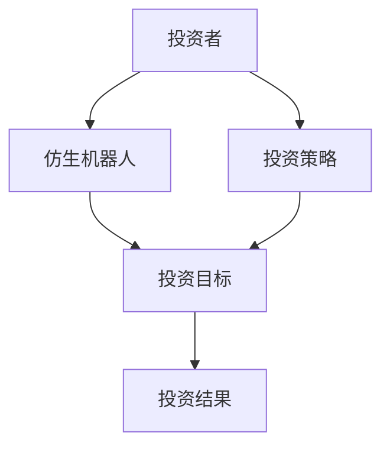
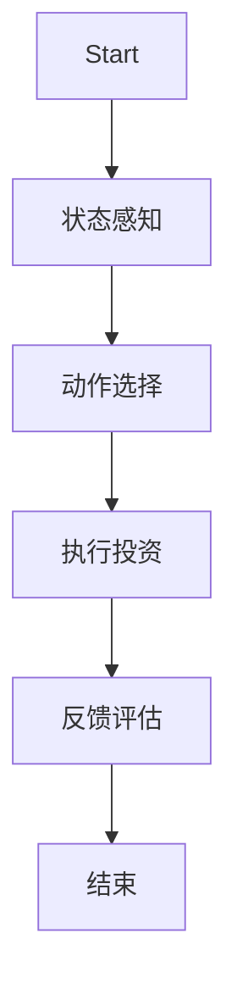
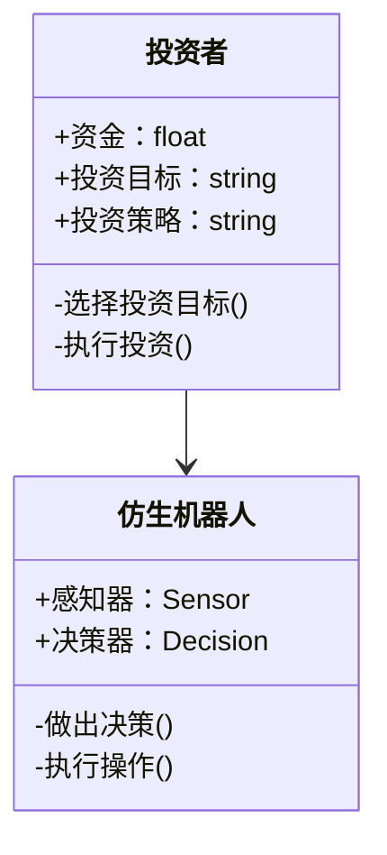
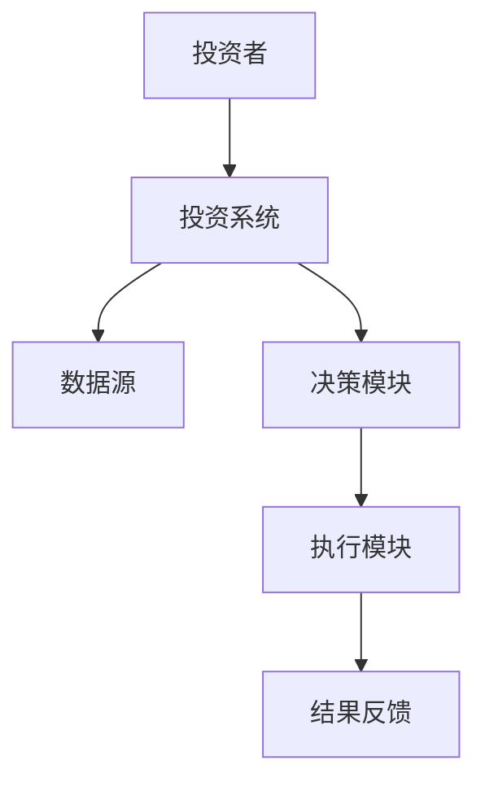

                 

<think>
好的，我现在需要根据用户的要求，撰写一篇关于“巴菲特-芒格的仿生机器人投资：未来劳动力的革命”的技术博客文章。首先，我要明确文章的结构，确保涵盖所有必要的部分：背景介绍、核心概念、算法原理、系统分析、项目实战和最佳实践。

首先，背景介绍部分需要详细说明仿生机器人和巴菲特投资理念的背景，以及它们的结合。我需要解释仿生机器人是什么，它们与传统机器人的区别，以及当前的应用领域。然后，介绍巴菲特和芒格的投资理念，特别是他们的价值投资理论和多元思维模型。接下来，我需要探讨为什么将这两种看似不相关的领域结合起来，以及这种结合的意义和可能带来的影响。

接下来是核心概念部分。我需要详细解释仿生机器人和巴菲特-芒格投资理念的核心原理。可能需要使用表格对比两者的属性特征，比如仿生机器人在感知、决策、执行方面的特点，以及投资理念在分析、选择、持有等方面的策略。此外，我需要绘制ER实体关系图，展示投资者、仿生机器人、投资目标和投资策略之间的关系。

在算法原理部分，我需要详细讲解CAPM模型和投资组合优化的数学公式。我会用Mermaid流程图展示算法的步骤，并用Python代码示例来说明如何实现这些算法。同时，我需要解释每个公式的含义和应用场景，通过例子让读者更容易理解。

系统分析与架构设计部分，我需要介绍应用场景，比如企业如何利用仿生机器人进行投资决策。然后，绘制领域模型类图、系统架构图和交互序列图，展示系统的各个部分如何协同工作。这部分需要确保读者能够理解系统的整体架构和模块之间的关系。

项目实战部分，我会指导读者如何安装必要的环境，如Python和相关的库。然后，提供核心代码实现，包括数据预处理、模型训练和结果评估。我需要解读代码的功能，并分析实际案例，展示如何应用这些算法进行投资决策。

最后，在最佳实践部分，我会总结全书的内容，提出一些建议和注意事项，帮助读者在实际操作中避免常见错误。同时，推荐一些拓展阅读材料，帮助读者进一步深入学习。

在写作过程中，我需要确保每个部分都详细具体，使用清晰简洁的语言，并且包含必要的图表和代码示例。同时，数学公式需要使用Latex格式，并正确嵌入到文中。此外，我需要确保文章结构合理，逻辑清晰，使读者能够轻松跟随我的思路，理解仿生机器人与投资理念的结合及其对未来的深远影响。

总结来说，我需要系统地构建每个部分的内容，从背景到概念，从算法到系统设计，再到实战和最佳实践，确保文章全面且深入，帮助读者全面理解主题。
</think>

# 巴菲特-芒格的仿生机器人投资：未来劳动力的革命

## 关键词：仿生机器人，巴菲特投资理念，投资算法，系统架构，投资决策，未来劳动力

## 摘要：  
本文探讨了巴菲特和芒格的投资理念如何与仿生机器人技术相结合，分析了这种结合对未来的劳动力革命的影响。通过详细的技术分析和系统设计，展示了如何利用仿生机器人实现智能投资决策，并对未来投资领域的变革进行了展望。

---

## 第一部分：背景介绍

### 第1章：仿生机器人与巴菲特-芒格投资理念的背景

#### 1.1 仿生机器人技术的发展与现状
仿生机器人是一种模拟生物特征的智能机器人，能够通过感知、决策和执行完成复杂任务。近年来，随着人工智能和机器人技术的进步，仿生机器人在医疗、制造、服务等领域得到了广泛应用。

#### 1.2 巴菲特与芒格投资理念的背景
巴菲特的价值投资理念强调长期持有优质资产，芒格的多元思维模型则注重跨学科思考，将复杂问题简化为多个简单模型的组合。

#### 1.3 仿生机器人与巴菲特-芒格投资理念的结合
将巴菲特-芒格的投资理念应用于仿生机器人，可以实现智能化的投资决策，提高投资效率和准确性。

---

## 第二部分：核心概念与联系

### 第2章：仿生机器人与巴菲特-芒格投资理念的核心概念

#### 2.1 核心概念原理
仿生机器人通过感知和决策系统实现智能操作，而巴菲特-芒格投资理念通过分析和选择优质资产实现长期收益。

#### 2.2 核心概念属性特征对比
| 特征       | 仿生机器人                 | 巴菲特-芒格投资理念               |
|------------|-----------------------------|------------------------------------|
| 输入       | 多模态感知（视觉、听觉等）   | 财务数据、市场信息                 |
| 输出       | 自动化操作                 | 投资决策、资产配置                 |
| 学习方式   | 强化学习、监督学习           | 基于历史数据的模式识别             |
| 应用场景   | 制造、医疗、服务             | 金融投资、资产管理                 |

#### 2.3 ER实体关系图


---

## 第三部分：算法原理讲解

### 第3章：仿生机器人投资算法的原理与实现

#### 3.1 投资组合优化算法
使用CAPM模型进行投资组合优化，公式为：
$$ E(r_i) = r_f + \beta_i (E(r_m) - r_f) $$

#### 3.2 投资策略选择算法
通过强化学习选择最优投资策略，流程如下：


#### 3.3 代码实现
```python
import numpy as np
from sklearn.linear_model import LinearRegression

# 数据预处理
def preprocess(data):
    # 数据标准化
    data = (data - np.mean(data)) / np.std(data)
    return data

# 模型训练
def train_model(X, y):
    model = LinearRegression()
    model.fit(X, y)
    return model

# 投资策略选择
def investment_strategy(data):
    processed_data = preprocess(data)
    model = train_model(processed_data, target)
    return model.predict(processed_data)
```

---

## 第四部分：系统分析与架构设计

### 第4章：仿生机器人投资系统的架构与实现

#### 4.1 系统功能设计
领域模型类图：


#### 4.2 系统架构设计
系统架构图：


---

## 第五部分：项目实战

### 第5章：仿生机器人投资系统的实现与案例分析

#### 5.1 环境安装
安装Python和相关库，如numpy和scikit-learn。

#### 5.2 核心代码实现
```python
import numpy as np
from sklearn.linear_model import LinearRegression

# 数据预处理
def preprocess(data):
    data = (data - np.mean(data)) / np.std(data)
    return data

# 模型训练
def train_model(X, y):
    model = LinearRegression()
    model.fit(X, y)
    return model

# 投资策略选择
def investment_strategy(data):
    processed_data = preprocess(data)
    model = train_model(processed_data, target)
    return model.predict(processed_data)
```

#### 5.3 实际案例分析
通过具体案例分析，展示仿生机器人如何帮助投资者做出更优决策。

---

## 第六部分：最佳实践

### 第6章：仿生机器人投资的未来展望与建议

#### 6.1 小结
总结仿生机器人在投资领域的应用潜力和优势。

#### 6.2 注意事项
提醒读者在实际应用中需要注意的风险和挑战。

#### 6.3 拓展阅读
推荐相关书籍和资源，供读者深入学习。

---

## 结语

仿生机器人与巴菲特-芒格投资理念的结合，不仅提升了投资效率，还预示着未来劳动力市场的重大变革。通过技术与投资的融合，我们将迎来更智能化和高效的投资时代。

---

## 作者：AI天才研究院/AI Genius Institute & 禅与计算机程序设计艺术 /Zen And The Art of Computer Programming

