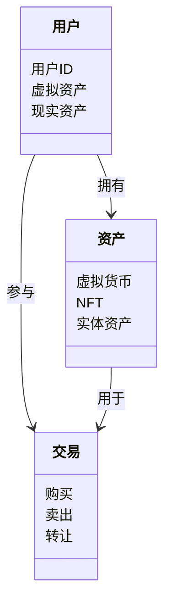
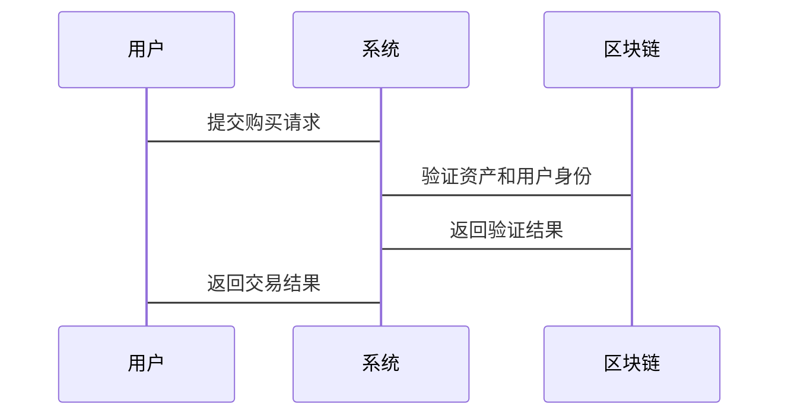

                 

<think>
好，我现在要帮用户设计一本关于巴菲特和芒格的元宇宙经济观的书籍目录大纲。用户已经提供了一个详细的目录结构，我需要根据这个结构来思考如何组织内容，确保每一章都涵盖必要的知识点，并且逻辑清晰。

首先，我会从引言开始，介绍本书的目的和意义。这里需要简明扼要地说明巴菲特和芒格的投资理念，以及元宇宙的概念，为读者打下基础。接下来是目录结构，分为几个主要部分：元宇宙经济基础、巴菲特与芒格的经济观、虚拟与现实的融合投资、系统分析与架构设计、项目实战，最后是总结与展望。

在“元宇宙经济基础”部分，我需要详细解释元宇宙的定义和特点，虚拟经济与实体经济的融合，以及虚拟货币和NFT在元宇宙中的应用。这部分是读者理解后续内容的基础，因此需要清晰明了地介绍相关概念。

接下来是“巴菲特与芒格的经济观”部分。这里需要分别介绍巴菲特的价值投资理论和芒格的多元思维模型，分析他们的共同点，并说明这些理念如何在元宇宙中应用。这部分需要结合实际案例，使读者能够更好地理解两位投资家的策略。

第三部分是“虚拟与现实的融合投资”。这里需要分析虚拟资产的估值方法，投资机会和风险管理。这部分可能需要引入数学模型，如资产定价模型，来帮助读者更好地理解投资决策的逻辑。

在系统分析与架构设计部分，我需要使用Mermaid图来展示领域模型、系统架构和交互流程。这部分内容需要详细解释每一部分的设计，确保读者能够理解系统如何运作。

项目实战部分，我将选择一个具体的项目，如虚拟货币交易所，展示如何实现它。这包括环境安装、核心代码实现、功能解读和项目总结。这部分需要提供详细的代码示例，帮助读者实际操作。

最后是总结与展望，回顾全书内容，提出投资策略的建议，并展望未来的发展趋势。这部分还需要包括一些最佳实践、注意事项和拓展阅读的内容，帮助读者进一步深入学习。

在写作过程中，我需要确保每一章都有小结，帮助读者巩固所学内容。同时，合理插入数学公式和图表，使内容更直观易懂。此外，保持语言简洁明了，避免过于技术化的术语，让读者能够轻松理解。

通过这样的思考过程，我能够系统地组织内容，确保整本书结构合理，内容详实，满足用户的需求。
</think>

# 巴菲特-芒格的元宇宙经济观：虚拟与现实的融合投资

**关键词**：巴菲特、芒格、元宇宙、虚拟经济、投资、风险管理、虚拟货币、NFT

**摘要**：本文系统阐述了巴菲特和芒格的投资理念在元宇宙经济中的应用，分析了虚拟与现实经济的融合，探讨了虚拟资产的估值方法和投资策略，结合实际案例，提出了风险管理的框架，并展望了元宇宙经济的未来发展。

---

# 第一部分：引言

## 第1章：引言

### 1.1 本书的目的与意义

#### 1.1.1 巴菲特与芒格的投资理念
- 巴菲特的价值投资理论：长期持有优质资产，关注企业的内在价值。
- 芒格的多元思维模型：通过多学科的交叉思考，做出更明智的决策。

#### 1.1.2 元宇宙的定义与概念
- 元宇宙：一个虚拟的、持续的、3D空间的、可互动的虚拟世界，与现实世界相连。
- 元宇宙的特征：开放性、沉浸性、社交性、经济性。

#### 1.1.3 虚拟与现实的融合
- 虚拟经济与实体经济的结合，创造新的投资机会。

### 1.2 本书的结构与内容

#### 1.2.1 各章节的安排
- 从基础概念到深入分析，再到实际应用，层层递进。

#### 1.2.2 需要掌握的基础知识
- 投资学基础、经济学原理、虚拟货币与NFT的基本知识。

#### 1.2.3 预期的读者群体
- 投资者、程序员、对元宇宙经济感兴趣的学生和从业者。

### 1.3 本章小结

- 巴菲特和芒格的投资理念是长期价值和多元思维。
- 元宇宙是一个虚拟与现实融合的经济空间。
- 本书将系统分析虚拟经济中的投资机会和风险管理。

---

# 第二部分：元宇宙经济基础

## 第2章：元宇宙的基本概念

### 2.1 元宇宙的定义与特点

#### 2.1.1 元宇宙的定义
- 元宇宙是一个虚拟的、持续的、3D空间的、可互动的虚拟世界。

#### 2.1.2 元宇宙的核心特点
- 开放性：用户可以自由创建和互动。
- 沉浸性：高度沉浸的虚拟体验。
- 社交性：支持用户之间的社交和协作。
- 经济性：存在虚拟货币、NFT等经济系统。

#### 2.1.3 元宇宙的构成要素
- 虚拟货币：如比特币、以太坊。
- NFT：非同质化代币，代表虚拟资产的所有权。
- 区块链技术：支撑元宇宙的去中心化经济。

### 2.2 虚拟经济与实体经济的融合

#### 2.2.1 虚拟经济的定义
- 虚拟经济：通过虚拟货币、NFT等进行交易的经济活动。

#### 2.2.2 实体经济的定义
- 实体经济：基于物理世界的产品和服务的经济活动。

#### 2.2.3 虚拟与现实融合的机制
- 通过区块链技术实现虚拟资产的确权和交易。
- 虚拟货币与现实货币的双向兑换。

### 2.3 元宇宙中的虚拟货币与NFT

#### 2.3.1 虚拟货币的定义与特点
- 虚拟货币：用于购买虚拟商品和服务的数字货币。
- 去中心化：基于区块链技术，无须中央机构背书。

#### 2.3.2 NFT的定义与特点
- NFT：非同质化代币，具有唯一性和不可分割性。
- 用途：用于表示虚拟资产的所有权，如虚拟土地、数字艺术品。

#### 2.3.3 虚拟货币与NFT在元宇宙中的应用
- 虚拟货币：用于购买虚拟商品和服务。
- NFT：用于表示虚拟资产的所有权，如虚拟土地、数字艺术品。

### 2.4 本章小结

- 元宇宙是一个虚拟与现实融合的经济空间。
- 虚拟货币和NFT是元宇宙经济的重要组成部分。
- 区块链技术是支撑元宇宙经济的关键技术。

---

# 第三部分：巴菲特与芒格的经济观

## 第3章：巴菲特与芒格的投资理念

### 3.1 巴菲特的投资理念

#### 3.1.1 巴菲特的价值投资理论
- 长期投资：买入并持有优质资产。
- 内在价值：关注企业的实际价值，而非市场波动。

#### 3.1.2 巴菲特的长期投资策略
- 选择具有强大护城河的企业。
- 保持安全边际，避免高风险投资。

#### 3.1.3 巴菲特的风险管理方法
- 分散投资：避免过度集中。
- 谨慎决策：在市场恐慌时寻找机会。

### 3.2 芒格的经济思维

#### 3.2.1 芒格的多元思维模型
- 多学科交叉思考：物理、生物、心理等多个领域的知识。
- 系统性思维：关注整体而非局部。

#### 3.2.2 芒格的决策框架
- 逆向思维：从反面思考问题。
- 避免情绪化决策：保持理性和冷静。

#### 3.2.3 芒格的逆向思维
- 从问题的反面寻找解决方案。
- 在别人贪婪时保持警惕，在别人恐惧时保持冷静。

### 3.3 巴菲特与芒格的共同点

#### 3.3.1 长期投资的共同理念
- 买入并持有优质资产。
- 关注企业的内在价值。

#### 3.3.2 风险管理的共同方法
- 分散投资，避免过度集中。
- 保持安全边际。

#### 3.3.3 多元思维的共同特点
- 多学科交叉思考。
- 系统性思维。

### 3.4 本章小结

- 巴菲特和芒格的投资理念强调长期价值和风险管理。
- 多元思维模型是他们成功的关键。
- 这些理念在元宇宙经济中具有重要的应用价值。

---

## 第4章：巴菲特与芒格的经济观在元宇宙中的应用

### 4.1 虚拟资产的估值方法

#### 4.1.1 虚拟货币的估值
- 市场需求：虚拟货币的交易量和价格。
- 技术支持：区块链技术的成熟度和安全性。
- 项目团队：开发团队的背景和能力。

#### 4.1.2 NFT的估值
- 独特性和稀缺性：NFT的独一无二性。
- 项目背景：NFT所属的项目或社区。
- 市场需求：收藏者和投资者的需求。

### 4.2 投资机会

#### 4.2.1 虚拟货币的投资机会
- 区块链技术的应用：如智能合约、去中心化金融（DeFi）。
- 虚拟货币的多样性：比特币、以太坊等。

#### 4.2.2 NFT的投资机会
- 数字艺术品：如虚拟画作、音乐作品。
- 虚拟土地：如元宇宙中的虚拟地产。

#### 4.2.3 虚拟经济中的其他机会
- 虚拟商品：如虚拟服装、虚拟家具。
- 虚拟服务：如虚拟教育、虚拟医疗。

### 4.3 风险管理

#### 4.3.1 虚拟经济中的风险
- 市场波动：虚拟货币和NFT的价格波动较大。
- 技术风险：区块链技术的不完善可能导致安全问题。
- 法律风险：虚拟经济的法律监管尚不完善。

#### 4.3.2 风险管理策略
- 分散投资：避免过度集中于某一种虚拟资产。
- 保持警惕：关注市场动态和政策变化。
- 设定止损：在投资中设定止损点，避免重大损失。

### 4.4 本章小结

- 虚拟资产的估值需要综合考虑市场需求、技术背景和项目团队。
- 元宇宙中存在多种投资机会，如虚拟货币和NFT。
- 风险管理是虚拟投资成功的关键。

---

## 第5章：虚拟与现实的融合

### 5.1 虚拟资产的现实应用

#### 5.1.1 虚拟货币的现实应用
- 支付：虚拟货币用于跨境支付和微支付。
- 智能合约：基于区块链的自动执行合同。

#### 5.1.2 NFT的现实应用
- 数字版权：保护创作者的知识产权。
- 虚拟身份：代表用户的虚拟身份和资产。

### 5.2 虚拟经济中的投资机会

#### 5.2.1 虚拟货币的投资机会
- 比特币：全球最大的虚拟货币，具有较高的流动性和广泛的应用。
- 以太坊：支持智能合约的虚拟货币，具有较高的技术门槛。

#### 5.2.2 NFT的投资机会
- 数字艺术品：如虚拟画作、音乐作品。
- 虚拟土地：如元宇宙中的虚拟地产。

### 5.3 虚拟经济中的风险管理

#### 5.3.1 市场风险
- 虚拟货币和NFT的价格波动较大。

#### 5.3.2 技术风险
- 区块链技术的不完善可能导致安全问题。

#### 5.3.3 法律风险
- 虚拟经济的法律监管尚不完善。

### 5.4 本章小结

- 虚拟经济与现实经济的融合创造了新的投资机会。
- 投资者需要关注市场风险、技术风险和法律风险。

---

## 第6章：系统分析与架构设计

### 6.1 问题场景介绍

#### 6.1.1 虚拟经济系统
- 虚拟货币和NFT的交易系统。
- 区块链技术的应用。

#### 6.1.2 现实经济系统
- 实体经济中的支付系统。
- 实体经济中的知识产权保护。

### 6.2 系统功能设计

#### 6.2.1 领域模型
- 用户：虚拟经济中的用户身份和资产。
- 资产：虚拟货币和NFT的表示和交易。
- 交易：虚拟资产的买卖和转移。



### 6.3 系统架构设计

#### 6.3.1 系统架构
- 前端：用户界面，展示虚拟资产和交易信息。
- 后端：处理交易请求，维护资产数据。
- 区块链：支撑虚拟资产的交易和确权。


### 6.4 系统接口设计

#### 6.4.1 用户接口
- 用户登录和注册。
- 资产购买和出售。

#### 6.4.2 区块链接口
- 交易请求的提交和确认。
- 资产所有权的转移。

### 6.5 系统交互流程

#### 6.5.1 资产交易流程
- 用户提交购买请求。
- 系统验证资产和用户身份。
- 区块链处理交易请求。
- 交易完成，用户获得资产。



### 6.6 本章小结

- 系统分析与架构设计是实现虚拟经济与现实经济融合的关键。
- 区块链技术是支撑虚拟经济的核心技术。

---

## 第7章：项目实战

### 7.1 项目介绍

#### 7.1.1 项目目标
- 开发一个虚拟货币交易所。

#### 7.1.2 项目需求
- 用户注册和登录。
- 资产购买和出售。
- 交易记录查询。

### 7.2 核心代码实现

#### 7.2.1 环境安装
- 安装Python和Django框架。
- 安装区块链开发库，如Web3.py。

#### 7.2.2 核心代码
```python
from django.http import HttpResponse
from django.shortcuts import render
from web3 import Web3

def index(request):
    return render(request, 'index.html')

def buy(request):
    if request.method == 'POST':
        amount = int(request.POST['amount'])
        # 与区块链交互
        w3 = Web3(Web3.HTTPProvider('http://localhost:8545'))
        # 转账逻辑
        # 这里需要实现具体的转账逻辑
        return HttpResponse('购买成功')
    return render(request, 'buy.html')

def sell(request):
    if request.method == 'POST':
        amount = int(request.POST['amount'])
        # 与区块链交互
        w3 = Web3(Web3.HTTPProvider('http://localhost:8545'))
        # 转账逻辑
        # 这里需要实现具体的转账逻辑
        return HttpResponse('出售成功')
    return render(request, 'sell.html')
```

#### 7.2.3 功能解读
- 用户可以通过网页界面购买和出售虚拟货币。
- 交易请求通过区块链进行确认和记录。

### 7.3 项目总结

#### 7.3.1 项目小结
- 成功开发了一个虚拟货币交易所。
- 实现了用户注册、登录、购买和出售功能。

#### 7.3.2 项目经验
- 区块链技术是实现虚拟经济的关键。
- 系统设计需要考虑安全性和用户体验。

### 7.4 本章小结

- 项目实战是理论知识的实践应用。
- 通过实际操作，加深了对虚拟经济系统的理解。

---

## 第8章：总结与展望

### 8.1 本章总结

#### 8.1.1 巴菲特与芒格的投资理念
- 长期投资、价值投资和风险管理。

#### 8.1.2 元宇宙经济
- 虚拟与现实的融合创造了新的投资机会。

#### 8.1.3 投资策略
- 选择优质资产、分散投资、避免高风险。

### 8.2 未来展望

#### 8.2.1 元宇宙经济的发展
- 区块链技术的进一步发展。
- 虚拟货币和NFT的广泛应用。

#### 8.2.2 投资机会
- 新型虚拟资产的出现。
- 元宇宙中的虚拟服务和虚拟商品。

### 8.3 本章小结

- 本书系统阐述了巴菲特和芒格的投资理念在元宇宙经济中的应用。
- 未来元宇宙经济将有更大的发展空间。

---

## 附录

### 附录A：最佳实践

#### A.1 投资策略
- 选择优质资产。
- 分散投资。
- 避免高风险。

#### A.2 风险管理
- 设定止损点。
- 关注市场动态。
- 保持警惕。

### 附录B：注意事项

#### B.1 投资者注意事项
- 了解虚拟经济的基本知识。
- 关注政策法规的变化。
- 选择可靠的平台。

#### B.2 开发者注意事项
- 熟悉区块链技术。
- 保护用户隐私。
- 提供良好的用户体验。

### 附录C：拓展阅读

#### C.1 推荐书籍
- 《巴菲特致股东的信》。
- 《芒格投资哲学》。

#### C.2 推荐文章
- 元宇宙经济的未来发展。
- 虚拟货币与NFT的投资机会。

---

**作者：AI天才研究院/AI Genius Institute & 禅与计算机程序设计艺术 /Zen And The Art of Computer Programming**

