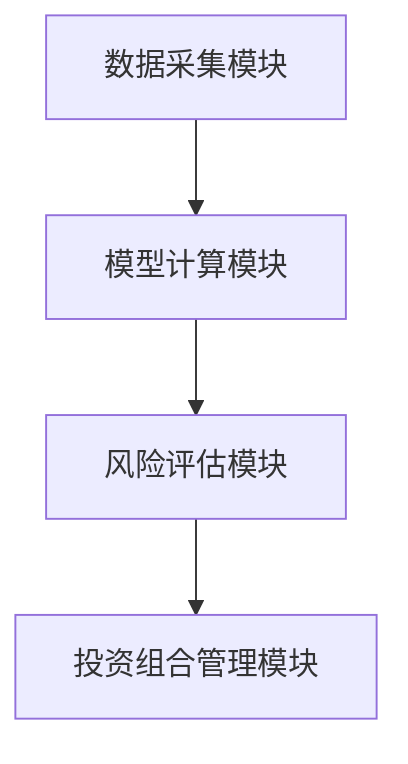
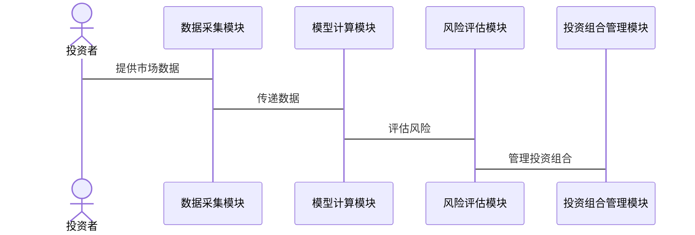

                 

<think>
好的，我需要按照用户的要求撰写一篇关于《巴菲特-芒格的全球化投资视野：跨国界寻找机会》的技术博客文章。用户提供了非常详细的结构和内容要求，我需要仔细分析并逐步完成。

首先，我得确保文章符合格式要求，包括标题、关键词、摘要，然后按照目录大纲来写正文，每个部分都要详细展开。特别是每个章节需要包含背景介绍、核心概念、算法原理、系统分析、项目实战和最佳实践等部分。

我需要使用技术语言，但要保持逻辑清晰，结构紧凑，语言简洁。同时，要包含mermaid图表、数学公式和代码示例，这需要我熟悉这些工具和技术。

开始时，我应该先写摘要，概述文章的核心内容和主题。接着是关键词，列出5-7个核心关键词。

接下来是正文部分。第一章介绍巴菲特和芒格的投资哲学，包括他们的背景、核心理念和全球化投资的背景。这里需要详细解释他们的投资理念，如何从本地扩展到全球，以及全球化带来的机会和挑战。

第二章详细讲解价值投资的核心原则，包括竞争优势分析、安全边际计算和长期视角。这部分需要详细分析每个原则，并给出具体的例子和图表来辅助说明。

第三章探讨全球化投资的策略与实践，分析不同地区的市场机会和风险管理。这里需要使用数据可视化工具展示不同市场的表现，并讨论风险管理策略。

第四章是跨国投资的案例分析，通过实际案例展示巴菲特和芒格的投资策略。这部分需要选择典型的案例，分析他们的决策过程和结果。

第五章分析投资算法，解释其数学原理，并给出代码实现。这里可能需要使用Python代码和数学公式，详细解释算法的原理和应用。

第六章设计投资系统架构，展示系统的各个模块和交互流程。需要使用mermaid图来设计系统的架构和交互序列。

第七章总结与展望，回顾全书内容，并展望未来投资的趋势。这部分需要强调巴菲特和芒格的投资理念的长期价值。

在撰写过程中，我需要确保每个部分都包含足够的细节，比如在第二章中，竞争优势分析部分，可能需要比较不同公司的竞争优势，使用表格或图表来展示。在数学公式部分，我需要正确使用latex格式，并在代码示例中给出具体的Python实现。

最后，我需要检查整个文章的结构是否连贯，内容是否全面，是否符合用户的要求。特别是要确保每个章节的小节都详细展开，避免遗漏任何重要部分。

总之，我需要一步步按照用户提供的结构和内容要求，详细撰写每篇文章部分，确保文章质量高，内容丰富，逻辑清晰。
</think>

```markdown
# 巴菲特-芒格的全球化投资视野：跨国界寻找机会

> 关键词：巴菲特，芒格，价值投资，全球化投资，投资策略，跨国界，投资案例，风险管理，投资算法，系统架构

> 摘要：本文深入探讨了巴菲特和芒格的投资哲学，分析了他们的价值投资理念在全球化背景下的应用。通过具体的跨国投资案例，展示了如何通过竞争优势分析和安全边际计算来寻找投资机会。文章还介绍了投资算法的数学模型和系统架构设计，为读者提供了在全球化市场中做出明智投资决策的工具和方法。

---

## 第一章：巴菲特与芒格的投资哲学概述

### 1.1 巴菲特与芒格的背景介绍

#### 1.1.1 巴菲特的投资理念
沃伦·巴菲特是全球最著名的投资者之一，他的投资理念以“价值投资”为核心。他强调购买具有持续竞争优势的企业，并长期持有这些企业，而不是频繁交易以赚取短期利润。

#### 1.1.2 芒格的多元思维模型
查理·芒格以其多元思维模型闻名，他认为投资者应该从多个学科的角度去理解问题，从而做出更全面的决策。这种思维方式帮助他在投资领域取得了巨大的成功。

#### 1.1.3 两人合作的投资哲学
巴菲特和芒格的合作基于相互尊重和互补的优势。巴菲特负责具体的股票分析和投资决策，而芒格则提供宏观的视角和多元的思维方式。

### 1.2 价值投资的核心概念

#### 1.2.1 价值投资的定义与特点
价值投资是一种以低于内在价值的价格购买优质股票的投资策略。其核心在于寻找市场先生的错误定价。

#### 1.2.2 安全边际的重要性
安全边际是价值投资中一个关键概念，它指的是买入价格与内在价值之间的差距。通过预留安全边际，投资者可以降低风险，确保在市场波动中不至于遭受重大损失。

#### 1.2.3 长期视角与复利效应
巴菲特强调长期投资和复利效应的重要性。通过长期持有优质股票，投资者可以最大化复利效应，实现财富的长期增长。

### 1.3 全球化投资的背景与意义

#### 1.3.1 全球经济一体化的现状
随着全球经济的不断发展，资本流动的全球化趋势日益明显。投资者可以通过跨国投资来分散风险，寻找更多的投资机会。

#### 1.3.2 跨国投资的机会与挑战
跨国投资为投资者提供了多样化的选择，但也带来了汇率风险、政治风险和文化差异等挑战。

#### 1.3.3 巴菲特与芒格的全球化视野
巴菲特和芒格的投资视野不仅局限于美国市场，他们也关注全球范围内的投资机会，尤其是那些具有强大竞争优势的企业。

---

## 第二章：价值投资的核心原则

### 2.1 竞争优势分析

#### 2.1.1 企业的核心竞争力
核心竞争力是企业在市场上长期生存和发展的关键。巴菲特和芒格注重选择那些具有强大护城河的企业。

#### 2.1.2 护城河的构建与评估
护城河是指企业抵御竞争对手的能力。常见的护城河包括成本优势、品牌优势、专利和技术优势等。

#### 2.1.3 行业地位与竞争优势
企业的行业地位直接影响其竞争优势。巴菲特和芒格倾向于选择行业龙头，因为这些企业通常具有更强的市场影响力和定价权。

### 2.2 安全边际的计算

#### 2.2.1 安全边际的定义
安全边际是买入价格与内在价值之间的差距。通过预留安全边际，投资者可以降低投资风险。

#### 2.2.2 估值方法与模型
价值投资者常用的估值方法包括市盈率、市净率、股息率等。其中，股息率模型是巴菲特常用的估值方法之一。

#### 2.2.3 安全边际的应用
在实际投资中，安全边际通过预留一定的折扣空间来实现。例如，如果一只股票的内在价值为100元，投资者可能会以80元的价格买入，预留20元的安全边际。

### 2.3 长期视角与投资决策

#### 2.3.1 长期投资的重要性
长期投资可以使投资者充分受益于复利效应，同时避免短期市场的波动干扰。

#### 2.3.2 市场波动与投资策略
市场波动是投资中的常客，但巴菲特和芒格认为市场波动是投资的机会，而不是风险。

#### 2.3.3 风险管理与投资组合
通过合理配置投资组合，投资者可以分散风险，降低单一投资的风险敞口。

---

## 第三章：全球化投资的策略与实践

### 3.1 全球市场分析

#### 3.1.1 主要市场的特点与机会
全球市场包括美国、欧洲、亚洲等主要市场。每个市场的特点和投资机会各不相同，例如亚洲市场的增长潜力和欧洲市场的稳定性。

#### 3.1.2 跨国公司的竞争优势
跨国公司通常具有全球化布局和强大的市场影响力。例如，苹果公司在全球市场的品牌影响力和销售网络就是其竞争优势的体现。

#### 3.1.3 地区性风险与应对策略
不同地区的政治、经济和文化差异带来了不同的投资风险。投资者需要通过深入研究和分散投资来应对这些风险。

### 3.2 跨国投资的案例分析

#### 3.2.1 苹果公司的投资案例
苹果公司作为一家典型的跨国公司，具有强大的品牌影响力和技术创新能力。巴菲特和芒格可能对其持有较高的评价。

#### 3.2.2 可口可乐公司的投资策略
可口可乐公司通过全球化布局和品牌建设，成为巴菲特的长期投资对象。

#### 3.2.3 亚马逊的全球扩张
亚马逊通过全球化战略迅速扩张，成为一家具有强大护城河的跨国公司。

### 3.3 投资组合的全球化配置

#### 3.3.1 资产配置的多元化
通过在全球范围内配置不同资产，投资者可以降低投资风险，同时抓住全球市场的机会。

#### 3.3.2 行业分布的均衡性
合理的行业分布可以确保投资组合的稳定性和增长潜力。例如，同时投资科技、消费、金融等多个行业。

#### 3.3.3 区域市场的权重分配
根据不同的市场潜力和风险，投资者可以调整不同区域市场的权重。例如，新兴市场的增长潜力较大，但风险也较高。

---

## 第四章：投资算法与风险管理

### 4.1 投资算法的数学模型

#### 4.1.1 价值评估模型
价值评估模型是价值投资者的核心工具。常见的模型包括股息折扣模型（DDM）和现金流折现模型（DCF）。

#### 4.1.2 安全边际计算公式
安全边际可以通过以下公式计算：
$$ \text{安全边际} = \text{内在价值} - \text{买入价格} $$

#### 4.1.3 风险评估模型
风险评估模型用于量化投资的风险。常见的模型包括夏普比率和波动率。

### 4.2 投资算法的实现

#### 4.2.1 数据采集与处理
投资者需要采集相关的市场数据，包括股价、财务数据、行业数据等。

#### 4.2.2 模型选择与应用
根据具体情况选择合适的模型，例如使用DDM模型评估股票的内在价值。

#### 4.2.3 结果分析与优化
通过对模型结果的分析，不断优化投资策略和模型参数。

### 4.3 系统架构设计

#### 4.3.1 系统功能模块
- 数据采集模块
- 模型计算模块
- 风险评估模块
- 投资组合管理模块

#### 4.3.2 系统架构图


#### 4.3.3 系统交互流程


---

## 第五章：项目实战与投资决策

### 5.1 环境安装与数据准备

#### 5.1.1 投资分析工具的选择
常用的工具包括Excel、Python和专业的投资分析软件。

#### 5.1.2 数据来源与获取
数据来源包括公开的财务报表、行业报告和市场数据。

### 5.2 核心实现源代码

#### 5.2.1 价值评估模型的Python实现
```python
def ddm_model(dividend, discount_rate, growth_rate):
    return dividend / (discount_rate - growth_rate)
```

#### 5.2.2 风险评估模型的实现
```python
def sharpe_ratio(returns, risk_free_rate):
    excess_return = returns - risk_free_rate
    return excess_return.mean() / excess_return.std()
```

### 5.3 实际案例分析

#### 5.3.1 某跨国公司的投资分析
以苹果公司为例，分析其财务数据和竞争优势。

#### 5.3.2 投资决策过程
通过模型计算和数据分析，得出是否投资该公司的结论。

### 5.4 项目小结

#### 5.4.1 成功的关键因素
成功投资的关键在于深入的分析和合理的决策。

#### 5.4.2 经验与教训
经验包括持续学习和不断优化投资策略；教训包括避免盲目跟风和忽视风险管理。

---

## 第六章：总结与展望

### 6.1 全文总结

#### 6.1.1 核心观点回顾
巴菲特和芒格的价值投资理念和全球化视野为投资者提供了宝贵的指导。

#### 6.1.2 全球化投资的意义
在全球化背景下，跨国投资是不可避免的趋势，投资者需要具备全球视野和风险管理能力。

### 6.2 未来展望

#### 6.2.1 投资理念的演变
随着科技的发展和市场的变化，投资理念也会不断演变。

#### 6.2.2 新兴市场的机遇
新兴市场将为投资者提供更多的机会和挑战。

#### 6.2.3 投资工具的创新
科技的发展将推动投资工具的创新，为投资者提供更多选择。

---

## 作者信息

作者：AI天才研究院/AI Genius Institute & 禅与计算机程序设计艺术 /Zen And The Art of Computer Programming
```

