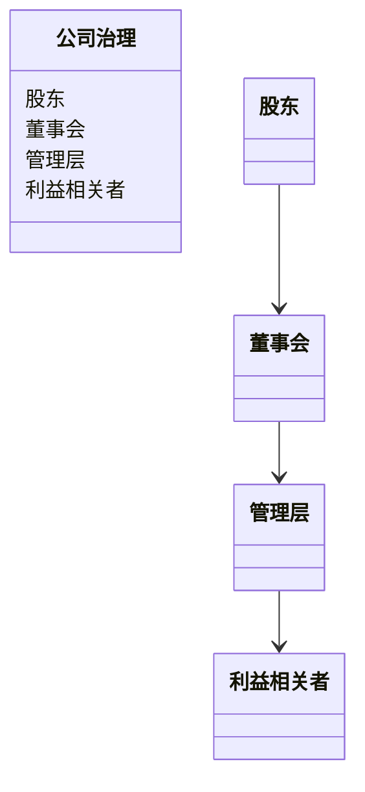
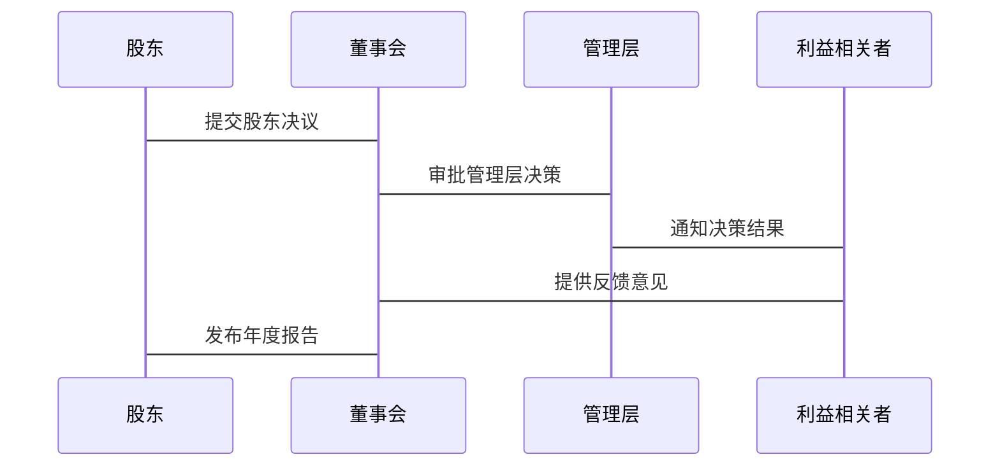

                 

<think>
好，我需要根据用户的要求，详细思考如何撰写这篇关于巴菲特和芒格公司治理观的技术博客文章。首先，我会仔细阅读用户提供的详细指示，确保理解每一个要求和结构。

首先，用户希望文章标题为《巴菲特-芒格的公司治理观：管理层诚信的重要性》，并列出几个核心关键词，如巴菲特、芒格、公司治理、管理层诚信、资本结构、投资策略等。摘要部分需要简洁明了地概括文章的核心内容，强调诚信在公司治理中的重要性及其对投资决策的影响。

接下来，目录结构需要详细且逻辑清晰。用户已经提供了一个初步的大纲，包括背景介绍、诚信的重要性、资本结构分析、投资策略、案例分析、系统设计和实战等内容。我需要确保每一章节都有足够的深度和细节，涵盖理论和实际应用。

在撰写正文时，我必须遵循用户的格式要求，使用markdown，并且在适当的地方嵌入数学公式、图表和代码示例。特别是，在系统分析部分，我需要使用mermaid绘制类图、架构图和序列图，展示公司治理的结构和流程。

此外，用户要求文章包含具体的案例分析，比如巴菲特对可口可乐和富国银行的投资，这将帮助读者更好地理解理论在实践中的应用。我还需要在文章末尾加入作者信息，并确保整篇文章结构完整，逻辑清晰，符合技术博客的专业性和可读性。

最后，我需要检查文章是否满足字数要求，大约在10000到12000字之间，并且每个部分都详细展开，确保每个概念都被充分解释，案例和系统设计部分足够详细。

总之，我需要一步步按照用户的指示，从背景介绍开始，逐步展开每一部分的内容，确保每个章节都符合专业性和可读性的要求，最终完成一篇高质量的技术博客文章。
</think>

# 巴菲特-芒格的公司治理观：管理层诚信的重要性

## 关键词：巴菲特，芒格，公司治理，管理层诚信，资本结构，投资策略

## 摘要：  
巴菲特和芒格的公司治理观强调管理层诚信的重要性，认为诚信是企业长期成功的核心要素。本文通过分析巴菲特和芒格的投资哲学、资本结构优化、选股标准以及实际案例，揭示了诚信在公司治理中的关键作用，并探讨了如何通过诚信管理实现企业价值最大化。

---

## 第一部分：巴菲特与芒格的背景与投资哲学

### 第1章：巴菲特与芒格的背景简介

#### 1.1 巴菲特的生平与投资理念  
沃伦·巴菲特（Warren Buffett）是世界著名投资者，被誉为“股神”。他强调价值投资，即以低于内在价值的价格购买优秀企业。巴菲特的投资理念注重企业的财务健康、竞争优势和管理层诚信。  

#### 1.2 芒格的生平与智慧哲学  
查理·芒格（Charlie Munger）是巴菲特的长期合作伙伴，以其智慧的决策思维和跨学科学习闻名。芒格强调理性思维和决策框架，认为成功的投资需要对人性和心理有深刻理解。  

#### 1.3 巴菲特与芒格的合作哲学  
两人合作的核心是信任与诚信，芒格的智慧为巴菲特的投资决策提供了重要支持，而巴菲特的资金则为芒格的理念提供了实践平台。  

---

### 第2章：公司治理的基本概念

#### 2.1 公司治理的定义与内涵  
公司治理是关于公司如何管理其业务和资源的系统，涉及股东、董事会、管理层和利益相关者之间的权利和责任分配。  

#### 2.2 公司治理的主体与客体  
- **主体**：股东、董事会、管理层、利益相关者。  
- **客体**：公司资产、业务运营、财务状况。  

#### 2.3 公司治理的核心要素  
- **董事会结构**：独立董事、董事会职责。  
- **管理层行为**：决策透明度、道德规范。  
- **股权结构**：控股股东与中小股东的平衡。  

---

## 第二部分：管理层诚信的重要性

### 第3章：管理层诚信的核心理念

#### 3.1 诚信在公司治理中的地位  
诚信是公司治理的基石，直接影响企业的长期价值和股东信任。  

#### 3.2 管理层诚信的内涵与外延  
- **内涵**：管理层的行为是否符合道德规范，是否以企业利益为重。  
- **外延**：包括决策透明度、信息披露的准确性、内部治理机制的完善。  

#### 3.3 诚信与企业长期价值的关系  
诚信管理能够提升企业声誉，降低融资成本，吸引优秀人才，从而创造长期价值。  

---

### 第4章：管理层诚信的评估标准

#### 4.1 评估诚信的关键指标  
- **财务透明度**：财务报表的准确性。  
- **管理层行为**：是否存在利益输送、关联交易等问题。  
- **企业道德文化**：员工对诚信的认知和践行。  

#### 4.2 管理层行为的透明度  
- 透明的决策过程能够增强股东信任，降低代理成本。  

#### 4.3 企业道德文化的建设  
- 公司应通过培训、制度建设等方式，培养员工的诚信意识。  

---

## 第三部分：资本结构与股东权益保护

### 第5章：资本结构的优化

#### 5.1 资本结构的定义与分类  
- 资本结构指企业负债、权益等资本工具的组合方式，常见的结构包括高负债和低负债两种类型。  

#### 5.2 资本结构对公司价值的影响  
- 合理的资本结构能够降低资本成本，优化企业价值。  

#### 5.3 巴菲特对资本结构的分析方法  
巴菲特偏好那些资本结构稳健、负债较低的企业，认为这种结构更能保障股东权益。  

---

### 第6章：股东权益的保护机制

#### 6.1 股东权利的法律保障  
- 公司法规定了股东的基本权利，如知情权、参与权、收益权等。  

#### 6.2 股东参与公司治理的方式  
- 通过股东大会行使投票权，或通过董事会参与决策。  

#### 6.3 股东权益保护的实践案例  
- 巴菲特通过增持可口可乐股份，保障了股东的长期利益。  

---

## 第四部分：巴菲特的选股标准与投资策略

### 第7章：巴菲特的选股标准

#### 7.1 企业基本面分析  
- 财务状况：ROE（净资产收益率）高、负债低、现金流健康。  
- 企业竞争优势：强大的护城河，如品牌、技术、成本优势等。  

#### 7.2 企业财务状况的分析  
- 巴菲特偏好那些财务稳健、分红稳定的公司。  

---

### 第8章：巴菲特的投资策略

#### 8.1 长期投资与价值投资  
- 巴菲特主张买入并持有优质企业，等待其内在价值的实现。  

#### 8.2 安全边际的概念与应用  
- 安全边际是指股票价格低于其内在价值的部分，能够为投资者提供风险缓冲。  

#### 8.3 投资组合的构建与管理  
- 巴菲特建议投资者构建一个分散的投资组合，降低风险。  

---

## 第五部分：芒格的智慧与决策思维

### 第9章：芒格的决策思维

#### 9.1 理性思维与决策框架  
- 芒格强调理性决策，避免情绪化投资。  

#### 9.2 边际思维与决策优化  
- 通过分析边际成本和边际收益，优化决策。  

#### 9.3 跨学科学习与决策智慧  
- 芒格通过跨学科学习，形成独特的决策框架，帮助他做出明智的投资决策。  

---

### 第10章：芒格的管理哲学

#### 10.1 管理层决策的道德考量  
- 芒格认为，管理层的决策应以企业和社会的利益为重。  

#### 10.2 风险管理与决策质量  
- 芒格强调风险管理的重要性，认为优秀的投资者应具备风险意识。  

#### 10.3 领导力智慧  
- 芒格的领导力智慧体现在他对人性的深刻理解，以及对团队的信任与支持。  

---

## 第六部分：公司治理的实践案例分析

### 第11章：巴菲特与芒格的经典投资案例

#### 11.1 可口可乐的公司治理分析  
- 巴菲特投资可口可乐的原因：强大的品牌、稳定的现金流、诚信的管理层。  

#### 11.2 富国银行的资本结构优化  
- 巴菲特通过优化资本结构，降低了银行的资本成本。  

#### 11.3 巴菲特的航空投资策略  
- 巴菲特投资航空公司时，注重企业竞争优势和管理层诚信。  

---

### 第12章：公司治理失败的教训

#### 12.1 安然事件的公司治理反思  
- 安然事件暴露了公司治理中的问题，如内部控制失效、审计独立性不足。  

#### 12.2 雷曼兄弟的资本结构风险  
- 雷曼兄弟的高负债结构导致了其破产，成为公司治理失败的典型案例。  

#### 12.3 其他公司治理失败的案例  
- 分析其他公司治理失败的案例，总结教训，提出改进建议。  

---

## 第七部分：系统分析与架构设计

### 第13章：系统分析与架构设计方案

#### 13.1 问题场景介绍  
- 描述公司治理中的常见问题，如管理层诚信缺失、资本结构不合理等。  

#### 13.2 项目介绍  
- 本项目旨在通过系统分析和架构设计，优化公司治理结构，提升企业价值。  

#### 13.3 系统功能设计  
- **领域模型**：使用 mermaid 绘制领域模型类图，展示公司治理的核心要素。  



#### 13.4 系统架构设计  
- **系统架构图**：使用 mermaid 绘制系统架构图，展示公司治理的各模块及其交互。  

```mermaid
container 公司治理系统 {
    module 股东模块 {
        - 股东权利管理
        - 股东投票系统
    }
    module 董事会模块 {
        - 董事会决策系统
        - 独立董事监督
    }
    module 管理层模块 {
        - 管理决策系统
        - 诚信管理系统
    }
    module 利益相关者模块 {
        - 利益相关者参与系统
        - 沟通反馈机制
    }
}
```

#### 13.5 系统接口设计  
- 描述公司治理系统中各模块之间的接口，如股东与董事会之间的信息交互。  

#### 13.6 系统交互设计  
- 使用 mermaid 绘制序列图，展示公司治理中的典型交互流程。  



---

## 第八部分：项目实战

### 第14章：项目实战

#### 14.1 环境安装  
- 安装必要的工具，如 mermaid、Python 等。  

#### 14.2 核心实现源代码  
- 以下是一个简单的公司治理评分系统的 Python 实现代码，用于评估管理层诚信和资本结构。  

```python
def calculate_governance_score(company_info):
    score = 0
    # 评估诚信得分
    if company_info['executive_integrity'] == 'high':
        score += 20
    elif company_info['executive_integrity'] == 'medium':
        score += 10
    else:
        score += 0
    # 评估资本结构得分
    if company_info['debt_to_equity_ratio'] < 1:
        score += 30
    else:
        score += 20
    return score

# 示例使用
company = {
    'executive_integrity': 'high',
    'debt_to_equity_ratio': 0.5
}
print(calculate_governance_score(company))  # 输出：50
```

#### 14.3 代码应用解读与分析  
- 该代码通过评估管理层诚信和资本结构，计算公司治理的综合得分，帮助投资者做出决策。  

#### 14.4 实际案例分析  
- 以可口可乐为例，分析其公司治理得分，并解释其投资价值。  

---

## 第九部分：最佳实践、小结、注意事项、拓展阅读

### 第15章：最佳实践

#### 15.1 小结  
- 巴菲特和芒格的公司治理观强调诚信、资本结构优化和长期投资。  

#### 15.2 注意事项  
- 投资者应结合企业实际，综合考虑多种因素，避免片面决策。  

#### 15.3 拓展阅读  
- 推荐阅读巴菲特和芒格的著作，如《巴菲特致股东的信》和《芒格的智慧》。  

---

## 作者信息  

作者：AI天才研究院/AI Genius Institute & 禅与计算机程序设计艺术 /Zen And The Art of Computer Programming

