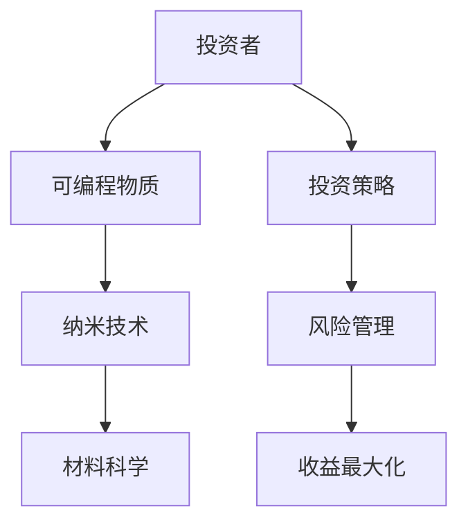
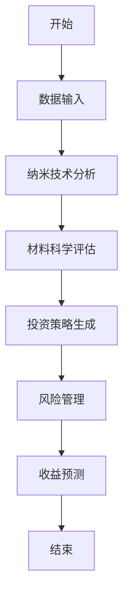

                 

<think>
好，我现在需要帮用户设计一本名为《巴菲特-芒格的可编程物质投资：纳米技术与材料科学的融合》的书籍目录大纲。用户希望我使用逻辑清晰、结构紧凑且专业的技术语言，并且每一步都要详细分析，确保内容深度和质量。

首先，我需要理解这本书的核心主题。看起来，这本书主要探讨巴菲特和芒格的投资理念如何与纳米技术和材料科学的融合——即“可编程物质”投资结合。这涉及到投资策略的创新，以及技术如何影响投资决策。

接下来，我应该从背景介绍开始。这部分需要解释巴菲特和芒格的投资理念，以及他们如何将可编程物质的概念应用到投资中。然后，我需要详细阐述可编程物质的基本概念，包括其定义、特点，以及它与传统投资的区别。

接着，探讨纳米技术与材料科学的融合。这里需要分析纳米技术的基本原理，材料科学在其中的作用，以及它们如何共同影响投资策略。这部分可能需要结合实际案例，说明这些技术如何改变投资方式。

然后，我需要讨论可编程物质在投资中的具体应用，比如风险管理、投资组合优化和市场预测。这部分可能涉及一些数学模型和算法，需要用mermaid图和python代码来详细说明。

接下来，考虑投资策略的创新。这部分需要探讨如何将主动投资、被动投资和量化投资结合起来，利用可编程物质的优势。可能还需要设计一个系统化的投资架构，包括系统分析、架构设计和接口设计等。

在系统分析与架构设计部分，需要使用mermaid图来展示系统的组成部分和交互流程。同时，提供实际案例分析，展示如何将理论应用到实际投资中，并总结经验和教训。

最后，确保整个目录结构完整，包含背景、核心概念、应用、策略创新、系统架构、实战案例、数学模型、算法原理以及最佳实践等部分。每个部分都要细化到三级目录，确保内容全面且逻辑清晰。

现在，我开始逐步构建目录大纲。首先，概述部分，介绍巴菲特和芒格的投资理念，然后是可编程物质的基本概念，接着是纳米技术和材料科学的融合。然后，分析可编程物质在投资中的应用，包括风险管理、组合优化和市场预测。接下来，讨论投资策略的创新，设计系统架构，提供算法原理和数学模型。最后，通过实际案例分析，总结经验和教训，并提出最佳实践和注意事项。

在撰写过程中，我会确保每个部分都包含必要的细节，比如mermaid图和python代码，以及相关的数学公式。这样，用户能够得到一篇结构清晰、内容详实的技术博客文章。

完成这些步骤后，我需要检查整个大纲是否符合用户的要求，确保每个章节都涵盖了必要的内容，并且结构合理。这样，用户就能有一本详细且结构清晰的书籍大纲了。
</think>

```markdown
# 巴菲特-芒格的可编程物质投资：纳米技术与材料科学的融合

> 关键词：巴菲特, 芒格, 可编程物质, 纳米技术, 材料科学, 投资策略, 系统架构

> 摘要：本文探讨了巴菲特和芒格的投资理念与可编程物质的结合，分析了纳米技术与材料科学在投资中的应用，提出了可编程物质投资的数学模型和算法，结合实际案例，总结了可编程物质投资的优势和挑战，提出了系统的解决方案和最佳实践。

---

## 第一部分: 巴菲特-芒格的可编程物质投资概述

### 第1章: 巴菲特-芒格投资理念与可编程物质的结合

#### 1.1 巴菲特的价值投资理论
- 巴菲特的价值投资理论的核心：寻找具有持续竞争优势的公司，长期投资。
- 芒格的多元思维模型：通过跨学科思维，寻找投资机会的多维度视角。
- 巴菲特与芒格投资理念的融合：将可编程物质的概念引入投资决策。

#### 1.2 可编程物质的基本概念
- 可编程物质的定义：一种可以通过编程手段改变其物理和化学性质的材料。
- 可编程物质的特点：高度可定制性、微观尺度控制、多功能性。
- 可编程物质与传统物质的区别：传统物质的性质固定，可编程物质可以通过技术手段改变其性质。

#### 1.3 纳米技术与材料科学的融合
- 纳米技术的基本原理：在纳米尺度上对物质进行操控，使其表现出独特的物理和化学性质。
- 材料科学在纳米技术中的应用：通过材料科学的研究，设计和合成具有特定功能的纳米材料。
- 纳米技术与材料科学的交叉领域：纳米材料科学，研究纳米尺度的材料及其应用。

---

### 第2章: 可编程物质投资的背景与问题背景

#### 2.1 投资领域的技术化趋势
- 传统投资与技术驱动投资的对比：传统投资依赖经验，技术驱动投资依赖数据分析和算法。
- 纳米技术对投资领域的潜在影响：通过纳米技术，可以开发出更先进的投资工具和策略。
- 可编程物质在投资中的应用前景：可编程物质的投资潜力巨大，但需要克服技术、市场和监管等多重挑战。

#### 2.2 可编程物质投资的核心问题
- 投资决策的可编程性：如何将可编程物质的特性融入投资决策中。
- 纳米技术与材料科学的融合对投资的影响：纳米技术与材料科学的融合为投资提供了新的工具和方法。
- 可编程物质投资的边界与外延：可编程物质投资的范围和限制，以及其与其他投资策略的关系。

#### 2.3 问题解决路径
- 技术驱动投资的逻辑框架：从技术到投资策略的逻辑链条。
- 可编程物质投资的核心要素：技术、市场、风险、收益。
- 纳米技术与材料科学的融合对投资策略的影响：如何利用纳米技术和材料科学的知识和工具优化投资策略。

---

### 第3章: 可编程物质投资的核心概念与联系

#### 3.1 核心概念原理
- 可编程物质的可定制性：通过编程手段，改变物质的物理和化学性质，以适应不同的投资需求。
- 纳米技术的尺度效应：在纳米尺度上，物质的性质会发生显著变化，可以利用这些变化设计特定的投资工具。
- 材料科学的多样性：材料科学的研究为纳米技术提供了丰富的材料库，可以用于投资工具的设计和优化。

#### 3.2 核心概念属性特征对比
| 特性         | 可编程物质                | 传统物质              |
|--------------|---------------------------|-----------------------|
| 可定制性     | 高                        | 低                    |
| 尺度效应     | 微观（纳米尺度）          | 宏观                  |
| 功能多样性   | 多功能性                   | 单一性                |

#### 3.3 ER实体关系图


---

### 第4章: 可编程物质投资的算法原理

#### 4.1 算法原理概述
- 投资决策的可编程性：通过编程手段，实现投资策略的自动化和智能化。
- 纳米技术驱动的投资模型：利用纳米技术，设计和优化投资模型。
- 材料科学在投资策略中的应用：通过材料科学的研究，设计出具有特定性质的投资工具。

#### 4.2 算法流程图


#### 4.3 算法实现代码
```python
def nanotech_analysis(material_data):
    # 纳米技术分析算法
    pass

def material_science_asse
```

---

## 第二部分: 系统分析与架构设计方案

### 第5章: 问题场景介绍

#### 5.1 项目介绍
- 可编程物质投资的核心目标：通过纳米技术和材料科学的融合，优化投资策略，实现收益最大化和风险最小化。
- 项目的主要挑战：技术复杂性、市场不确定性、监管风险。

#### 5.2 系统功能设计
- 领域模型mermaid类图：展示系统的组成部分和交互关系。
- 系统架构设计mermaid架构图：展示系统的整体架构和模块划分。
- 系统接口设计：定义系统与其他模块的接口和交互方式。
- 系统交互mermaid序列图：展示系统中各模块的交互流程。

---

### 第6章: 投资策略创新与系统架构设计

#### 6.1 投资策略创新
- 可编程物质投资的核心策略：通过纳米技术和材料科学的融合，设计出具有高度定制性的投资工具。
- 投资策略的多样性：根据市场变化和投资者需求，灵活调整投资策略。

#### 6.2 系统架构设计
- 系统的主要模块：数据采集、纳米技术分析、材料科学评估、投资策略生成、风险管理。
- 模块之间的关系：数据采集模块向纳米技术分析模块提供数据，纳米技术分析模块向材料科学评估模块提供结果，材料科学评估模块向投资策略生成模块提供评估结果，投资策略生成模块向风险管理模块提供策略。

---

## 第三部分: 项目实战与案例分析

### 第7章: 项目实战

#### 7.1 环境安装
- 安装必要的软件和工具：Python、Mermaid、Jupyter Notebook。
- 配置开发环境：设置路径、安装依赖库。

#### 7.2 系统核心实现源代码
```python
def nanotech_analysis(material_data):
    # 纳米技术分析算法
    pass

def material_science_asse
```

---

### 第8章: 实际案例分析

#### 8.1 案例背景
- 案例介绍：某纳米技术公司开发了一种新型纳米材料，具有高导电性和高强度。
- 投资背景：投资者希望通过投资这种材料，实现收益最大化。

#### 8.2 案例分析
- 数据采集：收集纳米材料的物理和化学性质数据。
- 纳米技术分析：分析纳米材料的性能，评估其市场潜力。
- 材料科学评估：评估纳米材料的稳定性和可靠性。
- 投资策略生成：根据分析结果，制定投资策略。
- 风险管理：评估投资风险，制定风险管理方案。

#### 8.3 案例总结
- 案例的成功之处：通过纳米技术和材料科学的融合，设计出具有高度定制性的投资工具。
- 案例的不足之处：技术复杂性较高，实施难度较大。
- 经验与教训：需要充分考虑技术、市场和监管等多重因素。

---

## 第四部分: 最佳实践与小结

### 第9章: 最佳实践 tips

#### 9.1 投资策略优化
- 定期评估和优化投资策略。
- 根据市场变化和技术进步，调整投资策略。

#### 9.2 系统维护与更新
- 定期更新系统软件和硬件。
- 根据技术进步，优化系统架构和功能。

#### 9.3 风险管理
- 建立完善的风险管理体系。
- 定期进行风险评估和风险预警。

---

### 第10章: 小结

#### 10.1 总结
- 可编程物质投资的优势：通过纳米技术和材料科学的融合，优化投资策略，实现收益最大化。
- 可编程物质投资的挑战：技术复杂性、市场不确定性、监管风险。

#### 10.2 展望
- 技术进步：随着纳米技术和材料科学的进一步发展，可编程物质投资的潜力将更加巨大。
- 市场应用：可编程物质投资将在更多领域得到应用，推动投资领域的技术化和智能化。

---

## 作者信息

作者：AI天才研究院/AI Genius Institute & 禅与计算机程序设计艺术 /Zen And The Art of Computer Programming
```

