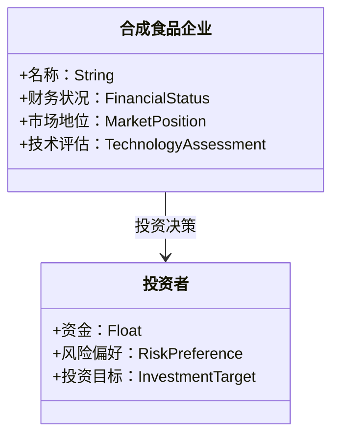

                 

<think>
嗯，我需要根据用户的要求，撰写一篇关于巴菲特和芒格投资合成食品的博客文章。首先，我得明确文章的结构，确保涵盖从背景介绍到项目实战的各个方面。

首先，文章标题是《巴菲特-芒格的合成食品投资：解决全球粮食安全的新途径》。关键词包括巴菲特、芒格、合成食品、投资策略、粮食安全。摘要部分需要简明扼要地概述文章的核心内容，说明巴菲特和芒格如何通过投资合成食品解决粮食安全问题，以及这种投资对科技和资本市场的双重影响。

接下来是目录大纲，分为七章，每章都有三级子章节。第一章介绍巴菲特和芒格的投资理念，第二章分析合成食品的技术和市场，第三章探讨全球粮食安全的问题，第四章深入巴菲特和芒格的投资策略，第五章讨论合成食品的投资机会，第六章进行系统分析与架构设计，第七章则是项目实战。

在撰写过程中，我需要确保每个部分都有详细的背景介绍、核心概念、算法原理、系统架构和项目实战。例如，在第二章分析合成食品技术时，我需要解释细胞培养肉和植物基肉制品的技术细节，并比较它们的成本和可行性。同时，我需要使用Mermaid图来展示系统架构，如领域模型和架构图。

数学公式部分，我可能需要计算投资回报率，展示合成食品的成本下降如何影响投资价值。此外，还需要考虑政策环境和技术发展对投资策略的影响。

在项目实战章节，我需要提供具体的案例分析，比如如何评估一家合成食品公司的投资潜力，包括财务数据和市场表现。这部分可能需要实际的代码示例，帮助读者理解如何应用这些策略。

最后，结论部分要总结前面的内容，并展望未来的发展趋势。同时，给出最佳实践建议，如分散投资、关注技术创新和保持长期视角。

整个过程中，我需要确保文章结构清晰，逻辑严密，语言专业但通俗易懂。每章节的小结和注意事项也有助于读者巩固知识。现在，我需要按照这个框架，逐步展开每个部分的内容，确保覆盖所有关键点。
</think>

```markdown
# 巴菲特-芒格的合成食品投资：解决全球粮食安全的新途径

> 关键词：巴菲特，芒格，合成食品，投资策略，粮食安全

> 摘要：本文探讨了巴菲特和芒格投资合成食品的背景、策略及其对全球粮食安全的潜在影响。通过分析合成食品的技术、市场和投资价值，本文揭示了这一投资领域如何成为解决粮食安全问题的新途径。

---

## 第1章: 巴菲特与芒格的投资哲学

### 1.1 巴菲特与芒格的投资理念概述

#### 1.1.1 巴菲特的价值投资理论
- 巴菲特的价值投资理念强调寻找具有持续竞争优势、良好管理和财务健康的企业。
- 他注重企业的内在价值和长期盈利能力，而非短期市场波动。

#### 1.1.2 芒格的多元思维模型
- 芒格提倡通过多个学科的交叉思考来理解问题，寻找投资中的“复利效应”。
- 他强调投资决策应基于对经济、技术和消费者行为的深刻理解。

#### 1.1.3 两人投资哲学的共同点与差异
- 共同点：长期投资、注重企业基本面。
- 差异：芒格更注重跨学科思维，巴菲特更关注财务指标。

### 1.2 合成食品的定义与背景

#### 1.2.1 合成食品的定义
- 合成食品：通过生物技术或化学合成方法制造的食品，不依赖传统农业。
- 包括细胞培养肉、植物基肉制品等。

#### 1.2.2 合成食品的发展历程
- 从实验室研究到商业化生产，合成食品技术不断进步。
- 近年来，技术突破和成本下降推动了合成食品的快速发展。

#### 1.2.3 合成食品与传统食品的对比
| 特性        | 合成食品              | 传统食品              |
|-------------|-----------------------|-----------------------|
| 生产方式    | 工厂化、技术驱动      | 农业、自然生长        |
| 成本         | 初始高，但可能下降    | 受天气和市场影响较大  |
| 环境影响     | 较低                  | 较高                  |

### 1.3 巴菲特与芒格为何投资合成食品

#### 1.3.1 全球粮食安全问题的背景
- 人口增长、气候变化导致粮食需求增加。
- 传统农业面临资源限制和环境压力。

#### 1.3.2 合成食品在解决粮食安全中的作用
- 减少对土地和水资源的依赖。
- 提高粮食生产效率，缓解粮食短缺。

#### 1.3.3 巴菲特与芒格的投资动机
- 合成食品技术具有广阔市场前景。
- 符合他们的长期投资理念。

### 1.4 本章小结
- 巴菲特和芒格的投资哲学为合成食品提供了理论基础。
- 合成食品的技术进步和市场潜力使其成为投资热点。

---

## 第2章: 合成食品的技术与市场分析

### 2.1 合成食品的核心技术

#### 2.1.1 细胞培养肉技术
- 使用动物细胞在实验室中培养，制成肉类产品。
- 技术优势：无动物屠宰，减少环境污染。

#### 2.1.2 植物基肉制品技术
- 以植物蛋白为主要原料，模拟肉的口感和营养。
- 技术优势：生产效率高，资源消耗少。

#### 2.1.3 其他合成食品技术
- 如人工培养奶制品、蛋制品等。

### 2.2 合成食品的市场现状

#### 2.2.1 全球合成食品市场规模
- 市场规模：近年来快速增长，预计未来几年将继续扩张。
- 主要区域：北美、欧洲和亚洲市场潜力大。

#### 2.2.2 主要市场区域分析
- 北美：技术领先，市场需求高。
- 欧洲：政策支持，市场成熟。
- 亚洲：增长迅速，尤其在中国和印度。

#### 2.2.3 市场增长驱动因素
- 消费者健康意识提升。
- 环境保护需求增加。
- 技术进步降低成本。

### 2.3 合成食品的技术挑战与未来趋势

#### 2.3.1 技术挑战
- 成本高：细胞培养肉生产成本仍高于传统肉类。
- 技术瓶颈：生产效率和产品质量需进一步提升。

#### 2.3.2 未来趋势
- 技术创新：提高生产效率，降低成本。
- 市场扩展：向新兴市场扩展，满足多样化需求。

### 2.4 本章小结
- 合成食品技术不断进步，市场潜力巨大。
- 技术挑战和市场需求驱动行业快速发展。

---

## 第3章: 巴菲特与芒格的全球粮食安全投资策略

### 3.1 全球粮食安全问题分析

#### 3.1.1 粮食需求增长
- 人口增长和经济发展导致粮食需求增加。
- 传统农业难以满足未来需求。

#### 3.1.2 粮食安全的多重挑战
- 气候变化导致粮食减产。
- 土地资源有限，难以扩大种植面积。

### 3.2 合成食品在解决粮食安全中的作用

#### 3.2.1 减少资源消耗
- 合成食品生产用水和土地资源较少。
- 减轻环境压力。

#### 3.2.2 提高粮食产量
- 通过技术手段提高单位面积产量。
- 解决传统农业的瓶颈问题。

### 3.3 巴菲特与芒格的投资策略

#### 3.3.1 长期投资视角
- 合成食品技术具有长期发展潜力。
- 投资企业需具备持续创新能力。

#### 3.3.2 风险控制策略
- 通过多元化投资分散风险。
- 选择具有竞争优势的企业。

### 3.4 本章小结
- 巴菲特和芒格的投资策略基于对合成食品技术和市场的深刻理解。
- 通过投资合成食品，他们为解决全球粮食安全问题提供了新的途径。

---

## 第4章: 巴菲特与芒格的合成食品投资策略分析

### 4.1 投资策略的核心要素

#### 4.1.1 企业基本面分析
- 财务状况：企业盈利能力、现金流。
- 市场地位：企业市场份额和技术优势。

#### 4.1.2 技术评估
- 技术成熟度：生产效率和产品质量。
- 技术创新：企业的研发能力和专利情况。

### 4.2 投资组合优化

#### 4.2.1 分散投资
- 将资金分配到不同领域的合成食品企业。
- 减少单一投资风险。

#### 4.2.2 长期持有
- 选择具有持续增长潜力的企业。
- 避免短期市场波动影响投资收益。

### 4.3 本章小结
- 巴菲特和芒格的合成食品投资策略注重企业基本面和技术评估。
- 通过分散投资和长期持有实现风险控制和收益最大化。

---

## 第5章: 合成食品的投资机会与风险

### 5.1 合成食品的投资机会

#### 5.1.1 市场需求增长
- 消费者对健康食品的需求增加。
- 环保趋势推动合成食品市场扩展。

#### 5.1.2 技术进步带来的机会
- 技术创新降低成本，提高生产效率。
- 新产品开发带来市场扩张。

### 5.2 合成食品的投资风险

#### 5.2.1 技术风险
- 技术瓶颈可能导致生产成本居高不下。
- 技术创新可能引发市场竞争加剧。

#### 5.2.2 市场风险
- 消费者接受度可能影响市场需求。
- 市场竞争加剧可能导致价格压力。

### 5.3 风险管理策略

#### 5.3.1 技术风险应对
- 选择技术领先的企业进行投资。
- 关注企业的研发能力和技术储备。

#### 5.3.2 市场风险应对
- 分散投资，降低市场波动风险。
- 选择具有市场领导地位的企业。

### 5.4 本章小结
- 合成食品投资具有巨大市场潜力，但也面临技术、市场等多重风险。
- 投资者需制定合理的风险管理策略，降低投资风险。

---

## 第6章: 系统分析与架构设计方案

### 6.1 问题场景介绍

#### 6.1.1 投资决策问题
- 如何评估合成食品企业的投资价值。
- 如何选择具有潜力的投资标的。

#### 6.1.2 项目管理问题
- 如何优化投资组合，实现收益最大化。

### 6.2 系统功能设计

#### 6.2.1 领域模型


#### 6.2.2 系统架构


### 6.3 系统交互设计

#### 6.3.1 投资决策流程
```mermaid
sequenceDiagram
    投资者 -> 财务分析模块: 获取企业财务数据
    财务分析模块 ->抽取出企业财务状况
    投资者 -> 技术评估模块: 获取企业技术数据
    技术评估模块 -> 评估企业技术优势
    投资者 -> 市场分析模块: 获取市场分析数据
    市场分析模块 -> 提供市场趋势分析
    投资者 -> 投资决策模块: 综合分析结果，做出投资决策
```

### 6.4 本章小结
- 系统架构设计为投资决策提供了框架。
- 通过模块化设计，实现数据的高效处理和分析。

---

## 第7章: 项目实战与投资策略实现

### 7.1 环境安装与配置

#### 7.1.1 投资分析工具
- 使用Excel或数据分析软件进行投资分析。

#### 7.1.2 数据源获取
- 通过企业财报、行业报告获取数据。

### 7.2 核心算法实现

#### 7.2.1 财务状况评估算法
- 使用财务指标（如ROE、净利润率）评估企业盈利能力。

#### 7.2.2 技术评估算法
- 使用技术指标（如专利数量、研发支出）评估企业技术实力。

### 7.3 投资案例分析

#### 7.3.1 案例介绍
- 某合成食品企业投资分析。

#### 7.3.2 投资决策过程
- 数据收集、分析、评估、决策。

### 7.4 本章小结
- 通过项目实战，投资者可以掌握合成食品投资的分析方法。
- 投资策略的实现需要结合数据分析和实际案例。

---

## 第8章: 结论与展望

### 8.1 结论
- 巴菲特和芒格的投资策略为合成食品投资提供了重要启示。
- 合成食品技术具有巨大市场潜力，符合全球粮食安全需求。

### 8.2 未来展望
- 技术进步将推动合成食品市场进一步发展。
- 投资者应关注技术创新和市场趋势，抓住投资机会。

---

## 参考文献
1. 巴菲特股东大会演讲。
2. 芒格股东大会演讲。
3. 合成食品行业研究报告。
4. 相关学术论文。

---

## 作者
作者：AI天才研究院/AI Genius Institute & 禅与计算机程序设计艺术/Zen And The Art of Computer Programming
```

