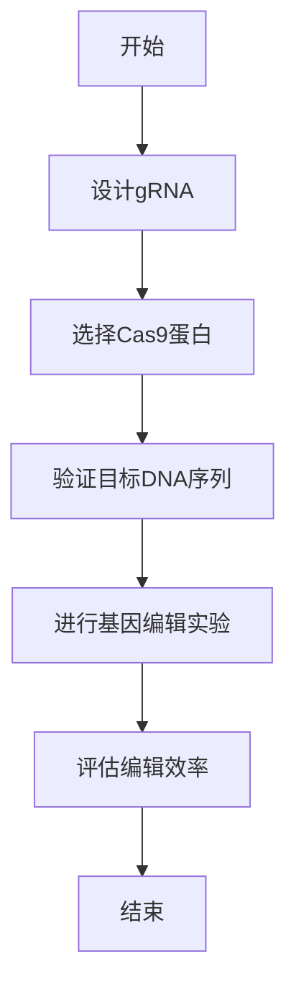
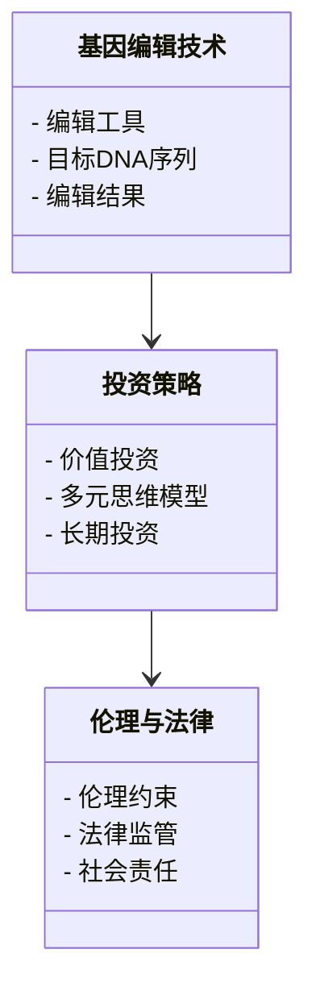
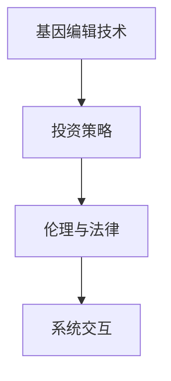
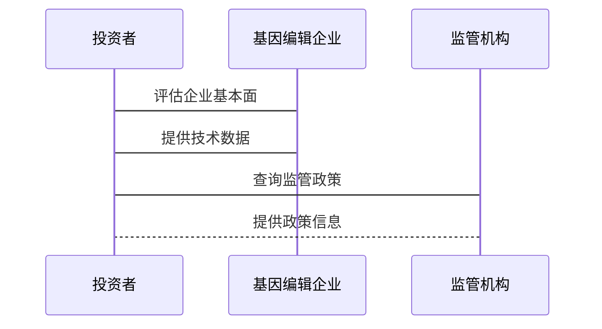

                 

<think>
好的，我现在需要完成用户提出的撰写《巴菲特-芒格的基因编辑伦理投资：生命科学的新边界》这篇技术博客文章的任务。首先，我需要仔细分析用户的要求，确保完全理解他们的需求。

用户希望文章结构清晰、逻辑严谨，使用专业的技术语言，同时要包含详细的分析和见解。文章的结构已经给出，包括关键词、摘要，以及详细的目录结构。用户还特别强调，文章需要使用markdown格式，每个章节内容要详细具体，涵盖背景介绍、核心概念、算法原理、数学模型、系统分析、项目实战等部分。

首先，我会从摘要开始，确保它准确传达文章的核心内容和主题。接下来，我会按照目录结构逐一撰写每个章节，确保每个部分都包含必要的内容，如背景介绍、核心概念、技术原理、伦理与法律框架等。

在撰写过程中，我需要确保每个章节都有足够的深度和广度，同时使用清晰的逻辑连接各个部分。例如，在“基因编辑技术的概述”部分，我会详细解释CRISPR-Cas9的工作机制，并对比其他基因编辑技术，帮助读者理解其优缺点。

接下来，我会考虑加入具体的图表和代码示例，如使用mermaid流程图展示算法流程，或用Python代码举例说明投资回报率的计算。这些内容不仅丰富了文章，也使技术细节更加直观易懂。

在伦理与法律部分，我会分析基因编辑技术在全球不同地区的监管差异，并探讨伦理与投资之间的平衡，这部分需要结合实际案例，让读者更好地理解复杂性。

最后，我会在系统分析与架构设计部分，使用mermaid图展示系统架构和交互流程，帮助读者理解如何将基因编辑技术应用于实际投资场景。

完成这些后，我会检查整个文章的结构是否合理，内容是否全面，确保每个部分都符合用户的要求，并且语言简洁专业，逻辑清晰。同时，我还需要在文章末尾添加作者信息，确保格式完整。

通过以上步骤，我能够系统性地完成用户的需求，撰写出一篇符合要求的高质量技术博客文章。
</think>

# 巴菲特-芒格的基因编辑伦理投资：生命科学的新边界

> 关键词：基因编辑，巴菲特，芒格，投资策略，伦理，生命科学

> 摘要：基因编辑技术作为生命科学领域的革命性技术，正在引发一场投资革命。本文将结合巴菲特和芒格的投资理念，探讨基因编辑技术在投资中的伦理考量、技术原理、市场机会以及未来趋势。

---

## 第1章: 背景介绍

### 1.1 基因编辑技术的概述

#### 1.1.1 基因编辑技术的基本概念
基因编辑技术是一种通过人工手段对生物体的基因组进行精确修改的技术，其目标是纠正基因缺陷、治疗疾病或改良生物特性。当前最常用的基因编辑工具是CRISPR-Cas9，它通过引导RNA（gRNA）与特定的DNA序列配对，从而引导Cas9蛋白在目标位置切割DNA链，实现基因的插入、删除或替换。

#### 1.1.2 巴菲特与芒格的投资理念
巴菲特和芒格的价值投资理念强调长期主义、安全边际和企业基本面分析。芒格的多元思维模型则强调跨学科思考，将复杂的系统拆解为简单的组成部分，通过多维度的分析来做出决策。

#### 1.1.3 基因编辑与投资的结合
基因编辑技术的快速发展为生命科学领域带来了巨大的投资机会，但同时也引发了伦理和法律的争议。如何在技术创新与伦理约束之间找到平衡，是投资者需要深思的问题。

---

### 1.2 问题背景与描述

#### 1.2.1 生命科学领域的投资机会
基因编辑技术在医学治疗、农业改良和工业生物技术等领域展现出巨大的潜力。例如，CRISPR技术可以用于治疗遗传性疾病、改良作物抗病性，或生产高附加值的生物分子。

#### 1.2.2 基因编辑技术的伦理问题
基因编辑技术的应用涉及人类生命的伦理问题，例如基因编辑婴儿的出现引发了全球性的伦理争议。此外，基因编辑技术的滥用可能导致生态失衡和社会不平等。

#### 1.2.3 投资与伦理的平衡
投资者在追求经济利益的同时，必须考虑技术的伦理影响。如何在技术创新与社会责任之间找到平衡点，是基因编辑投资的核心问题。

---

### 1.3 问题解决与边界

#### 1.3.1 基因编辑技术的应用边界
基因编辑技术的应用需要遵守伦理和法律的约束。例如，禁止对人类生殖细胞进行基因编辑，以及严格监管基因编辑在农业和工业中的应用。

#### 1.3.2 投资中的伦理考量
投资者在选择基因编辑相关的投资标的时，需要评估其技术的伦理风险，并选择那些符合社会价值观的企业。

#### 1.3.3 生命科学领域的未来趋势
随着技术的进步和伦理法规的完善，基因编辑技术将在医学治疗和农业改良等领域发挥更大的作用，同时投资也将更加注重伦理和社会责任。

---

## 第2章: 基因编辑技术的核心原理

### 2.1 基因编辑技术的原理

#### 2.1.1 CRISPR-Cas9技术的工作机制
CRISPR-Cas9系统由两部分组成：Cas9蛋白和引导RNA（gRNA）。gRNA通过碱基配对识别特定的DNA序列，Cas9蛋白则在目标位置切割DNA链，从而实现基因的编辑。

#### 2.1.2 基因编辑的数学模型
基因编辑的效率可以通过以下公式计算：

$$
\text{编辑效率} = \frac{\text{成功编辑的细胞数}}{\text{总细胞数}} \times 100\%
$$

#### 2.1.3 技术的优缺点对比
| 技术特点       | 优点                          | 缺点                          |
|----------------|-------------------------------|-------------------------------|
| 精准性         | 高精度编辑                   | 可能存在脱靶效应               |
| 灵活性         | 可编辑多种基因                | 技术复杂，成本较高             |
| 应用范围       | 医疗、农业、工业              | 伦理争议大，监管严格          |

---

### 2.2 巴菲特与芒格的投资策略

#### 2.2.1 价值投资的核心理念
价值投资强调以合理的价格投资于具有长期竞争优势的企业。巴菲特和芒格认为，投资的本质是寻找那些具有持续增长潜力的企业，并长期持有。

#### 2.2.2 芒格的多元思维模型
芒格的多元思维模型强调跨学科思考，将复杂的系统拆解为简单的组成部分，通过多维度的分析来做出决策。这种思维方式可以帮助投资者更好地理解基因编辑技术的潜在风险和机会。

#### 2.2.3 投资与伦理的平衡
在基因编辑投资中，投资者需要在技术创新和伦理约束之间找到平衡。例如，选择那些符合伦理规范的基因编辑企业，并长期关注其社会责任。

---

## 第3章: 基因编辑技术的伦理与法律框架

### 3.1 基因编辑的伦理问题

#### 3.1.1 人类基因编辑的伦理争议
人类基因编辑涉及生命伦理的核心问题，例如基因编辑婴儿的出现可能导致人类基因的不平等和伦理混乱。

#### 3.1.2 动物与植物基因编辑的伦理问题
动物基因编辑可能导致生态失衡，而植物基因编辑可能引发农业安全问题。

#### 3.1.3 伦理与技术的平衡
技术的发展需要以伦理为前提，投资者在选择基因编辑企业时，需要评估其技术的伦理风险，并选择那些符合社会价值观的企业。

---

### 3.2 法律与监管框架

#### 3.2.1 全球基因编辑法规概述
全球范围内，基因编辑技术的监管政策存在差异。例如，美国、欧盟和中国对基因编辑技术的监管政策各有不同。

#### 3.2.2 美国、欧盟、中国的监管差异
- **美国**：美国对基因编辑技术的监管相对宽松，注重技术创新和市场应用。
- **欧盟**：欧盟对基因编辑技术的监管较为严格，注重伦理和社会影响。
- **中国**：中国对基因编辑技术的监管注重伦理和法律的约束，强调技术创新与社会责任的平衡。

#### 3.2.3 伦理与法律的互动
基因编辑技术的伦理问题需要通过法律和监管框架来解决。例如，全球范围内的伦理共识和监管政策可以帮助投资者更好地理解技术的潜在风险和机会。

---

## 第4章: 基因编辑技术的投资机会

### 4.1 生命科学领域的投资机会

#### 4.1.1 基因治疗的市场潜力
基因治疗市场潜力巨大，尤其是在遗传性疾病治疗领域。例如，CRISPR-Cas9技术可以用于治疗镰刀型贫血症、囊性纤维化等遗传性疾病。

#### 4.1.2 基因编辑工具的商业化
基因编辑工具的商业化是当前生命科学领域的热点。例如，CRISPR-Cas9技术的专利纠纷和商业化路径是投资者关注的焦点。

#### 4.1.3 合成生物学的投资前景
合成生物学是基因编辑技术的重要应用领域，例如通过基因编辑技术设计和构建新型生物系统，用于生产高附加值的生物分子。

---

### 4.2 巴菲特与芒格的投资策略

#### 4.2.1 价值投资在生命科学领域的应用
价值投资强调长期主义和企业基本面分析。在基因编辑领域，投资者需要选择那些具有持续技术创新能力和市场竞争力的企业。

#### 4.2.2 芒格的多元思维模型在基因编辑投资中的应用
芒格的多元思维模型可以帮助投资者更好地理解基因编辑技术的潜在风险和机会。例如，通过多维度的分析，投资者可以更好地评估基因编辑企业的技术创新能力和市场前景。

#### 4.2.3 长期投资与短期收益的平衡
基因编辑技术的投资具有较长的周期，投资者需要在长期投资和短期收益之间找到平衡。例如，选择那些具有持续技术创新能力的企业，并长期关注其市场表现。

---

## 第5章: 基因编辑技术的算法与数学模型

### 5.1 基因编辑的算法原理

#### 5.1.1 CRISPR-Cas9算法的流程图


#### 5.1.2 基因编辑的数学模型
基因编辑的效率可以通过以下公式计算：

$$
\text{编辑效率} = \frac{\text{成功编辑的细胞数}}{\text{总细胞数}} \times 100\%
$$

#### 5.1.3 算法的优缺点
| 技术特点       | 优点                          | 缺点                          |
|----------------|-------------------------------|-------------------------------|
| 精准性         | 高精度编辑                   | 可能存在脱靶效应               |
| 灵活性         | 可编辑多种基因                | 技术复杂，成本较高             |

---

## 第6章: 基因编辑技术的系统分析与架构设计

### 6.1 问题场景介绍
基因编辑技术的系统分析需要考虑技术、伦理和法律等多个方面。例如，基因编辑技术的应用可能引发伦理争议，而监管政策的变化可能影响企业的市场表现。

### 6.2 系统功能设计

#### 6.2.1 领域模型（mermaid类图）


### 6.3 系统架构设计

#### 6.3.1 系统架构（mermaid架构图）


### 6.4 系统接口设计

#### 6.4.1 系统接口
- **输入接口**：基因编辑技术的市场表现、企业基本面数据、伦理与法律政策。
- **输出接口**：投资决策建议、风险评估报告、社会责任评价。

### 6.5 系统交互流程

#### 6.5.1 系统交互（mermaid序列图）


---

## 第7章: 基因编辑技术的项目实战

### 7.1 环境安装

#### 7.1.1 环境需求
- **操作系统**：Windows/Mac/Linux
- **编程语言**：Python
- **工具**：CRISPR-Cas9软件工具、生物信息学工具

### 7.2 核心实现

#### 7.2.1 Python代码实现
```python
def calculate_editing_efficiency(successful_edits, total_cells):
    efficiency = (successful_edits / total_cells) * 100
    return efficiency

# 示例
successful_edits = 50
total_cells = 1000
print(f"编辑效率为：{calculate_editing_efficiency(successful_edits, total_cells)}%")
```

#### 7.2.2 代码解读与分析
上述代码定义了一个计算基因编辑效率的函数，并通过示例计算了编辑效率。函数的关键在于将成功编辑的细胞数与总细胞数进行比较，从而计算出编辑效率。

---

## 第8章: 结论与展望

### 8.1 最佳实践 tips
- **伦理考量**：在基因编辑投资中，投资者需要关注企业的社会责任和伦理合规性。
- **技术评估**：选择具有持续技术创新能力的基因编辑企业。
- **长期投资**：基因编辑技术的投资具有较长的周期，投资者需要耐心等待技术的成熟和市场的认可。

### 8.2 小结
基因编辑技术作为生命科学领域的革命性技术，正在引发一场投资革命。投资者在追求经济利益的同时，必须考虑技术的伦理影响。如何在技术创新与社会责任之间找到平衡，是基因编辑投资的核心问题。

### 8.3 注意事项
- **法律风险**：基因编辑技术的监管政策可能会影响企业的市场表现。
- **伦理争议**：基因编辑技术的滥用可能导致社会不平等和伦理混乱。
- **技术风险**：基因编辑技术的脱靶效应可能引发安全问题。

### 8.4 拓展阅读
- **推荐书籍**：《The Gene: An Intimate History》
- **推荐文章**：Nature Biotechnology关于基因编辑技术的最新研究
- **推荐网站**：美国国家科学院关于基因编辑的伦理报告

---

## 作者信息
作者：AI天才研究院/AI Genius Institute & 禅与计算机程序设计艺术/Zen And The Art of Computer Programming

