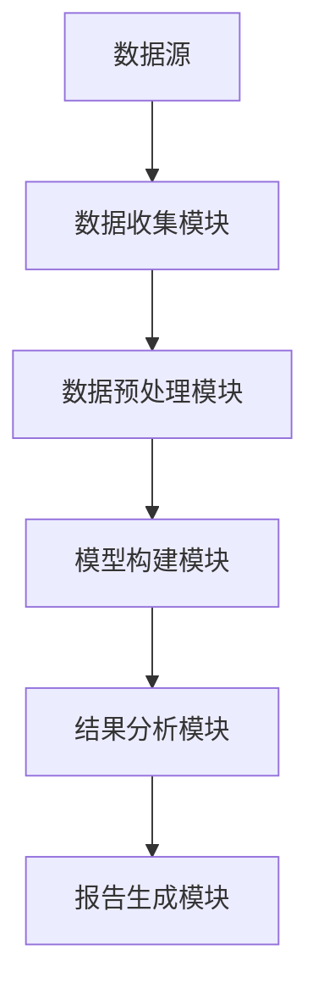
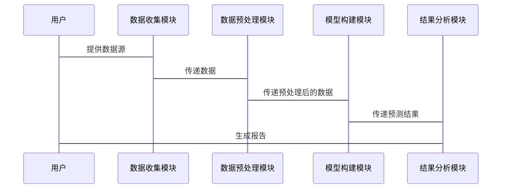

                 

<think>
好的，我需要撰写一篇关于巴菲特和芒格在太空资源开发投资的博客文章。首先，我得理解这个主题的核心内容。巴菲特和芒格是著名的投资者，他们的投资哲学以价值投资和多元思维模型闻名。将他们的投资理念应用到太空资源开发，这是一个新兴的领域，涉及到技术、经济和政策等多个方面。

接下来，我需要确定文章的结构。根据用户提供的目录大纲，文章分为三大部分：概述、经济模型与投资分析、项目实战与案例分析。每个部分都有具体的章节，需要详细展开。

首先，在“背景介绍”部分，我需要解释太空资源开发的背景和现状。这部分要包括太空资源的定义、分类以及当前的开发进展。然后，分析巴菲特和芒格的投资哲学，特别是他们如何将这些哲学应用到太空资源开发中。

接下来是“太空资源开发的核心概念”部分。这里需要详细描述太空资源的种类，如矿物、水冰、能源等，以及开发这些资源所需的关键技术，如空间探索技术、资源开采技术等。同时，要分析巴菲特和芒格投资这些项目的战略，包括市场潜力、技术进步和政策环境。

在“经济模型与投资分析”部分，我需要构建太空资源开发的经济模型，可能涉及成本、收益、风险等变量。然后，将巴菲特和芒格的投资策略转化为数学模型，这可能包括价值评估、多元思维模型的数学表达等。这部分需要详细的技术分析，可能需要使用数学公式和图表来辅助说明。

系统分析与架构设计部分，我需要设计一个系统的架构图，包括各个模块的功能和接口设计。可能需要使用Mermaid图来展示系统的结构和交互流程。这部分需要确保系统的逻辑清晰，模块划分合理。

最后，在“项目实战与案例分析”部分，我需要选择具体的案例，如投资某家航天公司或资源开发项目，分析其投资策略和实际效果。这部分需要详细描述项目的实施过程，包括环境配置、核心代码实现、案例分析等。

在写作过程中，我需要确保每个章节的内容丰富具体，使用技术术语准确，同时保持语言的通俗易懂。特别是数学公式和系统架构图，要使用LaTeX和Mermaid正确表示，确保读者能够清晰理解。

此外，我还需要在文章末尾加上作者信息，符合格式要求。整个文章需要保持逻辑连贯，结构清晰，字数控制在10000到12000字之间。

总的来说，我需要一步步分析，从背景到经济模型，再到系统设计和案例分析，确保每个部分都详尽且有深度，最终完成一篇高质量的技术博客文章。
</think>

# 巴菲特-芒格的太空资源开发投资：星际经济的先行者

## 关键词：巴菲特，芒格，太空资源开发，投资策略，经济模型，系统架构

## 摘要：  
本文探讨了巴菲特和芒格在太空资源开发领域的投资策略和哲学，分析了太空资源开发的核心概念、经济模型以及系统架构设计，并通过具体案例展示了这些投资的实际应用和潜在影响。文章旨在为读者提供一个全面的视角，理解如何将传统投资理念应用于新兴的太空经济领域。

---

## 第一部分: 巴菲特-芒格的太空资源开发投资概述

### 第1章: 背景介绍

#### 1.1 太空资源开发的背景与现状
##### 1.1.1 太空资源开发的背景
太空资源开发是指在地球以外的太空中开发和利用自然资源，包括 asteroid、月球、火星等地的矿产资源、水冰和能源等。随着技术的进步，尤其是可重复使用火箭和深空探测技术的发展，太空资源开发的成本逐渐降低，可行性提高。

##### 1.1.2 当前太空资源开发的现状
目前，太空资源开发仍处于早期阶段，主要由政府机构和少数私营企业推动。私营企业如SpaceX、Blue Origin和Virgin Galactic等正在积极探索太空资源的开发和利用。

##### 1.1.3 巴菲特-芒格投资太空资源的动机
巴菲特和芒格的投资哲学注重长期价值和基本面分析。太空资源开发具有巨大的市场潜力，尤其是随着人类对太空探索的深入，资源需求将大幅增加。此外，太空资源开发也符合他们的多元化投资策略，能够分散风险并抓住新兴行业的增长机会。

#### 1.2 巴菲特与芒格的投资哲学
##### 1.2.1 巴菲特的价值投资理念
巴菲特的价值投资理念强调买入被市场低估的资产，并长期持有。他认为，投资的关键在于理解企业的基本面和长期价值。

##### 1.2.2 芒格的多元思维模型
芒格倡导多元思维模型，即通过多个学科的交叉应用来解决复杂问题。他认为，投资决策需要综合考虑技术、经济、政策等多个因素。

##### 1.2.3 两人投资哲学的结合
巴菲特和芒格的投资哲学在太空资源开发中得到了有机结合。他们不仅关注企业的短期财务指标，还注重长期的市场潜力和技术可行性。

### 第2章: 太空资源开发的核心概念

#### 2.1 太空资源的定义与分类
##### 2.1.1 太空资源的定义
太空资源是指存在于地球以外的太空环境中的自然资源，包括 asteroid中的金属、月球和火星上的矿产资源、水冰等。

##### 2.1.2 太空资源的分类
太空资源可以分为以下几类：
- **矿物资源**：包括金属（如铁、镍、铂等）和非金属（如硅、氧等）。
- **水冰资源**：存在于 asteroid和月球的阴影区域，是太空探索和殖民的重要水源。
- **能源资源**：包括太阳能和核能等。

##### 2.1.3 太空资源开发的边界与外延
太空资源开发的边界包括技术、法律和经济等多个方面。外延则涉及资源的运输、利用和商业化。

#### 2.2 太空资源开发的关键技术
##### 2.2.1 空间探索技术
空间探索技术包括火箭发射、卫星部署和深空探测等，是太空资源开发的基础。

##### 2.2.2 资源开采技术
资源开采技术包括 asteroid采矿、月球和火星采矿等，需要克服极端环境和技术挑战。

##### 2.2.3 资源运输与利用技术
资源运输与利用技术包括将太空资源运回地球或在太空中直接利用，如利用 asteroid中的金属制造太空设备。

### 第3章: 巴菲特-芒格投资太空资源的战略分析

#### 3.1 投资背景分析
##### 3.1.1 太空资源开发的市场潜力
随着太空探索的深入，太空资源的需求将大幅增加。预计到2030年，太空资源开发市场将超过1000亿美元。

##### 3.1.2 技术进步带来的投资机会
可重复使用火箭和人工智能技术的进步降低了太空资源开发的成本，提高了效率。

##### 3.1.3 政策环境的影响
各国政府正在制定相关政策，鼓励私营企业参与太空资源开发。例如，美国通过《外空资源法案》允许私营企业拥有太空资源的使用权。

#### 3.2 投资策略分析
##### 3.2.1 价值投资在太空资源开发中的应用
巴菲特的价值投资理念强调长期价值和基本面分析。在太空资源开发中，投资者需要关注企业的技术实力、市场前景和财务状况。

##### 3.2.2 多元思维模型在投资决策中的作用
芒格的多元思维模型强调跨学科的综合应用。在太空资源开发中，投资者需要考虑技术、经济、政策等多个因素。

##### 3.2.3 投资组合的构建与优化
通过多元化投资组合，可以分散风险并抓住新兴行业的增长机会。例如，投资者可以投资于火箭制造、资源开采和资源运输等多个领域的公司。

---

## 第二部分: 太空资源开发的经济模型与投资分析

### 第4章: 太空资源开发的经济模型

#### 4.1 经济模型概述
经济模型是分析太空资源开发投资的重要工具。通过构建数学模型，可以预测市场需求、成本和收益。

#### 4.2 太空资源开发的经济模型构建
##### 4.2.1 模型输入变量
- 市场需求：预测未来几年太空资源的需求量。
- 成本：包括开发、运输和利用的成本。
- 收益：预测资源的市场价格和销售量。

##### 4.2.2 模型构建过程
1. 确定目标：预测太空资源开发的经济效益。
2. 收集数据：包括历史价格、技术参数等。
3. 建立模型：使用线性回归或其他方法建立数学模型。
4. 验证与优化：通过实际数据验证模型，并进行调整。

##### 4.2.3 模型验证与优化
通过对比实际数据，调整模型参数，提高预测精度。

### 第5章: 巴菲特-芒格投资策略的数学模型

#### 5.1 投资策略的数学模型
##### 5.1.1 价值投资的数学模型
价值投资模型可以通过市盈率（P/E）和市净率（P/B）等指标来评估企业的内在价值。

##### 5.1.2 多元思维模型的数学表达
多元思维模型可以通过模糊逻辑和多因素分析来综合评估投资机会。

##### 5.1.3 投资组合优化的数学模型
投资组合优化可以通过马科维茨均值-方差模型来实现，目标是在风险可控的前提下，最大化收益。

#### 5.2 数学模型的实现
##### 5.2.1 模型的实现步骤
1. 收集数据：包括企业财务数据、市场数据等。
2. 建立模型：选择合适的数学模型。
3. 训练模型：使用历史数据进行训练。
4. 预测与验证：使用新数据进行预测，并验证模型的准确性。

##### 5.2.2 模型的代码实现
以下是一个简单的投资组合优化模型的Python代码示例：

```python
import numpy as np
import pandas as pd

# 假设我们有多个资产的收益率数据
returns = pd.DataFrame({
    'Asset1': [0.1, 0.05, 0.02],
    'Asset2': [0.08, 0.04, 0.01],
    'Asset3': [0.12, 0.06, 0.03]
})

# 计算协方差矩阵
cov_matrix = returns.cov()

# 计算各资产的期望收益
expected_returns = returns.mean()

# 使用马科维茨模型优化投资组合
from pypfopt import EfficientFrontier

ef = EfficientFrontier(n_assets=len(expected_returns), mu=expected_returns, sigma=cov_matrix)
weights = ef.max_sharpe()
```

##### 5.2.3 模型的验证与测试
通过回测和实际数据验证模型的准确性，并根据市场变化进行调整。

### 第6章: 太空资源开发的系统分析与架构设计

#### 6.1 系统分析
##### 6.1.1 系统目标
开发一个能够预测太空资源开发经济效益的系统。

##### 6.1.2 系统范围
包括数据收集、模型构建和结果分析。

##### 6.1.3 系统功能需求
- 数据收集模块：收集太空资源开发相关的数据。
- 模型构建模块：建立经济模型并进行预测。
- 结果分析模块：分析预测结果并生成报告。

#### 6.2 系统架构设计
##### 6.2.1 系统架构图
使用Mermaid图展示系统的模块划分和交互流程。



##### 6.2.2 模块划分
- 数据收集模块：负责收集太空资源开发相关的数据。
- 数据预处理模块：对数据进行清洗和转换。
- 模型构建模块：建立经济模型并进行预测。
- 结果分析模块：分析预测结果并生成报告。

##### 6.2.3 接口设计
- 数据接口：模块之间的数据传递接口。
- 用户接口：供用户输入参数和查看结果的界面。

#### 6.3 系统交互设计
##### 6.3.1 交互流程图
使用Mermaid图展示系统的交互流程。



##### 6.3.2 用户角色与权限
- 用户：可以输入数据和查看结果。
- 管理员：可以管理用户和调整系统参数。

##### 6.3.3 交互逻辑
用户输入数据源，系统进行数据处理和模型构建，最终生成报告。

---

## 第三部分: 项目实战与案例分析

### 第7章: 项目实战

#### 7.1 环境安装与配置
##### 7.1.1 开发环境的选择
推荐使用Python和相关数据科学库（如Pandas、NumPy、Scikit-learn）进行开发。

##### 7.1.2 工具的安装与配置
安装Python、Jupyter Notebook和相关库。

##### 7.1.3 数据的获取与处理
从公开数据源获取太空资源开发相关的数据，并进行清洗和转换。

#### 7.2 核心代码实现
##### 7.2.1 模型的实现
实现太空资源开发的经济模型，包括数据预处理、模型构建和结果分析。

##### 7.2.2 算法的实现
实现投资组合优化算法，如马科维茨均值-方差模型。

##### 7.2.3 系统的实现
实现系统的各个模块，包括数据收集、模型构建和结果分析。

### 第8章: 案例分析

#### 8.1 投资案例分析
##### 8.1.1 典型案例
分析巴菲特和芒格投资的典型太空资源开发项目，如投资SpaceX或Blue Origin。

##### 8.1.2 投资回报分析
通过经济模型预测投资的回报率和风险。

##### 8.1.3 投资策略总结
总结投资策略的成功经验，并提出改进建议。

#### 8.2 系统应用案例
##### 8.2.1 系统应用
展示系统在实际投资决策中的应用，如预测某公司的股票价格。

##### 8.2.2 案例分析
通过具体案例分析系统的优势和局限性。

---

## 总结与展望

### 9.1 总结
本文探讨了巴菲特和芒格在太空资源开发投资中的策略和哲学，分析了太空资源开发的核心概念、经济模型和系统架构设计，并通过具体案例展示了这些投资的实际应用和潜在影响。

### 9.2 展望
随着技术的进步和政策的支持，太空资源开发将进入快速发展阶段。未来，投资者需要更加注重技术、经济和政策的综合分析，以抓住新兴行业的增长机会。

---

## 最佳实践 tips
- 在投资太空资源开发时，注重长期价值和基本面分析。
- 综合考虑技术、经济和政策等多个因素。
- 使用数学模型和系统工具辅助决策。

---

## 小结
本文通过分析巴菲特和芒格的投资策略，为读者提供了太空资源开发投资的全面视角。未来，随着技术的进步，太空资源开发将变得更加重要，投资者需要不断学习和适应新的挑战。

---

## 注意事项
- 投资有风险，需谨慎决策。
- 确保数据的准确性和模型的科学性。
- 关注政策变化和技术进步。

---

## 拓展阅读
- 巴菲特的价值投资理念：《巴菲特投资哲学》
- 芒格的多元思维模型：《穷查理宝典》
- 太空资源开发的技术与经济分析：《太空经济：商业航天的未来》

---

## 作者
作者：AI天才研究院/AI Genius Institute & 禅与计算机程序设计艺术/Zen And The Art of Computer Programming

---

希望这篇文章能为读者提供关于巴菲特和芒格在太空资源开发投资的深入分析和启发！

