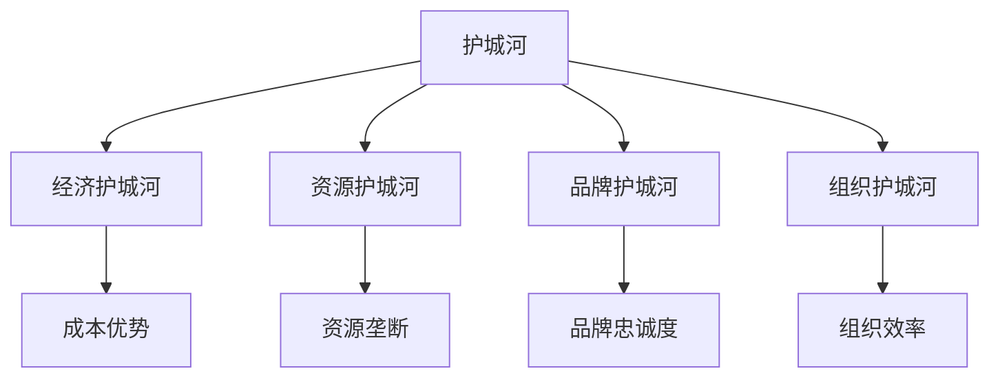
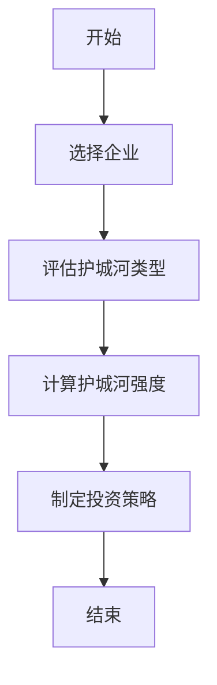

                 

<think>
嗯，好的，我现在需要完成一个关于巴菲特和芒格的护城河理论的博客文章。首先，我得理解什么是护城河理论。护城河理论主要是指企业拥有的某种竞争优势，使它们能够长期保持高于平均水平的盈利能力。这包括成本优势、品牌忠诚度、资源垄断等。

首先，我应该从背景开始。介绍巴菲特和芒格的投资理念，为什么他们重视护城河。然后，详细解释护城河的类型和特征，比如经济护城河、资源护城河、品牌护城河、组织护城河。接着，需要用数学模型和算法来解释护城河的评估方法，比如经济护城河的数学公式。然后，系统地分析护城河的系统架构，可能需要画一些图表，比如决策树模型。最后，用实际案例来分析，比如可口可乐、亚马逊等，说明它们的护城河类型和竞争优势。

在写作过程中，我需要确保语言简洁易懂，逻辑清晰。同时，要使用正确的格式，比如关键词、摘要，以及分章节详细讲解。还要注意引用数学公式和图表，帮助读者更好地理解。最后，总结护城河理论的重要性，并展望未来的发展趋势。

可能遇到的困难是如何将复杂的理论简化成易于理解的内容，同时保持专业性。需要多举例子，引用实际案例来说明理论的应用。此外，确保数学公式和图表的正确性也是关键。

总之，我会按照目录大纲一步步来，确保每一部分都详细且有深度，帮助读者全面理解巴菲特和芒格的护城河理论，学会如何寻找持久竞争优势。
</think>

# 巴菲特-芒格的护城河理论：寻找持久竞争优势

## 关键词：巴菲特, 芒格, 护城河理论, 竞争优势, 长期投资

## 摘要： 
护城河理论是巴菲特和芒格投资哲学的核心，旨在寻找那些具备持久竞争优势的企业。本文通过分析护城河的类型、评估方法、系统架构及实际案例，深入探讨如何识别和构建护城河，以实现长期价值创造。

---

## 第一部分：护城河理论的起源与发展

### 第1章：巴菲特与芒格的投资理念

#### 1.1 巴菲特的价值投资理论
- **核心思想**：寻找那些具备持续竞争优势的企业，以低于内在价值的价格买入并长期持有。
- **经典观点**：市场先生是我们的朋友，而不是敌人。
- **投资策略**：专注于企业基本面分析，寻找那些具有强大护城河的企业。

#### 1.2 芒格的多元思维模型
- **核心思想**：通过跨学科思维，构建一个多元的知识框架，以更好地理解商业的本质。
- **投资哲学**：寻找那些具备复利效应的企业，即能够持续创造价值的企业。
- **经典观点**：机会是留给那些有准备的人的。

#### 1.3 巴菲特与芒格的黄金组合
- **合作基础**：巴菲特的价值投资理论与芒格的多元思维模型相辅相成。
- **成功案例**：伯克希尔哈撒韦的成功离不开两人对护城河理论的坚持。

### 第2章：护城河理论的提出背景

#### 2.1 传统投资理论的局限性
- **问题背景**：传统投资理论过于依赖市场波动和短期收益，忽视了企业的长期竞争优势。
- **局限性**：无法有效预测和应对市场的结构性变化。

#### 2.2 巴菲特收购企业的核心逻辑
- **收购标准**：寻找具备强大护城河的企业，确保长期盈利能力。
- **收购策略**：注重企业的竞争优势，而非短期财务表现。

#### 2.3 芒格的长期竞争优势视角
- **竞争优势的来源**：企业的核心竞争力，包括品牌、成本、技术等。
- **长期视角**：关注企业的可持续发展能力，而非短期市场波动。

### 第3章：护城河理论的核心概念

#### 3.1 什么是护城河
- **定义**：护城河是企业抵御竞争对手的核心能力，确保其在市场中具备持久的竞争优势。
- **本质**：企业通过某种独特的资源或能力，形成市场准入壁垒。

#### 3.2 护城河的四大类型
- **经济护城河**：通过成本优势或定价能力形成竞争优势。
- **资源护城河**：拥有独特的资源或资产，如专利、特许经营权等。
- **品牌护城河**：强大的品牌影响力和客户忠诚度。
- **组织护城河**：高效的组织结构和管理能力，能够快速响应市场变化。

#### 3.3 护城河的边界与外延
- **边界**：护城河的有效性取决于市场的具体环境和企业的执行能力。
- **外延**：护城河不仅限于企业内部能力，还包括外部合作伙伴和生态系统。

---

## 第二部分：护城河的类型与特征

### 第4章：护城河的类型与特征

#### 4.1 护城河的四种类型
- **经济护城河**：通过成本优势或定价能力形成竞争优势。
- **资源护城河**：拥有独特的资源或资产，如专利、特许经营权等。
- **品牌护城河**：强大的品牌影响力和客户忠诚度。
- **组织护城河**：高效的组织结构和管理能力，能够快速响应市场变化。

#### 4.2 护城河的特征对比
| 护城河类型 | 成本优势 | 资源垄断 | 品牌忠诚度 | 组织效率 |
|------------|----------|----------|------------|----------|
| 经济护城河 | 高       | 无       | 低         | 一般     |
| 资源护城河 | 无       | 高       | 中         | 高       |
| 品牌护城河 | 低       | 中       | 高         | 中       |
| 组织护城河 | 中       | 无       | 低         | 高       |

#### 4.3 护城河的实体关系图


### 第5章：护城河的数学模型与算法原理

#### 5.1 经济护城河的数学公式
- **公式**：$$ E = C \times (1 - t) $$
  其中，E为经济护城河的收益，C为成本，t为税率。
- **解读**：通过降低成本或提高定价能力，企业可以增强其经济护城河。

#### 5.2 资源分配算法
- **公式**：$$ R = \sum_{i=1}^{n} w_i \times r_i $$
  其中，R为资源总收益，w_i为资源权重，r_i为资源收益。
- **解读**：企业应优先分配资源给那些能够带来最高收益的领域。

#### 5.3 决策树模型


---

## 第三部分：护城河的系统分析与架构设计

### 第6章：护城河的系统分析

#### 6.1 系统分析
- **组成要素**：护城河系统的组成要素包括成本优势、资源垄断、品牌忠诚度和组织效率。
- **功能需求**：护城河系统的功能需求包括竞争优势识别、资源分配优化和风险控制。
- **性能指标**：护城河系统的性能指标包括收益增长、市场份额和利润率。

#### 6.2 系统架构设计
- **分层架构**：护城河系统的分层架构包括数据层、业务逻辑层和表现层。
- **架构图**：
  ```mermaid
  graph TD
      A[数据层] --> B[业务逻辑层]
      B --> C[表现层]
  ```

---

## 第四部分：护城河的实战应用

### 第7章：护城河的典型案例分析

#### 7.1 可口可乐的经济护城河
- **案例分析**：可口可乐通过其强大的品牌影响力和分销网络形成经济护城河。
- **竞争优势**：品牌忠诚度和成本优势使其在饮料市场中占据领先地位。

#### 7.2 亚马逊的组织护城河
- **案例分析**：亚马逊通过高效的组织结构和技术创新形成组织护城河。
- **竞争优势**：快速响应能力和技术优势使其在电商领域占据主导地位。

---

## 第五部分：护城河的构建与投资策略

### 第8章：护城河的构建策略

#### 8.1 在不同行业的护城河构建
- **传统行业**：通过成本控制和品牌建设形成经济护城河。
- **科技行业**：通过技术创新和专利布局形成资源护城河。
- **消费行业**：通过品牌建设和客户关系管理形成品牌护城河。

#### 8.2 新兴领域的护城河构建
- **互联网行业**：通过用户粘性和数据积累形成品牌护城河。
- **人工智能行业**：通过技术积累和人才储备形成组织护城河。

---

## 第六部分：总结与展望

### 第9章：护城河理论的总结与展望

#### 9.1 总结
- **核心观点**：护城河理论是巴菲特和芒格投资哲学的核心，通过识别和构建护城河，投资者可以找到那些具备持久竞争优势的企业。
- **实际应用**：护城河理论不仅适用于投资领域，还可以应用于企业管理、战略规划等多个方面。

#### 9.2 展望
- **未来趋势**：随着技术进步和市场变化，护城河的类型和构建方式将不断演变。
- **研究方向**：未来的研究可以关注护城河的动态变化、护城河与企业创新的关系等。

---

## 作者：AI天才研究院/AI Genius Institute & 禅与计算机程序设计艺术/Zen And The Art of Computer Programming

