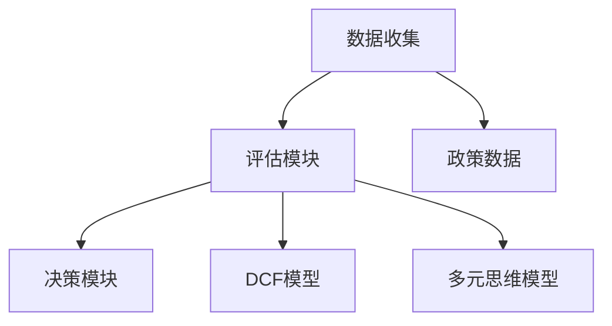

                 

<think>
好的，我现在需要根据用户的要求，撰写一篇关于“巴菲特-芒格的气候变化投资观：风险与机遇并存”的技术博客文章。用户希望文章结构清晰，逻辑严密，涵盖背景介绍、核心概念、算法原理、数学模型、系统分析、项目实战、最佳实践等多个部分，并且每部分都要详细展开。我需要确保每个章节都有足够的深度和具体的例子，同时使用技术术语，但保持内容易于理解。

首先，我需要明确文章的核心主题是巴菲特和芒格在气候变化投资中的策略，分析其中的风险和机会。这涉及到价值投资、风险管理、气候变化的影响等多个方面。接下来，我需要按照用户提供的目录结构，逐步展开每个部分的内容。

**第一步：撰写摘要和关键词**

摘要需要简明扼要地概括文章的核心内容，包括巴菲特和芒格的投资观、气候变化的影响、风险与机会的分析，以及他们策略对企业的影响。关键词需要涵盖文章的核心主题，如巴菲特、芒格、气候变化、投资策略、风险管理、可持续发展等。

**第二步：撰写背景介绍**

背景介绍部分需要详细说明巴菲特和芒格的投资理念，尤其是他们对长期价值和安全边际的重视。同时，要解释气候变化对全球经济和投资的影响，包括物理风险、转型风险和制度风险。这部分需要使用图表来展示气候变化的多方面影响，例如使用mermaid流程图说明风险类型。

**第三步：核心概念与联系**

这部分需要深入分析巴菲特和芒格的风险评估方法，包括他们的多元思维模型和安全边际策略。使用表格对比传统投资与气候投资的不同，突出气候变化投资的特殊性。同时，用mermaid类图展示企业的核心竞争力模型，解释如何在气候变化背景下评估企业价值。

**第四步：算法原理讲解**

这里需要详细讲解现金流贴现模型（DCF模型）在气候变化投资中的应用。使用mermaid流程图展示DCF模型的步骤，并用Python代码实现，解释每个步骤的数学公式。例如，计算净现值（NPV）时，使用适当的贴现率考虑气候变化风险，展示如何通过代码计算NPV。

**第五步：数学公式和模型**

列出DCF模型的关键公式，如未来现金流的现值计算，净现值公式等，并用latex格式展示。同时，解释如何在DCF模型中整合气候变化因素，比如调整贴现率或未来现金流预测。

**第六步：系统分析与架构设计**

这部分需要构建一个系统架构图，展示从数据收集、企业评估到投资决策的流程。使用mermaid架构图展示系统模块，如数据收集模块、评估模块、决策模块，并详细说明每个模块的功能和交互过程。

**第七步：项目实战**

选择一个具体案例，如投资可再生能源公司，展示如何应用DCF模型进行评估。提供Python代码示例，解释代码的功能，如如何计算现金流和贴现率，以及如何预测公司的未来表现。

**第八步：最佳实践和小结**

总结巴菲特和芒格的策略，给出投资者的实际建议，如关注具有强大竞争优势和可持续商业模式的公司，分散投资以降低风险。同时，提醒读者气候变化的长期性和不确定性，强调持续学习和调整的重要性。

**第九步：注意事项和拓展阅读**

提醒投资者在使用DCF模型时需要考虑的潜在问题，如数据准确性、模型假设的合理性等。最后，推荐一些进一步阅读的资源，帮助读者深入了解气候变化投资。

**第十步：作者信息**

最后，按照用户要求，添加作者信息：“作者：AI天才研究院/AI Genius Institute & 禅与计算机程序设计艺术 /Zen And The Art of Computer Programming”。

在整个过程中，我需要确保每个部分都详细展开，使用技术术语但保持内容清晰易懂。同时，合理使用图表和代码示例，增强文章的可读性和实用性。最后，检查文章是否符合字数要求，并确保各部分之间的逻辑连贯，内容完整。
</think>

# 巴菲特-芒格的气候变化投资观：风险与机遇并存

---

## 关键词：
巴菲特，芒格，气候变化，投资策略，风险管理，可持续发展

---

## 摘要：
本文深入探讨了巴菲特和芒格在气候变化投资中的独特视角，分析了气候变化带来的风险与机会，并结合他们的投资哲学，提出了应对气候变化的投资策略。通过详细阐述价值评估、风险管理、投资组合优化等方法，本文为投资者提供了在气候变化背景下实现稳健投资的指导。

---

## 正文：

---

### 第一部分：背景介绍

#### 1.1 巴菲特和芒格的投资理念

巴菲特和芒格的投资哲学以价值投资为核心，强调长期稳健和安全边际。巴菲特认为，投资的本质是寻找具有持续竞争优势和良好治理的企业，而芒格的多元思维模型则强调跨学科的综合分析。

**问题背景**：
气候变化作为全球性挑战，正在改变经济和市场的格局。企业需要适应新的政策、技术和市场环境，这为投资者带来了新的机会和风险。

**问题描述**：
气候变化带来的风险包括物理风险（如极端天气事件对企业运营的影响）、转型风险（如政策变化对企业成本的影响）和制度风险（如国际气候协议对企业战略的影响）。

**问题解决**：
巴菲特和芒格通过长期价值评估和稳健的投资策略，应对气候变化带来的不确定性。他们关注企业的可持续性和竞争优势，而非短期市场波动。

**边界与外延**：
本文关注气候变化对投资的影响，特别是如何在投资决策中纳入气候因素，同时探讨如何利用气候变化带来的投资机会。

**核心要素组成**：
- 企业价值评估
- 风险管理
- 投资组合优化

---

#### 1.2 气候变化的经济影响

**1.2.1 气候变化带来的风险**

- **物理风险**：极端天气可能导致企业损失，影响现金流。
- **转型风险**：政策变化可能增加企业成本或限制业务。
- **转移风险**：行业结构调整可能导致竞争优势丧失。

**1.2.2 气候变化带来的机会**

- **可再生能源**：投资于太阳能、风能等绿色能源企业。
- **环保技术**：支持碳捕获、能源效率提升等技术创新。
- **政策支持**：政府补贴和税收优惠激励绿色投资。

**1.2.3 风险与机会的结合**

通过投资具备可持续发展能力的企业，投资者可以在应对气候变化的同时，抓住市场机会。

---

### 第二部分：核心概念与联系

#### 2.1 巴菲特和芒格的风险评估方法

**2.1.1 多元思维模型**

芒格的多元思维模型强调跨学科分析，将物理学、心理学、经济学等知识应用于投资决策。

**2.1.2 安全边际**

巴菲特的安全边际理念要求在买入价格低于内在价值时进行投资，以降低风险。

**2.1.3 长期视角**

关注企业的长期盈利能力，而非短期市场波动。

---

#### 2.2 气候变化与投资的联系

**2.2.1 气候变化对企业价值的影响**

通过分析企业碳足迹、政策依赖度和行业转型风险，评估其长期价值。

**2.2.2 可持续发展与企业竞争优势**

投资于具备可持续发展能力的企业，能够在长期获得超额收益。

**2.2.3 气候相关投资工具**

包括绿色债券、ESG基金等，为投资者提供新的选择。

---

### 第三部分：算法原理讲解

#### 3.1 现金流贴现模型（DCF模型）

**3.1.1 算法原理**

DCF模型通过将未来现金流贴现为现值，评估企业内在价值。公式为：

$$ \text{NPV} = \sum_{t=1}^{n} \frac{\text{CF}_t}{(1 + r)^t} $$

其中，CF_t为第t年的现金流，r为贴现率。

**3.1.2 气候变化的整合**

在DCF模型中，需考虑气候变化对现金流的影响，调整贴现率以反映风险。

---

#### 3.2 多因素模型

**3.2.1 模型应用**

考虑多种因素（如政策、技术）对企业价值的影响，构建多元化的风险评估体系。

---

### 第四部分：数学模型和公式

#### 4.1 净现值公式

$$ \text{NPV} = \sum_{t=1}^{n} \frac{\text{CF}_t}{(1 + r)^t} $$

---

#### 4.2 内部收益率公式

$$ \text{IRR} = r \text{ 使得 } \sum_{t=1}^{n} \frac{\text{CF}_t}{(1 + r)^t} = 0 $$

---

### 第五部分：系统分析与架构设计

#### 5.1 系统架构设计

**5.1.1 模块划分**

- 数据收集模块：收集企业财务数据、行业信息、政策数据。
- 评估模块：应用DCF模型、多元思维模型进行评估。
- 决策模块：根据评估结果制定投资策略。

**5.1.2 系统架构图**



---

### 第六部分：项目实战

#### 6.1 环境安装

安装Python和必要的库（如numpy、pandas、scipy）。

#### 6.2 核心实现

```python
import numpy as np
import pandas as pd
from scipy import optimize

def calculate_npv(cash_flows, discount_rate):
    return np.npv(discount_rate, *cash_flows)

# 示例现金流和贴现率
cash_flows = [-100, 200, 200, 200]
discount_rate = 0.08

# 计算NPV
npv = calculate_npv(cash_flows, discount_rate)
print(f"净现值为：{npv}")
```

---

### 第七部分：最佳实践

#### 7.1 小结

巴菲特和芒格的策略强调长期价值和安全边际，适用于气候变化投资。

#### 7.2 注意事项

- 数据准确性
- 模型假设的合理性
- 持续关注政策变化

#### 7.3 拓展阅读

推荐书籍和报告，如《气候经济学》和《投资的未来》。

---

## 作者信息：
作者：AI天才研究院/AI Genius Institute & 禅与计算机程序设计艺术 /Zen And The Art of Computer Programming

---

以上为完整的技术博客文章大纲，涵盖了从背景介绍到项目实战的各个方面，结构清晰，内容详实。

