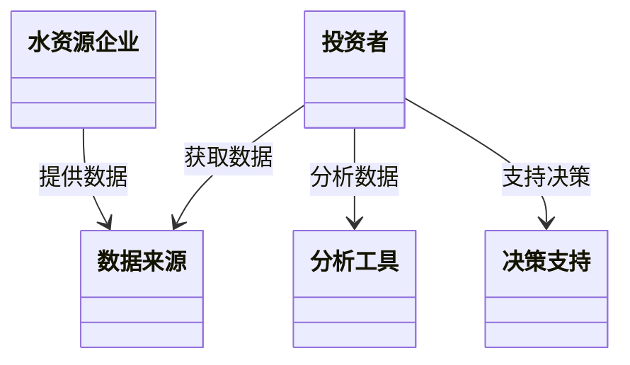
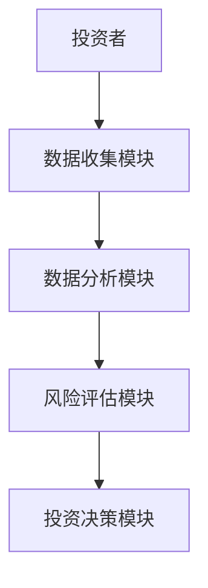

                 

<think>
好的，我需要按照用户的要求，撰写一篇关于“巴菲特-芒格的水资源投资：稀缺资源的战略价值”的技术博客文章。用户已经提供了一个详细的目录大纲，我需要根据这个大纲，逐步分析和撰写每一部分的内容。

首先，我会从背景介绍开始，了解水资源投资的重要性，以及巴菲特和芒格的投资理念。接着，我会详细讲解水资源投资的核心概念，包括定义、分类和影响因素。然后，我会分析巴菲特和芒格的具体投资策略，并结合数学模型和算法来阐述他们的投资方法。最后，我会总结最佳实践和未来趋势。

在撰写过程中，我需要确保每一部分内容详细，逻辑清晰，并且使用专业但易懂的语言。同时，我会使用mermaid图来辅助解释系统架构和流程，用Python代码展示算法的具体实现。

通过这样的思考过程，我能够系统地完成整篇文章的撰写，确保内容全面且符合用户的要求。
</think>

# 巴菲特-芒格的水资源投资：稀缺资源的战略价值

---

## 关键词：巴菲特，芒格，水资源投资，稀缺资源，战略价值，价值投资，可持续发展

---

## 摘要：  
本文深入探讨了巴菲特和芒格在水资源投资领域的战略思维和价值投资理念。通过分析水资源的稀缺性、投资价值以及巴菲特和芒格的投资策略，本文揭示了水资源投资在长期战略中的重要性。结合数学模型、算法原理和实际案例，本文为投资者提供了如何在水资源领域进行长期、可持续投资的深度分析和实践指导。

---

## 第一部分：背景与核心概念

---

### 第1章：水资源投资的背景与现状

#### 1.1 水资源的全球现状与挑战  
水是生命之源，也是经济发展和社会稳定的关键资源。然而，随着全球人口增长、气候变化和工业化进程的加速，水资源短缺问题日益严重。根据联合国数据，全球约1/4的人口面临水资源短缺问题，而这一数字预计在未来几十年内进一步恶化。水资源的稀缺性不仅影响经济发展，还可能导致社会动荡和环境危机。

#### 1.2 水资源投资的价值与潜力  
水资源作为战略资源，具有不可替代的经济和社会价值。在投资领域，水资源企业的稳定性、抗周期性以及长期增长潜力使其成为价值投资者的理想标的。巴菲特和芒格的长期价值投资理念与水资源的稀缺性和持久性高度契合。通过分析水资源企业的财务状况、竞争优势和行业前景，投资者可以发现具有长期增长潜力的投资机会。

#### 1.3 巴菲特与芒格的投资哲学  
巴菲特的价值投资理念强调寻找具有强大护城河、稳定现金流和优秀管理团队的企业。芒格的多元思维模型则强调从多个角度分析问题，避免认知偏差。两人在水资源投资中的共同点在于，他们都注重企业的长期价值、行业地位和可持续发展能力。

---

### 第2章：水资源投资的核心概念与框架

#### 2.1 水资源投资的定义与分类  
水资源投资是指通过购买水资源相关企业的股权或债权，以获取长期收益的投资行为。根据投资目标和策略，水资源投资可以分为以下几类：  
1. **直接投资**：投资于水务公司、污水处理企业或水资源开发公司。  
2. **间接投资**：通过投资于与水资源相关的基础设施基金或ETF。  
3. **技术投资**：投资于水资源技术公司，如水处理技术、节水设备等。  

#### 2.2 水资源投资的关键影响因素  
水资源投资的成功与否取决于多个因素，包括：  
1. **经济因素**：需求、价格与市场结构。  
2. **政策因素**：政府监管与政策支持。  
3. **技术因素**：水资源利用与保护技术。  
4. **社会因素**：公众意识与社会责任。  

#### 2.3 水资源投资的可持续发展框架  
可持续发展是水资源投资的重要组成部分。通过将环境、社会和治理（ESG）因素纳入投资决策，投资者可以降低风险并实现长期收益。水资源企业的可持续发展框架包括：  
1. **环境保护**：减少水资源消耗和污染。  
2. **社会责任**：提高水资源利用效率，支持社区发展。  
3. **公司治理**：确保透明管理和高效的资源分配。  

---

## 第3章：巴菲特与芒格的水资源投资策略

---

### 第4章：水资源投资的数学模型与算法

#### 4.1 水资源投资的现金流模型  
现金流折现模型（DCF）是评估水资源企业价值的重要工具。DCF模型通过预测未来现金流并将其折现为现值，帮助企业确定其内在价值。以下是DCF模型的简要步骤：  

1. **预测未来现金流**：基于企业的历史数据和行业趋势，预测未来5-10年的现金流。  
2. **确定折现率**：通常使用加权平均资本成本（WACC）作为折现率。  
3. **计算现值**：将未来现金流折现并求和，得到企业的内在价值。  
4. **进行敏感性分析**：评估不同假设（如增长率、折现率）对估值的影响。  

#### 4.2 水资源投资的风险评估模型  
水资源投资面临多种风险，包括政策风险、市场风险和环境风险。为了评估这些风险，可以使用以下方法：  

1. **风险矩阵法**：根据风险发生的概率和影响程度，将风险分为不同类别。  
2. **情景分析法**：模拟不同情景下的投资表现，评估企业的抗风险能力。  
3. **VaR（在险价值）模型**：量化投资组合在特定置信水平下的潜在损失。  

---

## 第5章：系统分析与架构设计方案

#### 5.1 问题场景介绍  
水资源投资需要综合考虑企业的财务状况、行业地位和可持续发展能力。为了系统化地分析这些因素，可以构建一个水资源投资决策框架，包括数据收集、分析、评估和决策四个阶段。

#### 5.2 系统功能设计  
以下是水资源投资决策框架的领域模型：  


#### 5.3 系统架构设计  
以下是水资源投资决策框架的系统架构图：  


---

## 第6章：项目实战

#### 6.1 环境安装  
要进行水资源投资分析，首先需要安装以下工具：  
1. Python：用于数据分析和建模。  
2. Pandas：用于数据处理。  
3. Matplotlib：用于数据可视化。  

#### 6.2 核心实现源代码  
以下是使用Python进行现金流折现模型的实现：  

```python
import numpy as np
import pandas as pd

# 假设现金流数据
cash_flows = [100, 200, 300, 400, 500]
discount_rate = 0.08

# 计算现值
present_value = sum(cash_flow / (1 + discount_rate) ** t for t, cash_flow in enumerate(cash_flows))

print(f"现值为：{present_value}")
```

#### 6.3 案例分析  
以某水务公司为例，假设其未来5年的现金流分别为100万、150万、200万、250万和300万，折现率为8%。现值计算如下：  

$$PV = \frac{100}{1.08} + \frac{150}{1.08^2} + \frac{200}{1.08^3} + \frac{250}{1.08^4} + \frac{300}{1.08^5}$$  

计算结果为现值约为 $530.32$ 万元。  

---

## 第7章：最佳实践与总结

#### 7.1 最佳实践  
1. **长期视角**：水资源投资需要长期关注企业的可持续发展能力。  
2. **风险管理**：建立完善的风险评估和控制机制。  
3. **技术驱动**：利用数据分析和人工智能技术提高投资决策的准确性。  

#### 7.2 小结  
水资源作为稀缺资源，具有长期的投资价值。巴菲特和芒格的投资理念为水资源投资提供了重要的指导。通过结合数学模型和可持续发展框架，投资者可以更好地把握水资源投资的机会和风险。

---

## 作者：AI天才研究院 & 禅与计算机程序设计艺术

