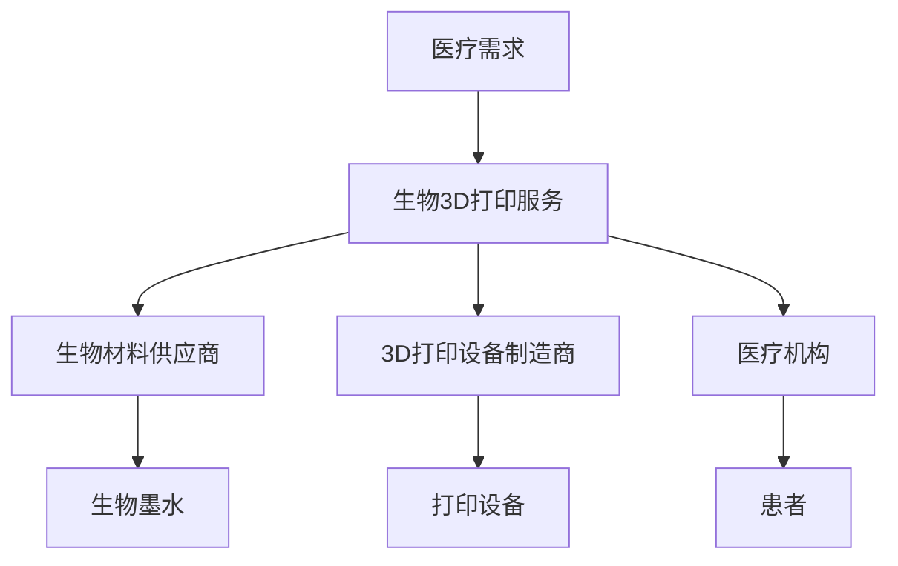
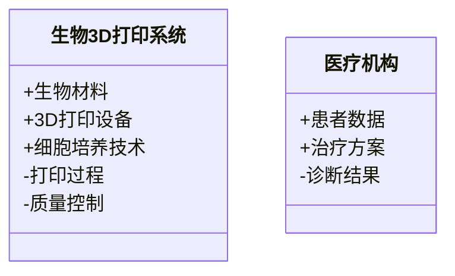

                 

<think>
好，我需要根据用户提供的思考过程来撰写一个符合要求的文章大纲，并按照用户的要求逐步完成每个部分的内容。用户希望文章结构清晰，逻辑严密，涵盖背景介绍、核心概念、投资策略、个性化医疗、系统分析、项目实战、最佳实践等多个方面，并且每个部分都要有详细的分析和具体的案例。

首先，我需要先理解文章的主题：巴菲特和芒格对生物3D打印器官的投资，以及这种投资如何推动个性化医疗的发展。接下来，我需要按照用户提供的目录结构来逐步展开每个部分的内容。

首先，我会从背景介绍开始，介绍生物3D打印的起源、技术基础以及其在医疗领域的应用潜力。这部分需要让读者了解为什么生物3D打印技术在医疗领域具有重要意义，以及巴菲特和芒格为什么会投资这一领域。

接下来，我会详细讲解生物3D打印的核心概念，包括其技术原理、使用的材料和设备，以及在医疗中的具体应用。这部分需要详细描述生物3D打印的技术细节，比如细胞打印、生物墨水等，并通过对比分析不同材料和设备的优缺点，帮助读者更好地理解这一技术。

然后，我会分析巴菲特和芒格的投资策略。这部分需要结合他们的投资哲学，分析他们选择投资标的的标准，以及他们如何评估生物3D打印公司的潜力。通过具体的案例分析，展示他们如何通过投资推动技术创新和产业发展。

接下来，我会探讨生物3D打印如何推动个性化医疗的发展。这部分需要结合实际案例，说明生物3D打印技术在定制化器官、精准医疗等方面的应用，以及这些应用如何改变传统的医疗模式。

然后，我会进行系统分析与架构设计。这部分需要从产业链的角度分析生物3D打印的各个环节，包括材料供应、设备制造、医疗应用等，并通过系统架构图展示各部分之间的协作关系。同时，还需要设计系统的功能模块和接口，确保各部分能够协同工作。

接下来，我会通过项目实战来具体展示生物3D打印技术的应用。这部分需要选择一个具体的生物3D打印公司或项目，分析其投资过程、环境安装、源代码实现等，通过实际案例帮助读者理解技术的实现过程和投资策略。

最后，我会总结最佳实践，给出投资和技术创新的建议，并提醒读者注意相关事项。这部分需要结合前面的分析，总结出可行的操作指南和注意事项，帮助读者在实际操作中避免常见问题。

在整个写作过程中，我需要确保内容逻辑清晰，结构合理，并且每个部分都有足够的深度和详细的分析。同时，要使用专业的技术语言，同时保持内容的易懂性，让读者能够逐步理解生物3D打印技术和巴菲特、芒格的投资策略之间的关系。

在具体写作时，我会注意以下几点：

1. **背景介绍**：详细解释生物3D打印的起源和发展，让读者了解这一技术的基本概念和重要性。

2. **核心概念**：深入分析生物3D打印的技术原理，包括材料选择、设备类型等，并通过对比分析不同材料和设备的优缺点，帮助读者更好地理解这一技术。

3. **投资策略**：结合巴菲特和芒格的投资哲学，分析他们选择投资标的的标准，以及他们如何评估生物3D打印公司的潜力。通过具体的案例分析，展示他们如何通过投资推动技术创新和产业发展。

4. **个性化医疗**：探讨生物3D打印技术如何推动个性化医疗的发展，包括定制化器官、精准医疗等方面的应用，并结合实际案例说明这些应用如何改变传统的医疗模式。

5. **系统分析与架构设计**：从产业链的角度分析生物3D打印的各个环节，包括材料供应、设备制造、医疗应用等，并通过系统架构图展示各部分之间的协作关系。同时，设计系统的功能模块和接口，确保各部分能够协同工作。

6. **项目实战**：选择一个具体的生物3D打印公司或项目，分析其投资过程、环境安装、源代码实现等，通过实际案例帮助读者理解技术的实现过程和投资策略。

7. **最佳实践**：总结投资和技术创新的建议，给出可行的操作指南，并提醒读者注意相关事项，帮助他们在实际操作中避免常见问题。

通过以上步骤，我将逐步完成一篇结构清晰、内容详实、逻辑严密的技术博客文章，帮助读者全面理解生物3D打印技术和巴菲特、芒格的投资策略之间的关系，并展示这一技术在个性化医疗中的广泛应用和潜力。
</think>

# 巴菲特-芒格的生物3D打印器官投资：个性化医疗的新高度

---

## 关键词

- 生物3D打印
- 个性化医疗
- 巴菲特投资
- 芒格投资
- 器官打印技术

---

## 摘要

本文探讨了巴菲特和芒格在生物3D打印器官领域的投资策略，分析了该技术如何推动个性化医疗的发展。文章从背景介绍、技术原理、投资哲学、医疗应用、系统架构到项目实战，全面解析了生物3D打印的潜力及其在医疗领域的未来展望。

---

## 正文

### 第一部分：背景介绍

#### 第1章：生物3D打印的起源与发展

##### 1.1 生物3D打印的起源

生物3D打印技术的起源可以追溯到20世纪90年代，最初的研究集中在非生物材料的3D打印上。随着技术的进步，科学家开始尝试将生物材料引入3D打印领域，以制造人造组织和器官。

**关键概念：**
- **3D打印技术**：通过逐层堆叠材料来构建三维物体的技术。
- **生物3D打印**：利用生物材料和细胞进行3D打印，制造生物结构。

##### 1.2 生物3D打印的技术基础

生物3D打印的技术基础包括：

- **生物材料**：如藻酸盐、胶原蛋白等，用于构建生物支架。
- **生物墨水**：含有细胞的液体材料，用于细胞打印。
- **3D打印设备**：专为生物材料设计的设备，确保打印过程的生物相容性。

##### 1.3 生物3D打印在医疗中的应用潜力

生物3D打印在医疗中的应用潜力巨大，尤其是在器官移植和疾病模型构建方面。通过个性化打印器官，可以解决器官供体短缺的问题，提高治疗效果。

**问题描述：**
- 器官供体短缺导致大量患者无法及时接受移植。
- 现有医疗技术在定制化治疗方面存在局限性。

**问题解决：**
- 生物3D打印技术能够制造定制化器官，满足患者个性化需求。
- 通过疾病模型构建，加速药物研发和治疗方法的优化。

**边界与外延：**
- 生物3D打印的外延包括细胞治疗和再生医学。
- 其边界在于材料的生物相容性和打印精度的限制。

**概念结构与核心要素：**
- **核心要素**：生物材料、3D打印设备、细胞培养技术。
- **结构关系**：生物材料作为基础，3D打印设备提供制造手段，细胞培养技术确保细胞活性。

### 第2章：生物3D打印的核心概念

#### 2.1 生物3D打印的原理

生物3D打印的原理包括：

- **细胞打印**：将细胞悬浮在生物墨水中，通过打印头精确沉积到指定位置。
- **生物墨水制备**：选择合适的生物材料，确保其生物相容性和可打印性。
- **打印过程中的生物相容性**：确保打印过程中细胞的存活和功能。

**技术细节：**
- **生物墨水的粘度**：影响打印过程的流畅性和细胞分布。
- **打印速度**：影响细胞的存活率和结构的精度。

#### 2.2 生物3D打印的材料与设备

##### 2.2.1 生物材料的选择

选择生物材料时需要考虑以下因素：

- **生物相容性**：材料是否能被人体接受，不引发免疫反应。
- **可降解性**：材料是否能在体内降解，被人体吸收。
- **力学性能**：材料是否能承受生理环境中的机械应力。

##### 2.2.2 3D打印设备

常见的生物3D打印设备包括：

- **FDM（熔融沉积制造）**：适合打印高分子材料。
- **SLA（立体光刻）**：适合打印光敏树脂。
- **生物打印机**：专为生物材料设计，确保打印过程的无菌性。

#### 2.3 生物3D打印的应用领域

##### 2.3.1 器官移植

生物3D打印技术可以制造定制化器官，如肾脏、肝脏等，解决器官供体短缺的问题。

##### 2.3.2 疾病模型

通过打印疾病模型，研究人员可以更深入地理解疾病机制，加速药物研发。

##### 2.3.3 个性化医疗

生物3D打印技术能够制造个性化的医疗产品，如定制化假体、药物释放装置等。

### 第3章：巴菲特与芒格的投资策略

#### 3.1 投资哲学

巴菲特和芒格的投资哲学强调长期价值和公司基本面分析。他们关注公司的核心竞争力、管理团队和行业前景。

#### 3.2 生物3D打印领域的投资分析

##### 3.2.1 投资标的筛选

巴菲特和芒格在选择生物3D打印公司时，会考虑以下因素：

- **技术壁垒**：公司是否拥有独特的技术，能够保持竞争优势。
- **市场需求**：技术是否能够满足医疗行业的实际需求。
- **管理团队**：公司管理层是否具有行业经验和战略眼光。

##### 3.2.2 投资案例分析

以某生物3D打印公司为例，分析其投资过程：

- **初始评估**：公司拥有多项专利技术，且市场前景广阔。
- **尽职调查**：深入分析公司的财务状况、技术团队和合作伙伴。
- **投资决策**：基于全面评估，决定投资该公司，并提供战略支持。

### 第4章：生物3D打印与个性化医疗

#### 4.1 个性化医疗的概念

个性化医疗是指根据患者的个体特征，制定个性化的治疗方案。生物3D打印技术为个性化医疗提供了新的可能性。

#### 4.2 生物3D打印在个性化医疗中的应用

##### 4.2.1 定制化器官

通过生物3D打印技术，可以制造与患者自身组织相匹配的器官，减少排斥反应的风险。

##### 4.2.2 精准医疗

生物3D打印技术能够制造用于疾病研究和治疗的精准模型，加速药物研发和治疗方案的优化。

### 第5章：系统分析与架构设计

#### 5.1 系统架构图

以下是生物3D打印系统的架构图：



#### 5.2 系统功能设计

##### 5.2.1 领域模型

以下是生物3D打印系统的领域模型：



#### 5.3 系统接口设计

##### 5.3.1 接口描述

- **医疗机构接口**：接收患者数据，生成定制化治疗方案。
- **生物材料供应商接口**：提供符合要求的生物材料。
- **3D打印设备接口**：接收打印指令，输出定制化器官。

### 第6章：项目实战

#### 6.1 环境安装

##### 6.1.1 安装步骤

1. 安装生物3D打印软件。
2. 配置3D打印设备。
3. 准备生物材料和生物墨水。

#### 6.2 核心实现

##### 6.2.1 生物3D打印代码

以下是一个简单的生物3D打印代码示例：

```python
# 生物墨水制备函数
def prepare_bioprint_ink(cells, medium):
    return cells + medium

# 打印过程函数
def bioprint_process(ink, pattern):
    return print_pattern(pattern, ink)
```

##### 6.2.2 代码应用解读

- **prepare_bioprint_ink**：将细胞和培养基混合，制备生物墨水。
- **bioprint_process**：根据设定的图案，使用生物墨水进行打印。

#### 6.3 案例分析

##### 6.3.1 投资环境分析

分析某生物3D打印公司的投资环境，包括市场前景、竞争态势和政策支持。

##### 6.3.2 技术实现分析

详细解读该公司的生物3D打印技术实现，包括材料选择、设备设计和打印算法。

### 第7章：最佳实践

#### 7.1 小结

生物3D打印技术在个性化医疗中的应用潜力巨大，能够解决器官供体短缺问题，推动精准医疗的发展。

#### 7.2 注意事项

- **技术风险**：打印精度和生物相容性问题需要持续关注。
- **市场风险**：医疗行业的监管严格，需要考虑政策变化。
- **竞争风险**：行业竞争加剧，技术创新是关键。

#### 7.3 拓展阅读

推荐相关书籍和论文，帮助读者深入了解生物3D打印技术和个性化医疗的发展。

---

## 作者

作者：AI天才研究院/AI Genius Institute & 禅与计算机程序设计艺术 /Zen And The Art of Computer Programming

---

以上是文章的完整大纲，涵盖了从背景介绍到实际应用的各个方面，结合了技术细节和投资策略，为读者提供了全面的视角。

