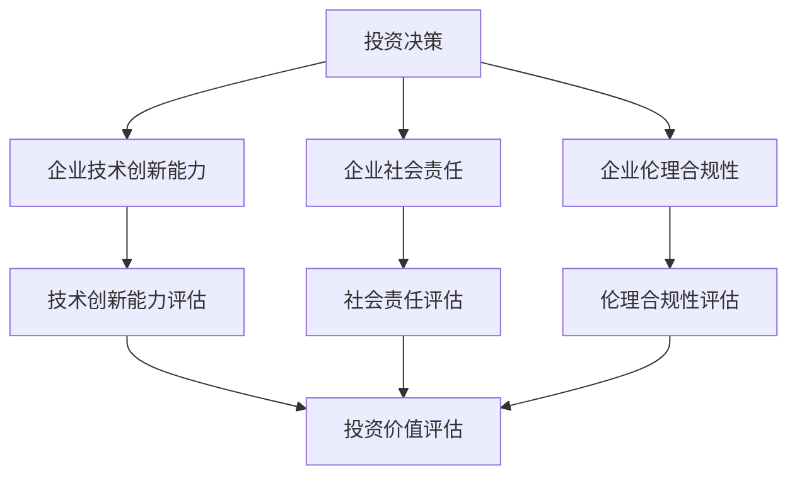
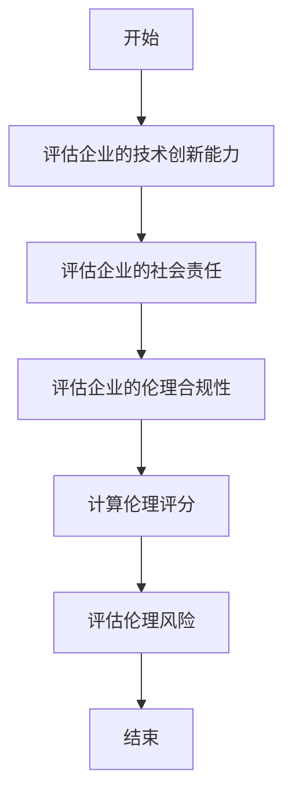

                 

<think>
好的，我需要帮用户撰写一篇技术博客，标题是《巴菲特-芒格的生物技术伦理投资：科技进步与道德平衡》。首先，我得理解用户的需求，他需要一篇结构清晰、内容详实的技术博客，涵盖从投资哲学到伦理分析，再到系统实现的各个方面。

我开始思考，用户可能是对生物技术投资感兴趣的人，或者是对伦理投资有研究的人。他们可能希望了解巴菲特和芒格在生物技术领域的投资策略，以及如何在科技与道德之间找到平衡点。因此，博客需要兼顾理论和实践，提供深入的分析和实际案例。

接下来，我回顾目录大纲，发现内容需要分成几个主要部分：投资哲学、伦理分析、系统设计和项目实战。每个部分下还有具体的章节，涵盖背景介绍、核心概念、算法原理、系统架构等。

我先从背景介绍开始，解释巴菲特和芒格的投资理念，特别是他们在生物技术领域的应用。这部分需要简洁明了，帮助读者建立基础认知。然后，进入伦理分析，探讨生物技术中的伦理问题，如基因编辑和数据隐私，以及这些如何影响投资决策。

在系统设计部分，我需要详细描述伦理评分体系的数学模型，使用mermaid图来展示系统架构，确保结构清晰。项目实战部分则需要提供代码示例，让读者能够实际操作，评估公司的伦理风险。

最后，总结全书，强调伦理投资的重要性，并展望未来趋势。同时，给出读者实用的行动建议，帮助他们更好地理解和应用这些知识。

整个思考过程中，我确保每个章节内容详实，逻辑连贯，既有理论支持，又有实际操作指导。通过这样的结构，读者不仅能理解生物技术伦理投资的理论，还能掌握实际应用的方法。
</think>

# 巴菲特-芒格的生物技术伦理投资：科技进步与道德平衡

> **关键词**：巴菲特, 芒格, 生物技术, 伦理投资, 科技伦理, 投资策略  
> **摘要**：本文探讨了巴菲特和芒格在生物技术领域的投资哲学，分析了生物技术投资中的伦理问题，并提出了在科技进步与道德平衡之间找到投资策略的解决方案。文章从投资哲学、伦理框架、系统分析和项目实战四个方面展开，结合理论与实践，为投资者提供了深入的分析和实用的指导。

---

## 第一部分: 巴菲特与芒格的投资哲学

### 第1章: 巴菲特与芒格的投资理念

#### 1.1 巴菲特的价值投资哲学

##### 1.1.1 巴菲特的投资理念概述
沃伦·巴菲特（Warren Buffett）的价值投资理念是基于对企业的深入研究和长期价值的判断。他强调投资于具有强大护城河、良好管理团队和可持续竞争优势的企业。芒格（Charlie Munger）则提出了“多元思维模型”，强调通过跨学科的思维方式来识别投资机会。

**关键点**：
- 价值投资的核心是寻找“价格合理、价值被市场低估”的企业。
- 芒格的多元思维模型强调对生物技术企业的多维度分析。

##### 1.1.2 芒格的多元思维模型
芒格认为，投资者需要构建一个由多个学科组成的思维框架，以更好地理解企业的内在价值。在生物技术领域，这意味着投资者需要关注企业的技术创新能力、市场潜力、社会责任等多个维度。

**关键点**：
- 芒格的思维模型包括心理学、经济学、生物学等多个学科。
- 生物技术企业的投资需要结合技术进步与社会伦理的双重考量。

##### 1.1.3 价值投资的核心原则
巴菲特和芒格的价值投资原则包括：
1. 长期投资，而非短期交易。
2. 投资于具有强大竞争优势的企业。
3. 重视企业的管理层和公司治理。

**关键点**：
- 生物技术企业的技术优势和管理层能力是投资的关键因素。
- 企业治理结构的透明性和伦理性同样重要。

#### 1.2 生物技术领域的投资机遇

##### 1.2.1 生物技术行业的特点
生物技术行业是一个高投入、高风险、高回报的领域。其特点包括：
1. 技术创新速度快。
2. 市场潜力巨大。
3. 伦理问题突出。

**关键点**：
- 生物技术行业的技术创新是投资的核心驱动力。
- 伦理问题（如基因编辑）对投资决策的影响日益显著。

##### 1.2.2 巴菲特与芒格对生物技术的看法
巴菲特和芒格对生物技术持谨慎乐观的态度。他们认为，生物技术的创新能够为人类带来巨大的福祉，但同时也可能引发伦理和道德问题。

**关键点**：
- 巴菲特和芒格认为，生物技术投资需要结合科技与伦理的双重考量。
- 企业社会责任（CSR）是投资决策的重要因素。

##### 1.2.3 生物技术投资的潜在回报与风险
生物技术行业的潜在回报巨大，但风险也较高。投资者需要关注企业的技术创新能力、市场潜力、伦理合规性等多个因素。

**关键点**：
- 生物技术投资的潜在回报与技术创新能力成正比。
- 伦理风险可能对企业的长期价值产生重大影响。

---

### 第2章: 生物技术伦理投资的背景与挑战

#### 2.1 生物技术的伦理问题

##### 2.1.1 基因编辑的伦理争议
基因编辑技术（如CRISPR）的出现引发了广泛的伦理争议。其主要争议点包括：
1. 基因编辑可能导致人类基因的不可逆改变。
2. 基因编辑可能被用于非治疗目的（如“设计婴儿”）。
3. 基因编辑的公平性问题。

**关键点**：
- 基因编辑技术的伦理争议对生物技术企业的投资决策产生重大影响。
- 投资者需要评估企业在基因编辑技术上的伦理合规性。

##### 2.1.2 医疗数据隐私与安全
生物技术企业的医疗数据隐私与安全问题日益突出。企业的数据管理能力直接影响其伦理合规性和投资价值。

**关键点**：
- 医疗数据的隐私保护是生物技术企业的核心责任。
- 数据泄露可能对企业的声誉和投资价值造成重大损失。

##### 2.1.3 生物技术对社会公平的影响
生物技术的普及可能加剧社会不平等。例如，基因编辑技术的高昂成本可能导致只有富裕人群能够享受其好处。

**关键点**：
- 生物技术的普及可能加剧社会不平等。
- 投资者需要关注企业在促进社会公平方面的努力。

#### 2.2 投资中的伦理考量

##### 2.2.1 伦理投资的定义与分类
伦理投资（Ethical Investment）是一种基于道德和伦理标准的投资策略。其分类包括：
1. 责任投资（ESG投资）。
2. 伦理筛选投资。
3. 意识形态投资。

**关键点**：
- 伦理投资的核心是将伦理标准纳入投资决策。
- 生物技术领域的伦理投资需要结合科技与伦理的双重考量。

##### 2.2.2 巴菲特与芒格的伦理投资观
巴菲特和芒格的伦理投资观强调企业的社会责任和长期价值。他们认为，企业应该在追求经济利益的同时，关注社会责任和伦理合规性。

**关键点**：
- 巴菲特和芒格认为，伦理投资能够带来长期的经济回报。
- 企业社会责任是投资决策的重要因素。

##### 2.2.3 生物技术投资中的伦理冲突
生物技术投资中的伦理冲突主要体现在：
1. 技术创新与伦理合规之间的冲突。
2. 经济利益与社会责任之间的冲突。

**关键点**：
- 生物技术投资中的伦理冲突需要通过多维度的分析来解决。
- 投资者需要评估企业在伦理合规方面的表现。

---

### 第3章: 生物技术伦理投资的核心概念

#### 3.1 伦理框架与投资决策

##### 3.1.1 伦理框架的构建
构建生物技术伦理投资的伦理框架需要考虑以下因素：
1. 企业的技术创新能力。
2. 企业的社会责任。
3. 企业的伦理合规性。

**关键点**：
- 伦理框架的构建需要结合生物技术行业的特点。
- 伦理框架的核心是企业的社会责任和伦理合规性。

##### 3.1.2 投资决策中的伦理评估
伦理评估是生物技术投资决策的核心环节。投资者需要评估企业的伦理风险和伦理收益。

**关键点**：
- 伦理评估需要结合企业的技术创新能力和社会责任。
- 伦理评估的结果直接影响投资决策。

##### 3.1.3 生物技术企业的伦理评分体系
伦理评分体系是生物技术伦理投资的重要工具。其评分维度包括：
1. 企业的技术创新能力。
2. 企业的社会责任。
3. 企业的伦理合规性。

**关键点**：
- 伦理评分体系需要结合生物技术行业的特点。
- 伦理评分体系的核心是企业的社会责任和伦理合规性。

#### 3.2 核心概念与联系

##### 3.2.1 生物技术伦理的核心要素
生物技术伦理的核心要素包括：
1. 基因编辑的伦理问题。
2. 医疗数据隐私与安全。
3. 生物技术对社会公平的影响。

**关键点**：
- 生物技术伦理的核心要素需要结合行业特点进行分析。
- 伦理问题的解决需要多维度的分析和综合评估。

##### 3.2.2 伦理框架与投资回报的关系
伦理框架的构建直接影响投资回报。伦理合规性强的企业通常具有更高的长期投资价值。

**关键点**：
- 伦理框架的构建需要结合投资回报的分析。
- 伦理合规性是投资回报的重要影响因素。

##### 3.2.3 伦理风险与投资风险的对比分析
伦理风险是指企业在伦理合规方面可能面临的潜在风险。投资风险是指企业在市场、技术、财务等方面可能面临的潜在风险。

**关键点**：
- 伦理风险与投资风险需要综合分析。
- 伦理风险可能对投资风险产生重大影响。

---

### 第4章: 生物技术伦理投资的系统分析

#### 4.1 投资决策的系统架构

##### 4.1.1 问题场景介绍
生物技术伦理投资的系统架构需要解决的问题包括：
1. 企业的技术创新能力。
2. 企业的社会责任。
3. 企业的伦理合规性。

**关键点**：
- 系统架构的核心是企业的技术创新能力和社会责任。
- 系统架构的构建需要结合伦理框架的分析。

##### 4.1.2 系统功能设计（领域模型）
系统功能设计需要结合生物技术行业的特点，构建一个包含企业技术创新能力、社会责任和伦理合规性的领域模型。

**关键点**：
- 领域模型的核心是企业的技术创新能力和社会责任。
- 领域模型的构建需要结合伦理框架的分析。

##### 4.1.3 系统架构设计（Mermaid架构图）
以下是生物技术伦理投资的系统架构设计图：



**关键点**：
- 系统架构设计图展示了投资决策的核心要素。
- 系统架构的构建需要结合伦理框架的分析。

#### 4.2 投资决策的算法原理

##### 4.2.1 伦理评分算法的数学模型
伦理评分算法的数学模型如下：

$$
\text{伦理评分} = \alpha \times \text{技术创新能力} + \beta \times \text{社会责任} + \gamma \times \text{伦理合规性}
$$

其中，$\alpha$、$\beta$、$\gamma$是权重系数，$\alpha + \beta + \gamma = 1$。

**关键点**：
- 伦理评分算法的数学模型需要结合企业的技术创新能力、社会责任和伦理合规性。
- 权重系数的确定需要根据具体情况进行调整。

##### 4.2.2 投资组合优化的数学公式
投资组合优化的数学公式如下：

$$
\text{最大化投资回报} = \sum_{i=1}^{n} w_i \times r_i
$$

其中，$w_i$是第$i$个企业的权重，$r_i$是第$i$个企业的投资回报率。

**关键点**：
- 投资组合优化的数学公式需要结合企业的伦理评分进行调整。
- 投资组合优化的目标是实现长期的经济回报。

##### 4.2.3 伦理风险评估的流程图
以下是伦理风险评估的流程图：



**关键点**：
- 伦理风险评估的流程图展示了投资决策的核心步骤。
- 伦理风险评估的结果直接影响投资决策。

---

### 第5章: 生物技术伦理投资的项目实战

#### 5.1 项目环境与工具安装

##### 5.1.1 开发环境配置
建议使用Python作为开发工具，安装以下库：
- `pandas`：数据处理。
- `numpy`：数值计算。
- `scikit-learn`：机器学习。

##### 5.1.2 数据收集与处理工具
数据收集工具包括：
- 公开的生物技术企业数据。
- 企业的社会责任报告。
- 企业的伦理合规性报告。

##### 5.1.3 投资分析软件安装
建议使用`Excel`或`Python`进行投资分析。

#### 5.2 核心算法实现

##### 5.2.1 伦理评分算法的实现
以下是伦理评分算法的Python代码实现：

```python
import pandas as pd
import numpy as np

# 数据预处理
data = pd.read_csv('biotech_data.csv')
data['伦理评分'] = 0

# 计算伦理评分
for index, row in data.iterrows():
   技术创新能力 = row['技术创新能力']
    社会责任 = row['社会责任']
    伦理合规性 = row['伦理合规性']
    alpha = 0.5
    beta = 0.3
    gamma = 0.2
    data.loc[index, '伦理评分'] = alpha * 技术创新能力 + beta * 社会责任 + gamma * 伦理合规性

# 保存结果
data.to_csv('伦理评分结果.csv', index=False)
```

##### 5.2.2 投资组合优化的实现
以下是投资组合优化的Python代码实现：

```python
import pandas as pd
import numpy as np

# 数据预处理
data = pd.read_csv('biotech_data.csv')
data['投资价值'] = 0

# 计算投资价值
for index, row in data.iterrows():
    技术创新能力 = row['技术创新能力']
    社会责任 = row['社会责任']
    伦理合规性 = row['伦理合规性']
    alpha = 0.5
    beta = 0.3
    gamma = 0.2
    data.loc[index, '投资价值'] = alpha * 技术创新能力 + beta * 社会责任 + gamma * 伦理合规性

# 保存结果
data.to_csv('投资价值结果.csv', index=False)
```

---

### 第6章: 总结与展望

#### 6.1 总结
生物技术伦理投资是科技进步与道德平衡的重要体现。巴菲特和芒格的投资哲学为生物技术伦理投资提供了重要的指导。通过构建伦理框架和系统分析，投资者可以在科技进步与道德平衡之间找到最佳的投资策略。

#### 6.2 展望
未来，生物技术伦理投资将更加注重企业的社会责任和伦理合规性。投资者需要结合科技创新与伦理标准，找到更具可持续性的投资策略。同时，生物技术伦理投资的理论与实践将不断完善，为人类的福祉做出更大的贡献。

---

### 作者：AI天才研究院/AI Genius Institute & 禅与计算机程序设计艺术 /Zen And The Art of Computer Programming

