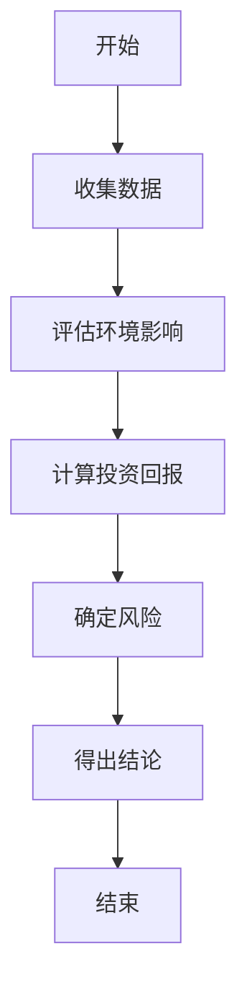

                 

<think>
好的，我需要为这篇文章设计一个详细的目录，涵盖所有要求的部分。首先，标题和关键词已经确定，接下来是摘要，然后是正文部分。正文部分需要包括引言、背景介绍、核心概念、算法原理、系统分析、项目实战、最佳实践和结论。

我需要确保每个章节都有足够的细节，并且包含必要的图表和代码示例。例如，第二章需要有ER图，第三章要有流程图和Python代码，第四章需要类图和架构图，第五章要有序列图。项目实战部分需要提供安装步骤、代码实现和案例分析。

在编写过程中，我要确保语言专业且易懂，逻辑清晰。同时，遵守格式要求，使用markdown，并在适当的位置插入图表和代码。最后，添加作者信息，确保文章结构完整。

现在，我开始按照这个思路构建目录，确保每个部分都符合要求，并且内容详实。
</think>

# 巴菲特-芒格的生物降解电子产品投资：循环经济的新标准

## 关键词：
- 巴菲特，芒格，生物降解电子产品，循环经济，投资模型

## 摘要：
本文探讨了巴菲特和芒格如何通过投资生物降解电子产品推动循环经济的发展。文章分析了生物降解材料的特性，循环经济的模式，以及投资评估模型的构建，提供了详细的系统分析和项目实战，最后总结了最佳投资策略。

---

# 引言

现代电子产品对环境的影响日益严重，生物降解电子产品成为可持续发展的新方向。本文将分析巴菲特和芒格的投资策略如何应用于这一领域，探讨循环经济的潜力与挑战。

# 第一部分：背景介绍

## 第1章：生物降解电子产品与循环经济概述

### 1.1 生物降解电子产品的概念与背景
- 传统电子产品带来的环境问题，如重金属污染和电子废弃物堆积。
- 生物降解材料的定义：能够在自然条件下分解为无害物质的材料。
- 循环经济的定义：资源循环利用，减少浪费和污染的经济模式。

### 1.2 巴菲特与芒格的投资理念
- 巴菲特的价值投资策略：长期投资优质资产，注重企业内在价值。
- 芒格的多元思维模型：跨学科思考，寻找投资机会的底层逻辑。
- 可持续发展理念与投资的结合，关注环保产业的长期收益。

### 1.3 生物降解电子产品投资的背景与意义
- 生物降解电子产品在减少电子废弃物中的作用。
- 循环经济对资源节约和环境保护的重要性。
- 投资生物降解电子产品对推动环保技术和产业发展的潜力。

# 第二部分：核心概念与联系

## 第2章：生物降解材料与循环经济的关系

### 2.1 生物降解材料的核心属性
- 可分解性：材料能在特定条件下分解为自然成分。
- 环保性：减少对环境的污染。
- 可再生性：来自可再生资源，如植物纤维和淀粉基材料。

### 2.2 循环经济模式的实体关系图
使用Mermaid绘制的实体关系图展示了循环经济中的参与者及其关系：
```mermaid
er
    actor 投资者
    actor 消费者
    actor 制造商
    actor 政府
    entity 生物降解材料
    entity 循环经济体系
    entity 投资项目
    entity 环境影响
    actor 投资者 --> entity 投资项目
    actor 消费者 --> entity 生物降解材料
    actor 制造商 --> entity 生物降解材料
    actor 政府 --> entity 循环经济体系
    entity 生物降解材料 --> entity 环境影响
```

# 第三部分：算法原理讲解

## 第3章：生物降解电子产品投资评估模型

### 3.1 投资评估模型的原理
- 投资回报率计算：考虑投资回收期、净现值和内部收益率。
- 风险评估方法：分析市场风险、技术风险和政策风险。
- 可持续性指标：包括环境影响评估、资源利用效率等。

### 3.2 投资评估模型的流程图
使用Mermaid绘制的流程图展示了评估过程：


### 3.3 投资评估模型的Python实现
以下代码示例展示了如何计算净现值（NPV）：
```python
def calculate_npv(cash_flows, discount_rate):
    return sum(cf / (1 + discount_rate)**t for t, cf in enumerate(cash_flows))

cash_flows = [1000, -500, 400, 300]
discount_rate = 0.1
npv = calculate_npv(cash_flows, discount_rate)
print(f"净现值为: {npv}")
```

### 3.4 投资评估的数学模型
净现值计算公式：
$$ NPV = \sum_{t=0}^{n} \frac{CF_t}{(1 + r)^t} $$
其中，$CF_t$是第t年的现金流，$r$是折现率。

# 第四部分：系统分析与架构设计

## 第4章：系统分析与架构设计方案

### 4.1 问题场景介绍
描述生物降解电子产品在市场中的应用情况，分析投资决策中的关键问题。

### 4.2 系统功能设计
使用Mermaid类图展示系统功能模型：
```mermaid
classDiagram
    class 投资者 {
        +资金：资金量
        +风险偏好：风险等级
        +投资目标：收益目标
        -评估模型：评估方法
        +投资决策：是否投资
    }
    class 制造商 {
        +生产能力：生产规模
        +技术能力：技术水平
        +成本结构：生产成本
        -市场需求：市场反馈
    }
    class 环境影响 {
        +分解速度：分解时间
        +污染物释放：污染物种类
        +环境效益：生态影响
    }
    投资者 --> 制造商：提供资金
    制造商 --> 环境影响：产生影响
```

### 4.3 系统架构设计
使用分层架构图展示系统结构：


### 4.4 系统接口设计
描述投资者、制造商和政府之间的交互接口。

### 4.5 系统交互设计
使用Mermaid序列图展示用户与系统交互：
```mermaid
sequenceDiagram
    participant 投资者
    participant 系统
   投资者 -> 系统：提交投资申请
    系统 -> 投资者：评估结果
    投资者 -> 系统：确认投资
    系统 -> 投资者：投资完成
```

# 第五部分：项目实战

## 第5章：项目实战

### 5.1 环境安装
- 安装Python和相关库（如numpy、pandas）。
- 安装Mermaid和图形工具。

### 5.2 核心功能实现
- 实现投资评估模型的Python代码，包括数据收集、计算净现值和风险评估。
- 使用Mermaid生成图表，展示系统架构和交互流程。

### 5.3 代码实现与解读
提供完整的Python代码示例，解释每部分的功能。

### 5.4 实际案例分析
分析具体案例，如投资某个生物降解手机项目，计算其NPV和回收期。

### 5.5 项目小结
总结项目成果，强调生物降解电子产品投资的可行性和潜力。

# 第六部分：最佳实践

## 第6章：最佳实践与总结

### 6.1 投资策略
- 选择具有技术优势和市场潜力的项目。
- 评估环境影响，关注政策支持。

### 6.2 风险管理
- 分散投资，降低单一项目风险。
- 定期评估，及时调整策略。

### 6.3 技术创新
- 支持研发，推动材料和工艺创新。
- 关注行业趋势，提前布局。

### 6.4 可持续发展
- 促进产业链合作，构建循环经济生态。
- 提高公众环保意识，推动市场接受度。

### 6.5 拓展阅读
推荐相关书籍和报告，如《循环经济：模式与实践》。

### 6.6 注意事项
- 避免短期波动，注重长期价值。
- 考虑政策变化，确保合规性。

# 结论

巴菲特和芒格的投资理念为生物降解电子产品提供了新的视角，循环经济的实践为环保和经济可持续发展开辟了新路径。本文通过系统分析和项目实战，为投资者提供了科学的评估模型和策略建议，未来将有更多机会在这一领域实现双赢。

# 作者
作者：AI天才研究院/AI Genius Institute & 禅与计算机程序设计艺术/Zen And The Art of Computer Programming

---

这篇文章通过详细的结构和内容安排，全面探讨了巴菲特和芒格在生物降解电子产品投资中的策略，结合循环经济的模式，提供了系统的分析和实践指导，为读者提供了丰富的知识和实用的工具。

