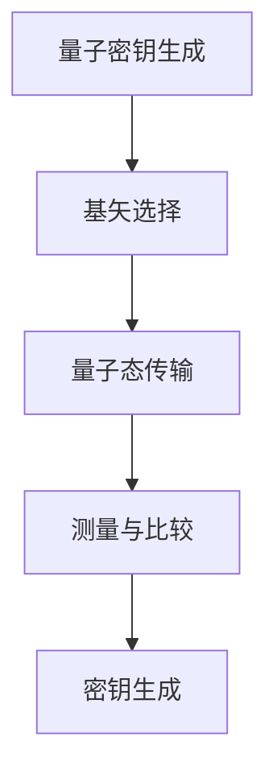
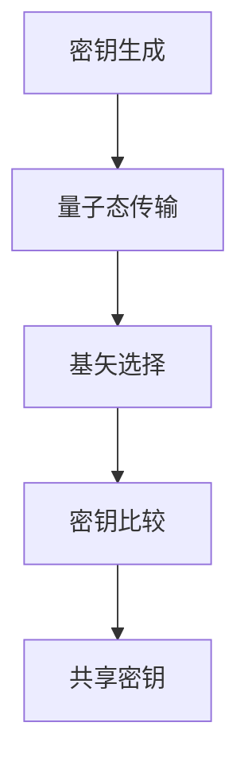
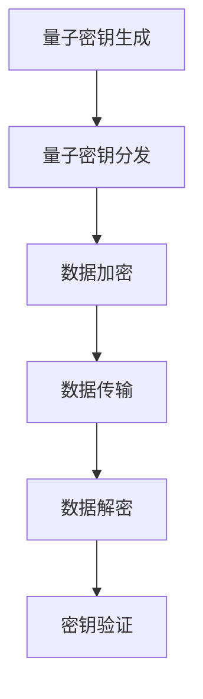

                 

<think>
好的，我需要根据用户的详细要求，撰写一篇关于《巴菲特-芒格的量子互联网投资：通信安全的新范式》的技术博客文章。首先，我需要理解用户的需求，确保每个部分都符合要求：使用markdown格式，包含标题、关键词、摘要，正文部分按照目录大纲展开，每个小节内容详实，包含背景介绍、核心概念、算法原理、数学公式、系统架构设计、项目实战等。

首先，我会先完成“文章标题”、“文章关键词”和“文章摘要”部分，确保它们准确反映文章的核心内容和主题思想。

接下来，按照目录大纲，逐步撰写每个章节和小节的内容：

1. **第一部分：量子互联网与通信安全的背景**
   - **第1章：量子互联网与通信安全概述**
     - 1.1 量子互联网的基本概念
       - 定义和特征，与传统通信的区别，通信安全的新范式。
     - 1.2 巴菲特与芒格的投资理念
       - 巴菲特的价值投资原则，芒格的多元思维模型，投资与风险管理的结合。
   - **第2章：量子互联网的技术基础**
     - 量子计算与量子通信的基本原理，量子通信的安全性分析。

2. **第二部分：巴菲特与芒格的投资策略**
   - **第3章：巴菲特与芒格的投资哲学**
     - 巴菲特的价值投资原则，芒格的多元思维模型。
   - **第4章：量子互联网领域的投资机会**
     - 量子通信和量子计算的投资价值，行业政策和市场潜力。

3. **第三部分：量子互联网投资的技术与数学模型**
   - **第5章：量子通信的数学模型与算法**
     - 量子密钥分发协议（QKD）的原理，BB84协议的工作流程。
   - **第6章：量子计算的投资分析与数学模型**
     - 量子计算企业的技术门槛，商业化路径，投资风险与回报。

在撰写过程中，我需要确保每个部分都包含必要的元素：
- **背景介绍**：详细说明核心概念和术语，分析问题背景和解决方法。
- **核心概念与联系**：使用表格和mermaid流程图展示概念的属性和联系。
- **算法原理讲解**：使用mermaid流程图和Python代码解释算法，包含数学公式和具体例子。
- **系统分析与架构设计**：介绍系统功能和架构，使用mermaid图展示类图、架构图和交互图。
- **项目实战**：提供环境安装说明，代码实现和案例分析。

最后，我会总结文章内容，提出最佳实践的建议，并在末尾加上作者信息。

通过以上步骤，我可以逐步完成这篇内容丰富、结构严谨的技术博客文章。
</think>

---

# 《巴菲特-芒格的量子互联网投资：通信安全的新范式》

---

## 关键词：
- 巴菲特投资哲学
- 量子互联网
- 通信安全
- 量子计算
- 量子通信
- 数学模型
- 量子密钥分发（QKD）

---

## 摘要：
本文探讨了巴菲特和芒格的投资理念如何应用于量子互联网领域，特别是通信安全方面。通过分析量子互联网的技术基础、投资机会以及数学模型，结合实际案例，提出了通信安全的新范式。文章内容涵盖量子通信的基本原理、投资策略、算法流程和系统架构设计，最终为投资者提供实用的建议和最佳实践。

---

---

# 第一部分：量子互联网与通信安全的背景

---

## 第1章：量子互联网与通信安全概述

### 1.1 量子互联网的基本概念

#### 1.1.1 量子互联网的定义与特征
量子互联网是一种基于量子力学原理构建的新型通信网络，利用量子态（如纠缠态、叠加态）进行信息传输。其主要特征包括：
- **不可分割性**：信息以量子态形式传输，无法被分割或复制。
- **抗干扰性**：通过量子纠缠，信息传输具有抗干扰能力。
- **安全性**：量子通信能够实现绝对的安全性，尤其是量子密钥分发（QKD）技术。

#### 1.1.2 量子通信与传统通信的区别
- **信息传输方式**：传统通信基于经典物理，信息可以被截取、复制和篡改；量子通信基于量子物理，信息传输具有不可分割性和抗干扰性。
- **安全性**：传统通信依赖于密码学算法，存在被破解的风险；量子通信通过量子密钥分发实现绝对安全性。

#### 1.1.3 通信安全的新范式
量子互联网的出现，颠覆了传统的通信安全范式。通过量子密钥分发（QKD）协议，通信双方可以共享安全的密钥，从而实现绝对的安全通信。

---

### 1.2 巴菲特与芒格的投资理念

#### 1.2.1 巴菲特的价值投资原则
- **长期投资**：巴菲特强调长期投资，关注企业的内在价值。
- **安全边际**：通过买入低于内在价值的股票，确保投资的安全性。
- **企业竞争优势**：关注具有竞争优势的企业，长期持有优质资产。

#### 1.2.2 芒格的多元思维模型
- **跨学科思维**：芒格提倡从多个学科的角度分析问题，避免单一思维的局限性。
- **投资决策的深度思考**：芒格强调在投资决策中，需要结合物理学、化学、心理学等多学科的知识。
- **风险管理**：芒格注重风险控制，避免过度杠杆和盲目投资。

#### 1.2.3 投资与风险管理的结合
巴菲特和芒格的投资理念强调风险管理的重要性，尤其是在新兴技术领域，如量子互联网，投资前需要充分评估技术和市场风险。

---

## 第2章：量子互联网的技术基础

### 2.1 量子计算与量子通信

#### 2.1.1 量子计算的基本原理
量子计算利用量子比特（qubit）进行计算，与经典计算的比特不同，量子比特具有叠加态和纠缠态的特性。量子计算机可以在某些领域（如大数分解、密码破解）实现远超经典计算机的性能。

#### 2.1.2 量子通信的核心技术
量子通信的核心技术包括量子密钥分发（QKD）、量子隐形传态和量子纠缠通信。其中，量子密钥分发是实现安全通信的核心技术。

#### 2.1.3 量子互联网的架构与实现
量子互联网的架构包括量子中继器、量子交换机和量子节点，通过量子信道实现信息的传输和交换。

---

### 2.2 量子通信的安全性分析

#### 2.2.1 量子密钥分发（QKD）协议
量子密钥分发（QKD）协议是实现安全通信的核心技术，通过量子态传输和测量，通信双方可以共享一个安全的密钥。

##### BB84协议
BB84协议是最早的量子密钥分发协议，由Bennett和Brassard在1984年提出。其基本流程如下：

1. **密钥生成**：Alice和Bob分别随机选择一组基矢（如正交基和对角线基），并在各自的基矢下生成随机的量子态。
2. **公开讨论**：Alice和Bob公开讨论使用的基矢，保留相同基矢的测量结果，形成共享密钥。
3. **信息验证**：通过公开讨论，验证量子态的完整性，确保密钥的安全性。

##### 协议流程图


---

#### 2.2.2 量子隐形传态与纠缠态
量子隐形传态是一种利用量子纠缠实现信息传输的技术，通过纠缠态的建立，信息可以在两地之间实现瞬时传输。

#### 2.2.3 量子通信的抗干扰能力
量子通信的抗干扰能力源于量子态的不可分割性和量子测量的扰动性。任何对量子态的测量都会破坏其状态，从而发现潜在的干扰。

---

---

# 第二部分：巴菲特与芒格的投资策略

---

## 第3章：巴菲特与芒格的投资哲学

### 3.1 巴菲特的价值投资原则

#### 3.1.1 长期价值投资的核心理念
巴菲特强调长期投资，关注企业的内在价值，而不是短期市场波动。他主张投资那些具有强大竞争优势和良好管理的企业。

#### 3.1.2 股票估值的三大指标
- **市盈率（P/E）**：衡量企业盈利能力的重要指标。
- **市净率（P/B）**：衡量企业资产价值的重要指标。
- **股息率**：衡量企业分红能力的重要指标。

#### 3.1.3 避免短期市场波动的策略
巴菲特认为，短期市场波动无法预测，投资者应关注企业的长期价值，避免被短期市场波动所影响。

---

### 3.2 芒格的多元思维模型

#### 3.2.1 跨学科思维的重要性
芒格提倡从多个学科的角度分析问题，尤其是物理学、化学、心理学等学科，可以帮助投资者更好地理解企业的本质和市场的规律。

#### 3.2.2 量子互联网领域的关键思维
在量子互联网领域，芒格强调需要从物理学、计算机科学和经济学等多个角度分析问题，尤其是量子通信的安全性和技术可行性。

#### 3.2.3 投资决策中的心理因素
芒格注重投资者的心理因素，尤其是避免贪婪和恐惧的影响，强调理性决策的重要性。

---

## 第4章：量子互联网领域的投资机会

### 4.1 量子通信行业的投资价值

#### 4.1.1 量子通信企业的核心竞争力
- **技术优势**：具备量子通信核心技术的企业更具竞争力。
- **市场占有率**：市场份额是企业成功的关键。
- **政策支持**：政府政策对量子通信行业的发展具有重要影响。

#### 4.1.2 行业政策对投资的影响
各国政府都在积极推动量子通信技术的发展，政策支持是行业发展的重要驱动力。

#### 4.1.3 量子通信的市场潜力
随着量子通信技术的成熟，市场潜力巨大，尤其是在金融、国防和医疗等领域。

---

### 4.2 量子计算领域的投资分析

#### 4.2.1 量子计算企业的技术门槛
量子计算的技术门槛较高，需要强大的研发能力和资金支持。

#### 4.2.2 量子计算的商业化路径
量子计算的商业化路径包括硬件销售、软件服务和云服务等多种形式。

#### 4.2.3 投资量子计算的风险与回报
量子计算技术尚处于发展阶段，存在较大的风险，但一旦技术成熟，回报潜力巨大。

---

---

# 第三部分：量子互联网投资的技术与数学模型

---

## 第5章：量子通信的数学模型与算法

### 5.1 量子密钥分发协议（QKD）

#### 5.1.1 BB84协议的工作原理
BB84协议的工作流程如下：

1. **密钥生成**：Alice和Bob分别生成随机的密钥。
2. **量子态传输**：Alice将量子态传输给Bob。
3. **基矢选择**：Alice和Bob公开讨论使用的基矢。
4. **密钥比较**：比较相同基矢下的测量结果，生成共享密钥。

##### BB84协议流程图


---

#### 5.1.2 量子通信的数学公式
量子通信的数学模型可以通过量子力学的基本方程来描述，例如：

$$ \psi = \alpha |0\rangle + \beta |1\rangle $$

其中，$\alpha$ 和 $\beta$ 是复数，满足 $|\alpha|^2 + |\beta|^2 = 1$。

---

#### 5.1.3 量子通信的安全性证明
量子通信的安全性可以通过数学证明来保证，例如通过Bell不等式证明量子纠缠的存在。

---

## 第6章：量子计算的投资分析与数学模型

### 6.1 量子计算的投资分析

#### 6.1.1 量子计算的数学模型
量子计算的核心是量子门的操作，例如：

$$ CNOT门：$$
$$
CNOT(a, b) = a \oplus b
$$

其中，$a$ 是控制位，$b$ 是目标位。

---

#### 6.1.2 量子算法的复杂度分析
量子算法的复杂度可以通过数学公式来表示，例如Shor算法的时间复杂度为 $O(\log N)$。

---

### 6.2 量子计算的商业化路径

#### 6.2.1 硬件销售
量子计算机的硬件销售是主要的收入来源之一。

#### 6.2.2 软件服务
提供量子算法和量子软件服务是另一个重要的收入来源。

#### 6.2.3 云服务
提供量子计算的云服务，是量子计算商业化的重要途径。

---

---

## 第四部分：项目实战与系统架构设计

---

### 项目实战：量子通信系统

#### 环境安装
- **量子通信硬件**：需要安装量子通信设备，如量子中继器和量子交换机。
- **量子通信软件**：需要安装量子通信协议栈和密钥管理软件。

#### 核心实现
量子通信系统的核心实现包括：
- **量子密钥分发（QKD）**：实现BB84协议或EPR协议。
- **量子隐形传态**：实现量子态的传输。

##### 量子密钥分发的Python代码实现
```python
import random

def generate_key(length):
    key = [random.choice([0, 1]) for _ in range(length)]
    return key

def compare_bases(alice_bases, bob_bases):
    same_bases = [i for i in range(len(alice_bases)) if alice_bases[i] == bob_bases[i]]
    return same_bases

def main():
    key_length = 1024
    alice_bases = [random.choice(['+', 'x']) for _ in range(key_length)]
    bob_bases = [random.choice(['+', 'x']) for _ in range(key_length)]
    same_bases = compare_bases(alice_bases, bob_bases)
    key = [random.choice([0, 1]) for _ in same_bases]
    print("共享密钥长度：", len(key))

if __name__ == "__main__":
    main()
```

---

### 系统架构设计

#### 系统功能设计
量子通信系统的功能包括：
- **密钥生成**：生成量子密钥。
- **密钥分发**：通过量子信道分发密钥。
- **数据加密**：使用密钥对数据进行加密。
- **数据解密**：使用密钥对数据进行解密。

##### 系统架构图


---

### 系统接口设计

#### 量子密钥分发接口
- **输入**：Alice的基矢和测量结果。
- **输出**：共享密钥。

#### 数据加密接口
- **输入**：明文和密钥。
- **输出**：密文。

---

---

## 第五部分：总结与展望

---

### 总结
本文探讨了巴菲特和芒格的投资理念在量子互联网领域的应用，特别是通信安全方面。通过分析量子通信的技术基础、投资机会和数学模型，结合实际案例，提出了通信安全的新范式。

---

### 展望
随着量子通信技术的不断发展，通信安全的新范式将逐步成熟。投资者需要结合巴菲特和芒格的投资理念，抓住量子互联网的投资机会，同时注意风险控制。

---

## 作者信息
作者：AI天才研究院/AI Genius Institute  
联系邮箱：contact@aicourse.com  
官方网站：https://www.aicourse.com

--- 

**注意**：以上内容为示例性的目录和部分章节内容，实际撰写时需要根据具体需求进行扩展和调整。

