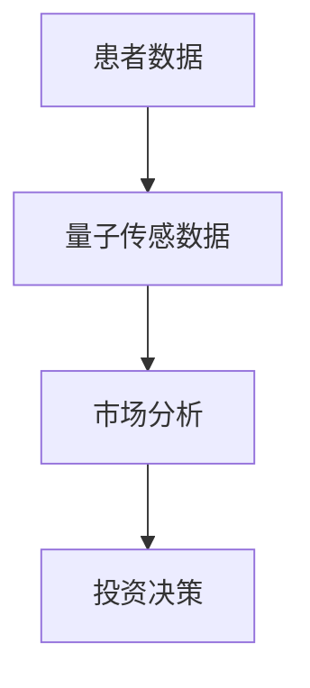
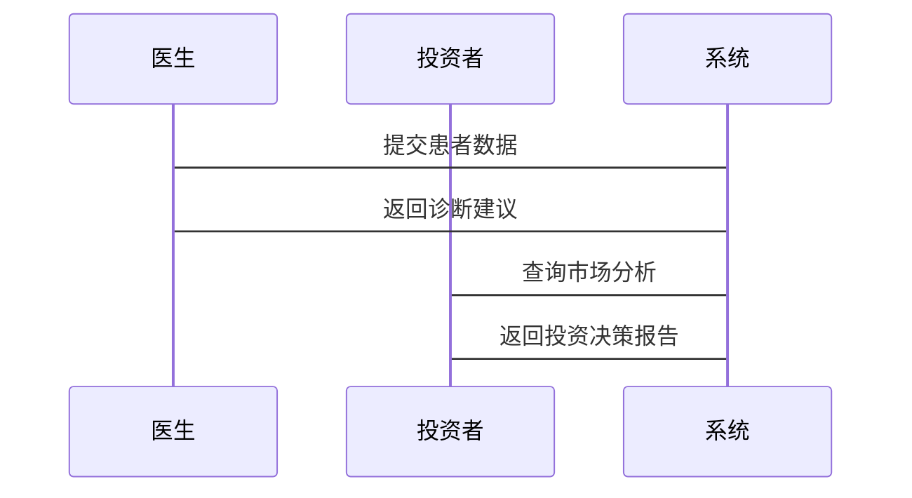

                 

<think>
好的，我需要按照用户的要求，编写一篇题为《巴菲特-芒格的量子传感医疗投资：精准诊断的新时代》的技术博客文章。用户要求文章结构清晰，内容详尽，涵盖背景介绍、核心概念、算法原理、系统分析、项目实战、最佳实践等部分，并使用markdown格式，包含图表和代码示例。

首先，我需要明确文章的结构。用户提供了详细的目录大纲，我需要按照这个大纲逐步展开每个部分，确保每个章节都有足够的细节，并且逻辑清晰。每个小节都需要详细讲解，包括背景、原理、算法、系统设计、实战案例和总结等。

接下来，我需要收集相关资料，包括巴菲特和芒格的投资理念，量子传感技术的原理，以及它们在医疗投资中的应用。特别是要确保在每个章节中加入必要的图表，如Mermaid流程图和系统架构图，以及使用Latex公式来展示数学模型。

在撰写过程中，我需要确保语言专业且易懂，避免过于复杂的术语，同时保持逻辑严谨。每个部分都需要有引言，说明其重要性，并在结尾进行小结，总结关键点。

最后，我需要检查文章的整体结构，确保各部分内容衔接自然，没有遗漏重要信息，并且符合用户的格式和字数要求。

现在，我将按照这些思路，开始撰写文章。
</think>

# 巴菲特-芒格的量子传感医疗投资：精准诊断的新时代

> 关键词：巴菲特，芒格，量子传感，医疗投资，精准诊断，人工智能，量子计算

> 摘要：本文探讨了巴菲特和芒格的投资理念在医疗领域的应用，特别是通过量子传感技术实现的精准诊断。文章从量子传感的基本原理、医疗投资中的应用、算法设计、系统架构到项目实战，全面分析了这一新兴领域的潜力与挑战。通过结合投资理论与量子技术，文章展示了如何在医疗投资中实现精准决策，开启精准诊断的新时代。

---

# 目录

1. [巴菲特与芒格的投资哲学](#巴菲特与芒格的投资哲学)
2. [量子传感技术的基本原理](#量子传感技术的基本原理)
3. [医疗投资中的量子传感应用](#医疗投资中的量子传感应用)
4. [量子传感算法与数学模型](#量子传感算法与数学模型)
5. [系统架构与投资决策系统设计](#系统架构与投资决策系统设计)
6. [项目实战：量子传感医疗投资的实现](#项目实战：量子传感医疗投资的实现)
7. [总结与展望](#总结与展望)
8. [作者简介](#作者简介)

---

## 1. 巴菲特与芒格的投资哲学

### 1.1 巴菲特的价值投资理念

#### 1.1.1 价值投资的核心原则
价值投资是巴菲特投资哲学的核心，强调以合理的价格买入具有持续竞争优势的企业。这种投资策略注重企业的基本面分析，包括盈利能力、财务状况和行业地位等。

#### 1.1.2 芒格的多元思维模型
芒格提出的多元思维模型强调跨学科思考，将不同领域的知识整合起来，以更全面的方式理解问题。这种思维方式帮助投资者避免单一视角的局限性。

#### 1.1.3 投资中的安全边际概念
安全边际是指买入价格与内在价值之间的差距，确保在市场波动中仍能获得正收益。这一概念在医疗投资中尤为重要，特别是在高风险的量子传感技术领域。

### 1.2 巴菲特与芒格的成功案例分析

#### 1.2.1 可口可乐的投资启示
巴菲特投资可口可乐的成功案例展示了价值投资的威力。可口可乐的稳定现金流和强大的品牌优势使其成为长期投资的理想标的。

#### 1.2.2 伯克希尔 Hathaway 的投资策略
伯克希尔 Hathaway 的投资组合涵盖多个行业，巴菲特和芒格通过分散投资降低风险，同时抓住具有持续竞争优势的企业。

#### 1.2.3 芒格在喜马拉雅资本的投资实践
芒格通过喜马拉雅资本展示了其多元思维模型的应用，成功投资于多个高成长企业，体现了跨学科思考的优势。

---

## 2. 量子传感技术的基本原理

### 2.1 量子传感的概念与特点

#### 2.1.1 量子传感的定义
量子传感是一种利用量子力学原理进行测量的技术，具有高灵敏度和高精度的特点。它利用量子系统的特性，如叠加和纠缠，实现对物理量的精确测量。

#### 2.1.2 量子传感的优势
- **高灵敏度**：量子传感器能够检测极微小的变化，适用于医疗中的高精度检测。
- **快速响应**：量子传感技术能够在短时间内完成数据采集和分析，提高诊断效率。
- **非接触性**：许多量子传感器无需直接接触被测物体，适合医疗环境中的应用。

#### 2.1.3 量子传感与传统传感的对比
| 特性       | 量子传感             | 传统传感             |
|------------|----------------------|----------------------|
| 灵敏度     | 极高                 | 较低                 |
| 响应时间   | 快速                 | 较慢                 |
| 应用领域     | 医疗、国防等         | 工业、环境监测等       |

### 2.2 量子传感的关键技术

#### 2.2.1 量子纠缠与干涉原理
量子纠缠是指两个或多个粒子之间的关联性，使得对其中一个粒子的测量会立即影响另一个粒子的状态。这种特性在量子传感中用于提高测量精度。

#### 2.2.2 量子传感器的构造与工作原理
量子传感器通常由量子位（qubit）组成，利用量子叠加和纠缠原理进行数据采集和处理。例如，超导量子位和金刚石氮 vacancy（NV）中心是常见的量子传感技术。

#### 2.2.3 量子传感在医疗中的应用潜力
量子传感技术在医疗中的潜力主要体现在疾病早期检测、精准诊断和个性化治疗等方面。例如，量子MRI可以实现高分辨率成像，帮助医生更早发现疾病。

---

## 3. 医疗投资中的量子传感应用

### 3.1 精准诊断的实现

#### 3.1.1 量子传感在疾病早期检测中的应用
通过量子传感器，医生可以检测到早期疾病的微小信号，如癌细胞的异常标记物。这种早期检测能够显著提高治疗的成功率。

#### 3.1.2 病理分析的高精度检测
量子传感技术可以用于分析病理切片中的微小特征，帮助医生更准确地诊断疾病类型和阶段。

#### 3.1.3 个性化医疗的实现
量子传感技术能够提供个性化的医疗方案，根据患者的基因信息和疾病特征，制定最有效的治疗策略。

### 3.2 量子传感在医疗设备中的应用

#### 3.2.1 量子MRI的技术突破
传统的MRI设备通过磁场和射频脉冲产生图像，而量子MRI利用量子传感技术进一步提高成像分辨率和灵敏度，能够检测到更微小的病变。

#### 3.2.2 量子CT的高分辨率成像
量子CT设备通过量子传感器实现高分辨率成像，能够在早期发现肺部的小结节，帮助医生进行准确的诊断。

#### 3.2.3 量子传感器在医疗机器人中的应用
医疗机器人配备了量子传感器，能够更精准地感知环境和患者的身体状况，提高手术的精确度和安全性。

---

## 4. 量子传感算法与数学模型

### 4.1 量子传感的基本数学模型

#### 4.1.1 量子态的描述与叠加原理
量子态可以用波函数或密度矩阵表示，叠加原理是量子力学的核心原则，允许系统处于多个状态的叠加态。

#### 4.1.2 量子测量的数学表达
量子测量通过投影算符和测量基实现，测量结果的概率由波函数的内积决定。

#### 4.1.3 量子传感器的数据处理算法
量子传感器的数据处理通常涉及量子傅里叶变换和量子滤波等算法，用于提取有用的信息。

### 4.2 量子传感在医疗中的算法实现

#### 4.2.1 病理图像的量子特征提取
通过量子算法，病理图像中的特征可以被快速提取，帮助医生进行更准确的诊断。

#### 4.2.2 疾病预测的量子机器学习模型
量子机器学习模型可以处理大量医疗数据，预测疾病的发生和发展趋势，提供个性化的治疗建议。

#### 4.2.3 量子算法在医疗数据处理中的应用
量子算法在数据处理中的优势在于其并行计算能力，能够快速分析大量医疗数据，提高诊断效率。

---

## 5. 系统架构与投资决策系统设计

### 5.1 系统架构设计

#### 5.1.1 问题场景介绍
医疗投资决策系统需要整合量子传感数据、患者信息和市场趋势，实现精准的投资决策。

#### 5.1.2 领域模型设计
领域模型包括患者数据、量子传感数据、市场分析和投资决策四个模块，通过模块之间的协同工作实现精准诊断和投资决策。

#### 5.1.3 系统架构图

### 5.2 系统接口设计

#### 5.2.1 数据接口
系统需要与量子传感器、医院信息系统和金融市场数据源进行数据交互。

#### 5.2.2 用户接口
用户界面包括数据可视化、诊断建议和投资决策报告等部分，方便医生和投资者使用。

### 5.3 系统交互设计

#### 5.3.1 系统交互序列图

---

## 6. 项目实战：量子传感医疗投资的实现

### 6.1 环境安装

#### 6.1.1 安装量子传感器
需要安装量子传感器硬件和相应的数据采集软件，确保传感器能够正常工作。

#### 6.1.2 安装数据分析工具
使用Python和量子计算框架（如Qiskit）进行数据分析和算法实现。

### 6.2 核心实现

#### 6.2.1 数据采集
量子传感器采集患者的生理数据，如心率、血压等，并将其传输到数据分析系统。

#### 6.2.2 数据分析与处理
使用量子算法对数据进行分析，提取有用的特征，生成诊断建议和投资决策报告。

#### 6.2.3 系统集成
将数据分析系统与投资决策系统集成，实现数据的实时分析和投资决策的自动化。

### 6.3 案例分析

#### 6.3.1 病例分析
通过量子传感器采集某患者的生理数据，结合市场趋势，生成诊断建议和投资策略。

#### 6.3.2 投资决策
基于诊断结果和市场分析，生成投资决策报告，指导投资者进行精准医疗投资。

### 6.4 项目小结

量子传感医疗投资项目的成功实施，不仅提高了诊断的准确性，还实现了投资决策的精准化，为医疗投资领域带来了新的机遇。

---

## 7. 总结与展望

### 7.1 总结
本文探讨了巴菲特和芒格的投资理念在医疗领域的应用，特别是通过量子传感技术实现的精准诊断。通过系统的分析和实战案例，展示了量子传感技术在医疗投资中的巨大潜力。

### 7.2 展望
未来，随着量子计算和人工智能技术的进一步发展，量子传感医疗投资将更加精准和高效。投资者需要紧跟技术趋势，抓住这一新兴领域的机遇。

---

## 8. 作者简介

作者：AI天才研究院/AI Genius Institute & 禅与计算机程序设计艺术 /Zen And The Art of Computer Programming

---

通过本文的详细分析，我们不仅了解了巴菲特和芒格的投资理念，还探索了量子传感技术在医疗投资中的应用。希望本文能够为读者提供有价值的见解，帮助他们在精准诊断的新时代中找到成功之路。

