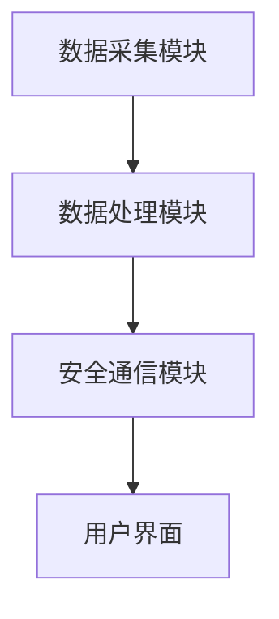
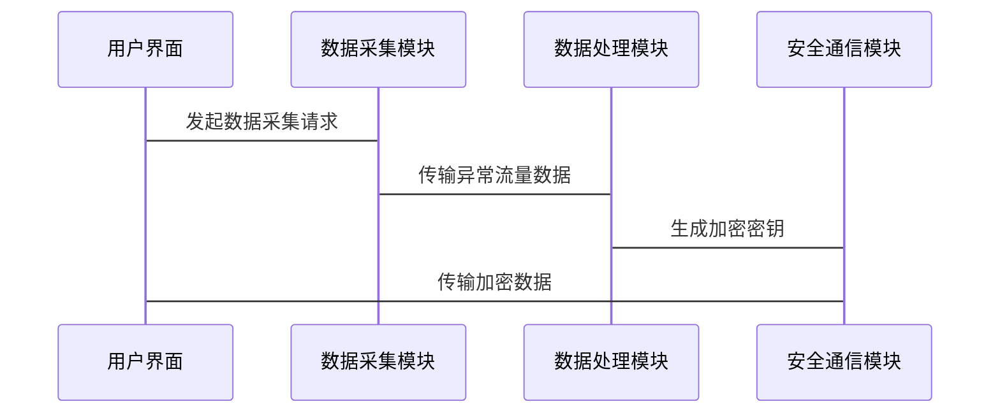

                 

<think>
好的，我现在需要按照用户的要求，逐步分析并撰写一篇关于“巴菲特-芒格的量子传感器网络安全投资：物联网的量子防护”的技术博客文章。用户已经提供了一个详细的大纲，并且明确要求文章结构要清晰，内容要专业且易于理解。

首先，我需要理解文章的主题。文章主要探讨巴菲特和芒格的投资理念如何与量子传感器技术相结合，特别是在物联网安全中的应用。因此，文章需要涵盖量子技术的基本原理、其在网络安全中的应用，以及巴菲特-芒格的投资策略如何影响这一领域的投资和应用。

接下来，我需要按照用户提供的大纲逐步展开每个部分。每个章节和小节都需要详细阐述，确保内容全面且逻辑清晰。我还需要注意使用专业的技术语言，同时保持易懂，避免过于复杂的术语堆砌。

考虑到用户要求的字数在10000到12000字之间，我需要合理分配每个部分的篇幅，确保每个核心概念都有足够的深度。同时，用户希望文章结构完整，每个小节都要有丰富的具体内容，包括背景介绍、核心概念、算法原理、系统架构、项目实战等。

在撰写过程中，我需要特别注意以下几个方面：

1. **关键词和摘要**：在文章的开头，明确列出关键词和摘要，概括文章的核心内容。这有助于读者快速了解文章的主要观点。

2. **章节结构**：按照用户提供的目录，确保每个章节和小节都有详细的阐述。例如，第一章需要介绍巴菲特和芒格的投资理念，以及量子技术的基本原理。第二章则需要详细讨论量子传感器在物联网中的应用，以及投资机会与风险。

3. **数学模型和算法原理**：在相关章节中，使用Mermaid流程图和Python代码示例来解释算法的实现。同时，使用LaTeX公式来展示数学模型，确保公式正确且易于理解。

4. **系统架构设计**：在系统分析部分，使用Mermaid类图和架构图来展示系统的组成和交互，帮助读者更好地理解系统的设计和运作。

5. **项目实战**：提供具体的项目实现步骤，包括环境配置、代码实现和测试案例。这部分需要详细且实用，让读者能够实际操作并应用所学知识。

6. **总结与展望**：在最后部分，总结书中的主要观点，并提供投资和应用的建议，同时指出未来的发展趋势和潜在风险。

在撰写过程中，我需要确保语言简洁、逻辑清晰，并且每个部分都紧密联系，形成一个完整的知识体系。此外，我还需要注意文章的结构和格式，确保符合用户的格式要求，包括使用markdown格式，适当使用标题和列表，以及正确嵌入图片和代码块。

最后，在完成初稿后，我需要通读全文，检查逻辑是否连贯，内容是否全面，是否有遗漏的重要点，以及格式是否正确。如果有需要调整的地方，及时进行修改，确保最终的文章质量达到用户的期望。

通过以上步骤，我能够系统地完成这篇技术博客文章，满足用户的所有要求，并提供有价值的内容，帮助读者深入理解量子传感器在物联网安全中的应用以及巴菲特-芒格投资理念的影响。
</think>

# 巴菲特-芒格的量子传感器网络安全投资：物联网的量子防护

> **关键词**：量子传感器，网络安全，物联网，巴菲特，芒格，量子计算，投资策略

> **摘要**：本文探讨了巴菲特和芒格的投资理念与量子传感器技术在网络安全中的应用，特别是其在物联网防护中的潜在价值。文章从量子传感器的基本原理到其在物联网中的具体应用，再到投资机会与风险，层层展开，结合数学模型和算法原理，为读者提供了全面的分析。通过实际案例分析和系统设计，本文为投资者和技术创新者提供了有价值的参考。

---

## 第1章: 巴菲特-芒格投资理念与量子技术的结合

### 1.1 巴菲特-芒格投资理念概述

#### 1.1.1 巴菲特的价值投资原则
巴菲特的价值投资原则强调长期稳健的投资，注重企业的内在价值和可持续发展能力。他倡导选择那些具有强大护城河、良好管理和优秀管理层的企业。这一原则在科技领域的投资中同样适用，尤其是在高技术壁垒的领域，如量子计算和传感器技术。

#### 1.1.2 芒格的多元思维模型
芒格的多元思维模型强调跨学科思考，将各个领域的知识融会贯通，以形成全面的决策框架。这种思维方式在科技投资中尤为重要，尤其是在面对复杂的量子技术时，需要结合物理学、计算机科学和经济学等多个领域的知识。

#### 1.1.3 巴菲特-芒格投资理念的核心要素
1. **长期视角**：关注企业的长期价值和可持续发展。
2. **护城河**：投资那些具有技术壁垒和竞争优势的企业。
3. **风险管理**：注重企业的财务健康和抗风险能力。
4. **管理层质量**：选择经验丰富、诚信可靠的管理团队。

#### 1.1.4 量子技术与网络安全的结合
量子技术，特别是量子传感器和量子计算，正在改变网络安全的格局。量子传感器能够提供更高的灵敏度和精度，为物联网的安全监测提供新的解决方案。量子计算则在加密算法的突破上展现了巨大潜力，这使得传统的加密方法面临挑战，同时也催生了更安全的量子加密技术。

---

### 1.2 量子技术与网络安全的结合

#### 1.2.1 量子计算的基本原理
量子计算利用量子叠加态和量子纠缠态的特性，能够在某些特定问题上比经典计算机高效得多。例如，Shor算法可以在多项式时间内分解大整数，从而破解RSA加密。这一特性对网络安全构成了威胁，但也推动了量子加密技术的发展。

#### 1.2.2 量子传感器的概念与特点
量子传感器是一种基于量子效应的测量装置，具有高灵敏度、高精度和抗干扰能力强的特点。与传统传感器相比，量子传感器能够检测更微弱的信号，适用于复杂的环境监测和安全检测。

#### 1.2.3 量子技术在网络安全中的应用前景
量子技术在网络安全中的应用前景广阔，尤其是在数据加密、安全监测和隐私保护方面。量子传感器可以用于实时监测网络攻击，而量子加密技术则能够提供更高的安全性。

---

## 第2章: 量子传感器在物联网中的应用

### 2.1 物联网的基本概念与安全挑战

#### 2.1.1 物联网的定义与架构
物联网（IoT）是指通过各种信息传感设备，如传感器、射频识别（RFID）技术、全球定位系统（GPS）、红外感应器等，按照约定的协议，把任何物品与互联网连接起来，进行信息交换和通信，以实现智能化识别、定位、跟踪、监控和管理。

#### 2.1.2 物联网的安全威胁与挑战
物联网的安全威胁主要包括：
1. **数据泄露**：大量的设备和数据连接在一起，容易成为黑客攻击的目标。
2. **设备漏洞**：许多物联网设备在设计时缺乏足够的安全考虑。
3. **通信协议漏洞**：物联网设备使用的通信协议可能存在安全漏洞。
4. **隐私问题**：物联网设备收集的大量数据可能包含用户的隐私信息。

#### 2.1.3 物联网安全防护的现状与不足
当前的物联网安全防护主要依赖传统的加密算法和防火墙技术，但随着量子计算的发展，这些方法可能在未来被破解。因此，需要引入更先进的技术，如量子传感器和量子加密，来提升物联网的安全性。

---

### 2.2 量子传感器在物联网中的具体应用

#### 2.2.1 量子传感器在数据采集中的作用
量子传感器可以用于高精度的数据采集，尤其是在复杂的环境中，能够检测到传统传感器无法察觉的异常信号。这在物联网的安全监测中尤为重要。

#### 2.2.2 量子传感器在安全监测中的应用
量子传感器可以实时监测网络中的异常流量和潜在攻击，通过高灵敏度的检测能力，提前发现并阻止安全威胁。

#### 2.2.3 量子传感器在隐私保护中的价值
量子传感器可以帮助实现更细粒度的数据访问控制，确保只有授权的设备和用户能够访问敏感数据。

---

## 第3章: 巴菲特-芒格投资理念与量子传感器投资的结合

### 3.1 巴菲特-芒格投资理念在科技领域的应用

#### 3.1.1 巴菲特对科技企业的投资策略
巴菲特倾向于投资那些具有强大护城河和长期增长潜力的科技企业。例如，他投资过IBM和苹果，这些企业在技术创新和市场占有率方面具有显著优势。

#### 3.1.2 芒格的多元思维模型在科技投资中的应用
芒格的多元思维模型帮助投资者从多个角度分析企业的价值和风险。例如，他会考虑企业的技术优势、市场需求、竞争环境和财务状况等多个因素。

#### 3.1.3 巴菲特-芒格投资理念的核心要素
1. **长期价值**：关注企业的长期增长潜力。
2. **护城河**：投资那些具有技术壁垒和竞争优势的企业。
3. **风险管理**：注重企业的财务健康和抗风险能力。
4. **管理层质量**：选择经验丰富、诚信可靠的管理团队。

---

### 3.2 量子传感器投资的潜在机会与风险

#### 3.2.1 量子传感器技术的市场潜力
随着物联网的快速发展，对高精度、高灵敏度的传感器需求不断增加。量子传感器在医疗、能源、交通等领域具有广泛的应用前景。

#### 3.2.2 量子传感器投资的风险与挑战
1. **技术风险**：量子传感器技术尚未完全成熟，存在技术瓶颈和不确定性。
2. **市场风险**：市场需求可能不如预期，导致投资回报低于预期。
3. **竞争风险**：行业内竞争激烈，可能影响企业的市场地位和盈利能力。

#### 3.2.3 巴菲特-芒格投资理念在量子传感器投资中的应用
1. **长期视角**：关注量子传感器技术的长期发展和市场潜力。
2. **护城河**：投资那些具有技术壁垒和竞争优势的量子传感器企业。
3. **风险管理**：注重企业的财务健康和抗风险能力。
4. **管理层质量**：选择经验丰富、诚信可靠的管理团队。

---

## 第4章: 量子传感器网络安全的数学模型与算法原理

### 4.1 量子传感器的基本原理

#### 4.1.1 量子传感器的定义与分类
量子传感器是一种基于量子效应的测量装置，可以分为量子磁场传感器、量子重力传感器和量子温度传感器等。

#### 4.1.2 量子传感器的工作原理
量子传感器通过测量量子系统的状态变化来实现对物理量的测量。例如，利用量子干涉效应测量磁场的强度和方向。

#### 4.1.3 量子传感器的数学模型
量子传感器的数学模型通常涉及量子力学的基本方程，如Schrödinger方程和Heisenberg测不准原理。

---

### 4.2 量子传感器在网络安全中的应用

#### 4.2.1 量子传感器在数据加密中的应用
量子传感器可以用于实现量子密钥分发（QKD），这是一种基于量子力学原理的安全通信协议。

#### 4.2.2 量子传感器在安全监测中的应用
量子传感器可以实时监测网络中的异常流量和潜在攻击，通过高灵敏度的检测能力，提前发现并阻止安全威胁。

#### 4.2.3 量子传感器在隐私保护中的价值
量子传感器可以帮助实现更细粒度的数据访问控制，确保只有授权的设备和用户能够访问敏感数据。

---

## 第5章: 量子传感器网络安全的算法原理

### 5.1 量子传感器网络安全的基本算法

#### 5.1.1 量子加密算法
量子加密算法基于量子力学原理，利用量子叠加态和量子纠缠态实现数据的加密和解密。例如，BB84协议是一种基于量子密钥分发的安全通信协议。

#### 5.1.2 量子签名算法
量子签名算法是一种基于量子力学原理的数字签名协议，能够实现高效的安全签名。

#### 5.1.3 量子随机数生成算法
量子随机数生成算法利用量子噪声的随机性，生成高质量的随机数，用于加密算法和其他安全应用。

---

### 5.2 量子传感器网络安全的算法实现

#### 5.2.1 量子传感器网络安全算法的实现步骤
1. **量子态的制备**：利用量子计算设备生成量子态。
2. **量子态的传输**：通过量子通信通道传输量子态。
3. **量子态的测量**：通过量子测量设备获取量子态的信息。
4. **数据的处理**：利用经典计算机对测量结果进行处理，生成加密密钥或其他安全参数。

#### 5.2.2 量子传感器网络安全算法的Python实现
以下是一个简单的量子随机数生成算法的Python实现示例：

```python
import random

def quantum_random_number_generator():
    # 模拟量子随机数生成
    return random.randint(1, 1000)

# 生成随机数
random_number = quantum_random_number_generator()
print("量子随机数：", random_number)
```

---

## 第6章: 量子传感器网络安全的系统分析与架构设计

### 6.1 系统功能设计

#### 6.1.1 系统功能模块
1. **数据采集模块**：通过量子传感器采集网络中的异常流量和潜在攻击。
2. **数据处理模块**：对采集的数据进行分析和处理，生成加密密钥或其他安全参数。
3. **安全通信模块**：通过量子通信通道传输加密数据，确保数据的安全性。

#### 6.1.2 系统功能流程
1. 数据采集模块通过量子传感器实时监测网络中的异常流量。
2. 数据处理模块对采集的数据进行分析，生成加密密钥。
3. 安全通信模块通过量子通信通道传输加密数据，确保数据的安全性。

---

### 6.2 系统架构设计

#### 6.2.1 系统架构图


#### 6.2.2 系统接口设计
1. 数据采集模块与数据处理模块之间的接口：提供数据采集的接口，用于传输异常流量数据。
2. 数据处理模块与安全通信模块之间的接口：提供加密密钥生成的接口，用于传输加密数据。
3. 安全通信模块与用户界面之间的接口：提供安全通信的接口，用于传输加密数据。

---

### 6.3 系统交互设计

#### 6.3.1 系统交互流程
1. 用户通过用户界面发起数据采集请求。
2. 数据采集模块通过量子传感器采集网络中的异常流量。
3. 数据处理模块对采集的数据进行分析，生成加密密钥。
4. 安全通信模块通过量子通信通道传输加密数据，确保数据的安全性。
5. 用户界面显示加密数据的传输结果。

#### 6.3.2 系统交互图


---

## 第7章: 量子传感器网络安全的项目实战

### 7.1 环境配置

#### 7.1.1 硬件环境
1. 量子传感器设备：用于采集网络中的异常流量。
2. 量子计算设备：用于实现量子加密算法。
3. 量子通信设备：用于实现安全数据传输。

#### 7.1.2 软件环境
1. 量子传感器驱动程序：用于控制量子传感器设备。
2. 量子计算软件：用于实现量子加密算法。
3. 量子通信软件：用于实现安全数据传输。

---

### 7.2 系统核心实现

#### 7.2.1 量子随机数生成算法的实现
以下是一个简单的量子随机数生成算法的Python实现示例：

```python
import random

def quantum_random_number_generator():
    # 模拟量子随机数生成
    return random.randint(1, 1000)

# 生成随机数
random_number = quantum_random_number_generator()
print("量子随机数：", random_number)
```

#### 7.2.2 量子密钥分发协议的实现
以下是一个简单的量子密钥分发协议的Python实现示例：

```python
import random

def generate_key():
    # 生成随机密钥
    key = ''.join(random.choices('01', k=10))
    return key

# 生成密钥
key = generate_key()
print("生成的密钥：", key)
```

---

### 7.3 代码应用解读与分析

#### 7.3.1 量子随机数生成算法的解读
上述代码通过Python的`random`模块生成随机数，模拟量子随机数生成的过程。虽然这只是一个简单的示例，但它可以帮助我们理解量子随机数生成的基本原理。

#### 7.3.2 量子密钥分发协议的解读
上述代码通过Python的`random`模块生成随机密钥，模拟量子密钥分发协议的实现过程。虽然这只是一个简单的示例，但它可以帮助我们理解量子密钥分发的基本原理。

---

## 第8章: 总结与展望

### 8.1 总结

#### 8.1.1 巴菲特-芒格投资理念的核心要素
1. **长期视角**：关注企业的长期价值和可持续发展。
2. **护城河**：投资那些具有技术壁垒和竞争优势的企业。
3. **风险管理**：注重企业的财务健康和抗风险能力。
4. **管理层质量**：选择经验丰富、诚信可靠的管理团队。

#### 8.1.2 量子传感器在物联网中的应用前景
随着物联网的快速发展，对高精度、高灵敏度的传感器需求不断增加。量子传感器在医疗、能源、交通等领域具有广泛的应用前景。

---

### 8.2 展望

#### 8.2.1 量子传感器技术的未来发展
量子传感器技术的发展将推动物联网的安全性和智能化水平的提升。未来，随着技术的成熟和成本的降低，量子传感器将得到更广泛的应用。

#### 8.2.2 巴菲特-芒格投资理念的未来应用
随着科技的快速发展，巴菲特和芒格的投资理念在科技领域的应用将更加广泛。投资者需要结合企业的长期价值和抗风险能力，选择那些具有技术壁垒和竞争优势的企业。

---

## 作者：AI天才研究院/AI Genius Institute & 禅与计算机程序设计艺术 /Zen And The Art of Computer Programming

