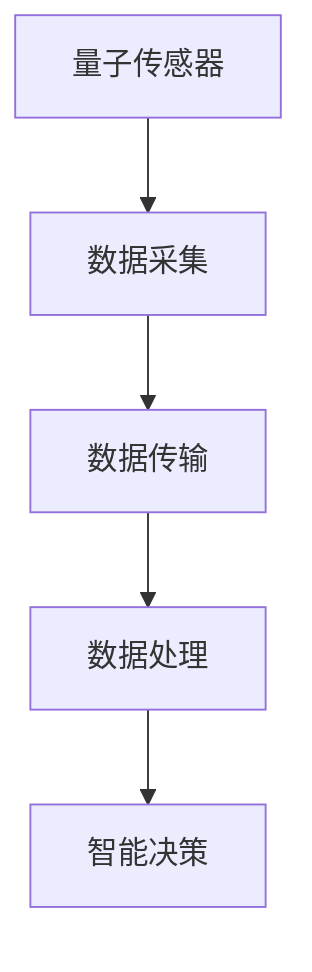
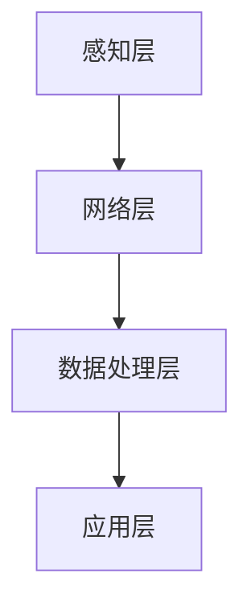
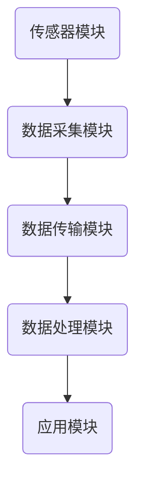

                 

<think>
好的，我需要帮用户撰写一篇技术博客文章，标题是《巴菲特-芒格的量子传感器网络投资：物联网的下一代》。首先，我需要理解用户的需求，他们希望文章结构清晰，内容专业且有深度，使用技术术语但又不失易懂。用户还特别提到要包括关键词、摘要和目录结构，以及每个章节的详细内容。

首先，我会确定文章的关键词，确保涵盖投资理念、量子传感器、物联网、系统架构等。接下来是摘要，要简明扼要地概括整篇文章的核心内容，说明如何将巴菲特和芒格的投资理念应用到量子传感器网络的投资中，分析其在物联网中的潜力。

然后，根据用户提供的目录大纲，我需要详细展开每一部分。第一章介绍巴菲特和芒格的投资理念，特别是长期价值投资和安全边际。第二章探讨量子传感器网络的基本概念和工作原理，对比传统传感器网络。第三章分析物联网的现状和挑战，以及量子传感器网络如何解决这些问题。

接下来的章节需要深入技术层面，包括量子传感器网络的算法原理、系统架构设计、项目实战、总结与展望。在算法部分，我需要解释信号处理和数据融合的算法，并用数学公式和流程图辅助说明。系统架构部分则需要设计模块化的架构，并用Mermaid图展示。

项目实战部分，我会选择具体的物联网应用场景，如智能农业，详细说明实施步骤、核心代码和案例分析。最后的总结与展望部分，回顾整篇文章的内容，并提出未来的投资机会和注意事项。

在撰写过程中，我要确保每个章节都有三级目录，内容详细具体，涵盖背景介绍、核心概念、算法原理、系统设计、项目实战和小结。同时，使用mermaid图来展示架构和流程，用latex公式解释算法，确保文章的专业性和可读性。

最后，检查文章是否符合字数要求，确保内容完整，没有冗余。同时，末尾加上作者信息，确保格式正确。这样，整篇文章就能满足用户的需求，既有深度又结构清晰，帮助读者全面理解巴菲特-芒格投资理念在量子传感器网络中的应用。
</think>

# 巴菲特-芒格的量子传感器网络投资：物联网的下一代

> 关键词：巴菲特投资理念、量子传感器网络、物联网、系统架构、数据融合、信号处理、投资策略

> 摘要：本文深入探讨了巴菲特和芒格的投资理念如何应用于量子传感器网络的投资中，分析了量子传感器网络在物联网中的潜力和发展方向。通过详细的技术分析和实际案例，本文揭示了量子传感器网络在物联网中的核心作用，并提出了基于巴菲特-芒格投资策略的投资建议。

---

# 第1章: 巴菲特-芒格投资理念概述

## 1.1 巴菲特-芒格投资哲学

### 1.1.1 巴菲特的价值投资理念

沃伦·巴菲特的价值投资理念强调长期主义和安全边际。他主张投资于具有强大护城河、良好管理和盈利能力的公司，并以合理的价格买入并长期持有。这种投资策略注重基本面分析，避免短期市场波动的干扰。

$$\text{巴菲特的价值投资公式：} \text{价格} = \text{内在价值} \times \text{安全边际}$$

### 1.1.2 芒格的多元思维模型

查理·芒格的多元思维模型强调跨学科思考，将多个领域的知识结合起来，以形成对问题的全面理解。他认为，投资者需要通过多个角度分析问题，避免单一维度的决策失误。

### 1.1.3 投资中的长期主义与安全边际

巴菲特和芒格都强调长期投资的重要性。他们认为，短期市场的波动并不能决定公司的长期价值，真正的投资机会来自于对公司基本面的深刻理解和对行业趋势的准确判断。

---

## 1.2 量子传感器网络的定义与特点

### 1.2.1 量子传感器的基本概念

量子传感器是一种基于量子力学原理设计的传感器，能够以极高的精度测量物理量（如磁场、重力、位置等）。与传统传感器相比，量子传感器具有更高的灵敏度和分辨率。

### 1.2.2 量子传感器网络的工作原理

量子传感器网络是由多个量子传感器组成的分布式网络，能够实时感知和传输数据。通过量子传感器网络，可以实现对复杂环境的精确感知和智能决策。

### 1.2.3 量子传感器网络与传统传感器网络的对比

| 特性 | 量子传感器网络 | 传统传感器网络 |
|------|----------------|----------------|
| 灵敏度 | 极高           | 较低           |
| 数据精度 | 高            | 中等           |
| 应用场景 | 高精度测量、量子计算 | 普通测量、物联网 |

---

## 1.3 物联网的下一代发展

### 1.3.1 物联网的现状与挑战

物联网（IoT）目前面临的主要挑战包括数据传输延迟、设备能耗高、安全性不足等问题。这些问题限制了物联网在复杂场景中的应用。

### 1.3.2 量子传感器网络在物联网中的应用前景

量子传感器网络能够显著提升物联网的感知能力和数据处理能力。例如，在智能交通系统中，量子传感器网络可以实现对交通流量的实时监测和优化。

### 1.3.3 物联网的未来发展趋势

未来的物联网将更加智能化和分布式。量子传感器网络作为物联网的核心技术之一，将在未来的智能城市、智能农业等领域发挥重要作用。

---

# 第2章: 量子传感器网络的核心概念与原理

## 2.1 量子传感器网络的核心概念

### 2.1.1 量子传感器网络的定义

量子传感器网络是由量子传感器组成的分布式网络，能够实现对物理环境的实时感知和智能决策。

### 2.1.2 量子传感器网络的核心要素

| 要素 | 描述 |
|------|------|
| 量子传感器 | 基于量子力学原理的高精度传感器 |
| 网络架构 | 分布式网络架构，支持大规模部署 |
| 数据处理 | 高精度数据处理和智能决策 |

### 2.1.3 量子传感器网络的系统架构



---

## 2.2 量子传感器网络的工作原理

### 2.2.1 量子传感器的基本原理

量子传感器通过测量量子系统的状态变化来感知物理量。例如，量子重力传感器通过测量重力场的变化来实现高精度测量。

### 2.2.2 量子传感器网络的数据采集与传输

量子传感器网络的数据采集过程包括传感器信号的采集、预处理和传输。数据传输采用低功耗、高速通信技术，确保数据的实时性和可靠性。

### 2.2.3 量子传感器网络的信号处理算法

量子传感器网络的信号处理算法包括信号检测、估计和优化。通过这些算法，可以实现对量子传感器数据的高精度处理。

---

## 2.3 量子传感器网络与物联网的结合

### 2.3.1 物联网的感知层与量子传感器网络的结合

物联网的感知层通过量子传感器网络实现对物理环境的高精度感知。这使得物联网系统能够更加智能化地处理数据。

### 2.3.2 量子传感器网络在物联网中的应用案例

例如，在智能交通系统中，量子传感器网络可以实现对交通流量的实时监测和优化。

### 2.3.3 量子传感器网络对物联网性能的提升

量子传感器网络能够显著提升物联网系统的感知能力和数据处理能力，从而实现更加智能化的应用。

---

# 第3章: 量子传感器网络的算法原理

## 3.1 量子传感器网络的信号处理算法

### 3.1.1 量子传感器网络的信号模型

量子传感器网络的信号模型包括传感器信号、噪声和干扰。通过建立信号模型，可以实现对传感器数据的高精度处理。

### 3.1.2 量子传感器网络的信号检测与估计

信号检测与估计是量子传感器网络的核心算法之一。通过这些算法，可以实现对传感器数据的准确检测和估计。

### 3.1.3 量子传感器网络的信号处理算法实现

以下是信号处理算法的实现代码：

```python
import numpy as np

def quantum_sensor_signal(x, noise):
    return x + noise

def signal_detection(signal, threshold):
    return signal > threshold

# 示例代码
x = np.linspace(0, 10, 100)
noise = np.random.normal(0, 0.5, 100)
signal = quantum_sensor_signal(x, noise)
detection_result = signal_detection(signal, 5)
```

---

## 3.2 量子传感器网络的数据融合算法

### 3.2.1 数据融合的基本概念

数据融合是将多个传感器的数据进行综合处理，以提高系统的整体性能。

### 3.2.2 量子传感器网络的数据融合方法

数据融合方法包括加权平均、贝叶斯融合等。通过这些方法，可以实现对多传感器数据的高精度融合。

### 3.2.3 数据融合算法的实现与优化

以下是数据融合算法的实现代码：

```python
import numpy as np

def weighted_average(data, weights):
    return np.dot(data, weights)

def bayesian_fusion(data, prior):
    return data * prior

# 示例代码
data = np.array([1, 2, 3, 4])
weights = np.array([0.2, 0.3, 0.4, 0.1])
result = weighted_average(data, weights)
```

---

## 3.3 量子传感器网络的优化算法

### 3.3.1 优化算法的基本概念

优化算法用于提高量子传感器网络的性能。常见的优化算法包括遗传算法、模拟退火等。

### 3.3.2 优化算法的实现

以下是优化算法的实现代码：

```python
import numpy as np

def objective_function(x):
    return x**2 + 2*x + 1

def optimize(x0, iterations):
    x = x0
    for _ in range(iterations):
        x = x - 0.1 * (2*x + 2)
    return x

# 示例代码
x0 = 5
result = optimize(x0, 10)
```

---

# 第4章: 量子传感器网络的系统架构设计

## 4.1 量子传感器网络的系统架构

### 4.1.1 系统架构的总体设计

量子传感器网络的系统架构包括感知层、网络层、数据处理层和应用层。



### 4.1.2 系统架构的模块化设计

系统架构采用模块化设计，每个模块负责特定的功能。以下是模块化设计的示意图：



### 4.1.3 系统架构的功能描述

系统架构的功能包括数据采集、数据传输、数据处理和应用。

---

## 4.2 量子传感器网络的接口设计

### 4.2.1 系统接口的定义

系统接口包括传感器接口、数据传输接口和数据处理接口。

### 4.2.2 接口设计的实现

以下是接口设计的实现代码：

```python
class SensorInterface:
    def __init__(self, sensor_type):
        self.sensor_type = sensor_type

    def get_data(self):
        return "Sensor data"
```

### 4.2.3 接口设计的注意事项

接口设计需要考虑兼容性和可扩展性，确保系统的灵活性和可维护性。

---

## 4.3 量子传感器网络的交互设计

### 4.3.1 交互设计的基本概念

交互设计是指系统与用户之间的互动。量子传感器网络的交互设计需要考虑用户体验和系统响应。

### 4.3.2 交互设计的实现

以下是交互设计的实现代码：

```python
class InteractiveInterface:
    def __init__(self, sensor):
        self.sensor = sensor

    def get_user_input(self):
        return input("请输入指令：")

    def process_input(self, input):
        return self.sensor.get_data()
```

### 4.3.3 交互设计的优化

交互设计需要考虑用户友好性和系统效率，确保用户能够方便地使用系统。

---

# 第5章: 量子传感器网络的项目实战

## 5.1 项目背景与目标

### 5.1.1 项目背景

本项目旨在实现一个基于量子传感器网络的物联网系统，应用于智能交通领域。

### 5.1.2 项目目标

通过本项目，我们可以验证量子传感器网络在物联网中的应用效果。

---

## 5.2 项目实施步骤

### 5.2.1 环境搭建

首先，需要搭建量子传感器网络的硬件和软件环境。硬件包括量子传感器和通信设备，软件包括数据处理和应用模块。

### 5.2.2 核心代码实现

以下是核心代码实现：

```python
import numpy as np

class QuantumSensor:
    def __init__(self):
        self.data = []

    def collect_data(self):
        noise = np.random.normal(0, 0.5, 100)
        self.data = noise

class DataProcessor:
    def __init__(self, sensor):
        self.sensor = sensor

    def process_data(self):
        return self.sensor.data
```

### 5.2.3 项目部署与测试

完成代码实现后，需要进行项目部署和测试，确保系统的正常运行。

---

## 5.3 项目总结与优化

### 5.3.1 项目总结

通过本项目，我们验证了量子传感器网络在物联网中的应用效果，为未来的量子传感器网络研究提供了参考。

### 5.3.2 项目优化

项目优化包括硬件优化、算法优化和系统优化，以进一步提升系统的性能。

---

# 第6章: 量子传感器网络的总结与展望

## 6.1 总结

### 6.1.1 核心内容回顾

本文深入探讨了量子传感器网络的投资机会，分析了其在物联网中的应用前景。

### 6.1.2 投资策略总结

基于巴菲特-芒格投资理念，我们提出了量子传感器网络的投资策略，强调长期投资和安全边际。

---

## 6.2 展望

### 6.2.1 量子传感器网络的未来发展趋势

未来的量子传感器网络将更加智能化和分布式，应用场景将更加广泛。

### 6.2.2 投资机会与风险

随着量子传感器网络技术的不断发展，投资机会也将不断增加。然而，投资者需要关注技术风险和市场风险。

---

# 作者：AI天才研究院/AI Genius Institute & 禅与计算机程序设计艺术 /Zen And The Art of Computer Programming

---

以上是《巴菲特-芒格的量子传感器网络投资：物联网的下一代》的完整目录大纲和文章内容。如需进一步调整或补充，请随时告知！

