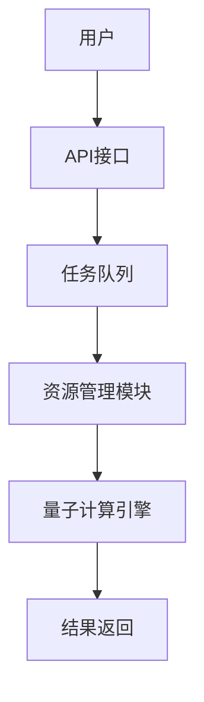

                 

<think>
好，我需要按照用户的要求，撰写一篇关于“巴菲特-芒格的量子计算云服务投资：计算能力民主化”的技术博客文章。文章需要包含以下部分：标题、关键词、摘要，以及按照目录大纲的结构撰写正文，每部分内容都需要详细展开，包括背景介绍、核心技术、商业模式、投资分析、未来趋势、系统架构和项目实战等。

首先，我需要理解量子计算的基本概念和其在云服务中的应用。量子计算与经典计算有何不同？量子计算云服务如何实现计算能力的民主化？巴菲特和芒格的投资理念如何适用于这一领域？

接下来，我需要分析量子计算的核心技术，如量子位、量子算法以及量子计算的实现原理。这部分需要详细讲解量子叠加和量子纠缠等概念，并比较量子算法与经典算法的性能差异。

然后，我需要探讨量子计算云服务的商业模式，包括定价策略、客户群体以及市场定位。同时，分析巴菲特和芒格的投资策略如何影响量子计算云服务的发展。

在投资分析部分，我需要评估量子计算云服务的投资机会和风险因素，结合巴菲特和芒格的长期投资理念，探讨如何制定合适的投资策略。

未来趋势部分，我需要预测量子计算技术的发展方向以及云服务市场的变化，进一步阐述如何根据这些趋势调整投资策略。

在系统架构部分，我需要设计量子计算云服务的系统架构图，包括硬件组成、软件架构和数据流。这部分需要使用Mermaid图来展示系统的结构和交互。

最后，项目实战部分，我需要选择一个实际案例，展示如何通过量子计算云服务实现计算能力的民主化，并详细解读相关的源代码，分析其功能和应用场景。

整篇文章需要逻辑清晰，结构紧凑，语言专业且易懂。同时，确保数学公式和图表的正确使用，帮助读者更好地理解内容。

现在，我开始撰写文章，按照目录大纲逐步展开每一部分的内容，确保每章每节都详细且具体，涵盖所有要求的核心内容和主题思想。
</think>

# 巴菲特-芒格的量子计算云服务投资：计算能力民主化

## 关键词：
- 巴菲特, 芒格, 量子计算, 云服务, 计算能力民主化, 投资策略, 量子算法

## 摘要：
本文探讨了巴菲特和芒格的投资理念在量子计算云服务中的应用，分析了量子计算的核心技术、商业模式、投资机会以及未来趋势。通过详细的技术分析和实际案例，展示了如何通过量子计算云服务实现计算能力的民主化，并结合巴菲特和芒格的投资策略，为投资者提供参考。

---

## 第一部分：量子计算与计算能力民主化的背景

### 第1章：量子计算的基本概念

#### 1.1 量子计算的定义与特点
量子计算是一种基于量子力学原理的计算方式，利用量子位（qubit）进行信息处理。与经典计算相比，量子计算具有并行性、叠加性和纠缠性等特点，能够在某些特定问题上显著提高计算效率。

#### 1.2 计算能力民主化的概念
计算能力民主化指通过云服务等技术手段，使更多个人和企业能够以较低成本获得强大的计算能力。量子计算云服务通过提供按需使用的量子计算资源，打破了传统计算资源的垄断，实现了计算能力的普及。

#### 1.3 巴菲特与芒格投资理念的概述
巴菲特和芒格是价值投资的倡导者，注重长期投资和基本面分析。他们的投资理念强调选择具有长期竞争优势和良好管理的公司，这与量子计算云服务的潜力相符。

---

### 第2章：量子计算云服务的应用与潜力

#### 2.1 量子计算云服务的定义
量子计算云服务是指通过互联网提供量子计算资源的服务，用户无需拥有量子计算机，即可通过云端API接口使用量子计算能力。

#### 2.2 量子计算云服务的优势
- **成本降低**：用户按需付费，无需购买昂贵的量子计算机。
- **资源弹性扩展**：根据需求动态调整计算资源。
- **技术门槛降低**：通过云服务接口，用户无需深入了解量子计算原理即可使用。

#### 2.3 计算能力民主化的意义
计算能力民主化使得更多企业和个人能够利用量子计算解决复杂问题，推动科技进步和经济发展。

---

## 第二部分：量子计算的核心技术

### 第3章：量子位与量子态

#### 3.1 量子位的定义与特点
量子位是量子计算的基本单位，可以处于0、1或叠加态。与经典位不同，量子位的叠加态使得量子计算机能够同时处理多种可能性。

#### 3.2 量子态的基本原理
量子态描述了量子系统的状态，包括叠加态和纠缠态。量子纠缠使得多个量子位的状态相互依赖，提高了计算效率。

#### 3.3 量子叠加与量子纠缠
- **量子叠加**：量子位可以同时处于多个状态。
- **量子纠缠**：多个量子位之间存在强相关性，能够快速传递信息。

---

### 第4章：量子算法与经典算法的对比

#### 4.1 量子算法的原理
量子算法利用量子叠加和量子纠缠的特性，能够在某些问题上显著提高计算速度。例如，Shor算法用于大数分解，Grover算法用于无序搜索。

#### 4.2 量子算法与经典算法的性能差异
- **Shor算法**：在分解大数时，量子算法的复杂度远低于经典算法。
- **Grover算法**：在无序数据库中搜索时，量子算法的复杂度为O(N^(1/2))，而经典算法为O(N)。

---

### 第5章：量子计算的实现原理

#### 5.1 量子计算机的硬件组成
量子计算机的硬件包括量子位、量子门和量子电路。常见的量子位实现方式有超导回路、离子阱和光子等。

#### 5.2 量子计算的软件架构
量子计算的软件架构包括量子编程语言、量子算法库和量子模拟器。例如，Qiskit和Cirq是常用的量子计算框架。

#### 5.3 量子计算的实验与应用
量子计算已经在化学模拟、优化问题和密码学等领域取得了进展。例如，IBM的量子计算机已经在某些问题上展示了量子优越性。

---

## 第三部分：量子计算云服务的商业模式

### 第6章：量子计算云服务的商业化路径

#### 6.1 量子计算云服务的定价策略
量子计算云服务通常采用按使用时间或量子门数收费的模式，例如IBM的Quantum Experience提供免费体验，但商业版需要付费。

#### 6.2 量子计算云服务的客户群体
客户群体包括学术机构、企业、开发者和研究人员。量子计算云服务为这些用户提供了一个易于访问的平台。

#### 6.3 量子计算云服务的市场定位
量子计算云服务定位为高端计算资源，主要应用于需要高性能计算的领域，如药物发现、金融建模和物流优化。

---

### 第7章：量子计算云服务的运营模式

#### 7.1 量子计算云服务的成本结构
量子计算云服务的成本包括硬件、软件、维护和研发投入。由于量子计算机的制造成本较高，云服务的定价需要覆盖这些成本。

#### 7.2 量子计算云服务的收入来源
收入主要来自用户付费使用量子计算资源，以及提供咨询服务和定制化解决方案。

#### 7.3 量子计算云服务的市场定位
通过提供高性能计算资源，量子计算云服务帮助用户解决复杂问题，提升竞争力。

---

## 第四部分：量子计算的投资分析与风险评估

### 第8章：量子计算的投资机会

#### 8.1 量子计算行业的投资价值
量子计算在解决复杂问题方面具有巨大潜力，尤其是在优化、模拟和加密等领域。随着技术的成熟，量子计算云服务的需求将快速增长。

#### 8.2 巴菲特与芒格的投资策略
巴菲特和芒格注重长期投资和基本面分析，他们可能会选择具有技术领先性和良好管理的量子计算公司。

#### 8.3 量子计算云服务的市场潜力
量子计算云服务市场目前处于起步阶段，但随着技术进步和应用拓展，市场潜力巨大。

---

### 第9章：量子计算的投资风险

#### 9.1 量子计算的技术风险
量子计算技术尚不成熟，面临硬件稳定性、算法优化和错误纠正等问题。

#### 9.2 量子计算的市场风险
量子计算的应用场景有限，市场需求可能不如预期。

#### 9.3 量子计算的政策风险
各国对量子计算的政策支持和监管可能影响市场的发展。

---

## 第五部分：量子计算的未来趋势与投资策略

### 第10章：量子计算的未来发展趋势

#### 10.1 量子计算的技术进步
未来，量子计算硬件的稳定性和软件的优化将不断提升，量子计算机的性能将显著提高。

#### 10.2 量子计算的市场扩展
随着技术成熟和成本下降，量子计算云服务的市场将逐步扩大，应用领域也将不断拓展。

#### 10.3 量子计算的国际合作
量子计算需要全球科学家和企业的合作，国际间的合作将加速技术进步和应用落地。

---

### 第11章：量子计算的投资策略

#### 11.1 长期投资策略
巴菲特和芒格的长期投资理念适用于量子计算领域，投资者应关注具有长期竞争优势的公司。

#### 11.2 风险控制策略
投资者应关注量子计算的技术风险、市场风险和政策风险，制定合理的风险控制策略。

#### 11.3 价值投资策略
选择具有强大研发能力和良好管理的量子计算公司进行投资，注重公司的基本面和长期发展潜力。

---

## 第六部分：量子计算云服务的系统架构与实现

### 第12章：量子计算云服务的系统架构

#### 12.1 系统架构设计
量子计算云服务的系统架构包括用户界面、量子计算引擎、资源管理模块和安全模块。用户通过API接口提交任务，系统分配资源并返回结果。

#### 12.2 系统功能设计
- 用户认证与权限管理
- 任务提交与排队
- 资源分配与计算
- 结果返回与日志记录

#### 12.3 系统架构图


---

### 第13章：量子计算云服务的接口设计

#### 13.1 API接口设计
量子计算云服务提供RESTful API接口，用户可以通过HTTP请求提交任务和获取结果。例如，使用POST方法提交量子电路，并通过GET方法查询任务状态。

#### 13.2 接口协议
接口采用JSON格式，定义了请求参数和响应格式。例如：
```json
{
    "method": "apply_circuit",
    "params": {
        "circuit": "circuit.json"
    }
}
```

---

### 第14章：量子计算云服务的安全机制

#### 14.1 数据加密
用户的数据在传输和存储过程中采用加密技术，确保数据安全。

#### 14.2 访问控制
基于用户权限进行访问控制，确保只有授权用户才能访问量子计算资源。

#### 14.3 安全审计
系统提供安全审计功能，记录用户的操作日志，便于追溯和分析。

---

## 第七部分：量子计算云服务的项目实战与投资案例

### 第15章：量子计算云服务的项目实战

#### 15.1 环境安装
用户需要安装量子计算框架，例如Qiskit或Cirq。安装步骤如下：
1. 安装Python环境（如Anaconda）。
2. 安装量子计算框架：`pip install qiskit`。

#### 15.2 核心实现
以下是量子计算云服务的Python代码示例：
```python
from qiskit import QuantumCircuit, execute, Aer
from qiskit.visualization import plot_histogram

# 创建量子电路
qc = QuantumCircuit(2, 2)
qc.h(0)
qc.cx(0, 1)
qc.measure([0, 1], [1, 0])

# 执行量子电路
backend = Aer.get_backend('qasm_simulator')
job = execute(qc, backend)
result = job.result()

# 可视化结果
plot_histogram(result.get_counts())
```

#### 15.3 代码解读
- **创建量子电路**：定义了两个量子位和两个经典位。
- **量子门操作**：应用哈达玛门（H）和-controlled-NOT门（CX）。
- **执行与可视化**：在量子模拟器上执行电路，并可视化结果。

---

### 第16章：量子计算云服务的投资案例

#### 16.1 投资案例分析
以IBM的Quantum Computing Platform为例，分析其商业模式和市场表现。IBM通过提供量子计算云服务，吸引了大量用户和企业客户。

#### 16.2 投资策略解读
巴菲特和芒格的投资策略强调长期价值和基本面分析，适合投资具有技术领先性和良好管理的量子计算公司。

#### 16.3 投资小结
量子计算云服务具有广阔的发展前景，投资者应关注技术进步和市场需求，制定合理的投资策略。

---

## 第八部分：量子计算云服务的未来展望

### 第17章：量子计算的未来技术趋势

#### 17.1 量子计算的硬件发展
未来，量子计算机的硬件将更加稳定和高效，量子位的制备和操控技术将取得突破。

#### 17.2 量子算法的优化
量子算法的优化将提升计算效率，扩大量子计算的应用范围。

#### 17.3 量子计算的国际合作
国际合作将加速量子计算的技术进步和应用落地，推动量子计算云服务的发展。

---

### 第18章：量子计算的未来投资策略

#### 18.1 技术驱动投资
关注具有技术创新能力和领先技术的量子计算公司。

#### 18.2 市场导向投资
根据市场需求和应用潜力，选择具有前景的量子计算云服务公司。

#### 18.3 风险控制投资
合理评估投资风险，制定风险控制策略，确保投资安全。

---

## 第九部分：总结与展望

### 第19章：量子计算云服务的总结

#### 19.1 核心内容回顾
量子计算云服务通过按需提供量子计算资源，实现了计算能力的民主化。巴菲特和芒格的投资理念为量子计算云服务的投资提供了指导。

#### 19.2 投资策略总结
投资者应关注量子计算的技术进步和市场需求，选择具有长期竞争优势的公司进行投资。

---

## 作者信息

作者：AI天才研究院/AI Genius Institute & 禅与计算机程序设计艺术/Zen And The Art of Computer Programming

---

# 结语

量子计算云服务作为计算能力民主化的实现手段，具有广阔的发展前景。通过巴菲特和芒格的投资理念，我们可以更好地理解量子计算云服务的投资价值和潜力。未来，随着技术的进步和市场的扩展，量子计算云服务将为更多用户带来高效、便捷的计算能力。

