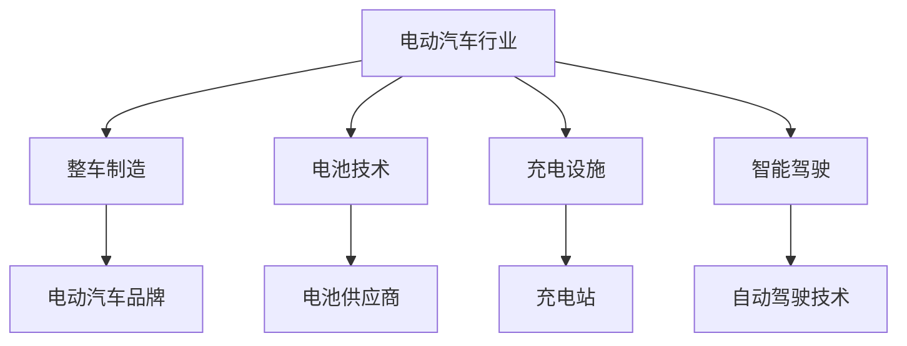

                 

<think>
好，我现在需要帮助用户撰写一篇关于巴菲特和芒格对电动汽车行业看法的技术博客文章。文章的标题是《巴菲特-芒格看电动汽车行业：未来出行的变革》。我需要按照用户提供的大纲结构来完成，同时确保内容逻辑清晰、结构紧凑，使用专业且易懂的技术语言。

首先，我会先阅读并理解用户提供的详细大纲，确保每个部分的内容都涵盖到位。接下来，我会按照每个章节的要求，逐步分析和撰写内容，确保每个小节都有足够的细节和深度。我还需要注意使用适当的数学公式和图表来辅助说明，比如在分析现金流时使用公式，或者用Mermaid图来展示系统架构。

在写作过程中，我会保持语言的专业性，同时尽量让内容通俗易懂。我会检查每个部分的逻辑是否连贯，是否有遗漏的关键点，并确保文章整体结构合理，符合用户的字数要求。

最后，我会在文章末尾添加作者信息，确保格式正确，并进行一次全面的校对，确保没有语法错误或逻辑不清晰的地方。这样，整篇博客文章就能满足用户的需求，既有深度又易于理解。
</think>

# 巴菲特-芒格看电动汽车行业：未来出行的变革

> 关键词：巴菲特, 芒格, 电动汽车, 投资策略, 未来出行

> 摘要：本文从巴菲特和芒格的投资哲学出发，深入分析电动汽车行业的现状、技术发展和市场趋势，探讨如何将价值投资与技术分析相结合，揭示未来出行的变革方向。文章结合实际案例，提供系统的投资分析框架，帮助读者在电动汽车行业中找到长期投资机会。

---

# 第一部分: 巴菲特-芒格投资智慧与电动汽车行业的结合

# 第1章: 电动汽车行业的背景与现状

## 1.1 电动汽车行业的背景介绍

### 1.1.1 传统汽车行业的转型与挑战

传统汽车行业正面临前所未有的挑战。随着环保意识的增强和能源结构的调整，传统燃油车的市场份额逐渐被挤压。电动汽车（EV）作为替代品，成为行业转型的必然趋势。汽车制造商、能源公司和科技企业纷纷加码电动汽车领域，试图在这一新兴市场中占据先机。

### 1.1.2 电动汽车行业的兴起与发展

电动汽车的兴起源于技术进步和政策支持。电池技术的突破（如锂离子电池）使得电动汽车的续航里程和充电效率显著提升。同时，全球范围内的碳中和目标推动了政府对电动汽车行业的补贴和税收优惠，进一步刺激了市场需求。

### 1.1.3 电动汽车行业的核心问题与目标

电动汽车行业的核心问题是技术瓶颈和市场渗透。技术方面，电池成本和充电设施的完善是关键；市场方面，如何提高消费者接受度和扩大市场份额是主要目标。行业的长期目标是实现完全依赖可再生能源的零排放出行。

## 1.2 电动汽车行业的技术发展与市场分析

### 1.2.1 电动汽车行业的技术发展

电动汽车的核心技术包括电池技术、电机技术和智能驾驶技术。电池技术是决定电动汽车性能的关键，目前主要依赖锂离子电池，未来可能向固态电池等更先进的技术发展。电机技术的进步提高了能效和可靠性，而智能驾驶技术的引入则提升了驾驶的安全性和用户体验。

### 1.2.2 电动汽车市场的现状与未来趋势

当前，全球电动汽车市场呈现快速增长态势。中国、欧洲和美国是主要的电动汽车市场，特斯拉、比亚迪等企业占据主导地位。未来，随着技术进步和成本下降，电动汽车将逐步取代传统燃油车，成为主流出行方式。

### 1.2.3 电动汽车行业的投资机会与风险

投资机会主要集中在电动汽车产业链的关键环节，如电池制造商、充电基础设施和整车制造商。风险方面，技术风险（如电池技术瓶颈）和政策风险（如补贴退坡）是主要挑战。

## 1.3 巴菲特与芒格的投资哲学与策略

### 1.3.1 巴菲特的价值投资理念

巴菲特的价值投资理念强调长期投资、注重企业内在价值和安全边际。他主张投资具有强大护城河、良好管理团队和可持续盈利能力的企业。

### 1.3.2 芒格的多元思维模型

芒格的多元思维模型强调跨学科思考，将多个领域的知识融会贯通，用于分析问题和做出决策。他认为，投资者需要通过不断学习和积累知识，构建一个完整的知识框架。

### 1.3.3 巴菲特与芒格投资策略的结合

巴菲特和芒格的投资策略结合了长期价值投资和多元思维模型。他们不仅关注企业的财务数据，还关注企业的竞争优势、行业发展趋势和宏观政策环境。

## 1.4 巴菲特与芒格对电动汽车行业的看法

### 1.4.1 巴菲特对电动汽车行业的早期态度

巴菲特早期对电动汽车行业持谨慎态度，认为电动汽车行业的竞争激烈且技术不确定性较高。他更倾向于投资传统能源企业，如石油和天然气公司。

### 1.4.2 芒格对电动汽车行业的深度分析

芒格对电动汽车行业持更为开放的态度，认为电动汽车是未来出行的必然趋势。他关注电动汽车行业的技术进步和政策支持，并认为电动汽车行业的长期前景广阔。

### 1.4.3 巴菲特与芒格对电动汽车行业的最新观点

近年来，巴菲特和芒格的态度有所转变。他们开始关注电动汽车行业的技术进步和市场潜力，认为电动汽车行业将对未来出行方式产生深远影响。

## 1.5 本章小结

本章从电动汽车行业的背景和现状出发，分析了行业的技术发展和市场趋势。同时，结合巴菲特和芒格的投资哲学，探讨了他们对电动汽车行业的看法和投资策略。下一章将深入分析电动汽车行业的核心概念与投资分析框架。

---

# 第2章: 电动汽车行业的核心概念与投资分析

## 2.1 电动汽车行业的核心概念

### 2.1.1 电动汽车行业的定义与范围

电动汽车是指完全依赖电能驱动的车辆，包括纯电动汽车（BEV）和插电式混合动力汽车（PHEV）。电动汽车行业的范围涵盖整车制造、电池生产、充电基础设施和智能驾驶技术等多个领域。

### 2.1.2 电动汽车行业的核心要素与属性

电动汽车行业的核心要素包括技术（电池技术、电机技术）、成本（生产成本、供应链成本）、政策（补贴政策、环保法规）和市场（消费者需求、竞争格局）。这些要素相互作用，共同影响行业的未来发展。

### 2.1.3 电动汽车行业的概念结构与关系图

以下是电动汽车行业的概念结构与关系图：

---

## 2.2 电动汽车行业的核心因素分析

### 2.2.1 技术因素：电池技术与充电设施

电池技术是电动汽车的核心，直接影响车辆的续航里程和充电效率。当前，锂离子电池是主流技术，但未来可能向固态电池等更高能量密度的技术发展。充电设施的完善是电动汽车普及的关键因素，包括公共充电站和家庭充电桩的建设。

### 2.2.2 成本因素：生产与供应链

电动汽车的生产成本包括整车制造和电池生产。整车制造的成本受规模效应和技术进步的影响，而电池生产成本则受原材料价格和生产效率的影响。供应链的稳定性和成本控制是电动汽车企业竞争力的关键。

### 2.2.3 政策因素：政府补贴与法规

政府补贴是电动汽车行业的重要支持，包括购车补贴、充电费用补贴和税收优惠。法规方面，各国政府通过强制排放标准和购车限制，推动电动汽车的普及。

### 2.2.4 市场因素：消费者需求与竞争格局

消费者需求受价格、品牌、续航里程和充电便利性的影响。竞争格局方面，特斯拉、比亚迪等企业在全球市场占据重要地位，而传统汽车制造商也在加速转型。

## 2.3 巴菲特与芒格投资策略与电动汽车行业的结合

### 2.3.1 巴菲特的价值投资与电动汽车行业的匹配

巴菲特的价值投资理念强调长期投资和企业内在价值。电动汽车行业的技术进步和市场潜力符合价值投资的逻辑，但需要关注企业的财务健康和管理团队。

### 2.3.2 芒格的多元思维模型在电动汽车行业的应用

芒格的多元思维模型要求投资者具备跨学科的知识，包括技术、经济和政策等方面。在分析电动汽车行业时，芒格会综合考虑技术进步、市场需求和政策环境，以做出全面的投资决策。

### 2.3.3 巴菲特与芒格对电动汽车行业的长期投资价值判断

巴菲特和芒格认为，电动汽车行业具有长期增长潜力，但需要关注企业的核心竞争力和行业趋势。他们倾向于投资那些具有技术优势、成本控制和良好管理团队的企业。

## 2.4 电动汽车行业的投资分析框架

### 2.4.1 电动汽车行业的投资逻辑与流程

电动汽车行业的投资逻辑包括以下几个步骤：
1. 分析行业趋势：关注技术进步、政策支持和市场需求。
2. 评估企业核心竞争力：分析企业的技术优势、成本控制和管理能力。
3. 评估财务状况：关注企业的盈利能力、现金流和资产负债情况。
4. 投资决策：结合市场估值和风险因素，做出投资决策。

### 2.4.2 电动汽车行业的关键指标与评估方法

以下是电动汽车行业的关键指标与评估方法：

| 关键指标       | 评估方法                                                                 |
|----------------|--------------------------------------------------------------------------|
| 技术先进性       | 通过专利数量、技术研发投入和产品性能进行评估                         |
| 成本控制         | 通过生产效率、供应链管理和单位成本进行评估                           |
| 市场份额         | 通过品牌影响力、销售网络和市场渗透率进行评估                         |
| 财务健康性       | 通过净利润率、现金流和资产负债率进行评估                             |

### 2.4.3 电动汽车行业的投资风险与应对策略

电动汽车行业的投资风险包括技术风险、政策风险和市场风险。应对策略包括分散投资、关注政策变化和选择具有强大技术优势的企业。

## 2.5 本章小结

本章分析了电动汽车行业的核心概念和投资分析框架，结合巴菲特和芒格的投资策略，探讨了如何在电动汽车行业中寻找长期投资机会。下一章将深入分析电动汽车行业的技术与市场分析。

---

# 第3章: 电动汽车行业的技术与市场分析

## 3.1 电动汽车行业的核心技术分析

### 3.1.1 电池技术：能量密度与成本

电池技术是电动汽车的核心，直接影响车辆的续航里程和成本。当前，锂离子电池是主流技术，但未来可能向固态电池等更高能量密度的技术发展。电池成本的下降是电动汽车普及的关键因素。

### 3.1.2 电机技术：效率与可靠性

电机技术的进步提高了电动汽车的能效和可靠性。永磁同步电机和交流异步电机是当前的主要技术，未来可能向更高效、更可靠的电机技术发展。

### 3.1.3 智能驾驶技术：AI与数据

智能驾驶技术的引入提升了电动汽车的安全性和用户体验。通过AI算法和大数据分析，智能驾驶技术能够实现自动驾驶和智能交通管理。

## 3.2 电动汽车行业的市场分析

### 3.2.1 全球电动汽车市场的现状与趋势

全球电动汽车市场呈现快速增长态势。2020年，全球电动汽车销量达到530万辆，占全球汽车总销量的10%。未来，随着技术进步和成本下降，电动汽车市场份额将逐步扩大。

### 3.2.2 中国、美国、欧洲市场的对比分析

中国是全球最大的电动汽车市场，2020年销量达到130万辆。美国和欧洲市场也呈现快速增长态势，特斯拉、通用和大众等企业是主要竞争者。

### 3.2.3 电动汽车市场的未来增长点

未来，电动汽车市场的增长点包括新兴市场的开拓、高端电动汽车的普及和智能驾驶技术的应用。

## 3.3 巴菲特与芒格对技术与市场的看法

### 3.3.1 巴菲特对技术进步的长期看法

巴菲特认为，技术进步是推动电动汽车行业发展的关键因素。他关注电池技术的突破和充电设施的完善，认为这些技术进步将推动电动汽车的普及。

### 3.3.2 芒格对市场需求的判断

芒格认为，电动汽车市场的未来增长主要取决于消费者需求和政策支持。他关注新兴市场的潜力和消费者对环保出行方式的接受度。

### 3.3.3 巴菲特与芒格对行业趋势的综合判断

巴菲特和芒格认为，电动汽车行业的技术进步和市场需求将推动行业的长期增长。他们倾向于投资那些具有技术优势和市场潜力的企业。

## 3.4 本章小结

本章分析了电动汽车行业的核心技术和发展趋势，探讨了巴菲特和芒格对技术与市场的看法。下一章将结合实际案例，提供系统的投资分析框架。

---

# 第4章: 电动汽车行业的投资分析与实战

## 4.1 电动汽车行业的投资分析框架

### 4.1.1 投资逻辑与流程

电动汽车行业的投资逻辑包括以下步骤：
1. 分析行业趋势：关注技术进步、政策支持和市场需求。
2. 评估企业核心竞争力：分析企业的技术优势、成本控制和管理能力。
3. 评估财务状况：关注企业的盈利能力、现金流和资产负债情况。
4. 投资决策：结合市场估值和风险因素，做出投资决策。

### 4.1.2 关键指标与评估方法

以下是电动汽车行业的关键指标与评估方法：

| 关键指标       | 评估方法                                                                 |
|----------------|--------------------------------------------------------------------------|
| 技术先进性       | 通过专利数量、技术研发投入和产品性能进行评估                         |
| 成本控制         | 通过生产效率、供应链管理和单位成本进行评估                           |
| 市场份额         | 通过品牌影响力、销售网络和市场渗透率进行评估                         |
| 财务健康性       | 通过净利润率、现金流和资产负债率进行评估                             |

## 4.2 电动汽车行业的实战分析

### 4.2.1 案例分析：特斯拉

特斯拉是电动汽车行业的代表性企业。以下是对其投资价值的分析：

#### 4.2.1.1 财务状况

特斯拉的财务状况表现强劲，2020年营业收入为315.4亿美元，净利润为7.21亿美元。公司现金流充裕，具备较强的抗风险能力。

#### 4.2.1.2 技术优势

特斯拉在电池技术和智能驾驶技术方面具有显著优势。其电池技术的创新和智能驾驶系统的领先使其在行业内占据重要地位。

#### 4.2.1.3 市场潜力

特斯拉在全球市场上占据领先地位，未来在新兴市场的拓展将为其带来更大的增长空间。

### 4.2.2 投资建议

基于特斯拉的财务状况、技术优势和市场潜力，我们认为特斯拉是值得长期关注的投资标的。

## 4.3 本章小结

本章通过实战分析，结合特斯拉的案例，提供了电动汽车行业的投资分析框架。投资者可以根据这一框架，结合自身的投资目标和风险偏好，做出合理的投资决策。

---

# 第5章: 结论与展望

## 5.1 本章小结

本文从巴菲特和芒格的投资哲学出发，深入分析了电动汽车行业的技术发展和市场趋势，探讨了如何将价值投资与技术分析相结合，揭示未来出行的变革方向。文章结合实际案例，提供了系统的投资分析框架，帮助读者在电动汽车行业中找到长期投资机会。

## 5.2 未来展望

未来，电动汽车行业将继续受益于技术进步和政策支持，成为未来出行的主流方式。投资者需要密切关注行业动态，灵活调整投资策略，抓住行业的长期增长机会。

---

# 作者：AI天才研究院/AI Genius Institute & 禅与计算机程序设计艺术 /Zen And The Art of Computer Programming

