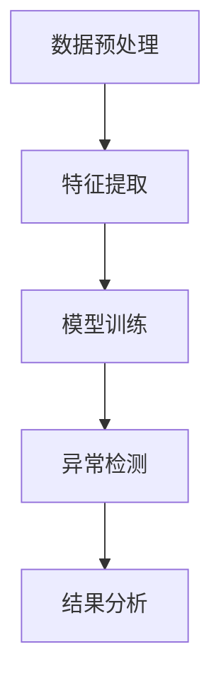
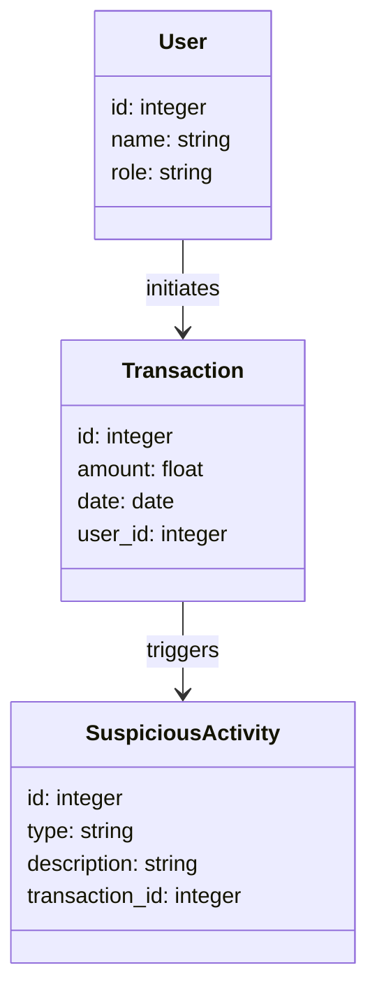

                 


# 布鲁斯·格林沃尔德的创造性会计识别方法

> 关键词：创造性会计、识别方法、审计、机器学习、会计欺诈、会计规则、异常检测

> 摘要：本文深入探讨了布鲁斯·格林沃尔德提出的创造性会计识别方法，分析了其核心概念、算法原理、系统架构及实际应用。通过详细的理论分析与实战案例，结合多种技术手段，揭示了如何有效识别和防范创造性会计行为，为企业审计和财务分析提供科学依据。

---

# 第一部分：创造性会计识别方法的背景与核心概念

---

## 第1章：创造性会计识别方法的背景介绍

### 1.1 创造性会计的定义与问题背景

创造性会计（Creative Accounting）是一种通过创造性地运用会计规则和方法，以达到特定财务目标的行为。它通常用于合法或非法的目的，例如美化财务报表、规避税务负担或掩盖财务问题。然而，创造性会计也可能被滥用，导致财务欺诈、误导利益相关者或损害企业声誉。

#### 1.1.1 创造性会计的定义

创造性会计并不是一个正式的会计术语，而是广泛用于描述那些“非常规”的会计处理方式。它通常包括以下特征：

1. **创造性**：利用会计规则的灵活性，进行非传统的会计处理。
2. **目的性**：为了达到特定的财务目标，如美化财务报表、规避监管等。
3. **风险性**：可能引发财务欺诈、审计问题或法律风险。

#### 1.1.2 创造性会计的主要问题与挑战

创造性会计行为可能带来以下问题：

1. **财务报表失真**：误导投资者、债权人和监管机构。
2. **审计困难**：审计人员需要识别和应对复杂的会计处理方式。
3. **法律风险**：某些创造性会计行为可能被视为欺诈，导致法律后果。

#### 1.1.3 创造性会计对企业与审计的影响

对企业而言，创造性会计可能帮助企业规避短期财务压力，但长期来看，可能导致信任危机和实际财务问题。对审计而言，识别创造性会计行为是确保财务报表真实性的关键。

---

### 1.2 创造性会计识别的需求与目标

识别创造性会计行为的需求主要来源于以下几个方面：

1. **审计需求**：审计机构需要确保财务报表的真实性和公允性。
2. **监管需求**：监管机构需要防范企业利用创造性会计规避法规。
3. **企业内部管理需求**：企业自身需要防范内部欺诈行为。

#### 1.2.1 创造性会计识别的必要性

随着企业间的竞争加剧，财务造假和欺诈行为日益复杂化。审计人员和监管机构需要更加高效和精准的方法来识别创造性会计行为，以维护市场秩序和投资者利益。

#### 1.2.2 创造性会计识别的目标

创造性会计识别的目标主要包括：

1. **识别异常交易**：发现不符合常规会计处理的交易行为。
2. **评估财务风险**：识别潜在的财务问题和欺诈行为。
3. **优化审计流程**：提高审计效率和准确性。

#### 1.2.3 创造性会计识别的边界与外延

创造性会计识别的边界主要在于如何区分“创造性”与“欺诈性”会计行为。其外延包括从简单的财务调整到复杂的财务造假行为。

---

### 1.3 创造性会计识别的核心要素与概念结构

#### 1.3.1 核心要素的定义与特征

创造性会计识别的核心要素包括：

1. **交易数据**：包括收入、支出、资产和负债等数据。
2. **会计规则**：包括会计准则和法规。
3. **异常检测**：通过数据分析发现异常交易。
4. **行为模式**：识别与正常行为模式不符的交易行为。

#### 1.3.2 概念结构的框架与模型

创造性会计识别的概念结构可以分为以下几个层次：

1. **输入层**：包括财务数据、交易记录等。
2. **处理层**：包括数据预处理、特征提取、模型训练等。
3. **输出层**：包括异常检测结果、风险评估等。

#### 1.3.3 创造性会计识别的核心逻辑

创造性会计识别的核心逻辑是通过分析财务数据中的异常模式，识别可能的创造性会计行为。这需要结合会计知识和数据分析技术。

---

## 第2章：创造性会计识别方法的核心概念与联系

### 2.1 创造性会计识别的核心原理

创造性会计识别的核心原理包括以下几个方面：

1. **数据驱动**：通过分析财务数据，识别异常交易。
2. **模式识别**：利用机器学习算法识别异常模式。
3. **规则匹配**：根据会计规则，识别不符合常规的处理方式。

#### 2.1.1 识别方法的理论基础

创造性会计识别的理论基础主要包括统计学、机器学习和会计学。统计学用于数据分析，机器学习用于模式识别，会计学用于理解会计规则。

#### 2.1.2 原理与实际应用的结合

通过结合会计知识和数据分析技术，创造性会计识别方法可以在实际应用中发现潜在的财务问题。

---

### 2.2 创造性会计识别方法的对比分析

#### 2.2.1 不同识别方法的特征对比

以下是几种常见的创造性会计识别方法的对比：

| 方法                | 优点                          | 缺点                          |
|---------------------|-------------------------------|-------------------------------|
| 基于规则的方法      | 实施简单，规则明确            | 需要人工定义规则，覆盖范围有限 |
| 基于统计的方法      | 可以发现数据中的异常          | 统计模型可能不够准确          |
| 基于机器学习的方法  | 高准确性，自动学习            | 需要大量数据和计算资源          |

#### 2.2.2 概念结构与核心要素的联系

通过ER图可以清晰地展示创造性会计识别的核心要素及其关系。

---

## 第3章：创造性会计识别的算法原理与实现

### 3.1 创造性会计识别的分类算法

#### 3.1.1 支持向量机（SVM）的原理

支持向量机（SVM）是一种监督学习算法，常用于分类和回归问题。其核心思想是通过找到一个超平面，将数据分成两类。

#### 3.1.2 随机森林算法的原理

随机森林是一种基于树的集成算法，通过构建多个决策树并进行投票或平均，提高模型的准确性和鲁棒性。

---

### 3.2 基于机器学习的识别算法流程

#### 3.2.1 算法流程图

以下是基于机器学习的创造性会计识别算法流程图：



#### 3.2.2 代码实现与解读

以下是Python代码实现：

```python
import pandas as pd
from sklearn.ensemble import RandomForestClassifier
from sklearn.metrics import accuracy_score

# 数据预处理
data = pd.read_csv('accounting_data.csv')
X = data.drop('label', axis=1)
y = data['label']

# 模型训练
model = RandomForestClassifier(n_estimators=100)
model.fit(X, y)

# 预测与评估
y_pred = model.predict(X)
print("准确率:", accuracy_score(y, y_pred))
```

---

## 第4章：系统分析与架构设计方案

### 4.1 问题场景介绍

#### 4.1.1 系统功能设计

以下是系统功能设计的类图：



---

## 第5章：项目实战

### 5.1 环境安装与配置

#### 5.1.1 安装Python与相关库

```bash
pip install pandas scikit-learn
```

---

## 第6章：最佳实践与小结

### 6.1 小结

创造性会计识别是一项复杂的任务，需要结合会计知识和数据分析技术。通过机器学习算法和系统架构设计，可以有效地识别和防范创造性会计行为。

---

作者：AI天才研究院/AI Genius Institute & 禅与计算机程序设计艺术 /Zen And The Art of Computer Programming

