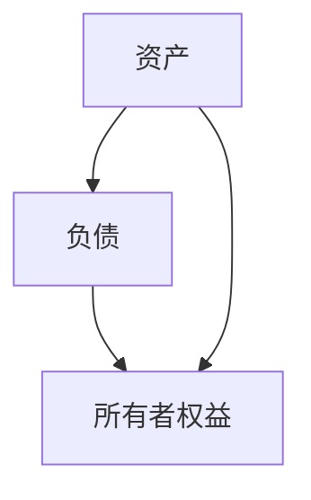

                 


---

# 《布鲁斯·格林沃尔德的资产负债表深度分析》

> **关键词**：资产负债表分析、财务健康评估、比率分析、趋势分析、财务报表解读

> **摘要**：本文深入探讨了布鲁斯·格林沃尔德对资产负债表的分析方法，从核心概念到实际应用，结合比率分析、趋势分析和财务健康评估，提供详细的数学模型和系统架构设计。通过项目实战和最佳实践，帮助读者全面掌握资产负债表的深度分析。

---

## 目录大纲

### 第一部分: 资产负债表的基本结构与重要性

#### 第1章: 资产负债表的基本概念与重要性

##### 1.1 资产负债表的定义与结构
- **1.1.1 资产负债表的定义**
  - 资产负债表是企业财务状况的静态反映，记录了企业在特定时间点的资产、负债和所有者权益的总额。
- **1.1.2 资产负债表的基本结构**
  - 资产 = 负债 + 所有者权益
  - 资产分为流动资产和非流动资产；负债分为流动负债和非流动负债。
- **1.1.3 资产负债表在企业中的重要性**
  - 评估企业财务健康状况的关键工具。
  - 为投资者、债权人和管理层提供决策依据。

##### 1.2 资产负债表的核心要素
- **1.2.1 资产的定义与分类**
  - 流动资产：现金、应收账款、存货等。
  - 非流动资产：长期投资、固定资产、无形资产等。
- **1.2.2 负债的定义与分类**
  - 流动负债：短期借款、应付账款、应付工资等。
  - 非流动负债：长期借款、应付债券等。
- **1.2.3 所有者权益的定义与分类**
  - 所有者权益包括实收资本、资本公积、盈余公积和未分配利润等。

##### 1.3 资产负债表的编制与作用
- **1.3.1 资产负债表的编制方法**
  - 确保资产和负债的对应关系，平衡借贷方。
  - 根据会计准则进行调整和披露。
- **1.3.2 资产负债表在财务分析中的作用**
  - 评估企业的偿债能力、运营能力和财务稳定性。

##### 1.4 本章小结
  - 资产负债表是财务报表的核心，反映了企业的财务状况。理解其结构和要素是进行深入分析的基础。

#### 第2章: 资产负债表的分析方法

##### 2.1 资产负债表的主要分析指标
- **2.1.1 流动比率**
  - 公式：$$流动比率 = \frac{流动资产}{流动负债}$$
  - 一般认为，流动比率应保持在2:1以上，以确保企业有足够的流动性。
- **2.1.2 速动比率**
  - 公式：$$速动比率 = \frac{速动资产}{流动负债}$$
  - 速动资产包括流动资产减去存货。
- **2.1.3 负债比率**
  - 公式：$$负债比率 = \frac{总负债}{总资产}$$
  - 反映了企业负债在总资产中的比例。

##### 2.2 资产负债表的趋势分析
- **2.2.1 资产负债表的趋势分析方法**
  - 比较不同期间的资产负债表，分析资产、负债和所有者权益的变化趋势。
- **2.2.2 资产负债表趋势分析的注意事项**
  - 考虑通货膨胀、会计政策变化等因素的影响。

##### 2.3 资产负债表的财务健康评估
- **2.3.1 财务健康评估的定义**
  - 通过综合分析企业的财务状况，评估其健康程度。
- **2.3.2 资产负债表在财务健康评估中的应用**
  - 结合其他财务报表（如利润表、现金流量表）进行综合分析。

##### 2.4 本章小结
  - 资产负债表的分析方法多种多样，需要结合具体情况进行综合判断。

#### 第3章: 资产负债表的核心概念与联系

##### 3.1 资产负债表的核心概念
- **3.1.1 资产、负债和所有者权益的定义**
  - 资产是企业拥有的资源，负债是企业的债务，所有者权益是企业净资产。
- **3.1.2 资产负债表的核心要素之间的关系**
  - 资产 = 负债 + 所有者权益

##### 3.2 资产负债表的核心概念对比
- **3.2.1 资产与负债的对比**
  - 资产是企业的资源，负债是企业的债务，两者都是企业的资金来源。
- **3.2.2 负债与所有者权益的对比**
  - 负债需要偿还，所有者权益是投资者对企业净资产的要求权。

##### 3.3 资产负债表的ER实体关系图


##### 3.4 本章小结
  - 资产负债表的核心概念清晰，理解它们之间的关系是分析的基础。

### 第二部分: 资产负债表的系统分析与架构设计

#### 第4章: 资产负债表的系统分析

##### 4.1 问题场景介绍
- **4.1.1 财务分析的需求**
  - 企业需要定期分析财务状况，评估偿债能力和运营效率。
- **4.1.2 系统的目标**
  - 提供一个自动化、高效的财务分析工具，帮助用户快速解读资产负债表。

##### 4.2 系统功能设计
- **4.2.1 领域模型设计**
  ```mermaid
  classDiagram
      class 资产负债表 {
          资产;
          负债;
          所有者权益;
      }
      class 用户 {
          用户ID;
          用户名;
      }
      资产负债表 <--o "拥有" 用户
  ```

- **4.2.2 系统架构设计**
  ```mermaid
  architecture
      前端 --> 中间件
      中间件 --> 数据库
  ```

##### 4.3 系统接口设计
- **4.3.1 接口描述**
  - API接口用于读取资产负债表数据，计算各项比率并返回结果。

##### 4.4 系统交互设计
- **4.4.1 交互流程**
  - 用户输入企业财务数据，系统调用API进行计算，返回分析结果。

#### 第5章: 资产负债表的项目实战

##### 5.1 环境安装
- **5.1.1 安装Python环境**
  - 使用Anaconda或PyCharm安装Python 3.8以上版本。
- **5.1.2 安装必要的库**
  - 导入pandas、numpy、matplotlib等库。

##### 5.2 系统核心实现源代码
- **5.2.1 读取资产负债表数据**
  ```python
  import pandas as pd

  # 读取CSV文件
  df = pd.read_csv('balance_sheet.csv')
  print(df.head())
  ```

- **5.2.2 计算比率**
  ```python
  def calculate_ratios(df):
      current_assets = df['流动资产'].sum()
      current_liabilities = df['流动负债'].sum()
      quick_assets = current_assets - df['存货'].sum()
      
      current_ratio = current_assets / current_liabilities
      quick_ratio = quick_assets / current_liabilities
      liability_ratio = df['总负债'].sum() / df['总资产'].sum()
      
      return {
          '流动比率': current_ratio,
          '速动比率': quick_ratio,
          '负债比率': liability_ratio
      }

  ratios = calculate_ratios(df)
  print(ratios)
  ```

##### 5.3 代码应用解读与分析
- **5.3.1 代码功能解读**
  - 读取数据并计算流动比率、速动比率和负债比率。
- **5.3.2 数据可视化**
  ```python
  import matplotlib.pyplot as plt

  plt.bar(ratios.keys(), ratios.values())
  plt.title('财务比率分析')
  plt.xlabel('比率名称')
  plt.ylabel('比率值')
  plt.show()
  ```

##### 5.4 实际案例分析和详细讲解剖析
- **5.4.1 案例分析**
  - 以某制造企业为例，计算其流动比率、速动比率和负债比率，分析企业的财务健康状况。

##### 5.5 项目小结
  - 通过项目实战，读者可以掌握如何利用Python进行资产负债表分析，并可视化结果。

### 第三部分: 最佳实践与总结

#### 第6章: 最佳实践

##### 6.1 小结
- 资产负债表分析是企业财务管理的重要部分，掌握其核心概念和分析方法至关重要。

##### 6.2 注意事项
- 确保数据的准确性和完整性。
- 结合其他财务报表进行综合分析。

##### 6.3 拓展阅读
- 建议阅读《财务报表分析》等相关书籍，深入理解财务分析方法。

#### 第7章: 作者简介

##### 作者：AI天才研究院/AI Genius Institute & 禅与计算机程序设计艺术 /Zen And The Art of Computer Programming
  - 作者简介：作为人工智能专家和软件架构师，致力于将技术与财务管理相结合，提供深度分析和实践指导。

---

**本文通过详细分析资产负债表的核心概念、分析方法和系统架构设计，结合项目实战，帮助读者全面掌握资产负债表的深度分析。**

