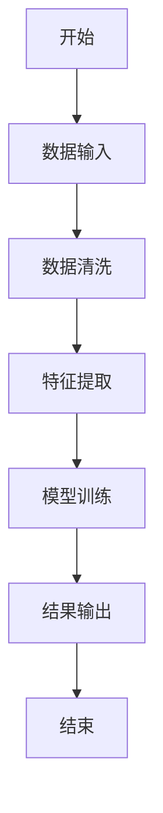
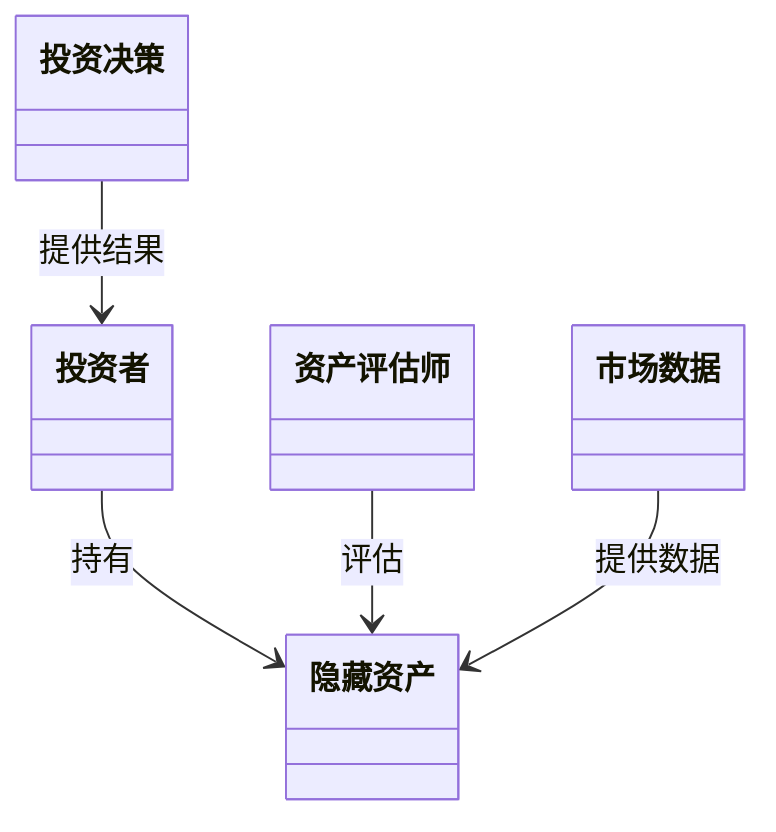
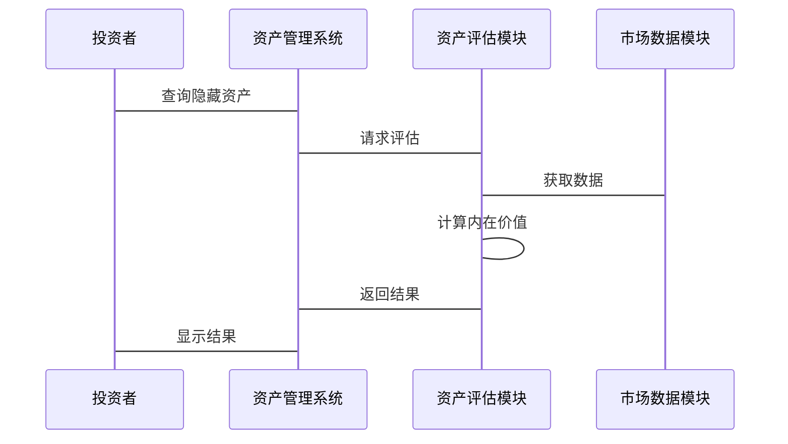

                 


# 布鲁斯·格林沃尔德的隐藏资产价值投资：发掘被低估的资产

> 关键词：隐藏资产，价值投资，资产发现，DCF模型，内在价值

> 摘要：本文深入探讨了隐藏资产价值投资的理论与实践，分析了隐藏资产的定义、分类及价值评估方法，结合实际案例，详细讲解了如何通过算法和系统架构设计发现和评估隐藏资产，最后总结了投资过程中的注意事项与最佳实践。

---

## 第一部分：隐藏资产价值投资的背景与核心概念

### 第1章：隐藏资产价值投资的背景介绍

#### 1.1 隐藏资产的定义与分类
##### 1.1.1 隐藏资产的定义
隐藏资产是指那些未被市场充分认知，但具有潜在高价值的资产。这些资产通常因信息不对称、市场忽视或特定环境因素而被低估。

##### 1.1.2 隐藏资产的分类
隐藏资产可以分为以下几类：
1. **未上市企业**：未公开的中小型企业，具有高增长潜力。
2. **非流动性资产**：如房地产、土地等，因流动性差而被市场忽视。
3. **无形资产**：如专利、品牌价值等，难以量化但具有高价值。
4. **新兴市场资产**：在新兴市场中未被充分挖掘的资源或企业。

##### 1.1.3 隐藏资产与传统资产的区别
| 概念       | 隐藏资产                     | 传统资产                     |
|------------|------------------------------|------------------------------|
| 定义       | 未被市场充分认知的资产         | 已被广泛认知的资产             |
| 发现难度   | 高                           | 低                           |
| 价值潜力   | 大                           | 中                           |

#### 1.2 隐藏资产价值投资的背景
##### 1.2.1 传统价值投资的局限性
传统价值投资主要关注已知的高流动性资产，如股票和债券。这种方法在市场充分竞争的情况下难以发现被低估的资产。

##### 1.2.2 隐藏资产投资的兴起
随着市场的扩展和信息透明度的提高，隐藏资产因其潜在的高回报而受到投资者的关注。

##### 1.2.3 隐藏资产投资的市场环境
隐藏资产投资的市场环境包括新兴市场、未上市企业、非流动性资产等领域。

#### 1.3 隐藏资产价值投资的核心要素
##### 1.3.1 资产的低估原因
隐藏资产的低估通常源于信息不对称、市场忽视或评估方法的局限性。

##### 1.3.2 隐藏资产的发现方法
1. **市场调研**：通过深入市场调研发现未被充分认知的资产。
2. **数据分析**：利用大数据分析技术筛选潜在的隐藏资产。
3. **网络挖掘**：通过社交媒体和网络信息挖掘潜在资产。

##### 1.3.3 隐藏资产的价值评估模型
隐藏资产的价值评估模型需要考虑资产的内在价值、市场环境和未来潜力。

#### 1.4 本章小结
隐藏资产的定义、分类及其与传统资产的区别是理解隐藏资产价值投资的基础。市场环境和发现方法是投资成功的关键。

---

### 第2章：隐藏资产价值投资的核心概念与联系

#### 2.1 隐藏资产的核心概念原理
##### 2.1.1 资产的内在价值
内在价值是资产在最佳条件下的理论价值，是投资决策的核心依据。

##### 2.1.2 市场价格与内在价值的关系
市场价格围绕内在价值波动，当市场价格低于内在价值时，资产具有投资价值。

##### 2.1.3 隐藏资产的发现机制
通过市场调研、数据分析和网络挖掘发现隐藏资产。

#### 2.2 核心概念属性特征对比表
| 概念       | 隐藏资产                     | 传统资产                     |
|------------|------------------------------|------------------------------|
| 定义       | 未被市场充分认知的资产         | 已被广泛认知的资产             |
| 发现难度   | 高                           | 低                           |
| 价值潜力   | 大                           | 中                           |

#### 2.3 ER实体关系图
```mermaid
er
  actor 投资者
  actor 资产评估师
  actor 市场监管机构
  asset 隐藏资产
  relation 持有
  relation 评估
  relation 监管
```

#### 2.4 本章小结
隐藏资产的核心概念包括内在价值、市场价格关系和发现机制。ER实体关系图展示了隐藏资产与相关主体的关系。

---

## 第二部分：隐藏资产价值评估的算法原理

### 第3章：隐藏资产价值评估的算法原理

#### 3.1 算法原理概述
##### 3.1.1 价值评估模型
隐藏资产的价值评估模型通常采用贴现现金流（DCF）模型。

##### 3.1.2 数据输入与处理
数据输入包括收入、利润率、贴现率等，数据清洗和特征提取是关键步骤。

##### 3.1.3 模型输出与结果解释
模型输出为资产的内在价值，结果解释需要结合市场环境和资产特性。

#### 3.2 算法流程图


#### 3.3 算法实现代码
```python
import numpy as np
import pandas as pd

def calculate_intrinsic_value(revenue, profit_margin, discount_rate):
    """
    计算内在价值的函数
    """
    # 计算未来现金流
    cash_flows = revenue * (1 + 0.05)**range(10)
    # 计算现值
    present_value = np.sum(cash_flows / (1 + discount_rate/100)**range(10))
    return present_value

# 示例数据
revenue = 1000000
profit_margin = 0.2
discount_rate = 10

intrinsic_value = calculate_intrinsic_value(revenue, profit_margin, discount_rate)
print(f"内在价值为：{intrinsic_value}")
```

#### 3.4 算法数学模型
贴现率计算公式：
$$
\text{贴现率} = \frac{\text{无风险利率} + \text{风险溢价}}{1}
$$

DCF模型公式：
$$
\text{内在价值} = \sum_{t=1}^{n} \frac{\text{现金流}_t}{(1 + \text{贴现率})^t}
$$

---

## 第三部分：系统分析与架构设计

### 第4章：系统分析与架构设计

#### 4.1 问题场景介绍
我们设计一个投资分析系统，用于发现和评估隐藏资产。

#### 4.2 系统功能设计
##### 4.2.1 领域模型


#### 4.3 系统架构设计
##### 4.3.1 架构图


#### 4.4 接口设计与交互
##### 4.4.1 接口设计
- 投资者查询接口：`GET /assets`
- 资产评估接口：`POST /evaluate_asset`

##### 4.4.2 交互序列图


---

## 第四部分：项目实战

### 第5章：项目实战

#### 5.1 环境安装
- 安装Python和相关库：`pip install numpy pandas`

#### 5.2 核心代码实现
```python
import numpy as np
import pandas as pd

def calculate_intrinsic_value(revenue, profit_margin, discount_rate):
    """
    计算内在价值的函数
    """
    cash_flows = revenue * (1 + 0.05)**range(10)
    present_value = np.sum(cash_flows / (1 + discount_rate/100)**range(10))
    return present_value

# 示例数据
revenue = 1000000
profit_margin = 0.2
discount_rate = 10

intrinsic_value = calculate_intrinsic_value(revenue, profit_margin, discount_rate)
print(f"内在价值为：{intrinsic_value}")
```

#### 5.3 案例分析与详细讲解
以某未上市科技公司为例，评估其内在价值。

---

## 第五部分：最佳实践

### 第6章：最佳实践

#### 6.1 小结
隐藏资产投资需要深入的市场调研和数据分析能力。

#### 6.2 注意事项
- 风险控制
- 数据质量
- 模型适用性

#### 6.3 拓展阅读
推荐书籍和文章，进一步深入学习。

---

## 作者：AI天才研究院 & 禅与计算机程序设计艺术

---

以上是《布鲁斯·格林沃尔德的隐藏资产价值投资：发掘被低估的资产》的技术博客文章的完整目录大纲和内容。

