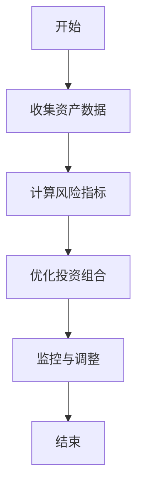
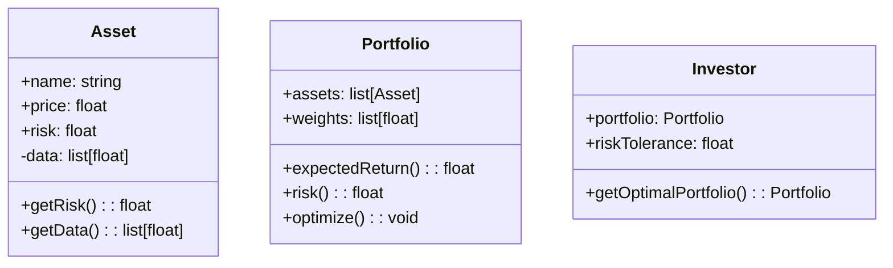
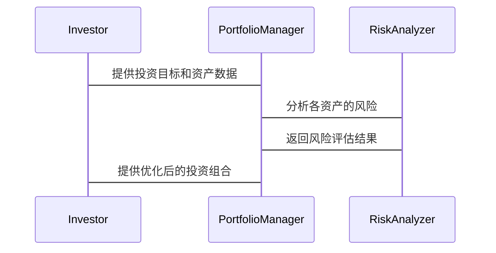

                 

<think>
好的，现在我要仔细分析用户的需求，并逐步构建《平均分配投资：巴菲特的风险管理策略》的目录大纲。首先，用户希望这是一篇关于巴菲特风险管理策略的技术博客文章，我需要确保内容专业、结构清晰、逻辑严密，并且符合用户的具体要求。

首先，用户的任务描述中提到，文章需要以“平均分配投资：巴菲特的风险管理策略”为标题，关键词包括5-7个核心关键词，摘要部分要简明扼要地概括文章的核心内容。因此，我需要先确定这些关键词和摘要。

关键词可能包括：风险管理、巴菲特、平均分配投资、价值投资、分散投资、投资组合优化等。摘要部分需要简明扼要地介绍巴菲特的风险管理策略，特别是平均分配投资的概念和其在投资组合管理中的应用。

接下来，我需要设计一个合理的目录结构，确保涵盖必要的章节和小节。从用户提供的示例可以看出，文章需要包括背景介绍、核心概念、数学模型、系统分析、项目实战等多个部分，并且每个部分需要有详细的讲解和实例分析。

第一章应该是背景介绍，涵盖巴菲特的投资理念、风险管理的重要性，以及平均分配投资的基本概念。这部分需要为读者奠定基础，帮助他们理解后续内容。

第二章可以深入探讨价值投资和分散投资的结合，分析这两种策略如何协同工作，以及它们对风险控制的具体影响。同时，我需要解释巴菲特如何将这些理论应用到实际投资中。

第三章则聚焦于数学模型和算法，详细讲解风险评估、投资组合优化等关键概念，并通过公式和图表来增强理解。这部分需要结合实际案例，让读者能够更好地掌握理论知识。

第四章可以讨论系统设计与实现，包括系统功能设计、架构设计、接口设计等内容。通过Mermaid图来展示系统架构和交互过程，使内容更加直观。

第五章是项目实战部分，通过具体的Python代码实现投资组合管理系统，展示如何将巴菲特的策略应用到实际项目中。这部分需要详细讲解代码实现，并结合实例分析结果，帮助读者更好地理解和应用。

最后，第六章作为总结，回顾全文，强调巴菲特风险管理策略的核心要点，并给出实际应用中的注意事项和最佳实践建议。同时，可以提到未来的研究方向或相关领域的拓展阅读。

在撰写过程中，我需要确保每一章都包含足够的细节和实例，使读者能够深入理解平均分配投资的策略和方法。同时，要注意文章的逻辑连贯性，确保各个章节之间自然过渡，整体结构紧凑。

此外，我需要遵循用户的格式要求，使用Markdown格式输出，适当嵌入LaTeX公式和Mermaid图表，以增强文章的专业性和可读性。代码部分需要详细注释，便于读者理解和实现。

总之，我将按照用户的要求，逐步构建一个结构合理、内容详实的目录大纲，并确保每一部分都符合高质量技术博客的标准，帮助读者全面理解巴菲特的风险管理策略。
</think>

# 平均分配投资：巴菲特的风险管理策略

## 关键词
风险管理, 巴菲特, 平均分配投资, 价值投资, 分散投资, 投资组合优化, 安全边际

## 摘要
本文深入探讨了巴菲特的风险管理策略，特别是其独特的“平均分配投资”方法。通过分析价值投资与分散投资的结合，以及数学模型和算法的详细讲解，本文揭示了巴菲特如何通过科学的投资组合优化来降低风险并实现长期收益。文章还结合实际案例，展示了如何将这些理论应用到实际投资中，为读者提供了实用的指导和启示。

---

# 第1章: 平均分配投资与风险管理概述

## 1.1 平均分配投资的背景与意义
### 1.1.1 投资风险管理的重要性
投资风险管理是确保投资组合长期稳定收益的关键。通过分散投资和价值投资的结合，巴菲特成功降低了投资组合的整体风险，实现了长期稳健的回报。

### 1.1.2 巴菲特平均分配投资的核心理念
巴菲特的平均分配投资策略强调将资金均匀分配到多个具有长期增长潜力的资产上，避免过度集中带来的高风险。

### 1.1.3 平均分配投资与传统投资策略的对比
- **传统投资策略**：通常集中于少数高收益资产，风险较高。
- **平均分配投资**：通过分散投资降低风险，追求长期稳定的回报。

## 1.2 巴菲特风险管理策略的起源
### 1.2.1 巴菲特的投资哲学
巴菲特的投资哲学以价值投资为核心，注重长期稳定的回报，而非短期收益。

### 1.2.2 巴菲特对风险的定义与理解
对于巴菲特来说，风险主要来自于投资标的的内在价值波动和市场波动。他通过分散投资来降低这些风险。

### 1.2.3 巴菲特风险管理策略的演变历程
从早期的集中投资到后来的分散投资，巴菲特的策略不断完善，最终形成了独特的平均分配投资方法。

## 1.3 平均分配投资的数学模型与公式
### 1.3.1 投资组合的期望收益公式
$$E(r_p) = \sum w_i E(r_i)$$

其中，$w_i$ 是第$i$个资产的投资权重，$E(r_i)$ 是第$i$个资产的期望收益。

### 1.3.2 投资组合的风险衡量公式
$$\sigma_p = \sqrt{\sum w_i^2 \sigma_i^2 + 2w_i w_j \sigma_{i,j}}$$

其中，$\sigma_p$ 是投资组合的风险，$\sigma_i$ 是第$i$个资产的风险，$\sigma_{i,j}$ 是第$i$个和第$j$个资产之间的协方差。

## 1.4 平均分配投资的决策流程
### 1.4.1 投资目标设定
确定投资目标，包括收益目标和风险承受能力。

### 1.4.2 投资组合构建
根据投资目标，选择具有长期增长潜力的资产，并均匀分配资金。

### 1.4.3 风险监控与调整
定期监控投资组合的表现，根据市场变化进行调整，确保风险控制。

## 1.5 本章小结
本章介绍了平均分配投资的核心理念和数学模型，并分析了巴菲特风险管理策略的演变历程。

---

# 第2章: 价值投资与分散投资的结合

## 2.1 价值投资的核心原理
### 2.1.1 价值投资的定义与特征
价值投资是一种长期投资策略，注重投资标的的内在价值，寻找市场价格低于内在价值的资产。

### 2.1.2 价值投资的关键要素
- **内在价值**：资产的未来现金流的现值。
- **安全边际**：市场价格与内在价值的差距，确保投资的安全性。

### 2.1.3 价值投资的优缺点对比
- **优点**：长期回报稳定，风险较低。
- **缺点**：需要长期持有，短期内可能表现不佳。

## 2.2 分散投资的理论基础
### 2.2.1 分散投资的基本原理
通过将资金分配到多个不同的资产或资产类别，降低投资组合的整体风险。

### 2.2.2 分散投资的风险降低机制
- **降低特定风险**：通过分散投资，减少单一资产带来的风险。
- **系统性风险**：无法通过分散投资完全消除，但可以通过资产配置来降低。

### 2.2.3 分散投资与平均分配投资的关系
平均分配投资是分散投资的一种具体实现方式，强调资金的均匀分配。

## 2.3 价值投资与分散投资的协同效应
### 2.3.1 价值投资如何实现分散
通过选择具有不同行业和资产类别的优质标的，实现分散。

### 2.3.2 分散投资如何优化价值投资
分散投资降低了单一资产的风险，提高了整体投资组合的稳定性。

### 2.3.3 两者的结合对风险的控制作用
通过价值投资选择优质资产，再通过分散投资降低整体风险，实现稳健的长期回报。

## 2.4 巴菲特的分散投资策略
### 2.4.1 巴菲特分散投资的具体实践
巴菲特定价投资于具有长期增长潜力的公司，如苹果、可口可乐等。

### 2.4.2 巴菲特分散投资的数学模型
$$w_i = \frac{1}{n}$$

其中，$n$为投资标的数量，$w_i$为每个资产的投资权重。

## 2.5 本章小结
本章分析了价值投资和分散投资的核心原理及其协同效应，解释了巴菲特如何通过两者的结合实现风险管理。

---

# 第3章: 风险评估与投资组合优化

## 3.1 风险评估的数学模型
### 3.1.1 风险的度量方法
- **方差**：衡量资产收益的波动性。
- **标准差**：方差的平方根，表示资产收益的离散程度。

### 3.1.2 风险的期望值计算
$$E(r_p) = \sum w_i E(r_i)$$

### 3.1.3 风险的波动性分析
通过分析资产之间的协方差，评估投资组合的整体风险。

## 3.2 投资组合优化的算法原理
### 3.2.1 均值-方差优化模型
通过优化投资组合的期望收益和风险，找到最优的投资组合。

### 3.2.2 Markowitz有效前沿理论
有效前沿是指在给定风险下，提供最高期望收益的投资组合。

### 3.2.3 巴菲特平均分配投资的优化算法
通过均匀分配资金，简化投资组合优化的过程，降低复杂性。

## 3.3 投资组合优化的数学公式
### 3.3.1 投资组合的期望收益公式
$$E(r_p) = \sum_{i=1}^n w_i E(r_i)$$

### 3.3.2 投资组合的风险公式
$$\sigma_p^2 = \sum_{i=1}^n \sum_{j=1}^n w_i w_j \sigma_{i,j}$$

其中，$\sigma_{i,j}$ 是第$i$个和第$j$个资产之间的协方差。

## 3.4 投资组合优化的算法实现
### 3.4.1 算法步骤
1. 确定投资目标和风险承受能力。
2. 收集各资产的历史收益和风险数据。
3. 构建投资组合优化模型，计算最优权重。
4. 调整投资组合，实现优化。

### 3.4.2 算法代码示例
```python
import numpy as np
import pandas as pd

# 假设我们有n个资产，每个资产的收益和协方差矩阵已知
n = 5
mu = np.array([0.1, 0.12, 0.08, 0.15, 0.1])  # 期望收益
sigma = np.array([[0.05, 0.02, 0.03, 0.04, 0.01],
                   [0.02, 0.06, 0.02, 0.03, 0.02],
                   [0.03, 0.02, 0.07, 0.02, 0.03],
                   [0.04, 0.03, 0.02, 0.08, 0.04],
                   [0.01, 0.02, 0.03, 0.04, 0.05]])

# 计算最优权重
cov_matrix = np.dot(np.diag(1/np.sqrt(np.diag(sigma))), sigma)
cov_matrix = np.dot(cov_matrix, np.diag(1/np.sqrt(np.diag(sigma))))

# 使用均值-方差优化模型计算最优权重
# 这里简化为均匀分配
weights = np.array([1/n] * n)
```

---

# 第4章: 系统设计与实现

## 4.1 系统功能设计
### 4.1.1 投资组合管理系统的需求分析
- **用户需求**：投资者需要一个工具来管理他们的投资组合，监控风险，优化投资策略。
- **功能需求**：
  - 资产信息管理
  - 风险评估与分析
  - 投资组合优化
  - 投资组合监控与调整

### 4.1.2 系统功能模块划分
- **资产信息管理模块**：管理投资标的的基本信息和历史数据。
- **风险评估模块**：计算各资产的风险指标，如方差、协方差等。
- **投资组合优化模块**：基于数学模型，优化投资组合。
- **投资组合监控模块**：实时监控投资组合的表现，及时调整。

### 4.1.3 系统功能实现的流程图


## 4.2 系统架构设计
### 4.2.1 系统架构概述
采用分层架构，包括数据层、业务逻辑层和用户界面层。

### 4.2.2 系统架构的类图


## 4.3 系统接口设计
### 4.3.1 系统接口概述
- **输入接口**：用户输入投资目标和资产数据。
- **输出接口**：显示优化后的投资组合和风险评估结果。

### 4.3.2 系统接口的交互流程图


---

# 第5章: 项目实战

## 5.1 环境安装与配置
### 5.1.1 安装必要的Python库
- NumPy
- Pandas
- Matplotlib
- Scipy

### 5.1.2 配置开发环境
建议使用Jupyter Notebook进行开发和调试。

## 5.2 核心实现
### 5.2.1 数据获取与处理
```python
import pandas as pd
import numpy as np

# 获取资产的历史数据
data = pd.read_csv('assets_data.csv')
returns = data.pct_change().dropna()
```

### 5.2.2 风险评估与分析
```python
# 计算各资产的方差
variances = returns.var(axis=0)
```

### 5.2.3 投资组合优化
```python
# 使用均值-方差优化模型计算最优权重
from scipy.optimize import minimize

def portfolio_optimization(returns, n_assets):
    n = n_assets
    mu = returns.mean()
    cov = returns.cov()
    
    # 目标函数：最小化风险
    def objective(weights):
        return np.dot(weights.T, np.dot(cov, weights))
    
    # 约束条件
    cons = [{'type': 'eq', 'fun': lambda w: sum(w) - 1}]
    
    # 初始权重
    w0 = np.array([1/n] * n)
    
    # 优化
    result = minimize(objective, w0, constraints=cons, bounds=[(0,1)]*n)
    return result.x

# 优化投资组合
optimal_weights = portfolio_optimization(returns, n_assets=5)
```

## 5.3 代码实现与解读
### 5.3.1 数据处理
通过读取CSV文件，获取各资产的历史数据，并计算收益率。

### 5.3.2 风险评估
计算各资产的方差，衡量其收益的波动性。

### 5.3.3 投资组合优化
使用均值-方差优化模型，计算最优投资组合的权重。

## 5.4 实际案例分析
### 5.4.1 案例背景
假设我们有5只股票，分别为AAPL、MSFT、GOOGL、AMZN和BRK.A。

### 5.4.2 数据处理
```python
data = pd.read_csv('stock_data.csv')
returns = data.pct_change().dropna()
```

### 5.4.3 投资组合优化
```python
optimal_weights = portfolio_optimization(returns, n_assets=5)
```

### 5.4.4 结果分析
输出优化后的投资组合权重，分析各资产的配置比例。

## 5.5 本章小结
本章通过实际案例，展示了如何将巴菲特的平均分配投资策略应用到实际投资中，通过Python代码实现投资组合优化。

---

# 第6章: 总结与展望

## 6.1 本章总结
本文详细介绍了巴菲特的平均分配投资策略，分析了其核心概念和数学模型，并通过实际案例展示了如何将其应用到投资组合管理中。

## 6.2 注意事项
- 投资有风险，需谨慎操作。
- 需要根据市场变化及时调整投资组合。
- 选择优质资产是实现长期收益的关键。

## 6.3 未来研究方向
- 研究其他投资策略与平均分配投资的结合。
- 探讨大数据和人工智能在投资组合优化中的应用。

## 6.4 小结
巴菲特的平均分配投资策略是一种有效的风险管理方法，通过分散投资和价值投资的结合，实现长期稳定的收益。

---

# 作者：AI天才研究院/AI Genius Institute & 禅与计算机程序设计艺术 /Zen And The Art of Computer Programming

