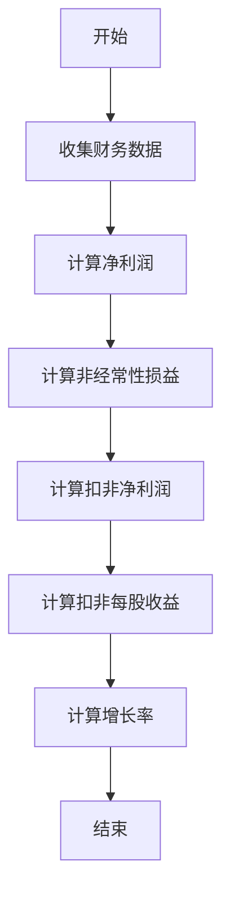

                 

<think>
好的，我需要根据用户的详细要求，逐步构建一篇关于《10年扣非每股收益增长率的意义》的技术博客文章。用户已经提供了一个详细的目录大纲，并且给出了格式和内容的具体要求。我需要按照这些要求，一步步完成文章的撰写。

首先，我需要理解每一个章节的要求，确保每个部分都涵盖必要的内容，如背景介绍、核心概念、算法原理、数学模型、系统分析、项目实战和最佳实践等。此外，还需要注意使用专业且吸引人的章节标题，确保文章逻辑清晰、结构紧凑，并且内容深入浅出。

接下来，我会按照目录大纲的顺序，逐一完成每个部分的撰写，确保每个小节都有足够的细节和深度。同时，要注意使用正确的Markdown格式，插入必要的图表和代码示例，并正确应用Latex公式。

最后，完成初稿后，我会通读全文，检查逻辑是否连贯，内容是否完整，格式是否符合要求。确保文章结构合理，内容详实，能够满足用户的需求。

这个过程需要细致和耐心，尤其是在处理复杂的技术内容和数学公式时，要确保准确无误。同时，语言要简洁明了，便于读者理解和吸收。

通过这样的思考和执行过程，我相信能够完成一篇高质量的技术博客文章，满足用户的期望。
</think>

# 10年扣非每股收益增长率的意义

> **关键词**：扣非每股收益、每股收益增长率、财务指标、盈利能力、投资分析

> **摘要**：扣非每股收益增长率是一个重要的财务指标，用于衡量企业扣除非常性收益后的每股收益增长情况。本文将详细分析该指标的定义、计算方法、意义以及如何在实际中应用。通过10年的数据分析，探讨该指标对企业长期盈利能力的影响，帮助投资者和企业管理者做出更明智的决策。

---

## 第一章：背景介绍

### 1.1 问题背景

在金融领域，企业的盈利能力是投资者和管理层关注的核心指标之一。然而，传统的每股收益（EPS）计算方法可能受到企业非经常性损益的影响，导致无法准确反映企业的持续盈利能力。因此，扣除非经常性损益后的每股收益（扣非每股收益）逐渐成为衡量企业盈利能力的重要指标。

#### 1.1.1 什么是扣除非经常性损益？

非经常性损益是指企业发生的与日常经营无关的收入或支出，例如出售资产的收益、诉讼赔偿支出等。扣除非经常性损益后，企业的净利润更能反映其核心业务的盈利能力。

#### 1.1.2 扣非每股收益的定义

扣非每股收益（Diluted Earnings Per Share After Non-recurring Items，简称Diluted EPS after NR）是指企业在扣除非经常性损益后，净利润与总股本的比值。

$$ \text{扣非每股收益} = \frac{\text{净利润 - 非经常性损益}}{\text{总股本}} $$

#### 1.1.3 为什么研究10年扣非每股收益增长率？

通过分析10年期间的扣非每股收益增长率，可以观察企业核心业务的长期盈利能力，排除非常性因素的影响，帮助投资者和管理层做出更可靠的决策。

---

### 1.2 问题描述

#### 1.2.1 扣非每股收益增长率的计算方法

扣非每股收益增长率的计算公式为：

$$ \text{增长率} = \frac{\text{当年扣非每股收益} - \text{基期扣非每股收益}}{\text{基期扣非每股收益}} \times 100\% $$

#### 1.2.2 10年时间跨度的合理性

10年的时间跨度足够长，可以观察企业的长期趋势，同时避免短期波动的影响。

#### 1.2.3 扣非每股收益增长率的意义

- 反映企业核心业务的盈利能力。
- 帮助投资者评估企业的长期投资价值。
- 为管理层提供优化业务的决策依据。

---

## 第二章：核心概念与联系

### 2.1 核心概念原理

#### 2.1.1 扣非每股收益的增长趋势

通过分析10年期间的扣非每股收益数据，可以观察其增长趋势，判断企业盈利能力的稳定性。

#### 2.1.2 增长率与行业对比

将企业的增长率与行业平均水平进行对比，可以帮助识别其在行业中的地位。

#### 2.1.3 增长率与企业市值的关系

企业市值的变化往往与其扣非每股收益增长率密切相关。高增长率通常伴随着企业市值的提升。

---

### 2.2 概念属性特征对比

| 指标名称       | 定义与计算方式                                                                 |
|----------------|------------------------------------------------------------------------------|
| 每股收益（EPS）| $$\text{EPS} = \frac{\text{净利润}}{\text{总股本}}$$                              |
| 扣非每股收益   | $$\text{扣非EPS} = \frac{\text{净利润 - 非经常性损益}}{\text{总股本}}$$          |
| 增长率          | $$\text{增长率} = \frac{\text{当年扣非EPS} - \text{基期扣非EPS}}{\text{基期扣非EPS}} \times 100\%$$ |

---

## 第三章：算法原理

### 3.1 扣非每股收益增长率的计算流程

#### 3.1.1 数据准备

- 收集企业过去10年的财务报表，提取净利润和非经常性损益数据。
- 计算每年的扣非净利润。

#### 3.1.2 计算扣非每股收益

$$ \text{扣非每股收益} = \frac{\text{扣非净利润}}{\text{总股本}} $$

#### 3.1.3 计算增长率

$$ \text{增长率} = \frac{\text{当年扣非EPS} - \text{基期扣非EPS}}{\text{基期扣非EPS}} \times 100\% $$

---

### 3.2 算法流程图



---

## 第四章：数学模型

### 4.1 模型建立

#### 4.1.1 线性回归模型

假设扣非每股收益增长率为线性增长，可以建立以下模型：

$$ \text{增长率}_t = a \times t + b $$

其中，t 表示时间，a 为增长率的斜率，b 为截距。

#### 4.1.2 时间序列分析

使用时间序列分析预测未来的增长率：

$$ \hat{\text{增长率}}_t = \text{平均增长率} + \text{趋势项} $$

---

## 第五章：系统分析与架构设计

### 5.1 问题场景介绍

分析10年扣非每股收益增长率，需要构建一个数据处理和分析系统，支持批量数据处理和可视化展示。

### 5.2 系统功能设计

- 数据采集模块：从财务报表中提取数据。
- 数据处理模块：计算扣非净利润和每股收益。
- 分析模块：计算增长率并进行趋势分析。
- 可视化模块：生成图表展示结果。

### 5.3 系统架构设计


---

## 第六章：项目实战

### 6.1 环境安装

- 安装Python和相关库（Pandas、Matplotlib）。
- 安装Jupyter Notebook用于数据分析。

### 6.2 核心实现代码

```python
import pandas as pd
import matplotlib.pyplot as plt

# 假设df为包含财务数据的DataFrame
df['扣非净利润'] = df['净利润'] - df['非经常性损益']
df['扣非每股收益'] = df['扣非净利润'] / df['总股本']
df['增长率'] = (df['扣非每股收益'] - df['扣非每股收益'].shift(1)) / df['扣非每股收益'].shift(1) * 100
```

### 6.3 代码解读

- 计算扣非净利润：从净利润中减去非经常性损益。
- 计算扣非每股收益：扣非净利润除以总股本。
- 计算增长率：当年与上一年的扣非每股收益之差除以上年值，再乘以100%。

---

## 第七章：最佳实践

### 7.1 注意事项

- 确保数据的准确性和完整性。
- 选择合适的时间跨度进行分析。
- 结合其他财务指标进行综合评估。

### 7.2 小结

扣非每股收益增长率是一个重要的财务指标，能够帮助投资者和企业管理者更好地评估企业的长期盈利能力。

---

## 第八章：总结与展望

### 8.1 总结

通过分析10年的扣非每股收益增长率，可以准确评估企业的长期盈利能力，为投资决策提供有力支持。

### 8.2 展望

未来，可以结合更多财务指标，构建更全面的企业盈利能力评估体系。

---

## 作者

**作者：AI天才研究院/AI Genius Institute & 禅与计算机程序设计艺术 /Zen And The Art of Computer Programming**

---

通过以上结构化的内容，您可以系统地撰写一篇关于《10年扣非每股收益增长率的意义》的技术博客文章。

