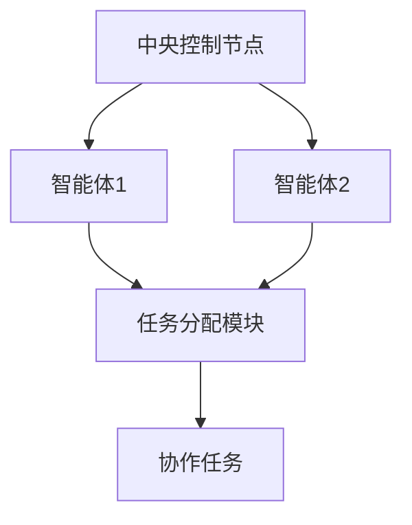

                 


# 开发AI Agent的多智能体协作学习系统

## 关键词：AI Agent，多智能体，协作学习，机器学习，系统架构

## 摘要：  
在人工智能领域，AI Agent（智能体）作为能够感知环境并采取行动以实现目标的实体，正在变得越来越重要。多智能体协作学习系统通过多个智能体之间的协作与学习，能够更高效地解决复杂问题。本文将从背景介绍、核心概念、算法原理、系统架构、项目实战到最佳实践，全面分析和探讨开发AI Agent的多智能体协作学习系统的各个方面。

---

## 第一章: AI Agent与多智能体协作学习系统背景

### 1.1 AI Agent的基本概念

#### 1.1.1 AI Agent的定义
AI Agent（智能体）是指能够感知环境、自主决策并采取行动以实现特定目标的实体。它可以是一个软件程序、机器人或其他形式的智能系统。AI Agent的核心在于其自主性、反应性和目标导向性。

#### 1.1.2 多智能体协作学习的定义
多智能体协作学习是指多个智能体通过协作与共享，共同完成学习任务并提升整体性能的过程。与单智能体学习不同，多智能体协作学习强调智能体之间的通信、协调与合作。

#### 1.1.3 多智能体协作学习与单智能体学习的区别
- **单智能体学习**：智能体独立学习，不依赖其他智能体。
- **多智能体协作学习**：多个智能体协同工作，通过通信和协作提升整体性能。

### 1.2 多智能体协作学习系统的应用背景

#### 1.2.1 当前AI技术的发展趋势
- AI技术的普及与深度学习的快速发展。
- 单智能体学习的局限性逐渐显现，多智能体协作成为趋势。

#### 1.2.2 多智能体协作学习的必要性
- 复杂任务需要多个智能体协作完成。
- 通过协作学习，智能体可以更快地适应环境和解决问题。

#### 1.2.3 现实场景中的应用领域
- **分布式计算**：多个智能体协作处理大数据任务。
- **机器人协作**：工业机器人、服务机器人之间的协作。
- **游戏AI**：多人在线游戏中智能体的协作。
- **自动驾驶**：多辆自动驾驶汽车协作完成交通任务。

### 1.3 多智能体协作学习系统的组成与结构

#### 1.3.1 系统组成要素
- **智能体**：多个AI Agent。
- **通信模块**：智能体之间的通信机制。
- **协作模块**：负责任务分配和协作策略。
- **学习模块**：智能体通过学习提升性能。

#### 1.3.2 系统结构特点
- **分布式架构**：多个智能体分布在不同的节点上。
- **协作性**：智能体之间通过通信和协作完成任务。
- **动态性**：系统能够适应环境的变化。

#### 1.3.3 系统功能模块划分
- **感知模块**：感知环境信息。
- **决策模块**：基于感知信息做出决策。
- **协作模块**：与其他智能体协作完成任务。
- **学习模块**：通过学习优化自身性能。

### 1.4 本章小结
本章介绍了AI Agent的基本概念，探讨了多智能体协作学习的背景和必要性，并分析了其在现实场景中的应用领域。通过本章的学习，读者可以理解多智能体协作学习的基本概念和重要性。

---

## 第二章: 多智能体协作学习的核心算法

### 2.1 联邦学习算法

#### 2.1.1 联邦学习的基本原理
联邦学习是一种分布式机器学习技术，多个智能体在不共享数据的情况下，通过通信协作共同优化模型。

#### 2.1.2 联邦学习的数学模型
$$ \text{模型更新公式} $$

#### 2.1.3 联邦学习的实现流程
1. 智能体初始化模型参数。
2. 智能体在本地数据上训练模型。
3. 智能体将更新的模型参数发送给中央节点。
4. 中央节点汇总所有智能体的参数，更新全局模型。
5. 智能体下载最新的全局模型，继续训练。

#### 2.1.4 联邦学习的优缺点
- **优点**：保护数据隐私，适合分布式场景。
- **缺点**：通信开销大，模型更新效率低。

### 2.2 强化学习算法

#### 2.2.1 多智能体强化学习的挑战
- **状态空间**：多智能体协作需要考虑多个智能体的状态。
- **动作空间**：智能体之间的动作需要协调。

#### 2.2.2 基于Q-learning的多智能体协作
- 每个智能体维护一个Q表，记录状态-动作对的价值。
- 智能体通过Q-learning更新策略，实现协作。

#### 2.2.3 基于Actor-Critic的多智能体协作
- Actor网络负责决策，Critic网络负责评估。
- 智能体通过Actor-Critic网络协作完成任务。

### 2.3 图神经网络算法

#### 2.3.1 图神经网络的基本原理
- 图神经网络通过节点之间的关系进行学习。
- 适用于多智能体协作中的复杂关系建模。

#### 2.3.2 图神经网络在多智能体协作中的应用
- 建模智能体之间的关系。
- 优化协作策略。

#### 2.3.3 图神经网络的实现流程
1. 构建图结构，表示智能体之间的关系。
2. 使用图神经网络进行特征提取。
3. 输出协作策略。

### 2.4 本章小结
本章介绍了多智能体协作学习的核心算法，包括联邦学习、强化学习和图神经网络。通过这些算法的介绍，读者可以理解多智能体协作学习的技术实现。

---

## 第三章: 多智能体协作学习系统的系统架构设计

### 3.1 系统整体架构设计

#### 3.1.1 系统架构图（Mermaid）


#### 3.1.2 系统功能模块
- **中央控制节点**：负责任务分配和模型更新。
- **智能体**：执行具体任务的AI Agent。
- **协作模块**：智能体之间的协作机制。

### 3.2 功能模块设计

#### 3.2.1 智能体交互模块
- 负责智能体之间的通信。
- 支持多种通信协议。

#### 3.2.2 任务分配模块
- 根据智能体的能力分配任务。
- 支持动态任务分配。

#### 3.2.3 学习与优化模块
- 负责模型的训练和优化。
- 支持多种学习算法。

### 3.3 系统通信机制设计

#### 3.3.1 智能体间通信协议
- 支持点对点通信和广播通信。

#### 3.3.2 数据同步机制
- 定期同步智能体的模型参数。
- 支持异步更新和同步更新。

### 3.4 系统安全性设计

#### 3.4.1 数据隐私保护
- 使用加密技术保护数据传输。
- 支持联邦学习的隐私保护机制。

#### 3.4.2 权限管理
- 根据权限分配智能体的访问权限。
- 支持细粒度权限控制。

### 3.5 本章小结
本章详细介绍了多智能体协作学习系统的系统架构设计，包括整体架构、功能模块和通信机制。通过本章的学习，读者可以理解系统的整体设计和实现细节。

---

## 第四章: 多智能体协作学习系统的项目实战

### 4.1 项目背景与目标

#### 4.1.1 项目背景
- 开发一个多智能体协作学习系统。
- 实现智能体之间的协作与学习。

#### 4.1.2 项目目标
- 实现多智能体协作学习的核心功能。
- 验证系统的可行性和性能。

### 4.2 项目环境配置

#### 4.2.1 环境需求
- 操作系统：Linux/Windows/MacOS。
- 开发工具：Python/Java/C++。
- 框架：TensorFlow/PyTorch。

#### 4.2.2 依赖安装
- 安装必要的Python库：numpy、pandas、scikit-learn。
- 安装通信库：WebSocket、ZMQ。

### 4.3 系统核心实现

#### 4.3.1 智能体实现
```python
class Agent:
    def __init__(self, id):
        self.id = id
        self.model = None
        self.communication = CommunicationProtocol()

    def receive_message(self, message):
        self.communication.receive(message)

    def send_message(self, message):
        self.communication.send(message)
```

#### 4.3.2 通信模块实现
```python
class CommunicationProtocol:
    def __init__(self):
        self.channel = Channel()

    def receive(self, message):
        self.channel.receive(message)

    def send(self, message):
        self.channel.send(message)
```

#### 4.3.3 协作学习实现
```python
class CollaborativeLearning:
    def __init__(self, agents):
        self.agents = agents
        self.central_node = CentralNode()

    def update_model(self):
        for agent in self.agents:
            self.central_node.update(agent.model)
```

### 4.4 项目实战案例分析

#### 4.4.1 案例背景
- 开发一个多智能体协作学习系统，用于图像分类任务。

#### 4.4.2 系统实现
- 初始化多个智能体。
- 智能体在本地数据上训练模型。
- 智能体通过通信模块将模型参数发送给中央节点。
- 中央节点汇总所有智能体的参数，更新全局模型。
- 智能体下载最新的全局模型，继续训练。

#### 4.4.3 实验结果
- 系统性能优于单智能体学习。
- 智能体之间的协作提升了整体准确率。

### 4.5 本章小结
本章通过一个实际案例，详细介绍了多智能体协作学习系统的开发过程和实现细节。通过本章的学习，读者可以掌握系统的实际开发技巧。

---

## 第五章: 多智能体协作学习系统的最佳实践

### 5.1 设计原则与注意事项

#### 5.1.1 设计原则
- **模块化设计**：确保系统模块化，便于维护和扩展。
- **可扩展性**：系统应支持新增智能体和任务。
- **容错性**：系统应具备容错能力，确保单点故障不影响整体。

#### 5.1.2 注意事项
- **通信延迟**：智能体之间的通信延迟会影响协作效率。
- **数据隐私**：需要考虑数据隐私保护。
- **任务分配**：合理分配任务，避免负载不均。

### 5.2 系统性能优化

#### 5.2.1 并行计算
- 使用多线程或多进程优化计算效率。
- 支持分布式计算，提升系统性能。

#### 5.2.2 模型优化
- 使用轻量级模型，减少通信开销。
- 优化模型更新策略，提升收敛速度。

### 5.3 系统安全性

#### 5.3.1 数据隐私保护
- 使用加密技术保护数据传输。
- 支持联邦学习的隐私保护机制。

#### 5.3.2 权限管理
- 根据权限分配智能体的访问权限。
- 支持细粒度权限控制。

### 5.4 系统可扩展性设计

#### 5.4.1 模块化设计
- 系统模块化设计，便于扩展。
- 支持新增智能体和任务。

#### 5.4.2 动态调整
- 系统支持动态调整任务分配和协作策略。

### 5.5 本章小结
本章总结了多智能体协作学习系统的最佳实践，包括设计原则、性能优化、安全性设计和可扩展性设计。通过本章的学习，读者可以掌握系统的优化技巧和注意事项。

---

## 结论

通过本文的介绍，读者可以全面了解多智能体协作学习系统的开发过程和实现细节。从背景介绍到算法原理，从系统架构到项目实战，再到最佳实践，本文详细讲解了多智能体协作学习系统的各个方面。希望本文能够为读者提供有价值的参考，帮助他们更好地理解和开发多智能体协作学习系统。

---

## 作者：AI天才研究院/AI Genius Institute & 禅与计算机程序设计艺术 /Zen And The Art of Computer Programming

---

### 总结
本文通过详细分析多智能体协作学习系统的各个方面，从背景到实现，从理论到实践，为读者提供了全面的知识。希望读者通过本文的学习，能够掌握多智能体协作学习系统的开发技巧，并在实际应用中取得成功。

