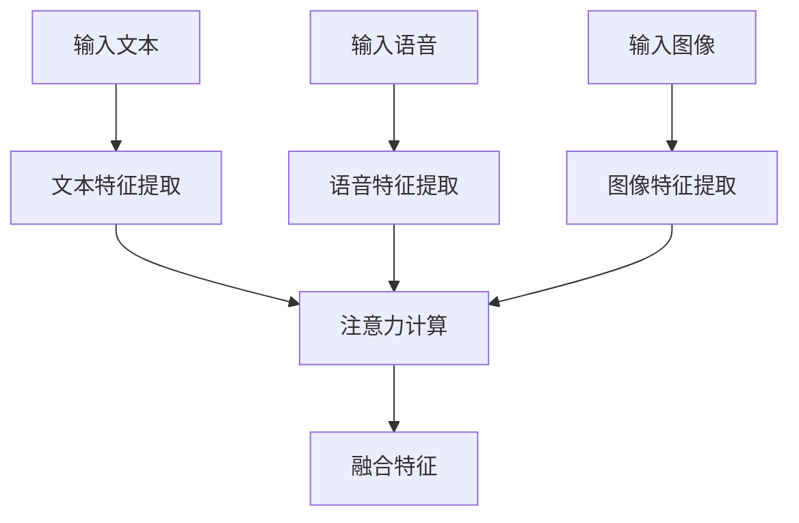
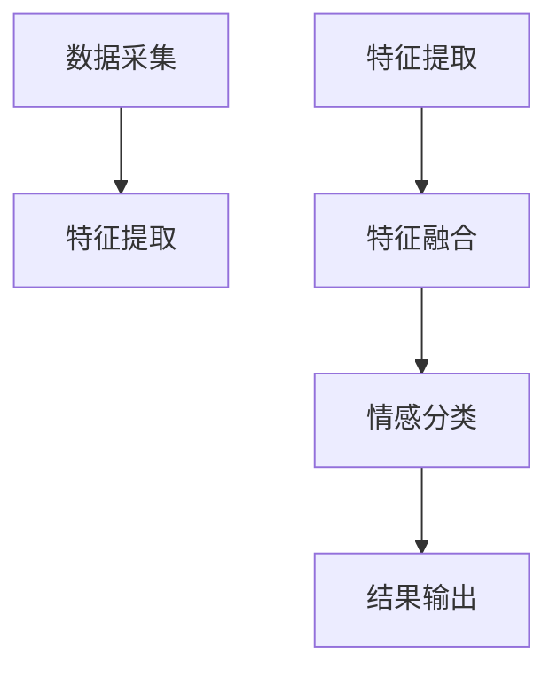
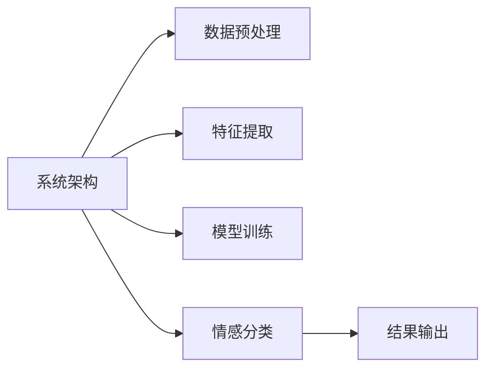

                 

<think>
好的，我现在需要根据用户的要求，撰写一篇关于《开发AI Agent的多模态情感计算引擎》的技术博客文章。首先，我得理解用户的需求，他们希望我扮演一个技术专家，提供一个详细的目录大纲，并且在文章中包含丰富的技术内容，包括背景介绍、核心概念、算法原理、系统架构、项目实战以及最佳实践等部分。同时，文章需要使用专业且清晰的技术语言，逻辑紧凑，结构合理。

首先，我需要明确文章的结构。用户已经提供了一个大纲，我需要按照这个大纲来展开每一部分的内容。文章分为七个章节，每个章节都有详细的子部分，比如背景介绍、核心概念、算法原理、系统架构等。我需要确保每个部分都有足够的细节，并且内容深入浅出，适合技术读者理解。

接下来，我需要考虑每个章节的具体内容。例如，第一章是背景介绍，需要涵盖AI Agent和多模态情感计算的基本概念，以及它们的发展历史和应用场景。这部分需要简明扼要，为后续章节打下基础。

在核心概念与联系部分，我需要详细讲解多模态数据融合和情感计算模型，使用对比表格和Mermaid图来展示不同方法的优缺点，以及系统中各模块的交互关系。这有助于读者更好地理解多模态情感计算的复杂性。

算法原理部分是关键，我需要详细讲解多模态融合算法和情感计算模型，使用Mermaid流程图展示算法步骤，并附上Python代码示例。数学公式需要用LaTeX表示，确保准确性和专业性。这部分需要深入浅出，让读者能够理解复杂的算法原理。

系统分析与架构设计部分，我需要从问题场景出发，介绍开发AI Agent多模态情感引擎需要解决的问题，设计系统的功能模块，并使用Mermaid图展示系统架构和接口设计。这部分需要展示系统的整体结构和各模块之间的关系，帮助读者理解系统的实现方式。

项目实战部分需要提供具体的实现步骤，包括环境安装、选择框架、编写代码、系统集成和测试等。这部分需要详细描述代码实现，并通过实际案例进行分析，帮助读者将理论应用到实践中。

最后，最佳实践部分需要总结开发过程中的经验和教训，提供一些实用的建议，如数据预处理的重要性、模型调优的技巧等，并推荐一些拓展阅读资料。这部分有助于读者进一步提升自己的技术水平。

在撰写过程中，我需要确保文章内容逻辑清晰，结构紧凑，语言专业但易懂。同时，要遵守用户的格式要求，使用Markdown格式，适当插入Mermaid图表和数学公式，确保文章的完整性和可读性。

可能遇到的挑战是如何将复杂的算法和系统架构以简洁明了的方式呈现出来，同时确保内容深入浅出。为此，我需要平衡技术深度和可读性，确保每个部分都能吸引读者的注意力并帮助他们理解。

总的来说，我需要系统地规划每个章节的内容，确保覆盖所有要求的部分，并且结构合理，逻辑连贯。这样，用户才能得到一篇内容丰富、结构清晰的技术博客文章。
</think>

# 开发AI Agent的多模态情感计算引擎

> 关键词：AI Agent, 多模态情感计算, 情感计算模型, 多模态数据融合, 系统架构设计

> 摘要：本文详细探讨了开发AI Agent的多模态情感计算引擎的关键技术与实现方法。从背景介绍、核心概念、算法原理到系统架构设计，结合实际案例和项目实战，全面解析如何构建高效、准确的多模态情感计算系统，为AI Agent在复杂情感场景中的应用提供理论与实践指导。

---

## 第一章: AI Agent与多模态情感计算概述

### 1.1 AI Agent的基本概念

#### 1.1.1 AI Agent的定义
AI Agent（人工智能代理）是一种能够感知环境、自主决策并执行任务的智能实体。它可以是一个软件程序，也可以是硬件设备，通过传感器和执行器与外部环境交互。

#### 1.1.2 AI Agent的核心特征
- **自主性**：能够在没有外部干预的情况下独立运作。
- **反应性**：能够根据环境变化实时调整行为。
- **目标导向**：基于明确的目标执行任务。
- **学习能力**：通过经验改进性能。

#### 1.1.3 多模态情感计算的定义与特点
多模态情感计算是指通过整合多种数据模态（如文本、语音、图像）来识别人类情感的过程。其特点是：
- **综合性**：结合多种模态信息，提高情感识别的准确性。
- **实时性**：能够在实时场景中快速响应。
- **适应性**：能够根据上下文调整情感分析策略。

---

### 1.2 多模态情感计算的背景与意义

#### 1.2.1 情感计算的定义与发展
情感计算（Affective Computing）是研究如何通过计算机技术识别人类情感的学科。其发展经历了从单一模态（如文本）到多模态的演进。

#### 1.2.2 多模态数据的特点与优势
多模态数据的特点包括：
- **互补性**：不同模态的信息可以相互补充，提高识别的准确性。
- **多样性**：涵盖文本、语音、图像等多种数据类型。
- **复杂性**：整合多种数据类型需要复杂的融合算法。

#### 1.2.3 多模态情感计算的应用场景
- **智能客服**：通过整合语音和文本信息，提供更精准的情感分析。
- **情感陪护机器人**：通过整合语音、图像和动作信息，实现更自然的交互。
- **教育科技**：通过分析学生的表情和语言，提供个性化的学习建议。

---

## 第二章: 多模态情感计算的核心概念与联系

### 2.1 多模态数据融合方法

#### 2.1.1 基于特征融合的方法
特征融合是指在特征层面将不同模态的信息进行整合。常见的方法包括：
- **加权融合**：根据各模态的重要性赋予不同的权重。
- **注意力机制**：通过注意力模型关注重要模态的信息。

#### 2.1.2 基于模型融合的方法
模型融合是在高层进行信息整合，例如：
- **多任务学习**：同时训练多个任务，共享特征提取部分。
- **联合学习**：通过联合优化目标函数，实现多模态信息的协同。

#### 2.1.3 基于注意力机制的融合方法
注意力机制是一种有效的多模态融合方法，通过计算各模态的重要性来动态调整权重。

---

### 2.2 情感计算模型的构建

#### 2.2.1 情感计算模型的核心要素
- **特征提取**：从多模态数据中提取有用的特征。
- **情感分类**：基于提取的特征进行情感类别判定。
- **情感表达**：将情感信息以可理解的形式输出。

#### 2.2.2 多模态情感计算模型的优缺点对比
| 方法                | 优点                            | 缺点                            |
|---------------------|---------------------------------|---------------------------------|
| 单模态计算          | 实现简单，易于优化              | 信息片面，识别准确率低          |
| 多模态融合计算      | 信息全面，识别准确率高          | 实现复杂，计算资源消耗大        |

#### 2.2.3 多模态情感计算模型的构建步骤
1. **数据预处理**：对多模态数据进行清洗和标准化。
2. **特征提取**：使用深度学习模型提取各模态的特征。
3. **特征融合**：将多模态特征进行融合，生成综合特征向量。
4. **情感分类**：基于融合特征进行情感类别判定。

---

## 第三章: 多模态情感计算引擎的算法原理

### 3.1 多模态融合算法

#### 3.1.1 基于注意力机制的多模态融合算法


#### 3.1.2 基于变换器的多模态融合算法
使用Transformer模型对多模态数据进行全局上下文建模，提升特征表达能力。

---

### 3.2 情感计算模型的算法实现

#### 3.2.1 基于深度学习的情感分类模型
使用卷积神经网络（CNN）或循环神经网络（RNN）对文本、语音和图像数据进行情感分类。

#### 3.2.2 基于注意力机制的情感分类模型
通过注意力机制关注重要特征，提高分类准确率。

#### 3.2.3 多模态情感计算的数学模型
情感分类模型的数学表达式：
$$ P(y|x) = \text{softmax}(Wx + b) $$
其中，$x$ 是输入特征，$W$ 和 $b$ 是模型参数。

---

## 第四章: 多模态情感计算引擎的系统架构设计

### 4.1 系统功能设计

#### 4.1.1 系统功能模块
- **数据采集模块**：采集多模态数据（文本、语音、图像）。
- **特征提取模块**：对各模态数据进行特征提取。
- **特征融合模块**：将各模态特征进行融合。
- **情感分类模块**：基于融合特征进行情感分类。

#### 4.1.2 系统功能流程图


### 4.2 系统架构设计

#### 4.2.1 基于微服务架构的设计
采用微服务架构，将系统划分为独立的服务模块，如数据预处理服务、特征提取服务、情感分类服务。

#### 4.2.2 系统架构图


---

## 第五章: 多模态情感计算引擎的项目实战

### 5.1 项目环境安装

#### 5.1.1 安装Python环境
使用Anaconda或virtualenv创建独立的Python环境。

#### 5.1.2 安装深度学习框架
推荐使用TensorFlow或PyTorch框架。

### 5.2 系统核心实现

#### 5.2.1 数据预处理代码
```python
import numpy as np
from sklearn.preprocessing import StandardScaler

# 示例数据预处理代码
def preprocess_data(data):
    scaler = StandardScaler()
    processed_data = scaler.fit_transform(data)
    return processed_data
```

#### 5.2.2 多模态融合算法实现
```python
import torch
import torch.nn as nn

class MultiModalFusion(nn.Module):
    def __init__(self, input_size):
        super().__init__()
        self.fc = nn.Linear(input_size, 1)
    
    def forward(self, x):
        x = self.fc(x)
        return torch.sigmoid(x)
```

### 5.3 系统集成与测试

#### 5.3.1 系统集成
将各功能模块集成到统一的系统中，进行模块间的接口测试。

#### 5.3.2 系统测试
使用测试数据集对系统进行性能测试，评估情感分类的准确率、召回率等指标。

---

## 第六章: 最佳实践与总结

### 6.1 最佳实践

#### 6.1.1 数据预处理的重要性
确保数据的高质量是提高系统性能的关键。

#### 6.1.2 模型调优的技巧
通过交叉验证和超参数优化提高模型性能。

### 6.2 项目小结

#### 6.2.1 项目总结
通过本项目，我们掌握了多模态情感计算的核心技术，成功实现了AI Agent的情感计算引擎。

#### 6.2.2 注意事项
在实际应用中，需要考虑系统的实时性和可扩展性。

### 6.3 拓展阅读

#### 6.3.1 推荐书籍
- 《Deep Learning》
- 《Affective Computing》

#### 6.3.2 推荐论文
- “Attention Is All You Need”
- “Multi-modal Deep Learning for Affective Computing”

---

## 作者信息

作者：AI天才研究院/AI Genius Institute & 禅与计算机程序设计艺术 /Zen And The Art of Computer Programming

