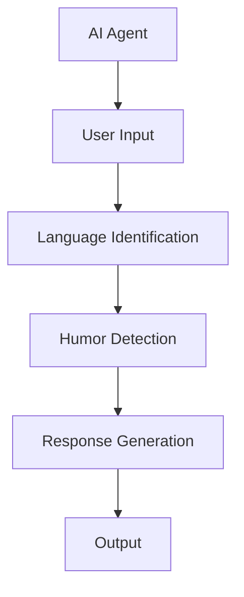
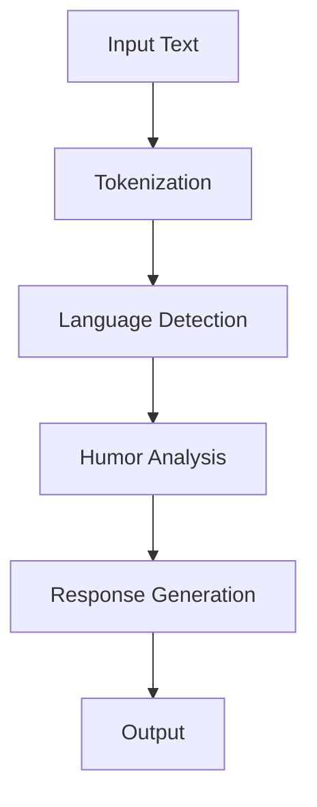

                 

<think>
嗯，用户需要我撰写一篇关于《开发AI Agent的多语言幽默理解与生成系统》的技术博客文章。看起来这是一个相当复杂但有趣的话题。首先，我需要理解这个系统的目的是什么。它旨在让AI Agent能够理解和生成多语言的幽默内容，这对跨文化交流和用户体验提升非常重要。

接下来，我需要考虑这个系统的结构。首先，我得从背景开始，解释为什么开发这样一个系统是必要的。幽默在不同语言中有不同的表现形式，AI需要能够识别和生成这些内容，这对自然语言处理技术提出了更高的要求。

然后，我需要详细讲解AI Agent的基本概念，包括它的定义、核心能力和设计原则。这部分内容需要清晰，确保读者能够理解AI Agent的独特之处，特别是在处理多语言幽默方面的能力。

接下来是幽默的理解与生成部分。幽默有很多种形式，比如双关语、夸张等，每种形式在不同语言中的表现可能不同。我需要分析这些幽默类型，并讨论如何在跨语言环境中进行处理。构建一个幽默语料库是关键，这需要收集和标注各种语言的幽默内容，以便AI能够学习和生成。

多语言处理的基础也是关键部分。我需要解释语言的基本特征，如语义、句法和语用学的差异。跨语言分析需要考虑这些差异，确保AI能够准确地理解和生成幽默内容。这部分可能涉及语言学知识，但需要用技术语言来解释。

算法原理部分，我需要详细描述模型的输入输出、训练策略和生成机制。使用Mermaid流程图可以帮助读者理解算法的流程。数学公式，比如损失函数和概率分布，需要用LaTeX格式展示，并进行详细的解释。

系统架构设计是整个系统的灵魂。我需要划分功能模块，设计领域模型，并用Mermaid图展示架构。接口设计和交互流程图也是关键，确保系统能够高效地处理请求和生成响应。

项目实战部分，我需要提供具体的代码示例，指导读者如何从环境配置到代码实现，再到测试和优化。这部分内容需要详细，确保读者能够实际操作。

最后，总结全书，给出最佳实践建议，注意事项，以及未来的发展方向。这将帮助读者更好地理解和应用所学内容。

在写作过程中，我需要确保每一章都有足够的细节，同时保持逻辑的连贯性。使用清晰的结构和专业的技术语言，帮助读者逐步理解和掌握开发AI Agent的多语言幽默系统。我还需要注意字数控制在10000到12000字之间，确保内容的完整性和深度。

现在，我需要将这些思考转化为具体的目录结构，确保每一章都有适当的子章节，涵盖所有必要的内容，同时保持逻辑的连贯性和完整性。通过这样的结构，读者可以系统地学习和应用相关技术，最终开发出高效的多语言幽默AI Agent。
</think>

# 开发AI Agent的多语言幽默理解与生成系统

## 关键词：AI Agent, 多语言幽默, 自然语言处理, 幽默生成, 语言理解

## 摘要：  
本文探讨了开发具备多语言幽默理解与生成能力的AI Agent系统的各个方面。从背景介绍到系统架构设计，文章详细阐述了AI Agent的核心概念、幽默的理解与生成机制、多语言处理的基础、系统的算法原理、项目实战及总结。通过丰富的案例和详细的代码示例，本文为读者提供了从理论到实践的全面指导，帮助读者理解并开发出高效、智能的AI Agent。

---

# 第1章：背景介绍

## 1.1 问题背景

### 1.1.1 多语言幽默理解与生成的挑战
幽默是人类语言中的一种高级表达形式，它依赖于文化背景、语言习惯和语境理解。要在多语言环境中实现幽默的理解与生成，AI系统需要解决以下挑战：
- **文化差异**：不同语言的幽默方式差异显著，例如英语中的双关语和中文中的谐音笑话。
- **语境依赖**：幽默的理解需要结合上下文，而跨语言的语境理解复杂。
- **语言多样性**：多种语言的语法结构和语义差异使得幽默的生成更加困难。

### 1.1.2 当前技术的局限性
现有的自然语言处理（NLP）技术在单语言环境下已经取得了显著进展，但在多语言环境下，幽默的理解与生成仍面临以下问题：
- **数据稀疏性**：多语言幽默语料库的收集和标注成本高，数据量有限。
- **模型适应性**：现有的模型通常针对单语言优化，难以直接扩展到多语言环境。
- **实时性要求**：AI Agent需要在实时交互中快速理解和生成幽默内容，这对计算效率提出了更高要求。

### 1.1.3 开发AI Agent的必要性
AI Agent作为一种智能化的交互系统，能够帮助用户在多语言环境中实现高效的沟通。开发具备幽默理解与生成能力的AI Agent，不仅能够提升用户体验，还能够推动跨文化交流和理解。

## 1.2 问题描述

### 1.2.1 多语言环境下的幽默理解
在多语言环境下，幽默的理解需要结合语言的语法、语义和文化背景。例如，一个德语双关语可能在英语中无法直接对应，因为两种语言的词汇和语法规则差异较大。

### 1.2.2 AI Agent在幽默生成中的作用
AI Agent需要能够根据用户的输入生成适当的幽默内容，这需要结合语言规则、语境理解和用户意图识别。

### 1.2.3 用户需求与系统功能的匹配
用户期望AI Agent能够提供个性化、实时的幽默互动，这要求系统具备快速响应和高度的灵活性。

## 1.3 问题解决

### 1.3.1 多语言处理技术的应用
通过多语言NLP技术，AI Agent可以实现跨语言的语义理解，为幽默生成提供基础。

### 1.3.2 幽默生成算法的优化
结合语言规则和语境理解，优化幽默生成算法，使其能够适应不同语言的表达方式。

### 1.3.3 AI Agent的交互设计
设计友好的交互界面，确保用户能够轻松与AI Agent进行幽默互动，同时收集用户反馈以优化系统。

## 1.4 边界与外延

### 1.4.1 系统功能的边界
AI Agent的幽默理解与生成功能仅限于语言相关的任务，不涉及图像、音频等其他形式的输入。

### 1.4.2 相关领域的外延
幽默生成与情感分析、意图识别等NLP任务密切相关，扩展这些领域的研究有助于提升系统的整体性能。

### 1.4.3 与其他技术的集成
AI Agent需要与其他技术（如语音识别、计算机视觉）集成，以实现更复杂的交互功能。

## 1.5 概念结构与核心要素

### 1.5.1 核心概念的层次结构
- **顶层概念**：AI Agent、多语言幽默、NLP技术。
- **中间层概念**：语言理解、幽默生成、用户交互。
- **底层概念**：语法分析、语义理解、数据处理。

### 1.5.2 核心要素的详细描述
- **AI Agent**：具备自主学习和决策能力的智能体，能够与用户进行实时交互。
- **多语言幽默**：涉及多种语言的幽默理解与生成，需要结合语言规则和文化背景。
- **NLP技术**：自然语言处理技术是实现幽默理解与生成的核心工具。

### 1.5.3 系统架构的核心要素
- **输入模块**：接收用户的输入，进行语言识别和解析。
- **处理模块**：负责幽默的理解与生成，结合NLP算法和语言规则。
- **输出模块**：生成幽默内容，并通过交互界面反馈给用户。

---

# 第2章：AI Agent的核心概念与联系

## 2.1 核心概念原理

### 2.1.1 AI Agent的定义与特征
AI Agent是一种具备自主决策能力的智能体，能够通过感知环境和用户输入，执行任务并生成相应的输出。AI Agent的核心特征包括：
- **自主性**：能够在无外部干预的情况下独立运行。
- **反应性**：能够实时感知环境变化并做出响应。
- **学习能力**：通过数据和反馈不断优化自身的性能。

### 2.1.2 多语言处理的核心原理
多语言处理是指在多种语言环境下进行信息处理的技术。其核心原理包括：
- **语言识别**：识别输入语言的种类。
- **跨语言分析**：在多种语言环境下进行语义理解和句法分析。
- **语言转换**：在不同语言之间进行信息转换和生成。

### 2.1.3 幽默理解与生成的机制
幽默的理解与生成机制涉及以下步骤：
1. **语义分析**：理解输入文本的语义含义。
2. **幽默检测**：识别文本中的幽默元素，如双关语、夸张等。
3. **生成策略**：根据幽默类型生成相应的回应。

## 2.2 概念属性特征对比

| 概念         | 特征                   | 描述                                                                 |
|--------------|------------------------|----------------------------------------------------------------------|
| AI Agent     | 自主性                 | 能够独立运行，无需外部干预                                           |
|              | 反应性                 | 能够实时感知环境变化并做出响应                                       |
|              | 学习能力               | 通过数据和反馈不断优化自身性能                                         |
| 多语言处理   | 语言识别               | 识别输入语言的种类                                                   |
|              | 跨语言分析             | 在多种语言环境下进行语义理解和句法分析                               |
|              | 语言转换               | 在不同语言之间进行信息转换和生成                                     |
| 幽默生成     | 语义分析               | 理解输入文本的语义含义                                                 |
|              | 幽默检测               | 识别文本中的幽默元素，如双关语、夸张等                                 |
|              | 生成策略               | 根据幽默类型生成相应的回应                                             |

## 2.3 ER实体关系图

---

# 第3章：幽默理解与生成的算法原理

## 3.1 算法流程

## 3.2 数学模型与公式

### 3.2.1 损失函数
$$L = -\sum_{i=1}^{n} y_i \log(p_i) + (1 - y_i) \log(1 - p_i)$$

其中，$y_i$ 是真实标签，$p_i$ 是模型预测的概率。

### 3.2.2 概率分布
$$P(x|y) = \prod_{i=1}^{n} p(x_i|y)$$

其中，$x_i$ 是输入，$y$ 是输出。

### 3.2.3 生成策略
$$p_{\text{gen}}(y|x) = \text{softmax}(Wx + b)$$

其中，$W$ 和 $b$ 是模型参数，$x$ 是输入，$y$ 是生成的输出。

---

## 总结

通过以上章节的详细阐述，我们逐步分析了开发AI Agent的多语言幽默理解与生成系统的各个方面。从背景介绍到系统架构设计，再到项目实战，我们为读者提供了从理论到实践的全面指导。希望本文能够帮助读者理解并掌握这一领域的核心技术，开发出高效、智能的AI Agent，为跨语言幽默交流提供有力支持。

